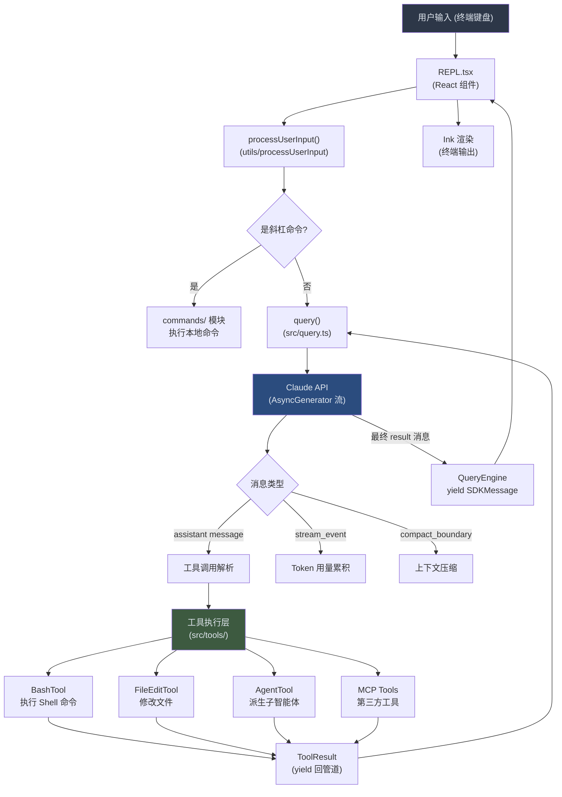

# 第 01 章：项目总览与架构设计
源地址：https://github.com/zhu1090093659/claude-code
## 学习目标
读完本章，你应该能够：

1. 用一句话解释 Claude Code 的核心架构——"一个以 AsyncGenerator 管道为骨骼、以 React 终端组件为皮肤的 AI 编程智能体"
2. 根据功能需求快速定位对应的模块目录，不必在 1884 个源文件里盲目搜索
3. 描述数据从用户击键到最终渲染的完整流转路径
4. 理解 Feature Flag（功能标志）在构建时死码消除（Dead Code Elimination）中的作用

---

## 1. Claude Code 是什么

Claude Code 是一个运行在终端里的 AI 编程智能体（Autonomous Coding Agent）。它不是简单的命令行包装器，而是能够自主读写文件、执行 bash 命令、调用外部工具、并在一次对话中持续完成复杂编程任务的完整系统。

从用户视角看，你在终端输入自然语言，Claude Code 会理解意图，拆解任务，调用 BashTool 跑测试、调用 FileEditTool 修改代码、调用 AgentTool 派生子智能体并发处理——最终给出结果。这套能力背后是一个精心设计的多层架构，而不是一段线性脚本。

从工程视角看，Claude Code 有几个核心特点值得注意：

**CLI 优先的 UI**。界面完全跑在终端里，使用了自研的 Ink 框架分支（基于 React），将 React 组件树渲染为 ANSI 转义序列。这意味着你看到的彩色对话框、进度条、权限提示，背后都是 React 组件的 `useState` 和重新渲染。

**AsyncGenerator 驱动的数据流**。核心查询循环不是 Promise，而是 `AsyncGenerator`。每一轮 API 调用、每一次工具执行的中间结果，都以 `yield` 的形式流出，使得调用方（无论是交互式 REPL 还是无头 SDK）可以在任意时刻订阅、暂停或中止。

**Feature Flag 的编译时分叉**。源码里大量出现 `feature('DAEMON')`、`feature('BRIDGE_MODE')` 这样的调用。这不是普通的运行时开关，`feature()` 来自 `bun:bundle`，在 Bun 打包时会被求值，未启用的分支被彻底从产物中裁剪掉——内部版本（Ant 员工用）和外部发布版因此可以共享同一份源码，但生成完全不同的二进制。

---

## 2. 技术栈总览

| 层次 | 技术 | 用途 |
|------|------|------|
| 运行时 | Bun | 执行环境、构建工具、`bun:bundle` Feature Flag |
| 语言 | TypeScript | 全量类型化，含 TSX |
| 终端 UI | Ink（自研分支，96 个文件） | React 到终端的渲染器 |
| UI 框架 | React 19 | 组件模型、Hooks、状态管理 |
| Schema 验证 | Zod v4 | 工具输入参数的运行时类型检查 |
| CLI 解析 | Commander.js | 命令行参数定义与分发 |
| API 客户端 | @anthropic-ai/sdk | 与 Claude API 通信 |
| 扩展协议 | MCP（Model Context Protocol） | 连接第三方工具服务器 |
| 语言服务 | LSP（Language Server Protocol） | IDE 级别的代码理解 |

Bun 在这里不只是 Node.js 的替代者——它的 `bun:bundle` 模块在编译期暴露 `feature()` 函数，使得功能分支可以做到**编译时死码消除**，这在 Node.js 生态里是很罕见的能力。

---

## 3. 目录结构逐一讲解

Claude Code 的 `src/` 目录下有 35 个模块，以下按文件数量降序排列并逐一说明其职责：

```
src/
├── utils/           (564 个文件) 工具函数大本营，含 bash/permissions/settings/swarm 等子目录
├── components/      (389 个文件) React 终端 UI 组件库，所有可见界面元素
├── commands/        (189 个文件) 70+ 斜杠命令（/clear、/compact、/commit 等）的实现
├── tools/           (184 个文件) 工具实现：BashTool、FileEditTool、AgentTool 等
├── services/        (130 个文件) API 客户端、MCP 服务、分析上报、LSP 服务等
├── hooks/           (104 个文件) React Hooks，业务逻辑与 UI 状态的桥梁
├── ink/             (96 个文件)  自研 Ink 终端渲染框架分支
├── cli/             (19 个文件)  SSE/WebSocket 传输层、远程 IO 适配
├── constants/       (21 个文件)  常量定义（提示词片段、XML 标签、错误码等）
├── keybindings/     (14 个文件)  自定义快捷键配置与处理
├── tasks/           (12 个文件)  任务管理（TodoList 相关）
├── migrations/      (11 个文件)  配置文件版本迁移
├── entrypoints/     (8 个文件)   入口点：cli.tsx、init.ts、mcp.ts、SDK 入口等
├── memdir/          (8 个文件)   项目记忆文件（MEMORY.md）的读写管理
├── skills/          (20 个文件)  Markdown 驱动的技能（Skill）系统
├── bridge/          (31 个文件)  远程控制桥接，允许从移动端操控本机 Claude
├── context/         (9 个文件)   上下文管理（统计、状态传递等）
├── state/           (6 个文件)   AppState 定义与 Store
├── buddy/           (6 个文件)   终端吉祥物（Companion）相关
├── vim/             (5 个文件)   Vim 模式（Normal/Insert/Visual）
├── query/           (4 个文件)   查询配置、Token 预算等辅助类型
├── remote/          (4 个文件)   远程会话管理
├── native-ts/       (4 个文件)   原生 TypeScript 桥接层
├── server/          (3 个文件)   Unix 域套接字服务端（进程间通信）
├── screens/         (3 个文件)   主屏幕（REPL.tsx）及其他全屏视图
├── plugins/         (2 个文件)   插件系统入口
├── upstreamproxy/   (2 个文件)   上游代理配置
├── coordinator/     (1 个文件)   Coordinator 模式（多智能体协调）
├── bootstrap/       (1 个文件)   全局单例状态（state.ts），进程生命周期内唯一
├── assistant/       (1 个文件)   助手会话历史
├── voice/           (1 个文件)   语音输入支持
├── outputStyles/    (1 个文件)   输出样式配置
├── moreright/       (1 个文件)   "更多内容"右侧栏 UI
├── schemas/         (1 个文件)   共享 Schema 定义
└── 根目录单文件模块         QueryEngine.ts、Task.ts、Tool.ts、tools.ts、
                              query.ts、commands.ts、main.tsx、
                              replLauncher.tsx、context.ts、history.ts 等
```

有几个目录值得额外说明：

`bootstrap/state.ts` 是整个进程的全局单例。文件开头有一行注释极具代表性：

```typescript
// DO NOT ADD MORE STATE HERE - BE JUDICIOUS WITH GLOBAL STATE
```

（`src/bootstrap/state.ts:31`）

这个文件导出 `State` 类型，里面包含了从 `totalCostUSD`、`sessionId`、到各种 beta 功能的 latch 标志共约 60 个字段。任何需要跨组件、跨工具调用的持久化状态，最终都汇集到这里——但作者非常警惕地限制着它的膨胀。

`entrypoints/cli.tsx` 是真正意义上的进程入口，它是一个**快速路径分发器（Fast-Path Dispatcher）**，会在加载庞大的主程序之前，先检测命令行参数是否命中特殊路径，从而避免不必要的模块加载开销：

```typescript
// Fast-path for --version/-v: zero module loading needed
if (args.length === 1 && (args[0] === '--version' || args[0] === '-v')) {
  console.log(`${MACRO.VERSION} (Claude Code)`);
  return;
}
```

（`src/entrypoints/cli.tsx:36-42`）

这种设计使得 `claude --version` 几乎是瞬时响应，因为它根本没有触发 TypeScript 模块的动态 import 链。

---

## 4. 架构图：事件驱动的 AsyncGenerator 管道

以下是 Claude Code 的核心运行时架构：



这张图描述的是**一次完整的用户问答轮次（Turn）**。注意几个关键点：

工具执行结果并不直接返回给用户——它作为 `user` 类型消息（内含 `tool_result` 内容块）重新进入 `query()` 循环，触发下一轮 API 调用。这就是 Claude 能"多步完成任务"的根本原因：它看到工具结果后，可以继续调用更多工具，直到认为任务完成。

`QueryEngine`（`src/QueryEngine.ts`）是 SDK 路径和 REPL 路径的共同核心。它的 `submitMessage()` 方法是一个 `AsyncGenerator`，外层不管是终端 UI 还是编程 API，都通过 `for await` 消费它产出的 `SDKMessage`：

```typescript
async *submitMessage(
  prompt: string | ContentBlockParam[],
  options?: { uuid?: string; isMeta?: boolean },
): AsyncGenerator<SDKMessage, void, unknown> {
  // ... 内部调用 query()，yield 每一条消息 ...
}
```

（`src/QueryEngine.ts:209-212`）

---

## 5. 数据流总览

下面把数据流拆解成六个阶段，逐步说明：

**阶段一：用户输入捕获**

用户在终端敲字，Ink 框架通过 `process.stdin` 捕获原始键盘事件，经过 `hooks/useTextInput` 处理后，触发 REPL 组件的状态更新。

**阶段二：输入预处理（processUserInput）**

原始输入进入 `utils/processUserInput/processUserInput.ts`。在这里，斜杠命令（如 `/clear`、`/compact`）会被识别并路由到 `commands/` 目录下的对应处理函数，普通自然语言则被打包成 `UserMessage` 传入下一阶段。

**阶段三：query 循环**

`src/query.ts` 的 `query()` 函数是整个系统的核心循环。它负责：

- 组装系统提示词（System Prompt），包括来自 CLAUDE.md 的用户自定义指令
- 将消息列表归一化后发送给 Claude API
- 以 `AsyncGenerator` 形式逐条 yield API 返回的流式事件
- 处理自动上下文压缩（Auto Compact）、Token 预算超限等边界情况

**阶段四：工具执行**

当 API 返回一条包含 `tool_use` 的 assistant 消息时，`query.ts` 会找到对应工具（通过 `findToolByName`），构建 `ToolUseContext` 并调用 `tool.call()`。

`ToolUseContext` 是工具执行环境的完整快照，包含了工具在执行过程中可能需要的一切——AppState 读写函数、AbortController、权限检查回调、UI 更新通道等：

```typescript
export type ToolUseContext = {
  options: {
    commands: Command[]
    mainLoopModel: string
    tools: Tools
    mcpClients: MCPServerConnection[]
    // ... 更多选项
  }
  abortController: AbortController
  getAppState(): AppState
  setAppState(f: (prev: AppState) => AppState): void
  setToolJSX?: SetToolJSXFn   // 工具可以渲染自己的 React 界面
  // ...
}
```

（`src/Tool.ts:158-300`）

**阶段五：结果归集与递归**

工具执行结果（`ToolResult`）被包装成 `user` 消息，追加到消息列表后，重新进入 `query()` 循环，触发下一轮 API 调用。这个循环直到以下条件之一满足才结束：Claude 返回 `stop_reason: 'end_turn'`、Token 预算耗尽、用户主动中断，或者达到 `maxTurns` 限制。

**阶段六：渲染**

QueryEngine 的 AsyncGenerator yield 出每一条 `SDKMessage`，REPL 组件通过 `useLogMessages` Hook 订阅这些消息，更新 React 状态，触发 Ink 重新渲染终端输出。

---

## 6. 关键配置：CLAUDE.md、settings.json 与 Feature Flag

### CLAUDE.md

CLAUDE.md 是用户为项目定制 Claude 行为的主要手段。Claude Code 在启动时会自动查找并加载以下位置的 CLAUDE.md：

- `~/.claude/CLAUDE.md`（全局用户级别）
- `{项目根目录}/CLAUDE.md`（项目级别）
- `{当前工作目录}/CLAUDE.md`（本地级别）

这些文件的内容会被注入到系统提示词的用户上下文（User Context）部分，在每次 API 调用时随消息一起发送。全局状态中有专门的缓存字段：

```typescript
// CLAUDE.md content cached by context.ts for the auto-mode classifier.
cachedClaudeMdContent: string | null
```

（`src/bootstrap/state.ts:123`）

### settings.json

Claude Code 维护多层配置文件，优先级由低到高依次为：用户全局设置（`~/.claude/settings.json`）、项目设置（`.claude/settings.json`）、本地设置（`.claude/settings.local.json`）、命令行 Flag 设置。

全局状态中明确记录了允许的配置来源：

```typescript
allowedSettingSources: [
  'userSettings',
  'projectSettings',
  'localSettings',
  'flagSettings',
  'policySettings',
],
```

（`src/bootstrap/state.ts:313-319`）

这种分层设计使得企业可以通过 `policySettings` 锁定某些配置，防止用户在本地覆盖。

### Feature Flag

Feature Flag 在 Claude Code 里有两种用途，在代码中体现为两种完全不同的机制：

**编译时 Feature Flag**：通过 `bun:bundle` 的 `feature()` 函数实现。这类 Flag 在 Bun 打包时被求值，未启用的代码块被彻底从产物中裁剪。工具注册表 `src/tools.ts` 中充满了这种用法：

```typescript
const SleepTool =
  feature('PROACTIVE') || feature('KAIROS')
    ? require('./tools/SleepTool/SleepTool.js').SleepTool
    : null
const cronTools = feature('AGENT_TRIGGERS')
  ? [
      require('./tools/ScheduleCronTool/CronCreateTool.js').CronCreateTool,
      // ...
    ]
  : []
```

（`src/tools.ts:25-35`）

这意味着外部用户的 Claude Code 二进制包里根本不存在 `SleepTool` 的代码——不是禁用了，而是物理上不存在。

**运行时 Feature Flag**：通过 GrowthBook 服务实现，可以在不重新部署的情况下动态开启或关闭功能。这类 Flag 通常用于 A/B 测试和灰度发布，代码中通过 `src/services/growthbook/` 模块访问。

入口文件中两种用法的区别一目了然：

```typescript
// feature() 必须保持内联，以便构建时死码消除（DCE）生效
if (feature('BRIDGE_MODE') && (args[0] === 'remote-control' || ...)) {
  // isBridgeEnabled() 才是运行时的 GrowthBook 检查
  const disabledReason = await getBridgeDisabledReason();
}
```

（`src/entrypoints/cli.tsx:112`）

---

## 7. 全局单例状态的设计哲学

`src/bootstrap/state.ts` 是整个代码库里注释最密集的文件之一，也是唯一带有三条强调性注释的文件：

```typescript
// DO NOT ADD MORE STATE HERE - BE JUDICIOUS WITH GLOBAL STATE

// ALSO HERE - THINK THRICE BEFORE MODIFYING

// AND ESPECIALLY HERE
const STATE: State = getInitialState()
```

（`src/bootstrap/state.ts:31`、`259`、`428-429`）

这三条注释并排出现，说明了作者对全局状态的态度：全局状态是必要的恶，而不是便利的工具。整个文件里的 State 类型有约 60 个字段，但每个字段都有清晰的注释说明其存在的理由。

该文件的另一个值得注意的设计是**函数式 setter**。没有 `STATE.sessionId = newId` 这样的直接赋值暴露在外，所有修改都通过类似 `setAppState(f: (prev: AppState) => AppState)` 的函数式更新来进行，这使得状态变更可追踪，也方便在 React 的不可变状态模型里使用。

---

## 关键要点

Claude Code 的架构可以用三个词概括：**管道（Pipeline）、插件（Plugin）、分层（Layered）**。

AsyncGenerator 管道是骨骼，它使得 API 调用、工具执行、UI 渲染三件事可以同步推进而不互相阻塞。工具系统是插件，`Tool` 接口定义了统一的契约（`call`、`isEnabled`、`isReadOnly` 等方法），任何满足此接口的对象都可以注入系统。分层配置是保护层，从 `policySettings` 到 `flagSettings` 的优先级链，使得同一套代码可以在个人开发者和企业环境里以不同的行为运行。

理解了这三点，源码里大量看似繁琐的条件分支和回调嵌套，就都有了合理的解释。

后续各章将沿着数据流的方向深入每个子系统：第 02 章从入口的 `main.tsx` 出发，详细拆解启动流程；第 03 章进入 `query.ts`，剖析多轮对话循环的每一个细节；第 04 章解析 `Tool` 接口，看清工具系统的完整设计。
