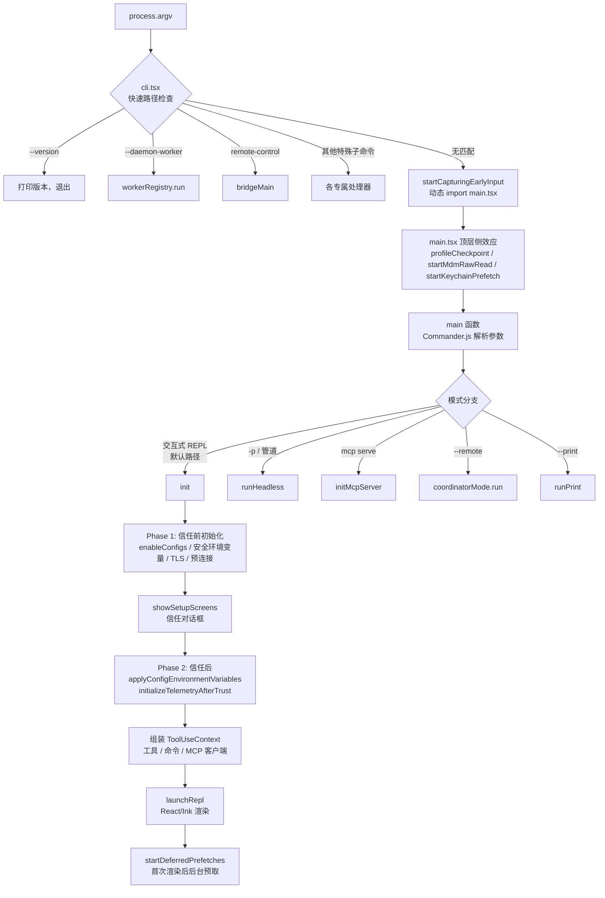

# 第 02 章：启动流程与初始化
源地址：https://github.com/zhu1090093659/claude-code
## 学习目标
读完本章，你应该能够：

1. 从 `claude` 命令调用出发，沿着源码追踪到 REPL 首次渲染的完整启动路径
2. 解释为什么 `init()` 在设计上分为"信任建立前"和"信任建立后"两个阶段
3. 说明 `bootstrap/state.ts` 中的进程级全局状态与 React 层的 `AppState` 各自承担什么职责
4. 理解 `ToolUseContext` 作为依赖注入（Dependency Injection）容器的组装过程

---

## 1. 全局视角：一次启动的旅程

在终端输入 `claude` 然后按下回车，到出现交互式提示符，这个过程在代码层面经历了五个主要阶段：快速路径分发、main.tsx 侧效应初始化、`init()` 两阶段初始化、模式分支决策、REPL 渲染。

下面的流程图描绘了这条路径的主干：



接下来逐层解剖。

---

## 2. cli.tsx：快速路径分发器

**文件**：`src/entrypoints/cli.tsx`

这个文件是整个程序真正的入口点，但它的职责极为单一：用最小代价把请求分发出去。文件头部注释写得很直白：

```typescript
// src/entrypoints/cli.tsx:28-32
/**
 * Bootstrap entrypoint - checks for special flags before loading the full CLI.
 * All imports are dynamic to minimize module evaluation for fast paths.
 * Fast-path for --version has zero imports beyond this file.
 */
```

### 2.1 零加载的版本查询

`--version` 是处理最轻量的分支，在所有动态导入发生之前就已返回：

```typescript
// src/entrypoints/cli.tsx:37-42
if (args.length === 1 && (args[0] === '--version' || args[0] === '-v' || args[0] === '-V')) {
  // MACRO.VERSION is inlined at build time
  console.log(`${MACRO.VERSION} (Claude Code)`);
  return;
}
```

`MACRO.VERSION` 不是运行时读取的——它是 Bun 在打包时内联的字面量，所以这条路径真的不需要加载任何模块。这是为了让 CI 脚本的版本检查尽可能快。

### 2.2 按序检查的快速路径链

处理完 `--version` 之后，cli.tsx 才加载启动性能分析器（Startup Profiler），然后依次检查一系列特殊标志：

```typescript
// src/entrypoints/cli.tsx:44-48
const { profileCheckpoint } = await import('../utils/startupProfiler.js');
profileCheckpoint('cli_entry');
```

之后是一个按优先级排列的快速路径链，每个分支命中后就立即返回，不会继续往下走：

| 标志 / 子命令 | 目标模块 | Feature Flag 保护 |
|---|---|---|
| `--dump-system-prompt` | constants/prompts.js | `DUMP_SYSTEM_PROMPT`（Ant 内部） |
| `--claude-in-chrome-mcp` | claudeInChrome/mcpServer.js | 无 |
| `--computer-use-mcp` | computerUse/mcpServer.js | `CHICAGO_MCP` |
| `--daemon-worker` | daemon/workerRegistry.js | `DAEMON` |
| `remote-control` / `rc` | bridge/bridgeMain.js | `BRIDGE_MODE` |
| `daemon` | daemon/main.js | `DAEMON` |
| `ps` / `logs` / `attach` / `--bg` | cli/bg.js | `BG_SESSIONS` |
| `environment-runner` | environment-runner/main.js | `BYOC_ENVIRONMENT_RUNNER` |

这些 `feature()` 调用来自 `bun:bundle`，在外部发布版的构建时求值为 `false`，整个分支被编译器彻底剪除（Dead Code Elimination，死码消除），不会出现在最终二进制中。

所有快速路径都未命中时，cli.tsx 才开始加载完整 CLI：

```typescript
// src/entrypoints/cli.tsx:288-298
const { startCapturingEarlyInput } = await import('../utils/earlyInput.js');
startCapturingEarlyInput();
profileCheckpoint('cli_before_main_import');
const { main: cliMain } = await import('../main.js');
profileCheckpoint('cli_after_main_import');
await cliMain();
profileCheckpoint('cli_after_main_complete');
```

`startCapturingEarlyInput()` 在 main.tsx 加载的 ~135ms 期间，把用户可能提前输入的字符缓冲起来，避免丢失。

---

## 3. main.tsx：顶层侧效应与参数解析

**文件**：`src/main.tsx`

这个文件一上来就有一段注释，解释为什么要在所有常规 import 之前执行三个语句：

```typescript
// src/main.tsx:1-20
// These side-effects must run before all other imports:
// 1. profileCheckpoint marks entry before heavy module evaluation begins
// 2. startMdmRawRead fires MDM subprocesses (plutil/reg query) so they run in
//    parallel with the remaining ~135ms of imports below
// 3. startKeychainPrefetch fires both macOS keychain reads (OAuth + legacy API
//    key) in parallel — isRemoteManagedSettingsEligible() otherwise reads them
//    sequentially via sync spawn inside applySafeConfigEnvironmentVariables()
//    (~65ms on every macOS startup)
import { profileCheckpoint } from './utils/startupProfiler.js';
profileCheckpoint('main_tsx_entry');
import { startMdmRawRead } from './utils/settings/mdm/rawRead.js';
startMdmRawRead();
import { ensureKeychainPrefetchCompleted, startKeychainPrefetch } from './utils/secureStorage/keychainPrefetch.js';
startKeychainPrefetch();
```

MDM（Mobile Device Management，移动设备管理）读取需要调用系统进程（macOS 上是 `plutil`，Windows 上是 `reg query`），耗时约 135ms。Keychain 预取在 macOS 上每次同步调用约 65ms。把这两个操作在模块加载期间就并行触发，让等待时间与后续 ~135ms 的 import 链完全重叠，效果等同于"免费的"并行化。

### 3.1 Commander.js 参数解析

`main()` 函数使用 Commander.js 定义完整的参数体系，然后根据解析结果分支到不同模式。在进入任何模式之前，还会运行配置迁移：

```typescript
// src/main.tsx:325-352
const CURRENT_MIGRATION_VERSION = 11;
function runMigrations(): void {
  if (getGlobalConfig().migrationVersion !== CURRENT_MIGRATION_VERSION) {
    migrateAutoUpdatesToSettings();
    migrateBypassPermissionsAcceptedToSettings();
    // ... 共 11 次迁移
    saveGlobalConfig(prev => ({
      ...prev,
      migrationVersion: CURRENT_MIGRATION_VERSION
    }));
  }
}
```

迁移版本号当前是 11。每次发布新版本可能涉及模型名称变更、权限字段迁移等，只要 `migrationVersion` 与当前值不符，就重新跑一遍全部迁移函数。每个迁移函数都是幂等的，重跑安全。

---

## 4. init.ts：两阶段初始化

**文件**：`src/entrypoints/init.ts`

这是整个启动中最值得细看的部分，它的设计体现了一个明确的安全边界。

### 4.1 memoize 保证只运行一次

```typescript
// src/entrypoints/init.ts:57
export const init = memoize(async (): Promise<void> => {
```

用 lodash 的 `memoize` 包装，无论调用多少次，初始化逻辑只执行一遍。这在交互式 REPL 和无头（Headless）模式可能各自独立调用 `init()` 的情况下，防止了双重初始化。

### 4.2 第一阶段：信任建立前

init 函数的第一段工作只做"安全"的事——即便还没有建立信任关系，也可以执行的操作：

```typescript
// src/entrypoints/init.ts:64-160（节选关键行）
enableConfigs()                        // load and validate config files
applySafeConfigEnvironmentVariables()  // apply only non-sensitive env vars
applyExtraCACertsFromConfig()          // set TLS CA certs before first TLS handshake
setupGracefulShutdown()                // register cleanup handlers
void populateOAuthAccountInfoIfNeeded() // async: populate OAuth info
void initJetBrainsDetection()          // async: detect JetBrains IDE
void detectCurrentRepository()         // async: detect Git repository
initializeRemoteManagedSettingsLoadingPromise()
initializePolicyLimitsLoadingPromise()
configureGlobalMTLS()                  // mTLS setup
configureGlobalAgents()                // proxy agent setup
preconnectAnthropicApi()               // overlap TCP/TLS handshake with action-handler work
```

这里有个值得注意的细节：`applyExtraCACertsFromConfig()` 必须在任何 TLS 连接建立之前调用，而 `preconnectAnthropicApi()` 的目的是让 TCP+TLS 握手（约 100-200ms）与后续的 action-handler 工作并行执行。注释原文：

```typescript
// src/entrypoints/init.ts:153-158
// Preconnect to the Anthropic API — overlap TCP+TLS handshake
// (~100-200ms) with the ~100ms of action-handler work before the API
// request. After CA certs + proxy agents are configured so the warmed
// connection uses the right transport. Fire-and-forget; skipped for
// proxy/mTLS/unix/cloud-provider where the SDK's dispatcher wouldn't
// reuse the global pool.
```

### 4.3 为什么要分成两个阶段

`init()` 只做"安全操作"，而有一件事被故意推迟到信任建立之后：`applyConfigEnvironmentVariables()`（完整版环境变量应用）。

原因是：项目配置文件（`CLAUDE.md`、`.claude/settings.json`）可能包含任意 Shell 环境变量，这些变量理论上能影响程序行为。在用户确认信任当前项目之前，应用这些变量存在潜在风险。

信任建立之后，`main.tsx` 的交互路径会调用 `initializeTelemetryAfterTrust()`，其内部会调用完整版的 `applyConfigEnvironmentVariables()`，将远程管理设置（Remote Managed Settings）中的变量也一并应用。

另外，git 命令也受到同样保护。`prefetchSystemContextIfSafe()` 在用户未建立信任时会跳过 git 操作（`getSystemContext()` 内部会跑 `git status`），因为 git 钩子（hooks）和配置（如 `core.fsmonitor`）可以执行任意代码：

```typescript
// src/main.tsx:360-380
function prefetchSystemContextIfSafe(): void {
  // Git commands can execute arbitrary code via hooks and config (e.g., core.fsmonitor,
  // diff.external), so we must only run them after trust is established or in
  // non-interactive mode where trust is implicit.
  const hasTrust = checkHasTrustDialogAccepted();
  if (hasTrust) {
    void getSystemContext();
  }
  // Otherwise, don't prefetch - wait for trust to be established first
}
```

---

## 5. bootstrap/state.ts：进程级全局状态

**文件**：`src/bootstrap/state.ts`

这个文件是整个程序的"全局状态单例"。文件顶部有一行注释，态度很强硬：

```typescript
// src/bootstrap/state.ts:31
// DO NOT ADD MORE STATE HERE - BE JUDICIOUS WITH GLOBAL STATE
```

### 5.1 State 类型结构

`State` 类型涵盖了进程生命周期内所有需要跨模块共享的字段，按职责分组：

**运行时度量**：`totalCostUSD`、`totalAPIDuration`、`totalToolDuration`、`turnToolCount` 等，用于计费和性能监控。

**工作目录追踪**：

```typescript
// src/bootstrap/state.ts:46-50
originalCwd: string       // stable: set once at startup, used for project identity
projectRoot: string       // also stable, set once, for history/skills/sessions
cwd: string               // dynamic: can change via cd-like operations
```

`originalCwd` 和 `projectRoot` 在启动时设置一次，不随会话内部的目录切换而变化；`cwd` 才是动态跟踪的当前工作目录。

**模型配置**：`mainLoopModelOverride`、`initialMainLoopModel`、`modelStrings`、`modelUsage`。

**遥测基础设施**：`meter`、`sessionCounter`、`loggerProvider`、`eventLogger` 等 OpenTelemetry 相关字段。

**会话标志**：`sessionBypassPermissionsMode`、`sessionTrustAccepted`、`scheduledTasksEnabled`、`hasExitedPlanMode` 等。

**缓存与优化**：`promptCache1hAllowlist`、`systemPromptSectionCache`、`invokedSkills` 等。

State 类型的字段超过 80 个，但它们都有一个共性：需要在多个模块之间共享，并且不适合放在 React 的状态管理层。

### 5.2 单例实现

```typescript
// src/bootstrap/state.ts（initialState 之后）
const stateInstance = { ...initialState }

export function getOriginalCwd(): string { return stateInstance.originalCwd }
export function setOriginalCwd(cwd: string): void { stateInstance.originalCwd = cwd }
// ... 80+ getter/setter 对
```

没有用 Proxy、没有 Observable、没有发布订阅——就是一个朴素的模块级对象，加上成对的 getter 和 setter。模块加载时初始化一次，进程生命周期内保持唯一。这个方案的优点是对调用方完全透明，调试时直接可见，不需要理解任何框架机制。

### 5.3 bootstrap/state.ts 与 AppState 的区别

`src/state/AppStateStore.ts` 里有另一个状态系统——`AppState`，它才是 React 组件层的状态。两者分工明确：

`bootstrap/state.ts` 管理的是**进程级状态**：整个进程生命周期有效，无论是否有 UI，都可以访问；通过导出的 getter/setter 直接读写；没有变更通知机制。

`AppState` 管理的是**UI 层状态**：React 组件树需要的状态，涵盖当前输入内容、消息列表、权限模式、界面配置等；通过 Zustand-style 的 `createStore` 管理，变更会触发组件重新渲染；通过 `ToolUseContext.getAppState / setAppState` 传递给工具层。

简单说：`bootstrap/state.ts` 对 React 一无所知，`AppState` 对进程级状态一无所知，两者通过 `main.tsx` 的组装层连接。

---

## 6. 模式树：五条执行路径

`main()` 函数在解析完参数之后，会根据用户的调用方式走向五条不同的执行路径：

**交互式 REPL**（默认路径）：用户直接运行 `claude` 或 `claude "任务描述"`，进入完整的交互式终端界面。经历 init → 信任对话 → ToolUseContext 组装 → React/Ink 渲染。

**无头模式（Headless Mode）**：`claude -p "..."` 或管道输入（`echo "..." | claude`）。跳过 UI，直接执行任务并输出结果到 stdout，适合 CI 环境和脚本集成。

**MCP 服务器模式**：`claude mcp serve`。把 Claude Code 作为 MCP（Model Context Protocol）服务器运行，供其他工具连接。

**远程 / 协调者模式（Coordinator Mode）**：`--remote` 标志。由 `COORDINATOR_MODE` Feature Flag 控制，在外部发布版中不存在。

**打印模式（Print Mode）**：`--print` 标志。类似无头模式的变体，通常用于输出单次响应。

这几条路径的共同特点是：越偏向"无头"的路径，对 UI 组件的依赖越少，启动开销也越小。`--bare` 模式（`CLAUDE_CODE_SIMPLE=1`）甚至会跳过所有首次渲染后的预取操作。

---

## 7. ToolUseContext：依赖注入万物袋

在交互式 REPL 路径中，main.tsx 在调用 `launchRepl()` 之前会组装一个 `ToolUseContext` 对象。这是整个系统的依赖注入（Dependency Injection）容器，把工具执行所需的所有外部依赖打包在一起传递给 REPL 组件树。

关键字段：

```typescript
// 组装发生在 main.tsx 的交互式路径中
const toolUseContext = {
  options: {
    tools: getTools(),                               // all available tools
    commands: getCommands(),                         // slash commands
    mcpClients: getMcpToolsCommandsAndResources(),   // MCP server connections
    mainLoopModel: getMainLoopModel(),               // current model setting
  },
  getAppState,    // bound to Zustand store getter
  setAppState,    // bound to Zustand store setter
  setToolJSX,     // React state setter for tool output rendering
  messages,       // current session message array
  abortController // cancellation signal
}
```

`ToolUseContext` 的存在解决了一个架构问题：工具（BashTool、FileEditTool 等）需要访问 MCP 客户端、当前模型设置、应用状态等，但这些东西在工具模块加载时并不存在，也不应该通过全局单例暴露（那会让测试变得困难）。通过 `ToolUseContext` 传递，工具实现只依赖接口，测试时可以注入 Mock。

---

## 8. replLauncher.tsx：最后一步

**文件**：`src/replLauncher.tsx`

这个文件的代码量极少，职责也清晰：把 `App` 和 `REPL` 两个核心组件动态导入并渲染。

```typescript
// src/replLauncher.tsx:12-22
export async function launchRepl(
  root: Root,
  appProps: AppWrapperProps,
  replProps: REPLProps,
  renderAndRun: (root: Root, element: React.ReactNode) => Promise<void>
): Promise<void> {
  const { App } = await import('./components/App.js')
  const { REPL } = await import('./screens/REPL.js')
  await renderAndRun(root, <App {...appProps}><REPL {...replProps} /></App>)
}
```

`App` 和 `REPL` 都用动态 `import()` 而不是静态 import，目的是把这两个组件（以及它们依赖的整个 React 组件树）的加载延迟到真正需要渲染的时刻。对于无头模式，这两个组件从来不会被加载，减少了内存占用。

`renderAndRun` 是从 `src/interactiveHelpers.ts` 传入的，它封装了 Ink 的 `render()` 调用，将 React 组件树渲染为终端 ANSI 输出。

### 8.1 首次渲染后的延迟预取

`launchRepl()` 完成首次渲染后，`startDeferredPrefetches()` 被调用，在后台并行预热各种缓存：

```typescript
// src/main.tsx:388-431
export function startDeferredPrefetches(): void {
  // This function runs after first render, so it doesn't block the initial paint.
  void initUser();
  void getUserContext();
  prefetchSystemContextIfSafe();
  void getRelevantTips();
  void countFilesRoundedRg(getCwd(), AbortSignal.timeout(3000), []);
  void initializeAnalyticsGates();
  void refreshModelCapabilities();
  void settingsChangeDetector.initialize();
  // ...
}
```

这些操作被刻意推迟到首次渲染之后，目的是不阻塞终端界面的出现。用户在看到提示符并开始思考和打字的这段时间里，这些后台任务已经在并行完成。在 `--bare` 模式或启动性能基准测试（`CLAUDE_CODE_EXIT_AFTER_FIRST_RENDER`）模式下，这些操作全部被跳过。

---

## 9. 启动时序的整体观

把上述所有环节放在一起，一次典型的交互式启动大约经历以下时序（时间是量级参考，实际因机器和网络而异）：

| 阶段 | 耗时量级 | 关键操作 |
|---|---|---|
| cli.tsx 顶层 | <1ms | 快速路径检查，版本号直接返回 |
| main.tsx 模块加载 | ~135ms | 并行触发 MDM 读取 + Keychain 预取 |
| init() Phase 1 | ~20ms | 配置加载，TLS 配置，API 预连接 |
| 信任对话 / 跳过 | 用户交互 | 首次使用显示，此后跳过 |
| init() Phase 2 | <5ms | 完整环境变量应用，遥测初始化 |
| MCP 客户端连接 | ~50-200ms | 并发连接所有配置的 MCP 服务器 |
| ToolUseContext 组装 | <5ms | 工具列表、命令列表组装 |
| React/Ink 首次渲染 | ~10ms | App + REPL 组件树渲染到终端 |
| 延迟预取 | 异步 | 在用户打字期间后台完成 |

API 预连接（`preconnectAnthropicApi()`）、MDM 读取、Keychain 预取这三个操作被精心安排为与模块加载时间重叠，这是启动性能优化的核心手法。

---

## 关键要点

理解本章之后，以下几点是值得记住的：

**cli.tsx 是轻量路由器，不是框架。** 它存在的唯一理由是用最小代价把请求分发出去，避免为 `--version` 这样的简单操作加载几百个模块。动态 import 是实现这一目标的关键技术。

**两阶段 init 设计有明确的安全语义。** 第一阶段只做不依赖用户信任的操作；第二阶段在信任建立后才应用可能影响程序行为的配置变量和执行 git 操作。这个边界不是性能优化，而是安全约束。

**bootstrap/state.ts 是有意为之的粗暴设计。** 直接的对象字段 + 成对 getter/setter，没有任何响应式框架——这是保持 bootstrap 代码作为"导入图中的叶节点"的必要代价。复杂的响应式机制会引入额外的模块依赖，破坏快速路径。

**ToolUseContext 是显式依赖注入的体现。** 工具执行需要的所有外部依赖都通过这个容器传入，而不是从全局状态直接读取。这让工具的单元测试成为可能，也让工具的行为完全可预测。

**延迟预取利用了用户的思考时间。** 从终端显示到用户第一次按键，中间通常有几秒钟的间隙。`startDeferredPrefetches()` 正是把所有"有用但不紧迫"的工作塞进这个窗口里。
