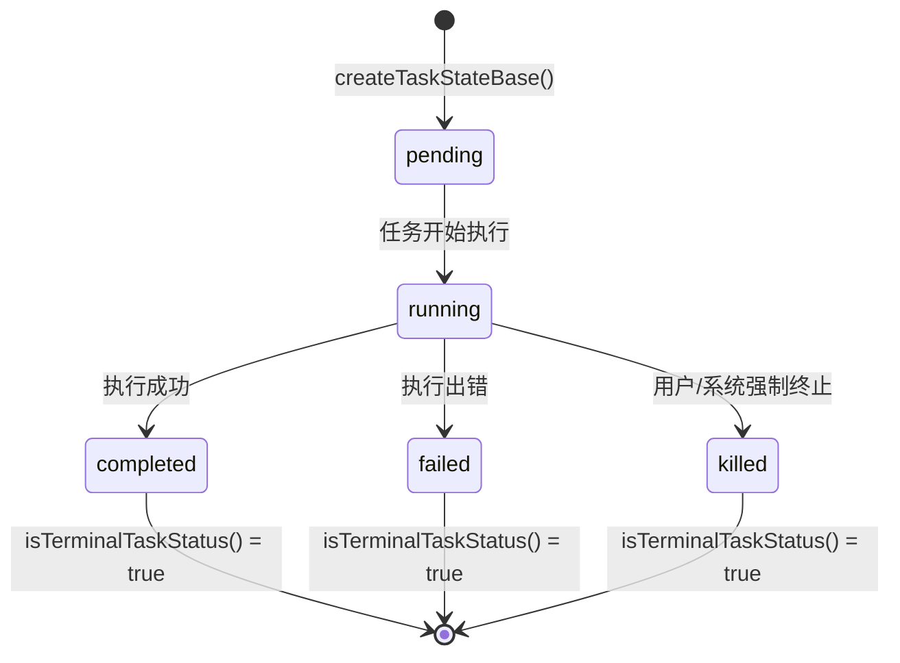
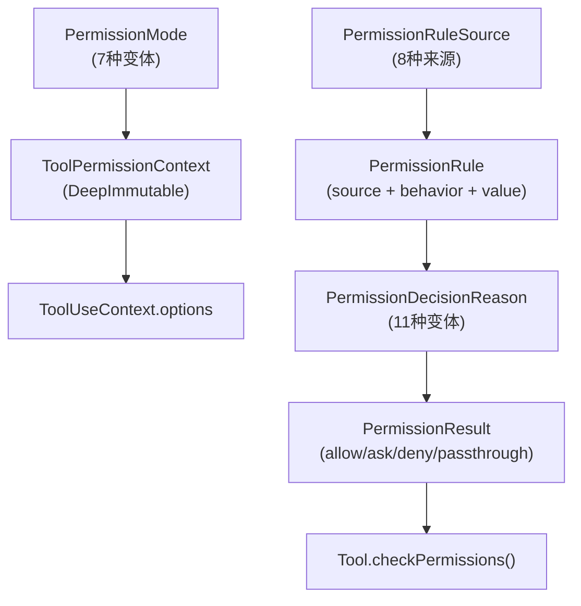
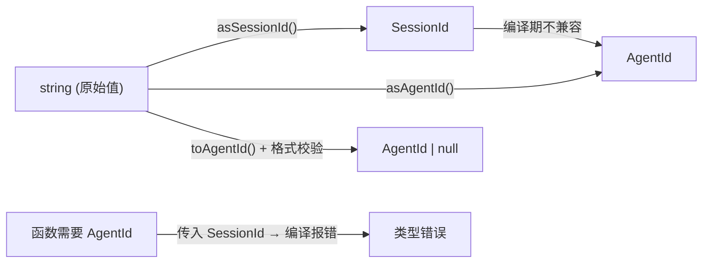
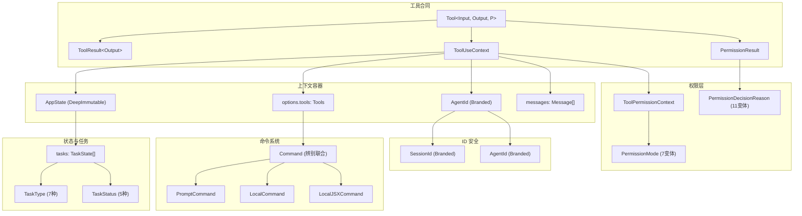

# 第 03 章：核心类型体系
源地址：https://github.com/zhu1090093659/claude-code
## 学习目标

读完本章，你应该能够：

1. 解释 `Tool<Input, Output, P>` 泛型的三个类型参数各自的作用，以及为什么 `Input` 必须约束为 `AnyObject`
2. 说出 `ToolUseContext` 中最重要的 10 个字段，并描述它们在工具调用链中的用途
3. 理解 `buildTool()` 工厂函数如何用"默认值填充"策略替代每个工具手写样板代码
4. 区分 `Command` 辨别联合的三种变体，以及为什么 `LocalJSXCommand` 需要延迟加载
5. 对 `TaskType` 的 7 种类型、`TaskStatus` 的 5 种状态、以及终止状态判断函数形成清晰认知
6. 解释品牌类型（Branded types）在编译时防止 ID 混用的工作原理
7. 理解 `DeepImmutable<T>` 如何通过递归只读将状态变异从根上封堵

---

Claude Code 最吸引人的地方之一，是它的代码并非堆砌起来的——而是由一套精心设计的类型体系支撑。这套类型体系并不是事后补上的注解，而是整个系统的"骨骼"：工具如何被调用、权限如何被决策、任务如何流转、状态如何更新，全都由类型合同（Type Contract）在编译期保证。

本章逐层拆解这套类型体系。

---

## 1. `Tool<Input, Output, P>`：通用工具契约

`src/Tool.ts` 是整个代码库的核心文件，全文约 800 行。其中最重要的定义是这个三参数泛型接口：

```typescript
// src/Tool.ts:362-466
export type Tool<
  Input extends AnyObject = AnyObject,
  Output = unknown,
  P extends ToolProgressData = ToolProgressData,
> = {
  readonly name: string
  readonly inputSchema: Input          // Zod schema, used for runtime validation
  readonly inputJSONSchema?: ToolInputJSONSchema  // For MCP tools
  outputSchema?: z.ZodType<unknown>

  call(
    args: z.infer<Input>,
    context: ToolUseContext,
    canUseTool: CanUseToolFn,
    parentMessage: AssistantMessage,
    onProgress?: ToolCallProgress<P>,
  ): Promise<ToolResult<Output>>

  description(
    input: z.infer<Input>,
    options: {
      isNonInteractiveSession: boolean
      toolPermissionContext: ToolPermissionContext
      tools: Tools
    },
  ): Promise<string>

  isConcurrencySafe(input: z.infer<Input>): boolean
  isEnabled(): boolean
  isReadOnly(input: z.infer<Input>): boolean
  isDestructive?(input: z.infer<Input>): boolean
  checkPermissions(input: z.infer<Input>, context: ToolUseContext): Promise<PermissionResult>

  maxResultSizeChars: number
  // ... 20+ more optional methods
}
```

三个类型参数各司其职：

`Input extends AnyObject` 是 Zod schema 类型，约束为 `z.ZodType<{ [key: string]: unknown }>`。它同时扮演两个角色：在运行时作为 `inputSchema` 字段的值进行参数校验，在编译期通过 `z.infer<Input>` 将 Zod schema "推导"为 TypeScript 类型。这个设计让你在定义一次 Zod schema 之后，所有方法的参数类型都自动保持同步，不需要手动维护 TypeScript 接口和 Zod schema 两份代码。

`Output` 是工具执行结果的类型参数，默认 `unknown`。它被 `ToolResult<Output>` 包裹返回，而不是直接返回——这是刻意的设计：`ToolResult` 携带的不只是结果数据，还有可能改变会话状态的 `contextModifier`、需要插入对话的 `newMessages`，以及 MCP 协议元数据。

```typescript
// src/Tool.ts:321-336
export type ToolResult<T> = {
  data: T
  newMessages?: (UserMessage | AssistantMessage | AttachmentMessage | SystemMessage)[]
  // contextModifier is only honored for tools that aren't concurrency safe.
  contextModifier?: (context: ToolUseContext) => ToolUseContext
  /** MCP protocol metadata (structuredContent, _meta) to pass through to SDK consumers */
  mcpMeta?: {
    _meta?: Record<string, unknown>
    structuredContent?: Record<string, unknown>
  }
}
```

`P extends ToolProgressData` 是进度回调的数据类型参数。当工具执行时间较长（比如 BashTool 跑耗时脚本），它通过 `onProgress` 回调流式输出中间状态。`P` 的默认值是基类型 `ToolProgressData`，具体工具可以收窄为更精确的类型，例如 `BashProgress`、`AgentToolProgress` 等。

### 值得注意的几个方法签名

`isConcurrencySafe` 这个方法决定了工具能否并发执行。如果返回 `false`，则 `contextModifier`（在 `ToolResult` 里）会被执行，允许工具修改共享上下文；如果返回 `true`，`contextModifier` 被忽略，以避免并发写入冲突。这个设计把并发安全声明权交给了工具本身，而非调用层。

`isSearchOrReadCommand` 是 UI 折叠的依据。返回 `{ isSearch: true }` 或 `{ isRead: true }` 的工具，在对话界面中不会展开显示完整结果，而是折叠成一行摘要——这是为什么大量文件读取和搜索操作在界面上显得很"干净"的原因。

`shouldDefer` 和 `alwaysLoad` 控制工具是否走延迟加载路径。当工具数量很多时（尤其是 MCP 工具），主提示词中不会列出所有工具的完整 Schema，而是通过 `ToolSearchTool` 按需检索。标记了 `alwaysLoad: true` 的工具始终出现在初始提示词中，不走检索路径。

---

## 2. `ToolUseContext`：40+ 字段的依赖注入对象

每次工具被调用，`call()` 方法都会收到一个 `ToolUseContext` 对象。这个对象是整个工具生态的依赖注入容器——工具需要读取的所有环境信息和状态操作能力，都通过它传入，而不是通过全局变量或单例访问。

```typescript
// src/Tool.ts:158-300
export type ToolUseContext = {
  options: {
    commands: Command[]
    debug: boolean
    mainLoopModel: string
    tools: Tools
    verbose: boolean
    thinkingConfig: ThinkingConfig
    mcpClients: MCPServerConnection[]
    mcpResources: Record<string, ServerResource[]>
    isNonInteractiveSession: boolean
    agentDefinitions: AgentDefinitionsResult
    maxBudgetUsd?: number
    customSystemPrompt?: string
    appendSystemPrompt?: string
    querySource?: QuerySource
    refreshTools?: () => Tools
  }
  abortController: AbortController
  readFileState: FileStateCache
  getAppState(): AppState
  setAppState(f: (prev: AppState) => AppState): void
  setAppStateForTasks?: (f: (prev: AppState) => AppState) => void
  messages: Message[]
  agentId?: AgentId
  // ... 25+ more fields
}
```

这 40 多个字段按用途大致分为五类：

**静态配置**（`options` 子对象）：会话启动时确定，整个生命周期内不变。包含可用工具列表、模型设置、MCP 客户端连接等。注意 `refreshTools` 是个例外，它是一个可选的回调函数，允许在 MCP 服务器在会话中途连接时刷新工具列表。

**状态读写**：`getAppState()` 读当前全局状态，`setAppState()` 以函数式更新风格写状态（接受 `prev => next` 形式的更新函数，而非直接赋值）。还有一个特殊的 `setAppStateForTasks`，专门用于后台任务和会话钩子——即使在子智能体上下文中 `setAppState` 是空操作，这个方法也能确保任务注册/清理操作能够到达根 Store。

**中止控制**：`abortController` 是标准 Web API 的 `AbortController`，工具应在每次 I/O 操作中传入 `abortController.signal`，以响应用户的中断请求。

**UI 交互**：一系列可选方法，仅在交互式（REPL）上下文中存在。`setToolJSX` 允许工具向界面注入 React 节点；`addNotification` 发布系统通知；`sendOSNotification` 触发操作系统级别的提醒（iTerm2、Kitty、bell 等）；`requestPrompt` 允许工具向用户请求交互输入。这些方法在无头 SDK 模式或非交互式会话中全部是 `undefined`，工具代码必须做空值判断。

**智能体身份**：`agentId` 字段仅在子智能体上下文中存在，主线程该字段为 `undefined`。权限钩子（Hooks）用它来区分主线程调用和子智能体调用，从而实施不同的权限策略。

有一个设计细节值得仔细看：`messages: Message[]` 直接挂在 `ToolUseContext` 上，而不是藏在 `options` 里。这是因为 `messages` 随每次对话轮次变化——工具在执行中如果需要访问对话历史（例如生成压缩摘要），需要读取的是"当前对话快照"，而不是会话启动时的静态配置。

---

## 3. `buildTool()`：Builder 模式与 TypeScript 类型体操

`Tool` 接口有 30 多个方法，但大多数工具只需要实现其中一小部分。为了避免每个工具都手写 `isEnabled: () => true`、`isConcurrencySafe: () => false` 这样的样板代码，代码库提供了 `buildTool()` 工厂函数：

```typescript
// src/Tool.ts:757-792
const TOOL_DEFAULTS = {
  isEnabled: () => true,
  isConcurrencySafe: (_input?: unknown) => false,
  isReadOnly: (_input?: unknown) => false,
  isDestructive: (_input?: unknown) => false,
  checkPermissions: (
    input: { [key: string]: unknown },
    _ctx?: ToolUseContext,
  ): Promise<PermissionResult> =>
    Promise.resolve({ behavior: 'allow', updatedInput: input }),
  toAutoClassifierInput: (_input?: unknown) => '',
  userFacingName: (_input?: unknown) => '',
}

export function buildTool<D extends AnyToolDef>(def: D): BuiltTool<D> {
  // The runtime spread is straightforward; the `as` bridges the gap between
  // the structural-any constraint and the precise BuiltTool<D> return.
  return {
    ...TOOL_DEFAULTS,
    userFacingName: () => def.name,
    ...def,
  } as BuiltTool<D>
}
```

这里有几个值得关注的工程决策：

默认值是**保守的**。`isConcurrencySafe` 默认 `false`（假设不安全），`isReadOnly` 默认 `false`（假设会写入），`isDestructive` 默认 `false`（假设可逆）。需要宽松策略的工具必须显式声明，而不是依赖宽松默认值，这是**失败关闭（fail-closed）**原则的体现。

`checkPermissions` 的默认实现直接返回 `{ behavior: 'allow', updatedInput: input }`，即默认放行。这看起来不安全，但实际上系统有统一的外层权限检查（`permissions.ts`），`checkPermissions` 方法包含的是工具**特定**的权限逻辑——不需要工具特定逻辑的工具，交给统一系统处理即可。

类型层面的关键在 `ToolDef` 和 `BuiltTool` 两个辅助类型：

```typescript
// src/Tool.ts:721-741
type DefaultableToolKeys =
  | 'isEnabled'
  | 'isConcurrencySafe'
  | 'isReadOnly'
  | 'isDestructive'
  | 'checkPermissions'
  | 'toAutoClassifierInput'
  | 'userFacingName'

// ToolDef: same as Tool but defaultable methods are optional
export type ToolDef<Input, Output, P> =
  Omit<Tool<Input, Output, P>, DefaultableToolKeys> &
  Partial<Pick<Tool<Input, Output, P>, DefaultableToolKeys>>

// BuiltTool<D>: for each defaultable key, D's type wins if present, else default fills in
type BuiltTool<D> = Omit<D, DefaultableToolKeys> & {
  [K in DefaultableToolKeys]-?: K extends keyof D
    ? undefined extends D[K]
      ? ToolDefaults[K]
      : D[K]
    : ToolDefaults[K]
}
```

`BuiltTool<D>` 在类型层面精确镜像了运行时的 `{ ...TOOL_DEFAULTS, ...def }` 展开行为——如果 `def` 提供了某个默认键，用 `def` 的类型；如果 `def` 省略了，用默认值的类型。这种类型级别的"展开"使得 `buildTool` 的返回类型完全精确，调用方不会丢失任何类型信息。

使用方式非常简洁。以 GrepTool 为例：

```typescript
// src/tools/GrepTool/GrepTool.ts:1-3
import { z } from 'zod/v4'
import { buildTool, type ToolDef } from '../../Tool.js'

// Only define what differs from defaults
export const GrepTool = buildTool({
  name: GREP_TOOL_NAME,
  inputSchema: inputSchema,
  maxResultSizeChars: 50_000,
  isConcurrencySafe: () => true,   // override: grep is read-only, safe to parallelize
  isReadOnly: () => true,
  // ... call(), description(), etc.
})
```

---

## 4. `Command`：辨别联合的三种变体

斜杠命令（如 `/clear`、`/compact`、`/commit`）通过 `Command` 类型表达，它是一个辨别联合（Discriminated Union），由三种变体组成：

```typescript
// src/types/command.ts:205-206
export type Command = CommandBase &
  (PromptCommand | LocalCommand | LocalJSXCommand)
```

三种变体通过 `type` 字段区分：

`PromptCommand`（`type: 'prompt'`）是"扩展到模型上下文"的命令。它持有一个 `getPromptForCommand()` 方法，调用时返回 `ContentBlockParam[]`，这些内容会被注入当前对话，然后发给 Claude 继续处理。技能系统（Skills）和许多 `/command` 都是这种类型。它还携带 `context: 'inline' | 'fork'` 字段——`inline` 意味着技能内容直接展开进当前对话，`fork` 意味着在独立子智能体中以单独 token 预算运行。

`LocalCommand`（`type: 'local'`）是"本地执行"命令，不调用模型。它通过 `load()` 方法延迟加载模块，返回 `LocalCommandModule`，其中的 `call()` 方法是具体实现。延迟加载确保命令模块只在首次调用时才被解析，避免启动时加载所有命令的开销。

`LocalJSXCommand`（`type: 'local-jsx'`）是带 React UI 的本地命令。它同样通过 `load()` 延迟加载，但 `call()` 返回 `React.ReactNode`——这个节点会通过 `setToolJSX` 被注入到终端 UI 中，实现在命令行里渲染完整的交互式组件（比如 `/mcp` 的 MCP 配置界面、`/settings` 的设置面板）。

```typescript
// src/types/command.ts:74-152
type LocalCommand = {
  type: 'local'
  supportsNonInteractive: boolean
  load: () => Promise<LocalCommandModule>
}

type LocalJSXCommand = {
  type: 'local-jsx'
  /**
   * Lazy-load the command implementation.
   * Returns a module with a call() function.
   * This defers loading heavy dependencies until the command is invoked.
   */
  load: () => Promise<LocalJSXCommandModule>
}
```

`CommandBase` 是所有变体共享的基础字段集合，包含了 `name`、`description`、`availability`（控制在哪种认证环境下可见）、`aliases`、`isEnabled`、`immediate`（绕过队列直接执行）等。

一个有趣的字段是 `isSensitive?: boolean`——当为 `true` 时，命令参数会从对话历史中被编辑掉，防止敏感参数（例如 API Key）出现在 transcript 里。

---

## 5. `Task` 和 `TaskType`：后台任务类型系统

Claude Code 支持多种后台任务（Background Tasks），例如并发执行 Bash 脚本、启动子智能体、连接远程智能体等。这套任务系统的类型定义在 `src/Task.ts` 中。

### 7 种任务类型

```typescript
// src/Task.ts:6-13
export type TaskType =
  | 'local_bash'          // Run a shell command in background
  | 'local_agent'         // An async subagent in the same process
  | 'remote_agent'        // An agent running in a remote session
  | 'in_process_teammate' // A full in-process teammate (with shared memory/UI)
  | 'local_workflow'      // A local workflow script
  | 'monitor_mcp'         // An MCP server health monitor
  | 'dream'               // Internal: speculative prefetch "dreaming" task
```

每种类型在 AppState 中对应一个前缀字符，用于生成任务 ID：`local_bash` → `b`、`local_agent` → `a`、`remote_agent` → `r`、`in_process_teammate` → `t`、`local_workflow` → `w`、`monitor_mcp` → `m`、`dream` → `d`。这让任务 ID 从格式上就能看出任务类型。

`dream` 是个特别的类型，代表推测性预取（Speculative Prefetch）——系统在等待用户输入时，悄悄预测下一步可能需要的工具调用并提前执行，以缩短响应延迟。这种"做梦"式的预执行被设计为不可见的后台活动。

### 5 种任务状态及其流转

```typescript
// src/Task.ts:15-20
export type TaskStatus =
  | 'pending'    // Created but not yet started
  | 'running'    // Currently executing
  | 'completed'  // Finished successfully
  | 'failed'     // Finished with error
  | 'killed'     // Externally terminated

/**
 * True when a task is in a terminal state and will not transition further.
 * Used to guard against injecting messages into dead teammates, evicting
 * finished tasks from AppState, and orphan-cleanup paths.
 */
export function isTerminalTaskStatus(status: TaskStatus): boolean {
  return status === 'completed' || status === 'failed' || status === 'killed'
}
```

`isTerminalTaskStatus` 函数值得单独强调。它封装了"任务已结束"的判断逻辑，让调用方不必手动拼 `status === 'completed' || ...`。注释写明了它的三个使用场景：防止向已死亡的队友注入消息、从 AppState 中驱逐完成的任务、孤儿清理路径。这是一种刻意将业务语义内聚到类型层的设计手法。

每个运行中的任务都有 `TaskStateBase`，记录了任务的快照数据：

```typescript
// src/Task.ts:45-57
export type TaskStateBase = {
  id: string
  type: TaskType
  status: TaskStatus
  description: string
  toolUseId?: string    // Links back to the tool_use block that created this task
  startTime: number
  endTime?: number
  totalPausedMs?: number   // Accumulated paused time (for accurate duration calculation)
  outputFile: string       // Path to disk-persisted output
  outputOffset: number     // Read cursor position in outputFile
  notified: boolean        // Whether user has been notified about completion
}
```

注意 `outputFile` 和 `outputOffset` 的存在：任务输出被持久化到磁盘文件，而不是保存在内存里。这是为了支持大量并发任务和长时间运行的任务——内存不会因为累积任务输出而持续增长，同时输出数据在会话恢复后也不会丢失。

状态流转关系如下图所示：



---

## 6. 权限类型体系：模式、决策与原因

权限系统的类型定义集中在 `src/types/permissions.ts`，这个文件有个有趣的背景：文件头注释说明它的存在是为了打破导入循环（Import Cycles）。

### 权限模式（Permission Modes）

```typescript
// src/types/permissions.ts:16-36
export const EXTERNAL_PERMISSION_MODES = [
  'acceptEdits',       // Auto-accept file edits, ask for commands
  'bypassPermissions', // Skip all permission checks (dangerous)
  'default',           // Ask for everything
  'dontAsk',           // Never ask, auto-allow
  'plan',              // Plan-only mode: no writes/commands
] as const

export type ExternalPermissionMode = (typeof EXTERNAL_PERMISSION_MODES)[number]

// Internal modes include feature-flag-gated additions
export type InternalPermissionMode = ExternalPermissionMode | 'auto' | 'bubble'
export type PermissionMode = InternalPermissionMode

// 'auto' is only included when TRANSCRIPT_CLASSIFIER feature flag is enabled
export const INTERNAL_PERMISSION_MODES = [
  ...EXTERNAL_PERMISSION_MODES,
  ...(feature('TRANSCRIPT_CLASSIFIER') ? (['auto'] as const) : ([] as const)),
] as const satisfies readonly PermissionMode[]
```

`auto` 模式只有在 `TRANSCRIPT_CLASSIFIER` Feature Flag 开启时才出现在运行时可用集合中——这是 Feature Flag 控制功能可见性的典型用法，外部用户的发布版本根本不会看到 `auto` 这个选项。`bubble` 模式是另一个内部模式，用于子智能体向父级"冒泡"权限请求。

### 权限决策结果

`PermissionResult` 是一个四变体联合（包含 `passthrough`），但核心的三种决策是：

```typescript
// src/types/permissions.ts:174-266
// Allow: permission granted, possibly with modified input
type PermissionAllowDecision<Input> = {
  behavior: 'allow'
  updatedInput?: Input        // Tool input may be rewritten (e.g., path normalization)
  userModified?: boolean      // True if a human approved or edited
  decisionReason?: PermissionDecisionReason
  acceptFeedback?: string
  contentBlocks?: ContentBlockParam[]
}

// Ask: user interaction required
type PermissionAskDecision<Input> = {
  behavior: 'ask'
  message: string             // Shown to user
  updatedInput?: Input
  decisionReason?: PermissionDecisionReason
  suggestions?: PermissionUpdate[]
  blockedPath?: string
  pendingClassifierCheck?: PendingClassifierCheck  // async classifier may auto-approve
}

// Deny: permission denied
type PermissionDenyDecision = {
  behavior: 'deny'
  message: string
  decisionReason: PermissionDecisionReason
}
```

`updatedInput` 的存在说明权限系统不只是通过/拒绝，它还可以**修改工具的输入**。这让权限层能够做路径规范化、参数净化，甚至完全替换工具参数，而工具本身完全不感知。

### 权限决策原因（PermissionDecisionReason）

这是一个 9 变体联合，记录了权限决策的原因链：

```typescript
// src/types/permissions.ts:271-324
export type PermissionDecisionReason =
  | { type: 'rule'; rule: PermissionRule }                    // Matched a permission rule
  | { type: 'mode'; mode: PermissionMode }                    // Decided by current mode
  | { type: 'subcommandResults'; reasons: Map<...> }          // Compound command sub-results
  | { type: 'permissionPromptTool'; ... }                     // Custom permission prompt tool
  | { type: 'hook'; hookName: string; hookSource?: string }   // A hook made the decision
  | { type: 'asyncAgent'; reason: string }                    // Background agent restriction
  | { type: 'sandboxOverride'; reason: ... }                  // Sandbox environment override
  | { type: 'classifier'; classifier: string; reason: string } // AI classifier decision
  | { type: 'workingDir'; reason: string }                    // Working directory restriction
  | { type: 'safetyCheck'; reason: string; classifierApprovable: boolean }
  | { type: 'other'; reason: string }
```

这个联合类型的设计意图是可追溯性——每一次权限决策都能说清楚是"因为有规则匹配"、"因为当前模式是 plan"，还是"因为分类器认为这是危险操作"。这对调试权限问题和向用户解释"为什么被拒绝"都至关重要。

类型关系总览：



---

## 7. `AppState`：150+ 字段的 DeepImmutable 全局状态

`AppState` 是整个 Claude Code 进程的全局 UI 和会话状态。它定义在 `src/state/AppStateStore.ts`：

```typescript
// src/state/AppStateStore.ts:89-158
export type AppState = DeepImmutable<{
  settings: SettingsJson
  verbose: boolean
  mainLoopModel: ModelSetting
  mainLoopModelForSession: ModelSetting
  statusLineText: string | undefined
  expandedView: 'none' | 'tasks' | 'teammates'
  isBriefOnly: boolean
  showTeammateMessagePreview?: boolean
  selectedIPAgentIndex: number
  coordinatorTaskIndex: number
  viewSelectionMode: 'none' | 'selecting-agent' | 'viewing-agent'
  footerSelection: FooterItem | null
  toolPermissionContext: ToolPermissionContext
  kairosEnabled: boolean
  remoteSessionUrl: string | undefined
  remoteConnectionStatus: 'connecting' | 'connected' | 'reconnecting' | 'disconnected'
  replBridgeEnabled: boolean
  replBridgeConnected: boolean
  replBridgeSessionActive: boolean
  // ... 100+ more fields
}> & {
  // TaskState excluded from DeepImmutable because TaskState contains function types
  tasks: { [taskId: string]: TaskState }
  agentNameRegistry: Map<string, AgentId>
  mcp: {
    clients: MCPServerConnection[]
    tools: Tool[]
    commands: Command[]
    resources: Record<string, ServerResource[]>
    pluginReconnectKey: number
  }
  plugins: { /* ... */ }
}
```

注意 `AppState` 的类型结构有一个"交叉分裂"：大部分字段被 `DeepImmutable<{...}>` 包裹，但 `tasks`、`agentNameRegistry`、`mcp`、`plugins` 等字段以 `& { ... }` 的形式追加在外面，**不受** `DeepImmutable` 约束。

这个设计是刻意的，注释已经说明了原因：`TaskState` 包含函数类型（如 `kill()` 方法），而 `DeepImmutable` 通过递归 `readonly` 处理对象，但函数类型不应该被 `readonly` 修饰——函数本来就不可变，再套一层 `readonly` 没有意义且会造成类型推导问题。

### `DeepImmutable<T>` 的实现

```typescript
// src/types/utils.ts (as referenced in Tool.ts and AppStateStore.ts)
export type DeepImmutable<T> = T extends (...args: unknown[]) => unknown
  ? T  // Functions pass through unchanged
  : { readonly [K in keyof T]: DeepImmutable<T[K]> }  // Objects: all keys become readonly, recurse
```

这是一个条件类型（Conditional Type）加映射类型（Mapped Type）的组合。对于函数类型，直接透传；对于对象类型，将所有键标记为 `readonly`，并对每个值递归应用 `DeepImmutable`。最终效果是：被包裹的对象在任何嵌套深度都不能被直接赋值修改。

这个设计的价值在于：当你从 `getAppState()` 拿到 `AppState`，TypeScript 会阻止你写 `state.verbose = true` 这样的直接修改，强迫你通过 `setAppState(prev => ({ ...prev, verbose: true }))` 这种函数式更新路径。这是 React 不可变状态模式的类型系统强制版本。

---

## 8. 品牌类型：编译时 ID 安全

Claude Code 同时管理会话 ID（Session ID）和智能体 ID（Agent ID）。这两者在运行时都是普通字符串，如果用 `string` 类型表达，编译器无法阻止你不小心把会话 ID 传到需要智能体 ID 的地方。品牌类型（Branded Types）解决了这个问题：

```typescript
// src/types/ids.ts
/**
 * Branded types prevent accidentally mixing up session and agent IDs at compile time.
 */
export type SessionId = string & { readonly __brand: 'SessionId' }
export type AgentId = string & { readonly __brand: 'AgentId' }

export function asSessionId(id: string): SessionId {
  return id as SessionId
}

export function asAgentId(id: string): AgentId {
  return id as AgentId
}

// Validate AgentId format: 'a' + optional '<label>-' + 16 hex chars
const AGENT_ID_PATTERN = /^a(?:.+-)?[0-9a-f]{16}$/

export function toAgentId(s: string): AgentId | null {
  return AGENT_ID_PATTERN.test(s) ? (s as AgentId) : null
}
```

`string & { readonly __brand: 'SessionId' }` 这个交叉类型在运行时等价于普通字符串——`__brand` 字段是虚构的，它不存在于任何实际对象中，只是附加在类型上的"标签"。但在编译期，TypeScript 会把 `SessionId` 和 `AgentId` 视为两个不兼容的类型，任何试图混用的代码都会报错。

这套模式有三个函数配合使用：

`asSessionId` 和 `asAgentId` 是"无条件转换"，相当于断言：我知道这个字符串是什么格式，请信任我。在系统边界（例如从配置文件或 API 响应读取 ID）时使用。

`toAgentId` 是"带验证转换"：它用正则表达式验证格式，格式不符合则返回 `null`。智能体 ID 的格式是 `a` + 可选的 `<label>-` + 16 个十六进制字符，这个格式在 `generateTaskId` 函数中也有对应的生成逻辑。



---

## 9. Zod v4：运行时 Schema 验证

代码库全面使用 Zod v4，但有一个细节容易遗漏：导入路径是 `'zod/v4'`，而不是通常的 `'zod'`：

```typescript
// src/Tool.ts:10
import type { z } from 'zod/v4'

// src/tools/GrepTool/GrepTool.ts:1
import { z } from 'zod/v4'
```

这是 Zod v4 的子路径导出约定。使用 `'zod/v4'` 是 Zod 官方在 v4 中提供的稳定子路径，使得项目可以在同一个依赖树中同时使用 v3 和 v4 的 Zod，平滑迁移。

Zod schema 在 `Tool` 类型体系中承担双重职责。作为 `inputSchema` 字段的值，它在运行时用于解析和验证 Claude API 返回的工具调用参数——模型生成的 JSON 参数在进入 `call()` 前会经过 Zod 的 `parse()` 校验，类型不符会抛出结构化错误而非隐式失败。在编译期，`z.infer<Input>` 将 Zod schema 类型推导为 TypeScript 类型，所有方法签名中的参数类型都来自这里，确保工具实现与 schema 定义之间没有类型漂移（Type Drift）。

---

## 类型关系总览

下图展示本章各核心类型之间的组合关系：



---

## 关键要点

类型安全不是装饰，是设计。Claude Code 的类型体系不是为了通过 `tsc --noEmit` 检查而补写的注解，而是系统架构的第一手表达。`Tool<Input, Output, P>` 的三参数泛型、`PermissionResult` 的辨别联合、`TaskStatus` 的终止状态函数——每一个设计都在用类型系统表达业务约束。

`ToolUseContext` 是显式依赖注入容器。工具通过它获取一切需要的外部能力，而不是通过全局变量。字段上有大量可选标记（`?`），这不是设计缺陷，而是在区分"交互式环境有、无头模式没有"的能力边界，工具必须正确处理 `undefined` 而不是假设总可用。

`buildTool()` 集中管理默认值。"失败关闭"的默认值（`isConcurrencySafe: false`、`isReadOnly: false`）确保新工具在没有显式声明的情况下不会意外获得宽松权限。所有工具都应该通过 `buildTool()` 创建，而不是手动实现 `Tool` 接口。

`DeepImmutable<T>` 强制不可变状态更新路径。从 `getAppState()` 获取的状态对象在任意嵌套层都是只读的，任何修改都必须通过 `setAppState(prev => newState)` 路径进行，这是 React 响应式状态管理模式的类型级保证。

品牌类型用零运行时开销换取编译期安全。`SessionId` 和 `AgentId` 在运行时是普通字符串，`__brand` 字段纯属幻觉，但 TypeScript 会把它们视为不兼容类型，从根上防止 ID 误传。这是 TypeScript 类型系统最优雅的技巧之一。
