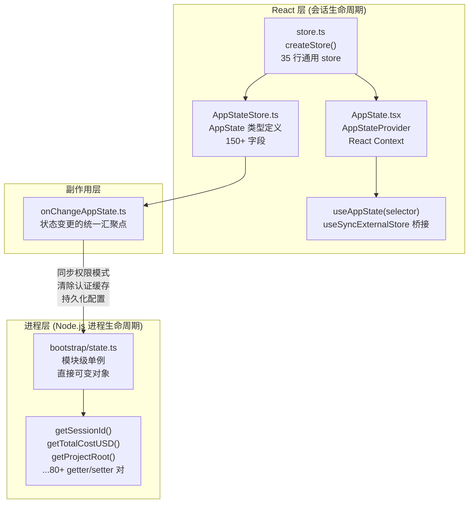

# 第 04 章：状态管理机制
源地址：https://github.com/zhu1090093659/claude-code
## 学习目标

读完本章，你应该能够：

1. 解释两层状态架构（Dual-tier State Architecture）的职责边界，判断一个新字段应该放在哪一层
2. 阅读并理解 `store.ts` 这 35 行代码是如何支撑整个 React 状态系统的
3. 说明为什么 `tasks` 字段不能被 `DeepImmutable<>` 包裹，以及这个设计决策的权衡
4. 理解 `onChangeAppState` 如何作为状态变更的统一副作用入口，以及它解决了什么历史问题
5. 能够为 `AppState` 新增一个字段，并正确地读取和更新它

---

Claude Code 的状态管理在整个代码库中处于中枢地位——几乎所有功能模块都要从状态中读取配置，向状态中写入结果。然而它的实现出人意料地克制：没有 Redux 那样的 Action/Reducer 体系，也没有 MobX 那样的响应式代理，而是一个手写的 35 行微型 store，配合 React 内置的 `useSyncExternalStore` 接入并发模式，再加上一个进程级别的全局单例管理不需要响应性的底层数据。

理解这套架构，是理解整个系统运作方式的关键。

---

## 1. 两层状态的基本格局

在开始看代码之前，需要先建立一个宏观概念：Claude Code 的状态分为截然不同的两层，它们并非同一套机制的不同用法，而是为两种不同需求设计的两套独立方案。



两层之间的分工相当清晰：凡是需要触发 React 重渲染的，放进 `AppState`；凡是需要在非 React 代码（Agent 循环、工具执行器、遥测模块）中同步读取的进程级数据，放进 `bootstrap/state.ts`。

下面的对比表描述了两者最本质的区别：

| 维度 | `bootstrap/state.ts` | `AppState`（store + AppStateStore） |
|---|---|---|
| 生命周期 | 进程级，Node.js 进程存在则存在 | 会话级，React 树存在则存在 |
| 访问方式 | 同步函数调用 `getXxx()` / `setXxx()` | `store.getState()` 或 React hook `useAppState()` |
| 响应性 | 无，变更不通知任何监听者 | 有，变更触发订阅该字段的组件重渲染 |
| 不可变性 | 无，直接可变 | 通过 `DeepImmutable<>` 强制只读 |
| 典型内容 | sessionId、API 调用总成本、遥测计数器、模型覆盖 | UI 状态、权限模式、MCP 连接、任务列表 |
| 子代理继承 | 共享（子代理进程可读取父进程的 totalCostUSD） | 不共享（每个子代理有自己独立的 store） |

---

## 2. `store.ts`：35 行背后的设计哲学

`src/state/store.ts` 是这套架构的基石。整个文件只有 35 行，但它实现的东西和 Zustand、Valtio 这些流行状态库的核心逻辑如出一辙。

```typescript
// src/state/store.ts:1-34
type Listener = () => void
type OnChange<T> = (args: { newState: T; oldState: T }) => void

export type Store<T> = {
  getState: () => T
  setState: (updater: (prev: T) => T) => void
  subscribe: (listener: Listener) => () => void
}

export function createStore<T>(
  initialState: T,
  onChange?: OnChange<T>,
): Store<T> {
  let state = initialState
  const listeners = new Set<Listener>()

  return {
    getState: () => state,

    setState: (updater: (prev: T) => T) => {
      const prev = state
      const next = updater(prev)
      if (Object.is(next, prev)) return       // skip if referentially equal
      state = next
      onChange?.({ newState: next, oldState: prev })
      for (const listener of listeners) listener()
    },

    subscribe: (listener: Listener) => {
      listeners.add(listener)
      return () => listeners.delete(listener)   // returns unsubscribe fn
    },
  }
}
```

这 35 行里有几个值得仔细品味的设计决策。

**updater 函数而非直接赋值**。`setState` 接受的是 `(prev: T) => T` 形式的更新函数，而不是直接传入新值。这个设计迫使调用方基于当前状态计算下一个状态，避免了并发场景下读-改-写操作之间的竞态窗口。你在整个代码库中会看到大量这样的用法：

```typescript
// typical usage in the codebase
store.setState(prev => ({
  ...prev,
  toolPermissionContext: {
    ...prev.toolPermissionContext,
    mode: 'plan',
  },
}))
```

**引用相等短路**（`src/state/store.ts:23`）。`Object.is(next, prev)` 这行检查至关重要。如果更新函数返回的是同一个对象引用，store 直接跳过通知。这意味着只要调用方使用展开运算符 `{ ...prev, field: newValue }` 来构造新状态，就自然享有"相同内容不触发重渲染"的优化——但前提是字段值本身也需要是新引用，否则对象引用不变，依然会被跳过。

**`onChange` 钩子与 `listeners` 的顺序**（`src/state/store.ts:25-26`）。在通知 React 订阅者之前，store 先调用 `onChange`。这个顺序保证了副作用（比如同步权限模式到 SDK）在 React 重渲染之前已经完成，避免了副作用在渲染周期中间才生效的竞态问题。

**`subscribe` 返回取消订阅函数**（`src/state/store.ts:31`）。这个模式直接对应了 `useSyncExternalStore` 对 `subscribe` 参数的接口要求——后者要求订阅函数返回一个清理函数。

---

## 3. `AppStateStore.ts`：一份会说话的类型定义

`src/state/AppStateStore.ts` 本身没有运行时逻辑，它是一份纯粹的类型定义文件，但这份类型定义揭示了整个应用在某一时刻"知道"什么。这个文件大约有 400 行，定义了 150 个以上的字段。

### 3.1 DeepImmutable 分割线

`AppState` 的定义有一个引人注意的结构——它不是一个简单的 `type AppState = DeepImmutable<{...}>`，而是一个带 `&` 的交叉类型：

```typescript
// src/state/AppStateStore.ts:89-158
export type AppState = DeepImmutable<{
  settings: SettingsJson
  verbose: boolean
  mainLoopModel: ModelSetting
  mainLoopModelForSession: ModelSetting
  statusLineText: string | undefined
  expandedView: 'none' | 'tasks' | 'teammates'
  toolPermissionContext: ToolPermissionContext
  spinnerTip?: string
  kairosEnabled: boolean
  remoteConnectionStatus: 'connecting' | 'connected' | 'reconnecting' | 'disconnected'
  replBridgeEnabled: boolean
  replBridgeConnected: boolean
  // ... many more fields
}> & {
  // Unified task state - excluded from DeepImmutable because TaskState contains function types
  tasks: { [taskId: string]: TaskState }
  agentNameRegistry: Map<string, AgentId>
  foregroundedTaskId?: string
  mcp: {
    clients: MCPServerConnection[]
    tools: Tool[]
    commands: Command[]
    resources: Record<string, ServerResource[]>
    pluginReconnectKey: number
  }
  todos: { [agentId: string]: TodoList }
  notifications: { current: Notification | null; queue: Notification[] }
  plugins: { enabled: LoadedPlugin[]; disabled: LoadedPlugin[]; ... }
  // ... more complex fields
}
```

这个分割线不是任意的。注释说得很清楚：`// Unified task state - excluded from DeepImmutable because TaskState contains function types`（`src/state/AppStateStore.ts:159`）。

`DeepImmutable<T>` 的实现在 `src/types/utils.ts` 中，它递归地把所有属性变成 `readonly`，把所有数组变成 `ReadonlyArray`，把所有 `Map` 变成 `ReadonlyMap`。这对于纯数据类型完全没有问题，但 `TaskState` 包含函数字段（比如 `abort: () => void`，用于取消正在进行的 Agent 任务），TypeScript 无法把函数类型标记为 `readonly`，所以这些字段必须排除在 `DeepImmutable<>` 的作用范围之外。

### 3.2 字段的分组逻辑

粗略浏览这 150 多个字段，可以归纳出几个功能群：

UI 控制字段负责管理当前界面的显示状态，比如 `expandedView`（展开哪个面板）、`footerSelection`（底部哪个功能图标被选中）、`viewSelectionMode`（是否在选择 Agent 视图）。这些字段直接驱动 React 组件的渲染分支。

远程桥接字段（`replBridge*` 前缀）有十余个，描述了 Claude Code 与 claude.ai 之间的实时连接状态：是否已连接、会话 URL 是什么、是否正在重连、环境 ID 是什么。这些字段对应了"Always-on bridge"功能，允许用户在网页端观察 CLI 的工作进度。

任务系统字段以 `tasks` 为核心，配合 `foregroundedTaskId`、`viewingAgentTaskId` 实现了多 Agent 任务的前台/后台切换逻辑。

特性门控字段（`kairosEnabled`、`thinkingEnabled`、`bagelActive`、`tungstenActiveSession`）是各种实验性功能的开关，通过 GrowthBook 功能标志（Feature Flag）在运行时决定是否激活。

---

## 4. `AppState.tsx`：把 Store 接入 React

`src/state/AppState.tsx` 扮演着"桥梁"的角色——它把前面那个与 React 无关的通用 store，通过标准的 React 机制暴露给组件树。

### 4.1 Provider 的单例保证

```typescript
// src/state/AppState.tsx:36-57（源码中已经过 React Compiler 编译，以下为原始逻辑）
const HasAppStateContext = React.createContext<boolean>(false)

export function AppStateProvider({ children, initialState, onChangeAppState }: Props) {
  const hasAppStateContext = useContext(HasAppStateContext)
  if (hasAppStateContext) {
    throw new Error("AppStateProvider can not be nested within another AppStateProvider")
  }

  // Store is created once and never changes — stable context value means
  // the provider never triggers re-renders. Consumers subscribe to slices
  // via useSyncExternalStore in useAppState(selector).
  const [store] = useState(
    () => createStore(initialState ?? getDefaultAppState(), onChangeAppState)
  )

  return (
    <HasAppStateContext.Provider value={true}>
      <AppStoreContext.Provider value={store}>
        {children}
      </AppStoreContext.Provider>
    </HasAppStateContext.Provider>
  )
}
```

`HasAppStateContext` 是一个只含布尔值的 Context，专门用来防止嵌套 Provider——一旦嵌套就立刻抛出错误。这个设计的深层原因是：如果允许嵌套，子树就会有自己的 store 实例，外层的状态变更就无法传递进去，会产生非常难以调试的状态不一致。

`useState(() => createStore(...))` 里的初始化函数（lazy initializer）保证 store 只被创建一次，且 `store` 的引用在整个 Provider 存活期间保持不变。Context value 不变意味着 Provider 本身不会触发子组件因 Context 变化而重渲染——消费侧通过 `useSyncExternalStore` 自行订阅所需字段，只有订阅的字段变了才重渲染。

### 4.2 `useSyncExternalStore` 桥接

组件不直接调用 `store.getState()`，而是通过 `useAppState` hook 订阅状态切片（Slice）：

```typescript
// src/state/AppState.tsx:142-163（原始源码逻辑）
export function useAppState<T>(selector: (state: AppState) => T): T {
  const store = useAppStore()

  const get = () => {
    const state = store.getState()
    const selected = selector(state)
    return selected
  }

  return useSyncExternalStore(store.subscribe, get, get)
}
```

`useSyncExternalStore`（React 18 引入）是将外部 store 接入 React 并发模式（Concurrent Mode）的官方方案。它接受三个参数：`subscribe` 函数、获取快照的 `getSnapshot` 函数、以及服务端渲染用的 `getServerSnapshot`。这里 `get` 被传了两次，因为 Claude Code 运行在终端里，不需要区分服务端和客户端快照。

`selector` 的设计是整个性能优化的关键。比如：

```typescript
// good: only re-renders when verbose changes
const verbose = useAppState(s => s.verbose)

// good: stable reference, re-renders when the whole object replaces
const { text, promptId } = useAppState(s => s.promptSuggestion)

// bad: new object on every call, always triggers re-render
// const value = useAppState(s => ({ a: s.a, b: s.b }))
```

源码注释（`src/state/AppState.tsx:136-140`）明确警告了最后这种反模式：selector 不能返回新创建的对象，因为 `Object.is` 永远会认为两个不同引用的对象不相等，导致该组件在每次任何状态变更时都重渲染。

---

## 5. `selectors.ts`：将查询逻辑集中管理

`src/state/selectors.ts` 存放的是对 `AppState` 进行推导计算的纯函数（Pure Functions）。这些函数没有副作用，只是从状态中提取或计算出更高层次的数据。

```typescript
// src/state/selectors.ts:18-40
export function getViewedTeammateTask(
  appState: Pick<AppState, 'viewingAgentTaskId' | 'tasks'>,
): InProcessTeammateTaskState | undefined {
  const { viewingAgentTaskId, tasks } = appState

  // Not viewing any teammate
  if (!viewingAgentTaskId) return undefined

  // Look up the task
  const task = tasks[viewingAgentTaskId]
  if (!task) return undefined

  // Verify it's an in-process teammate task
  if (!isInProcessTeammateTask(task)) return undefined

  return task
}
```

注意这个函数的参数类型：`Pick<AppState, 'viewingAgentTaskId' | 'tasks'>`。这不是写 `AppState` 的偷懒，而是有意为之——它让函数只声明自己真正需要的字段，便于测试（只需提供这两个字段的对象），也防止了函数在内部悄悄访问它"不该"访问的状态。

`getActiveAgentForInput`（`src/state/selectors.ts:59-76`）返回一个辨别联合（Discriminated Union）类型：

```typescript
// src/state/selectors.ts:46-50
export type ActiveAgentForInput =
  | { type: 'leader' }
  | { type: 'viewed'; task: InProcessTeammateTaskState }
  | { type: 'named_agent'; task: LocalAgentTaskState }
```

调用方用 switch 或 if 分支处理三种情况，TypeScript 会强制穷举所有可能性。这是比返回 `null | Task` 更健壮的设计——后者无法区分"当前没有选中 Agent"和"当前选中的是 leader"这两种语义不同的情况。

---

## 6. `onChangeAppState`：统一副作用的汇聚点

`src/state/onChangeAppState.ts` 是整个状态系统里最值得研究的文件之一——不是因为它的代码量大，而是因为它的注释里藏着一段真实的架构演化历史。

### 6.1 它解决了什么问题

文件的注释（`src/state/onChangeAppState.ts:50-64`）记录了这个函数诞生之前的混乱状态：

```typescript
// src/state/onChangeAppState.ts:50-64
// toolPermissionContext.mode — single choke point for CCR/SDK mode sync.
//
// Prior to this block, mode changes were relayed to CCR by only 2 of 8+
// mutation paths: a bespoke setAppState wrapper in print.ts (headless/SDK
// mode only) and a manual notify in the set_permission_mode handler.
// Every other path — Shift+Tab cycling, ExitPlanModePermissionRequest
// dialog options, the /plan slash command, rewind, the REPL bridge's
// onSetPermissionMode — mutated AppState without telling
// CCR, leaving external_metadata.permission_mode stale and the web UI out
// of sync with the CLI's actual mode.
//
// Hooking the diff here means ANY setAppState call that changes the mode
// notifies CCR (via notifySessionMetadataChanged → ccrClient.reportMetadata)
// and the SDK status stream (via notifyPermissionModeChanged → registered
// in print.ts). The scattered callsites above need zero changes.
```

用大白话说：修改权限模式（Permission Mode）的路径有 8 条以上（按 Shift+Tab、点击对话框按钮、输入 `/plan` 命令、rewind 操作……），但通知 Web UI（CCR）权限变了的代码只覆盖了其中 2 条。结果就是 Web UI 经常显示陈旧的权限状态。修复方案不是逐一给 8 条路径添加通知代码，而是在 store 的 `onChange` 回调里做一次差分（diff）检查——不管是哪条路径触发的，只要 `toolPermissionContext.mode` 变了，就通知所有相关方。

### 6.2 它现在做什么

```typescript
// src/state/onChangeAppState.ts:43-171（简化展示核心逻辑）
export function onChangeAppState({ newState, oldState }) {
  // 1. 权限模式变更 → 通知 CCR（Web UI）和 SDK 状态流
  const prevMode = oldState.toolPermissionContext.mode
  const newMode = newState.toolPermissionContext.mode
  if (prevMode !== newMode) {
    const prevExternal = toExternalPermissionMode(prevMode)
    const newExternal = toExternalPermissionMode(newMode)
    if (prevExternal !== newExternal) {
      notifySessionMetadataChanged({ permission_mode: newExternal, ... })
    }
    notifyPermissionModeChanged(newMode)
  }

  // 2. mainLoopModel 变更 → 持久化到用户设置文件，同步 bootstrap/state.ts
  if (newState.mainLoopModel !== oldState.mainLoopModel) {
    updateSettingsForSource('userSettings', { model: newState.mainLoopModel })
    setMainLoopModelOverride(newState.mainLoopModel)
  }

  // 3. expandedView 变更 → 持久化到 globalConfig
  if (newState.expandedView !== oldState.expandedView) {
    saveGlobalConfig(current => ({ ...current, showExpandedTodos: ..., showSpinnerTree: ... }))
  }

  // 4. settings 变更 → 清除认证缓存、重新应用环境变量
  if (newState.settings !== oldState.settings) {
    clearApiKeyHelperCache()
    clearAwsCredentialsCache()
    clearGcpCredentialsCache()
    if (newState.settings.env !== oldState.settings.env) {
      applyConfigEnvironmentVariables()
    }
  }
}
```

这个函数处理的每一块都是一个"AppState 变更 → 外部系统同步"的管道。它是 AppState 与进程级状态（bootstrap）、持久化配置（globalConfig）、外部通知（CCR/SDK）之间的唯一桥接层。

值得注意的是，`onChangeAppState` 被作为 `createStore` 的 `onChange` 参数传入（`src/state/AppState.tsx` 中的 `Provider`），这意味着它在每次任何字段变更时都会被调用，通过差分比较决定哪些副作用需要触发。这是"有副作用就在 onChange 里做差分"和"无副作用则不关心"的边界划分。

---

## 7. `bootstrap/state.ts`：进程级单例

`src/bootstrap/state.ts` 文件顶部的注释是整个文件最重要的一行：

```typescript
// src/bootstrap/state.ts:31
// DO NOT ADD MORE STATE HERE - BE JUDICIOUS WITH GLOBAL STATE
```

这行注释出现了两次（第 31 行和第 259 行）。这种重复不是错误，而是在强调：全局单例是有代价的，每新增一个字段，就多了一个需要在测试之间手动重置、在子进程中谨慎处理的全局变量。

### 7.1 结构

```typescript
// src/bootstrap/state.ts:45-257（类型定义部分）
type State = {
  originalCwd: string    // resolved once at startup, never changes
  projectRoot: string    // stable project root, set by --worktree
  totalCostUSD: number   // accumulated API cost this session
  totalAPIDuration: number
  sessionId: SessionId
  parentSessionId: SessionId | undefined
  isInteractive: boolean
  // telemetry (OpenTelemetry)
  meter: Meter | null
  sessionCounter: AttributedCounter | null
  // ... 80+ more fields
}
```

实现方式是一个模块级对象（Module-level Object），通过 `getInitialState()` 初始化：

```typescript
// src/bootstrap/state.ts:260-420（简化）
function getInitialState(): State {
  const resolvedCwd = realpathSync(cwd()).normalize('NFC')
  return {
    originalCwd: resolvedCwd,
    projectRoot: resolvedCwd,
    totalCostUSD: 0,
    sessionId: randomUUID() as SessionId,
    // ...
  }
}

const stateInstance = { ...getInitialState() }

export function getSessionId(): SessionId { return stateInstance.sessionId }
export function switchSession(newId: SessionId): void { stateInstance.sessionId = newId }
export function getTotalCostUSD(): number { return stateInstance.totalCostUSD }
export function addCost(usd: number): void { stateInstance.totalCostUSD += usd }
// ...
```

每个字段都有对应的 getter（有时还有 setter 或 adder），外部只通过这些函数访问，不直接操作 `stateInstance`。

### 7.2 为什么不全部用 AppState

一个自然的问题是：既然 AppState 已经有了那么多字段，为什么还要维护 bootstrap 这个单独的单例？

原因有三。第一是访问点不同：Agent 循环的核心代码（`src/query.ts`、工具实现、遥测上报）在完全没有 React 上下文的情况下运行，它需要同步、零依赖地读取 sessionId 或累加 totalCostUSD，调用 `getSessionId()` 一行就够了，不需要 store 引用。第二是响应性不对称：sessionId、totalCostUSD 这些字段根本不需要触发 UI 重渲染，放进 AppState 会白白消耗 React 的调度开销。第三是子代理的继承问题：子代理进程与父进程共享同一个 Node.js 模块图，bootstrap 单例天然被继承；而 AppState 对每个会话（React 树）是独立的，子代理有自己的 store。

---

## 8. 实践：添加一个新的状态字段

理解了架构之后，添加新字段的步骤就相对清晰了。以添加一个"当前会话的自定义标题"字段为例，演示完整流程。

**第一步，判断放在哪一层**。这个标题需要在 UI 里显示，需要触发 Header 组件重渲染——放 AppState。

**第二步，在 AppStateStore.ts 里添加类型**。先判断这个字段是否可以被 DeepImmutable 包裹。字符串是纯数据类型，可以放在 `DeepImmutable<{...}>` 的范围内：

```typescript
// in src/state/AppStateStore.ts, inside the DeepImmutable block
export type AppState = DeepImmutable<{
  // ... existing fields
  sessionTitle: string | undefined   // add here
}> & {
  // ... mutable fields
}
```

**第三步，在 `getDefaultAppState()` 里添加默认值**：

```typescript
// in src/state/AppStateStore.ts, getDefaultAppState function
export function getDefaultAppState(): AppState {
  return {
    // ... existing defaults
    sessionTitle: undefined,
  }
}
```

**第四步，在组件里读取**：

```typescript
// in any React component inside AppStateProvider
const sessionTitle = useAppState(s => s.sessionTitle)
```

**第五步，更新它**：

```typescript
// using useSetAppState
const setAppState = useSetAppState()
setAppState(prev => ({ ...prev, sessionTitle: 'My Research Session' }))

// or using store directly in non-React code
store.setState(prev => ({ ...prev, sessionTitle: 'My Research Session' }))
```

如果这个字段的变更需要触发副作用（比如持久化到磁盘），在 `onChangeAppState.ts` 里添加差分处理：

```typescript
// in src/state/onChangeAppState.ts
if (newState.sessionTitle !== oldState.sessionTitle) {
  // persist or notify external systems
}
```

---

## 关键要点

Claude Code 的状态管理体现了一种务实的工程判断。

store.ts 的 35 行证明了一件事：你不需要框架来管理状态，你只需要一个带差分检查的发布-订阅模式，再加上 React 官方提供的外部 store 接入钩子。把状态逻辑本身（store.ts）和 React 绑定（AppState.tsx）分开，意味着 store 可以被非 React 代码使用，也意味着可以被独立测试。

两层架构的划分不是任意的，而是由访问场景决定的。进程级、无需响应性、需要在任何代码路径中同步读取的数据，用 bootstrap 单例；会话级、需要驱动 UI 更新的数据，用 AppState store。混淆这两层会带来要么过度的重渲染，要么 React 上下文缺失时的运行时错误。

`DeepImmutable<>` 的作用范围恰好揭示了状态设计中的一个真实约束：不可变性和函数类型不相容。`tasks` 字段被排除在外，不是偷懒，而是 TypeScript 类型系统本身无法表达"含函数的只读对象"这个语义，所以只能用架构上的分隔来替代编译期保证。

`onChangeAppState` 的注释是整个代码库里最好的"设计决策记录"之一——它告诉你，当你发现一个副作用被多条代码路径漏掉时，正确的做法不是给每条路径单独打补丁，而是找到那个所有路径都必须经过的单一节点，把副作用放在那里。

---

**延伸阅读**

- 第 02 章"启动流程与初始化"描述了 `AppStateProvider` 如何在 REPL 启动时被挂载，以及 `onChangeAppState` 如何作为参数传入
- 第 07 章"权限与安全模型"会深入讲解 `toolPermissionContext.mode` 的 8+ 条变更路径，以及 `onChangeAppState` 如何保证它们都触发正确的同步
- 第 05 章"Agent 循环引擎"会展示 `bootstrap/state.ts` 中的 `totalCostUSD` 等字段是如何在 `query.ts` 的核心循环里被更新的
