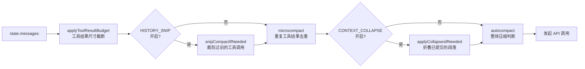
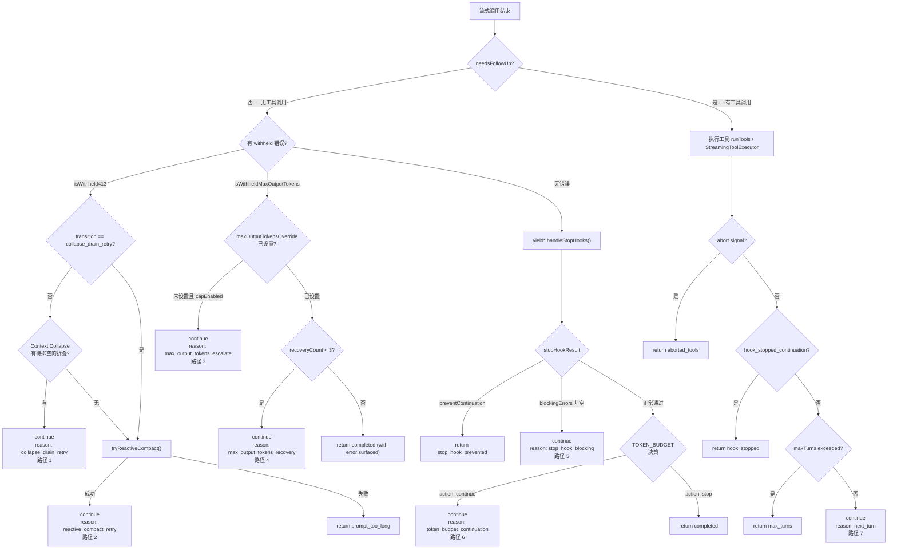

# 第5章 — Agent 循环引擎
源地址：https://github.com/zhu1090093659/claude-code
## 本章导读

读完本章，你应该能够：

1. 解释为什么 Agent 行为必须用一个 `while(true)` 循环来驱动，而不是简单的函数递归
2. 区分 `query()` 与 `queryLoop()` 的职责边界，说清楚外层门面的价值
3. 逐字段读懂 `State` 结构，理解每个字段在跨迭代状态传递中的作用
4. 说出循环进入 API 调用之前会依次经历哪四重预处理，以及它们的顺序为何不能颠倒
5. 掌握全部 7 条 `continue` 路径的触发条件和退出时的状态变更，能在代码里快速定位某条路径
6. 理解 stop hooks 机制的设计动机，知道哪些副作用在这里执行、哪些被有意排除
7. 理解 `QueryConfig` 与 `QueryDeps` 的解耦设计，能用它为循环逻辑写单元测试

---

每当你在 Claude Code 里输入一条指令并按下回车，背后真正工作的是一个叫做 `queryLoop` 的函数。它是整个 Agent 能力的发动机：负责把消息发送给模型，接收流式回复，执行工具调用，处理各种错误和恢复逻辑，然后决定是继续还是退出。

很多 Agent 框架把这套逻辑藏在复杂的事件总线或插件系统之后。Claude Code 的选择截然不同——所有的控制流都显式地写在一个大循环里。这不是粗糙，而是经过深思熟虑的设计：当错误恢复、上下文压缩、token 预算管理全都在同一个可见的地方，调试和推理就变得直接了当。

本章将带你逐层解开这个循环的结构。

---

## 5.1 为什么需要一个循环

要理解循环的必要性，先想一个最简单的场景：用户问了个问题，模型直接给出了文字回答。这种情况下，一次 API 调用就够了，不需要任何循环。

但 Claude Code 的核心价值在于工具调用。当模型回复里包含一个 `tool_use` 块——比如让它读取某个文件——系统就必须真正去执行这个读取操作，然后把结果作为新的用户消息发回给模型，让模型继续处理。这天然就是多轮的：工具调用结果作为下一轮的输入，下一轮的输出可能又触发新的工具调用，如此往复直到模型停止请求工具。

工具调用只是循环存在的第一个理由。还有更多：

上下文压缩（Compaction）需要循环。当对话历史积累到接近模型的上下文窗口上限时，系统需要把历史消息压缩成摘要，然后用这个更短的历史重新开始下一轮请求。这是一个"中途改变输入再重试"的操作，本质上就是 `continue`。

错误恢复需要循环。当 API 返回 `prompt_too_long` 错误，系统不该直接报错退出，而是尝试压缩上下文、删除不必要的附件，然后用更小的消息重试。这同样是循环。

Token 预算管理需要循环。在某些场景下，即使模型已经给出了一个完整回答，如果还没用完分配的 token 预算，系统会主动注入一条提示，要求模型继续完善答案。这又是一次循环迭代。

如果用递归来实现，上面这些场景的堆栈会越来越深，难以追踪且有栈溢出风险。`while(true)` 的显式循环把所有这些重试逻辑压平在同一层，状态通过 `state = {...}; continue` 在迭代间传递，清晰而安全。

---

## 5.2 外层函数 `query()`：简洁的门面

`src/query.ts:219` 是整个 Agent 循环对外暴露的入口：

```typescript
// src/query.ts:219
export async function* query(
  params: QueryParams,
): AsyncGenerator<
  | StreamEvent
  | RequestStartEvent
  | Message
  | TombstoneMessage
  | ToolUseSummaryMessage,
  Terminal
> {
  const consumedCommandUuids: string[] = []
  const terminal = yield* queryLoop(params, consumedCommandUuids)
  // Only reached if queryLoop returned normally. Skipped on throw (error
  // propagates through yield*) and on .return() (Return completion closes
  // both generators). This gives the same asymmetric started-without-completed
  // signal as print.ts's drainCommandQueue when the turn fails.
  for (const uuid of consumedCommandUuids) {
    notifyCommandLifecycle(uuid, 'completed')
  }
  return terminal
}
```

这个函数极短，只做了两件事。第一，把实际工作完全代理给 `queryLoop`，用 `yield*` 把内层生成器的所有产出原封不动地传给调用方。第二，在循环正常结束后，通知所有被消费的命令已完成生命周期。

注意注释里那句话：这段收尾代码只在"正常返回"时执行。如果 `queryLoop` 抛出异常，或者调用方提前调用了 `.return()` 中断生成器，这段代码会被跳过。这是 JavaScript 生成器的语义：`yield*` 异常穿透，`return()` 协同关闭。设计者有意利用了这个不对称性——成功的命令得到"已完成"通知，失败和中断的命令不会。

`QueryParams` 是传入的参数包，涵盖了一次查询所需的全部上下文：

```typescript
// src/query.ts:181
export type QueryParams = {
  messages: Message[]               // conversation history
  systemPrompt: SystemPrompt        // system prompt content
  userContext: { [k: string]: string }
  systemContext: { [k: string]: string }
  canUseTool: CanUseToolFn          // permission check function
  toolUseContext: ToolUseContext    // tool execution environment (40+ fields)
  fallbackModel?: string           // model to switch to on failure
  querySource: QuerySource         // e.g. 'repl_main_thread', 'sdk', 'agent:xxx'
  maxOutputTokensOverride?: number
  maxTurns?: number                // max loop iterations
  skipCacheWrite?: boolean
  taskBudget?: { total: number }   // API-level output token budget
  deps?: QueryDeps                 // injectable dependencies for testing
}
```

`querySource` 字段值得特别关注。它标识了本次查询的来源，贯穿整个循环的大量决策分支：是否保存缓存参数供 `/btw` 命令使用、是否运行 stop hooks、是否向 MCP 服务器暴露工具调用上下文……几乎每一处有条件的行为都会检查这个字段。常见的值有 `repl_main_thread`（用户在 REPL 里直接输入的主线程查询）、`sdk`（通过 SDK 调用的）、`agent:xxxx`（子 Agent 发起的）、`compact`（压缩任务发起的）。

---

## 5.3 主循环的骨架：State 与 while(true)

`queryLoop` 的真正起点在 `src/query.ts:241`。函数体可以分为三段：初始化、`while(true)` 循环、以及永远不会被直接执行到的收尾（因为 `while(true)` 只通过 `return` 或 `continue` 退出）。

初始化阶段首先创建 `State` 对象：

```typescript
// src/query.ts:268
let state: State = {
  messages: params.messages,
  toolUseContext: params.toolUseContext,
  maxOutputTokensOverride: params.maxOutputTokensOverride,
  autoCompactTracking: undefined,
  stopHookActive: undefined,
  maxOutputTokensRecoveryCount: 0,
  hasAttemptedReactiveCompact: false,
  turnCount: 1,
  pendingToolUseSummary: undefined,
  transition: undefined,
}
```

`State` 类型是循环的记忆。每次 `continue` 时，代码不是修改现有的 `state` 对象的字段，而是用展开语法构建一个全新的对象：`state = { ...oldState, someField: newValue }; continue`。这个不可变更新（Immutable Update）模式让每次迭代的起点都是一张干净的快照，便于调试和推理，也让 `transition` 字段能精确记录"上一次循环为什么没有退出"。

各字段的含义如下：

`messages` 是传给 API 的消息历史。每次工具调用完成后，新的 assistant 消息和 tool result 消息都会被追加进去，然后通过 `state` 传入下一轮。

`toolUseContext` 是贯穿整个会话的执行上下文容器，包含工具列表、AbortController、权限模式、MCP 客户端等四十多个字段。它本身是引用类型，但更新时也走不可变路径（展开后替换字段）。

`autoCompactTracking` 记录了自动压缩（Auto-Compact）的追踪状态。压缩发生后它会被重置，用于计算"上次压缩以来经过了多少轮"，供压缩触发阈值判断使用。

`maxOutputTokensRecoveryCount` 是 max_output_tokens 错误的恢复计数器。当模型的输出被截断，系统会注入一条"请继续"的提示并重试，最多重试 3 次（`MAX_OUTPUT_TOKENS_RECOVERY_LIMIT`）。这个字段记录已经重试了多少次。

`hasAttemptedReactiveCompact` 是防止无限循环的保险阀。如果因为 `prompt_too_long` 已经尝试过一次响应式压缩，就不再重复尝试。

`maxOutputTokensOverride` 记录是否已经把输出 token 上限从默认的 8k 升级到了 64k。

`pendingToolUseSummary` 是一个异步 Promise，指向"当前轮工具调用的摘要"的生成任务。它在工具执行完成后立即启动（不阻塞），在下一轮循环开始时才去 `await`，这样摘要生成和下一轮 API 调用就并行执行了。

`stopHookActive` 标记当前是否正处于 stop hook 触发的重试周期内，影响 stop hook 的执行方式。

`turnCount` 是轮次计数器，从 1 开始，每次正常的工具调用循环后加 1，用于与 `maxTurns` 比较。

`transition` 是最后一次 `continue` 的原因记录。在第一轮迭代时它是 `undefined`，此后每个 `continue` 站点都会写入一个描述对象，如 `{ reason: 'next_turn' }` 或 `{ reason: 'max_output_tokens_escalate' }`。这个字段对测试极为有用——测试代码可以直接检查 `state.transition.reason` 来断言走了哪条恢复路径，而不用解析消息内容。

---

## 5.4 循环前准备：四重预处理

每次进入 `while(true)` 循环体，在发起 API 调用之前，代码会对消息列表做一系列预处理。这个顺序是精心设计的，不可随意调换。



**第一步：工具结果尺寸截断（applyToolResultBudget）**

某些工具（如文件读取）可能返回几十万字符的内容。如果不加限制地把这些原始内容全部塞进上下文，很快就会超出模型的 token 限制。`applyToolResultBudget` 在每轮开始时检查消息里的工具结果，对超过单条上限的内容进行截断，替换为"已被截断，完整内容见 session 存储"的占位符。

这一步刻意排在 microcompact 之前。因为 microcompact 是基于 `tool_use_id` 做缓存匹配的，从不检查内容本身——内容替换对它完全透明，两步可以干净地组合。

**第二步：snip 裁剪（HISTORY_SNIP 开启时）**

`snipCompactIfNeeded` 是一种轻量级的历史裁剪策略：识别出对话历史中"非常老的工具调用往返对"，把它们从消息列表里移除，但同时记录一个 boundary 标记。这比完整的压缩代价小得多，适合在上下文略微超标时快速腾出空间。

裁剪释放的 token 数量（`snipTokensFreed`）会被传递给后续的 autocompact，让它在计算"当前 token 使用量"时减去这部分，避免误判为仍然超标。

**第三步：microcompact 微压缩**

`microcompactMessages` 处理的是另一类冗余：当同一个文件在同一轮对话里被多次读取，后几次的读取结果与第一次往往完全相同，但全部保留会浪费大量 token。microcompact 识别出这些重复的工具结果并把它们折叠，保留第一次，后续的用一个极短的占位符替代。

这一步结果里还有一个 `pendingCacheEdits` 字段，用于延迟发布 boundary 消息——它要等 API 返回后才能知道实际删了多少 token，这样 boundary 消息里的数字才是准确的。

**第四步：context collapse 上下文折叠（CONTEXT_COLLAPSE 开启时）**

这个机制比 autocompact 更细粒度：它不是把整个历史压成一条摘要，而是把对话里的某些"段落"折叠成更短的摘要，其余部分保持原样。折叠操作通过一个"提交日志"来持久化，每次 `projectView()` 调用都会重放这些提交，因此折叠效果会跨轮次保留。

这一步刻意排在 autocompact 之前：如果 context collapse 就把 token 降到了阈值以下，autocompact 就不必运行，从而保留了更细粒度的历史。

**第五步：autocompact 自动压缩判断**

`autoCompactIfNeeded` 是"大炮"，会把当前整个消息历史压缩成一条摘要，然后把后续的新消息附在摘要后面继续。这一步有阈值保护——只有当当前 token 使用量超过设定阈值时才触发。触发后，`autoCompactTracking` 会被更新，记录本次压缩的时间点。

压缩完成后，代码并不会 `continue` 重开循环，而是直接用压缩后的消息继续当前迭代的后续步骤。这意味着一次循环迭代里，可以先压缩再调用 API——压缩是"同一轮里的预处理"，不算新的一轮。

---

## 5.5 发起 API 请求：流式调用

预处理完成后，代码进入真正的 API 调用段落（`src/query.ts:659`）：

```typescript
// src/query.ts:659
for await (const message of deps.callModel({
  messages: prependUserContext(messagesForQuery, userContext),
  systemPrompt: fullSystemPrompt,
  thinkingConfig: toolUseContext.options.thinkingConfig,
  tools: toolUseContext.options.tools,
  signal: toolUseContext.abortController.signal,
  options: {
    model: currentModel,
    fallbackModel,
    querySource,
    maxOutputTokensOverride,
    // ... more options
  },
})) {
  // Handle each streaming message
}
```

`deps.callModel` 是一个异步生成器，它对应生产环境中的 `queryModelWithStreaming`。用依赖注入而不是直接调用，是为了让测试能够替换成假的模型，注入预设的消息序列，而无需真正发起网络请求。

流式调用的每个产出（`message`）可能是以下类型：

`assistant` 类型的消息是最常见的。它的 `message.content` 是一个数组，可以同时包含 `text` 块（模型的文字回复）、`tool_use` 块（工具调用请求）、`thinking` 块（模型的内部思考）。代码在遇到 `assistant` 消息时会检查它的内容，如果有 `tool_use` 块就把它们收集到 `toolUseBlocks` 数组，并把 `needsFollowUp` 设为 `true`——这个标志是循环结束后决定"是继续还是退出"的关键信号。

流式阶段还有一个重要的"扣押（withhold）"机制：某些特定的错误消息——`prompt_too_long`、`max_output_tokens`、媒体尺寸错误——会被检测到后暂时不 `yield` 出去，而是先推入 `assistantMessages` 数组，等流结束后再决定是尝试恢复还是直接暴露。这防止了错误消息提前泄漏给 SDK 调用方（很多 SDK 调用方一看到 error 字段就会终止会话，而这时恢复逻辑还没有运行）。

`streamingToolExecutor` 是流式工具执行器（Streaming Tool Executor）。在 `streamingToolExecution` 特性门开启时，工具执行不等整个流结束——每当一个完整的 `tool_use` 块到达，`StreamingToolExecutor` 就立即开始执行对应的工具，同时模型继续流式输出后续内容。这让工具执行与模型生成并行，减少了整体延迟。

当流式传输过程中发生了"流式降级（streaming fallback）"——即从流式切换到非流式——所有已收集的中间消息（可能包含不完整的 thinking 块，其签名对后续 API 调用无效）都会被清理，发送一批 `tombstone` 消息告知 UI 移除这些孤儿消息，然后从一个干净的状态重新接收非流式响应。

---

## 5.6 七条 continue 路径

流结束后，代码进入一系列判断，决定本次迭代该退出（`return`）还是继续（`continue`）。有 7 个明确的 `continue` 站点，每一个都对应一类特定的恢复或续行场景。



### 路径一：context collapse 排空重试

触发条件：API 返回了 `prompt_too_long` 错误（即 `isWithheld413 === true`），且这轮不是已经走过一次 collapse 排空了（`state.transition?.reason !== 'collapse_drain_retry'`），且 context collapse 功能开启并有已暂存的折叠等待提交。

`src/query.ts:1094` 调用 `contextCollapse.recoverFromOverflow()`，它会把所有暂存但还没提交的折叠一次性全部提交，得到一个更短的消息列表。如果确实有内容被提交（`drained.committed > 0`），就用这个更短的列表重试。

典型场景：用户在一个长对话里让 Agent 读了很多文件，历史中有一批早期的工具往返还没有被折叠。现在 prompt 超长了，先把这些已计划的折叠全部落地，消息列表变短，然后重试。这比直接运行 reactive compact 成本更低，保留了更多细粒度的上下文。

### 路径二：reactive compact 重试

触发条件：prompt 超长（或媒体尺寸错误），且路径一不适用（或已经走过路径一但仍然超长）。

`src/query.ts:1119` 调用 `reactiveCompact.tryReactiveCompact()`，这是一次真正的压缩——把当前消息历史通过另一个 API 调用压缩成摘要，然后用摘要替代历史重试。`hasAttemptedReactiveCompact` 被设为 `true`，防止第二次触发这条路径（因为如果压缩后还是超长，就说明无法恢复了，应该报错）。

典型场景：一个长期运行的 Agent 处理了大量文件操作，历史太长，context collapse 也不够用了，必须做整体压缩。

### 路径三：max_output_tokens 升级

触发条件：API 报告输出 token 超限（`max_output_tokens` 错误），且这是第一次遇到（`maxOutputTokensOverride === undefined`），且特性 `tengu_otk_slot_v1` 开启，且没有环境变量手动覆盖 token 上限。

`src/query.ts:1207` 把 `maxOutputTokensOverride` 设为 `ESCALATED_MAX_TOKENS`（64k），然后用相同的消息重新请求模型。这是"先静默升级再重试"，用户不会看到任何提示，如果 64k 就够了，这次错误对用户完全透明。

典型场景：模型在生成一段很长的代码时用完了默认的 8k token 限制。系统悄悄把限制升到 64k 再试一次，大多数情况下就够了。

### 路径四：max_output_tokens 多轮恢复

触发条件：路径三已经运行过（即 `maxOutputTokensOverride` 已经是 64k），模型在 64k 上限下仍然被截断，且 `maxOutputTokensRecoveryCount < 3`。

`src/query.ts:1231` 注入一条对用户隐藏的系统消息："Output token limit hit. Resume directly — no apology, no recap of what you were doing. Pick up mid-thought if that is where the cut happened. Break remaining work into smaller pieces." 然后把 `maxOutputTokensRecoveryCount` 加 1，继续下一轮。

这条路径最多执行 3 次（`MAX_OUTPUT_TOKENS_RECOVERY_LIMIT = 3`）。如果 3 次都不够，就把被扣押的错误消息释放出来，让用户看到，然后结束。

典型场景：模型在生成一个非常长的文件（比如几千行的代码）时，64k 都不够用，只能分多次续写，每次从截断处接着来。

### 路径五：stop hook 阻断错误

触发条件：`handleStopHooks()` 返回 `blockingErrors` 非空数组——即某个 stop hook 脚本运行后返回了"阻断"信号，要求 Agent 继续运行来解决问题。

`src/query.ts:1282` 把 stop hook 返回的 blocking error 消息追加到消息历史末尾，设 `stopHookActive: true`，然后继续下一轮。`stopHookActive` 让下一轮的 stop hook 知道自己是在"stop hook 重试轮"里，可以据此调整行为。

典型场景：用户配置了一个检查代码风格的 stop hook，这轮 Agent 修改了一个文件但没有跑格式化。stop hook 检查到了风格问题，返回一个 blocking error 让 Agent 知道需要修复。Agent 收到错误消息，在下一轮调用 formatter，修复后 stop hook 通过，流程继续。

`hasAttemptedReactiveCompact` 在这条路径里被刻意保留（不重置为 `false`），因为有一个真实的无限循环 bug 就是因为重置了这个标志引发的：compact 后仍然 prompt_too_long，stop hook blocking 触发，compact 标志被重置，再次 compact，再次 too long，循环往复，烧掉大量 API 调用。

### 路径六：token budget 继续

触发条件：`TOKEN_BUDGET` 特性开启，且 `checkTokenBudget()` 返回 `action: 'continue'`——即模型使用的 token 还没有达到分配预算的 90% 阈值，且没有出现"边际收益递减"（连续 3 次增量都低于 500 token）。

`src/query.ts:1316` 注入一条隐藏的"继续"提示，引导模型在预算耗尽前继续产出。`budgetTracker` 记录了连续触发次数和每次的 token 增量，用于判断是否进入"边际收益递减"状态——如果模型每次续写只多产出几十个 token，继续下去也没有意义了。

这条路径服务于一个特定的场景：在大型 Agentic 任务里，希望模型尽量利用分配的 token 预算做更多工作，而不是在很早就给出一个简短的回答停下来。

### 路径七：常规下一轮（工具调用续行）

触发条件：`needsFollowUp === true`——流式响应里包含了 `tool_use` 块，工具执行完成，结果已经追加到消息列表，没有中途中断，没有 hook 阻止继续，且没有超过 `maxTurns` 限制。

`src/query.ts:1715` 构建新的 `state`，把当前轮的 `messagesForQuery + assistantMessages + toolResults` 合并为新的 `messages`，把 `turnCount + 1`，把 `maxOutputTokensRecoveryCount` 和 `hasAttemptedReactiveCompact` 重置为初始值，然后 `continue`。

这是七条路径里最普通也最常走的一条：Agent 调用了工具，工具运行完了，结果作为下一轮的输入继续。

---

## 5.7 Stop Hooks：一轮结束时的后台任务

当 `needsFollowUp === false`（即模型没有发起工具调用，这轮对话从模型角度是"结束"了），代码会调用 `handleStopHooks()`（`src/query/stopHooks.ts:65`）。

这个函数本身也是一个异步生成器，它负责在每轮对话自然结束时执行一系列"清理和补充"工作。

第一件事是**保存缓存参数（cacheSafeParams）**。只对 `repl_main_thread` 和 `sdk` 来源的查询执行。`/btw` 命令和 `side_question` SDK 控制请求需要读取这个快照，它记录了最近一次完整对话结束时的完整上下文，让这两个功能能够"插入"到正在进行的对话流中。

第二件事是**prompt suggestion**（非 bare 模式）。在用户可能不确定下一步该输入什么时，主动生成建议提示。这是 fire-and-forget 的（`void executePromptSuggestion(...)`），不会阻塞主循环。

第三件事是**extractMemories**（`EXTRACT_MEMORIES` 特性开启时）。分析本轮对话，提取值得长期记忆的信息（如用户的习惯、项目特定约定），存入记忆系统。同样是 fire-and-forget，对于 `-p` 非交互模式，`print.ts` 里有 `drainPendingExtraction` 在退出前等待这个操作完成。

第四件事是**autoDream**，一个在后台异步运行的任务生成器，不影响主流程。

第五件事是**cleanupComputerUseAfterTurn**（`CHICAGO_MCP` 特性开启时），负责在对话结束后释放 Computer Use 的锁、取消隐藏。这只在主线程执行——子 Agent 不持有 CU 锁，如果让子 Agent 释放会导致主线程在错误的时机丢失锁。

上述五项都是"副作用型"工作，不会阻塞循环也不影响循环的控制流决策。真正影响控制流的是接下来的 `executeStopHooks`：

```typescript
// src/query/stopHooks.ts:180
const generator = executeStopHooks(
  permissionMode,
  toolUseContext.abortController.signal,
  undefined,
  stopHookActive ?? false,
  toolUseContext.agentId,
  toolUseContext,
  [...messagesForQuery, ...assistantMessages],
  toolUseContext.agentType,
)
```

这里执行的才是用户通过配置文件定义的 stop hook 脚本。生成器产出的事件分两类：`blockingError`（要求 Agent 重新工作的错误消息，触发路径五）和 `preventContinuation`（直接停止 Agent，触发 `stop_hook_prevented` 返回）。

`handleStopHooks` 最终返回一个 `StopHookResult`：

```typescript
type StopHookResult = {
  blockingErrors: Message[]
  preventContinuation: boolean
}
```

调用方根据这个结果决定走哪条路：`preventContinuation` 为 true 就直接 `return { reason: 'stop_hook_prevented' }`，`blockingErrors` 非空就走路径五继续循环，两者都不满足就继续到 token budget 判断。

对于 teammate 类型的 Agent，`handleStopHooks` 还会额外运行 `TaskCompleted` hooks 和 `TeammateIdle` hooks，处理多 Agent 协作场景下的任务完成通知。

---

## 5.8 工具执行：runTools 与 StreamingToolExecutor

在 `needsFollowUp === true` 的分支里，代码会执行本轮收集到的所有工具调用。根据 `config.gates.streamingToolExecution`，有两条执行路径：

```typescript
// src/query.ts:1380
const toolUpdates = streamingToolExecutor
  ? streamingToolExecutor.getRemainingResults()
  : runTools(toolUseBlocks, assistantMessages, canUseTool, toolUseContext)
```

**非流式路径（runTools）**：等到整个流式响应结束后，拿到完整的 `toolUseBlocks` 列表，按顺序逐一执行每个工具，把每个工具的结果作为 `UserMessage` 追加到 `toolResults`。这是传统的"先完全接收，再全部执行"模式。

**流式路径（StreamingToolExecutor）**：在流式响应阶段，每当一个完整的 `tool_use` 块到达，`StreamingToolExecutor.addTool()` 就立即开始异步执行该工具，不等其他工具块到达。到执行阶段调用 `getRemainingResults()` 时，很多工具可能已经执行完成，等待的时间大大减少。这种"流水线"执行方式在有多个工具调用时尤其有效。

无论哪条路径，工具执行产出的 `update` 都包含两个可能的字段：

`update.message` 是工具结果消息，会被 `yield` 出去（让 UI 实时显示结果），同时经过 `normalizeMessagesForAPI` 转换后追加到 `toolResults`，供下一轮 API 调用使用。

`update.newContext` 是更新后的 `ToolUseContext`。某些工具调用会修改上下文（比如连接了新的 MCP 服务器），需要把更新后的上下文传入下一轮。

在工具执行结束后，代码还会处理以下几件事：

收集队列里的 Slash Command 和 task-notification 消息，把它们作为 attachment 追加到下一轮的消息里。这是"在 Agent 工作过程中插入新指令"的机制。

消费记忆预取的结果（`pendingMemoryPrefetch`）。记忆预取在 `queryLoop` 初始化时就启动了，到这里才去读取结果，把相关记忆作为 attachment 附加进去。

刷新工具列表（`refreshTools`）。如果有新的 MCP 服务器在这轮期间连接上了，这里会更新工具列表，让下一轮 API 调用能够使用新工具。

---

## 5.9 QueryConfig 与 QueryDeps：可测试的依赖注入

循环里的控制流判断和外部依赖是解耦的。`src/query/config.ts` 和 `src/query/deps.ts` 是实现这个解耦的两个模块。

### QueryConfig：一次性快照

```typescript
// src/query/config.ts:15
export type QueryConfig = {
  sessionId: SessionId
  gates: {
    streamingToolExecution: boolean  // Statsig feature gate (stale-ok)
    emitToolUseSummaries: boolean    // env var
    isAnt: boolean                   // USER_TYPE check
    fastModeEnabled: boolean         // env var inversion
  }
}
```

`buildQueryConfig()` 在 `queryLoop` 初始化时调用一次，产出一个不可变的快照。循环内的所有判断都读这个快照，而不是每次重新去查询环境变量或 Statsig。

为什么要快照而不实时查询？有两个原因。第一，Statsig 特性门（`CACHED_MAY_BE_STALE`）设计上就允许返回缓存值，快照的做法与这个契约一致。第二，如果一次长时间运行的循环里某个特性门的状态在中间发生了变化，实时查询会导致同一次会话里的不同轮次行为不一致，难以调试。快照让整个 query 调用内的行为完全一致。

注释里还提到了一个重要设计决策：`feature()` 特性门故意**不**放进 `QueryConfig`，因为 `feature()` 是 Bun 的 bundle 级别的 tree-shaking 边界，只在 `if/ternary` 条件里内联使用，编译器才能把整个分支静态消除。如果放进 `QueryConfig` 就会破坏 dead code elimination，影响外部构建产物的体积。

### QueryDeps：可注入的 I/O 层

```typescript
// src/query/deps.ts:21
export type QueryDeps = {
  callModel: typeof queryModelWithStreaming  // real API call
  microcompact: typeof microcompactMessages  // message de-duplication
  autocompact: typeof autoCompactIfNeeded    // context compaction
  uuid: () => string                          // ID generation
}
```

注释里明确说明了设计动机：这 4 个函数在测试文件里每一个都用 `spyOn` 打了 6-8 次桩，重复的模块导入和 spy 设置代码让测试很啰嗦。通过 `QueryDeps` 接口，测试只需要在调用 `query()` 时传入一个 `deps` 对象，就能替换所有这些依赖：

```typescript
// Example: how tests inject fake dependencies
const result = await queryLoop({
  ...params,
  deps: {
    callModel: async function* () { yield fakeAssistantMessage },
    microcompact: async (msgs) => ({ messages: msgs, compactionInfo: null }),
    autocompact: async () => ({ compactionResult: null, consecutiveFailures: undefined }),
    uuid: () => 'test-uuid-123',
  }
})
```

`typeof fn` 的写法而不是手写接口类型，确保了接口类型与真实实现始终保持同步——改了实现的签名，`QueryDeps` 里的对应字段的类型就自动更新。

注释里还提到，当前的 4 个依赖是"有意范围受限的，用来验证这个模式"，后续 PR 可以逐步把 `runTools`、`handleStopHooks`、`logEvent`、队列操作等也迁移进来。

---

## 5.10 Token Budget 模块

`src/query/tokenBudget.ts` 是一个独立的纯函数模块，不依赖任何外部状态，完全通过参数驱动。

```typescript
// src/query/tokenBudget.ts:45
export function checkTokenBudget(
  tracker: BudgetTracker,
  agentId: string | undefined,
  budget: number | null,
  globalTurnTokens: number,
): TokenBudgetDecision
```

`BudgetTracker` 是一个简单的计数器结构：

```typescript
export type BudgetTracker = {
  continuationCount: number     // how many times budget continuation has fired
  lastDeltaTokens: number       // token delta in last check
  lastGlobalTurnTokens: number  // global turn tokens at last check
  startedAt: number             // timestamp for duration tracking
}
```

函数的决策逻辑分两个阈值：

`COMPLETION_THRESHOLD = 0.9`（90%）：如果已使用的 token 低于预算的 90%，且没有出现"边际收益递减"，就返回 `continue`。

`DIMINISHING_THRESHOLD = 500`：如果连续 3 次检查里，每次新增的 token 都低于 500，就认为进入了边际收益递减状态，即使还没到 90%，也返回 `stop`。

"边际收益递减"保护很重要。没有它，一个写了很多注释但实际代码不多的模型，可能会在每轮 `continue` 里只产出少量 token，但触发很多次循环，消耗大量等待时间和 API 成本。

子 Agent（`agentId !== undefined`）被有意排除在 token budget 管理之外——子 Agent 的 token 使用由父 Agent 或顶层调用者管理，让子 Agent 自己做 budget 决策会导致双重管理冲突。如果 `budget === null` 或 `budget <= 0`，同样直接返回 `stop`，不触发任何续行逻辑。

---

## 本章要点回顾（Key Takeaways）

理解 `query.ts` 这个文件，就是理解整个 Claude Code 的 Agent 能力的核心。把这一章的内容提炼成几条关键认知：

`while(true)` 不是偷懒，是工程上的诚实表达。工具调用续行、错误恢复、压缩重试……这些都是同等优先级的续行理由，放进一个循环比分散在递归和事件回调里要清晰得多。

七条 `continue` 路径是完整的容错图。它们分别处理：上下文太长（路径一、二）、输出被截断（路径三、四）、外部钩子要求修复（路径五）、预算未耗尽（路径六）、以及最普通的工具调用续行（路径七）。掌握这张图，你就能在 debug 时快速定位某个异常行为走了哪条分支。

State 不可变更新是循环可推理的基础。每个 `continue` 站点构建一个全新的 `State` 对象，而不是原地修改字段，这让整个循环的状态转换链路可以被清晰地追踪。`transition` 字段是这个追踪能力的直接体现。

"扣押"机制（withhold）是让错误恢复对外部调用方透明的关键手段。先不 yield 可恢复的错误，等恢复成功后消费方什么都看不到；只有恢复失败时，错误才真正暴露出去。

`QueryDeps` 是这个 1700 行文件能够被单元测试的制度保障。通过注入假的 `callModel`，可以在不发起任何网络请求的情况下测试所有七条路径和所有退出原因。

预处理的顺序（工具结果截断 → snip → microcompact → context collapse → autocompact）从轻到重，先用低成本手段尝试，后用高成本手段兜底，是一个典型的"分级降级（graceful degradation）"设计。
