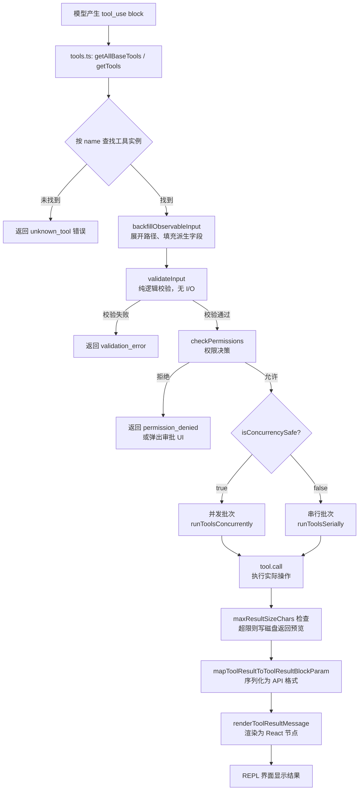

# 第6章 — 工具系统深度剖析
源地址：https://github.com/zhu1090093659/claude-code
## 本章导读

如果说 Agent 循环（第5章）是 Claude Code 的心脏，那工具系统就是它的手。模型每次产生一个 `tool_use` 消息，就是在请求用某只具体的"手"去做一件事：读文件、执行命令、搜索代码、写入内容……工具系统负责接收这个请求，验证它的合法性，执行真实操作，再将结果序列化回 API 协议要求的格式，最终在 REPL 界面里渲染成人类可读的样子。

这条链路横跨了五六个源文件，涉及类型推断、权限策略、流式并发执行和 UI 渲染四个完全不同的领域。本章的目标是把这条链路从头到尾讲清楚，让你在读完之后，既能理解现有工具是怎么工作的，也能从零开始自信地写一个新工具。

本章假设你已经理解了第3章介绍的 `Tool<Input, Output>` 接口轮廓和第5章介绍的工具执行入口（`runTools` / `StreamingToolExecutor`）。本章会向下钻探这两个主题的实现细节。

---

## 6.1 工具生命周期：从注册到渲染

一个工具调用从模型产生 `tool_use` 到用户在屏幕上看到结果，要经过下面这条流水线。先用图形把全局关系说清楚，后续各节再逐一展开每个方框的内部实现。



这条流水线里有几个容易被忽略的细节值得提前标注：第一，`backfillObservableInput` 在权限检查之前运行，这意味着权限规则匹配的是展开后的真实路径，而不是模型传来的 `~/project` 形式的缩写；第二，`validateInput` 和 `checkPermissions` 是两个独立步骤，前者是纯计算（不读磁盘、不查状态），后者才去对照权限规则；第三，`maxResultSizeChars` 的截断逻辑在 `call()` 的调用方，而不在工具内部，这让单个工具可以专注于生产数据，不必操心截断细节。

---

## 6.2 `Tool<Input, Output>` 接口

工具接口（interface）定义在 `src/Tool.ts`，是整个工具系统的类型契约。每一个工具实例都必须满足这个接口，或者通过 `buildTool()` 工厂函数来补全可选方法的默认实现。

接口方法可以按职责分为四组：核心执行、权限与验证、UI 渲染、API 序列化。

### 6.2.1 核心执行方法

```typescript
// The main execution entry point of a tool.
// args is the validated and type-safe input parsed from the model's tool_use block.
// context carries session state, working directory, permission context, etc.
// canUseTool lets nested tools (e.g. AgentTool) ask whether sub-tools are permitted.
// parentMessage is the AssistantMessage that triggered this tool call.
// onProgress streams incremental progress events to the REPL during long operations.
call(
  args: z.infer<Input>,
  context: ToolUseContext,
  canUseTool: CanUseToolFn,
  parentMessage: AssistantMessage,
  onProgress?: ToolCallProgress<P>,
): Promise<ToolResult<Output>>
```

`call()` 是工具的主体逻辑所在。它接收的 `args` 已经经过 Zod schema 解析，所以类型是安全的。返回值 `ToolResult<Output>` 除了 `data` 字段（工具的业务产出）之外，还可以携带两个元数据：`newMessages` 用于向对话历史注入额外消息（比如 AgentTool 把子任务的完整对话插回父会话），`contextModifier` 是一个函数，允许工具在执行后更新 `ToolUseContext`——比如切换工作目录、添加新的权限规则。

```typescript
// Returns a short human-readable description of what this tool call is doing.
// Used in progress displays and audit logs.
description(input, options): Promise<string>

// Returns the full prompt text that will be injected into the system prompt
// so the model understands how to use this tool.
prompt(options): Promise<string>

// The Zod schema that defines the input shape.
// The framework uses this for both parsing and JSON Schema generation.
readonly inputSchema: Input

// Whether multiple concurrent instances of this tool can run safely.
// Read-only tools (FileReadTool, GrepTool) return true.
// Write-heavy tools (BashTool, FileEditTool) return false.
isConcurrencySafe(input: z.infer<Input>): boolean

// Whether this tool only reads, never mutates.
// Used to decide whether to show a "read-only" indicator in the permission UI.
isReadOnly(input: z.infer<Input>): boolean

// Whether this tool can cause irreversible damage (delete, overwrite, format, etc.)
isDestructive?(input: z.infer<Input>): boolean
```

`isConcurrencySafe()` 是并发调度的核心开关。第6.6节会详细解释分区算法；这里先记住：声明为 `true` 的工具会和同批次的其他安全工具并行运行，声明为 `false` 的工具则独享一个串行时间槽。

### 6.2.2 权限与验证方法

```typescript
// Pure input validation — no I/O, no side effects.
// Rejects clearly wrong inputs before reaching the permission check.
// Examples: malformed page range, blocked file extension, device file path.
validateInput?(input, context): Promise<ValidationResult>

// Permission decision point.
// Consults the current permission rules (allow/deny lists, auto-approve settings)
// and returns either { behavior: 'allow' } or { behavior: 'deny', message }.
checkPermissions(input, context): Promise<PermissionResult>

// Expands derived fields before any other processing.
// Typical use: resolve ~ and relative paths to absolute paths.
// Runs before validateInput so that path-based deny rules see the real path.
backfillObservableInput?(input): void

// Returns a value for the auto-approval classifier to inspect.
// For file tools this is the file path; for BashTool this is the command string.
toAutoClassifierInput(input): unknown
```

`validateInput` 和 `checkPermissions` 的分工值得强调：前者负责"这个输入在语义上是否有效"（格式问题、已知危险的扩展名），后者负责"当前会话是否允许执行这个操作"（目录白名单、用户审批状态）。把这两步分开，让权限系统可以独立演进，不会和业务校验逻辑混在一起。

### 6.2.3 UI 渲染方法

```typescript
// Renders the "tool is being called" card shown while the tool is running.
// Typically shows the tool name, key arguments, and a spinner.
renderToolUseMessage(input, options): React.ReactNode

// Renders the result card shown after the tool finishes.
// content is the ToolResult data; progressMessages are streamed partial updates.
renderToolResultMessage?(content, progressMessages, options): React.ReactNode

// Renders an error card if the tool call failed.
renderToolUseErrorMessage?(result, options): React.ReactNode
```

这三个渲染方法构成了 REPL 里工具调用的完整视觉生命周期：请求 → 结果（或错误）。它们都返回 `React.ReactNode`，可以是普通文本，也可以是带色彩、图标、折叠面板的复杂 JSX 结构。

### 6.2.4 API 序列化方法

```typescript
// Converts the tool's data output into the shape expected by the Anthropic API.
// The tool_use_id must be echoed back so the API can correlate request and result.
mapToolResultToToolResultBlockParam(content, toolUseID): ToolResultBlockParam
```

这个方法是工具输出和 API 协议之间的适配器（Adapter）。不同类型的输出（文本、图片、结构化 JSON）需要生成不同形状的 `ToolResultBlockParam`，这里统一由工具自己负责序列化，而不是由调用框架猜测格式。

---

## 6.3 `buildTool()`：工厂函数与默认值策略

并非所有工具都需要实现 `Tool` 接口的每一个方法。`buildTool()` 是一个工厂函数（Factory），它接收一个 `ToolDef` 对象，自动补全那些有合理默认值的可选方法，返回一个完整的工具实例。

`ToolDef` 的类型定义是：

```typescript
// ToolDef separates required methods from optional (defaultable) ones.
// Tools only need to provide what's different from the defaults.
export type ToolDef<Input, Output, P> =
  Omit<Tool<Input, Output, P>, DefaultableToolKeys> &   // required: must implement
  Partial<Pick<Tool<Input, Output, P>, DefaultableToolKeys>>  // optional: has defaults
```

可以有默认值的方法（`DefaultableToolKeys`）和各自的默认值如下：

| 方法名 | 默认值 | 含义 |
|---|---|---|
| `isEnabled` | `() => true` | 工具默认启用 |
| `isConcurrencySafe` | `() => false` | 默认不并发（保守策略） |
| `isReadOnly` | `() => false` | 默认有写权限风险 |
| `isDestructive` | `() => false` | 默认非破坏性 |
| `checkPermissions` | `() => { behavior: 'allow' }` | 默认允许（需自行覆盖保安全） |
| `toAutoClassifierInput` | `() => ''` | 默认不提供分类器数据 |
| `userFacingName` | `() => def.name` | 默认显示名等于内部名 |

`buildTool()` 的实现极其简单：

```typescript
// Merges TOOL_DEFAULTS with the provided def, letting def override any default.
// The type magic (BuiltTool<D>) ensures TypeScript knows which optional fields
// are now present on the returned object.
export function buildTool<D extends AnyToolDef>(def: D): BuiltTool<D> {
  return {
    ...TOOL_DEFAULTS,
    userFacingName: () => def.name,  // pre-fill name before spreading def
    ...def,                          // def wins over all defaults
  } as BuiltTool<D>
}
```

这里的类型推断是精心设计的：`BuiltTool<D>` 是一个条件类型，它会根据 `D` 里已经提供了哪些 `DefaultableToolKeys`，计算出最终类型中哪些字段是 `Required`，哪些仍是 `Optional`。实际效果是：你在调用 `buildTool()` 后得到的对象，TypeScript 能精确知道你提供了哪些方法、哪些用了默认值，不会出现类型层面的"可能 undefined"噪音。

---

## 6.4 工具解剖：FileReadTool 全解

`FileReadTool` 是代码库中功能最完整的工具之一，它处理了文本、图片、PDF、Jupyter Notebook 等六种文件类型，实现了去重优化、权限检查、路径展开、安全提醒等几乎所有工具特性。用它作为解剖对象，能覆盖到工具系统的绝大部分角落。

### 6.4.1 输入 Schema（lazySchema 延迟初始化）

```typescript
// lazySchema defers Zod schema construction until first use.
// This avoids circular dependency issues and speeds up module loading,
// since not all tools are needed for every command.
const inputSchema = lazySchema(() =>
  z.strictObject({
    // Absolute path is required — no relative paths, no ~ shortcuts here.
    // The model must provide the full path; backfillObservableInput handles expansion.
    file_path: z.string().describe('The absolute path to the file to read'),

    // semanticNumber wraps z.number() to accept string representations like "10".
    // Models sometimes produce numeric fields as strings, so this handles the coercion.
    offset: semanticNumber(z.number().int().nonnegative().optional())
      .describe('The line number to start reading from...'),
    limit: semanticNumber(z.number().int().positive().optional())
      .describe('The number of lines to read...'),

    // Only relevant for PDF files; format: "1-5", "3", "10-20"
    pages: z.string().optional()
      .describe('Page range for PDF files...'),
  }),
)
```

`z.strictObject` 与 `z.object` 的区别是：前者会拒绝包含未声明字段的输入，防止模型"偷渡"额外参数绕过校验。`semanticNumber` 是一个自定义包装器，解决了模型有时把数字字段输出为字符串这一常见的格式漂移（format drift）问题。

### 6.4.2 输出 Schema（6 路判别联合）

```typescript
// The output is a discriminated union over 6 file types.
// Discriminated unions (辨别联合) let the type system narrow precisely:
// when you check data.type === 'image', TypeScript knows all image-specific fields are present.
const outputSchema = lazySchema(() =>
  z.discriminatedUnion('type', [
    // Plain text file — most common case
    z.object({ type: z.literal('text'), file: z.object({ /* content, lines, path */ }) }),
    // Image file (png, jpg, gif, webp, etc.) — content is base64 encoded
    z.object({ type: z.literal('image'), file: z.object({ /* base64Content, mediaType, path */ }) }),
    // Jupyter notebook (.ipynb) — rendered as structured cell output
    z.object({ type: z.literal('notebook'), file: z.object({ /* cells */ }) }),
    // PDF document — text extracted, respecting page range if provided
    z.object({ type: z.literal('pdf'), file: z.object({ /* pages, text */ }) }),
    // Large file split into parts — returned when file exceeds token budget
    z.object({ type: z.literal('parts'), file: z.object({ /* parts[] */ }) }),
    // Cache hit: file unchanged since last read — avoids re-sending identical content
    z.object({ type: z.literal('file_unchanged'), file: z.object({ /* path, mtime */ }) }),
  ])
)
```

六路判别联合（discriminated union）比一个大而全的 `interface` 要干净得多：每种文件类型有各自专属的字段，不会出现"图片没有 `cells` 字段但类型上写着 `cells?: ...`"这种噪音。`mapToolResultToToolResultBlockParam` 里的 `switch (data.type)` 也因此变得穷举安全——TypeScript 能在编译期确保每个分支都被处理。

### 6.4.3 执行流程：call()

`call()` 方法是实际读文件的地方。它的执行路径按顺序是：

1. **去重检查**：查询 `readFileState`（一个 `Map<path, mtime>`），如果文件在本次会话中被读过且修改时间未变，直接返回 `file_unchanged` 类型，不再重新读取。这是一个会话内（intra-session）的内容缓存优化。

2. **条件技能激活（conditional skills）**：扫描文件路径，看是否有匹配的技能（skill）规则需要在读取时激活。

3. **按扩展名分支执行**（核心逻辑）：
   - `.ipynb` → `readNotebook()`
   - 图片扩展名（`.png`、`.jpg`、`.gif` 等）→ `readImageWithTokenBudget()`
   - `.pdf` → `readPDF()` 或 `extractPDFPages()`（如果提供了 `pages` 参数）
   - 其余情况 → `readFileInRange(path, offset, limit)`

4. **token 预算检查**：`validateContentTokens()` 估算读取内容的 token 量，超限则抛出错误，提示模型用 `offset`/`limit` 分段读取。

5. **更新 readFileState**：记录本次读取的 mtime，供下次去重检查使用。

6. **触发 fileReadListeners**：通知订阅了文件读取事件的其他模块（比如上下文感知的权限提示系统）。

### 6.4.4 权限检查：validateInput() + checkPermissions()

`validateInput()` 负责纯逻辑的前置校验，不涉及文件系统 I/O：

```typescript
async validateInput({ file_path, pages }, toolUseContext) {
  // 1. Validate pages format — must match patterns like "1-5", "3", "10-20"
  if (pages && !isValidPageRange(pages)) {
    return { result: false, message: `Invalid pages format: "${pages}"`, errorCode: 'INVALID_PAGES' }
  }

  // 2. Check explicit deny rules from the current permission context
  const denyRule = matchingRuleForInput(file_path, toolUseContext.denyRules)
  if (denyRule) {
    return { result: false, message: `Access denied by rule: ${denyRule}`, errorCode: 'DENIED_BY_RULE' }
  }

  // 3. UNC paths (\\server\share) are allowed early — they're Windows network paths
  if (isUNCPath(file_path)) return { result: true }

  // 4. Reject dangerous binary extensions, but exempt PDFs, images, and SVGs
  if (isDangerousBinaryExtension(file_path) && !isSafeReadableExtension(file_path)) {
    return { result: false, message: 'Binary file type not supported', errorCode: 'BINARY_NOT_SUPPORTED' }
  }

  // 5. Reject blocking device files (/dev/zero, /dev/urandom, etc.)
  if (isBlockingDeviceFile(file_path)) {
    return { result: false, message: 'Cannot read blocking device files', errorCode: 'DEVICE_FILE' }
  }

  return { result: true }
}
```

`checkPermissions()` 则委托给通用权限系统：

```typescript
async checkPermissions(input, context) {
  // Delegates to the shared read-permission helper, which checks:
  // - Is the path within an allowed directory?
  // - Does the user have a standing auto-approve rule?
  // - Is this a first-time read requiring explicit confirmation?
  return checkReadPermissionForTool(FileReadTool, input, appState.toolPermissionContext)
}
```

### 6.4.5 结果序列化：mapToolResultToToolResultBlockParam()

这个方法把工具的内部输出格式转换为 Anthropic API 需要的 `ToolResultBlockParam`：

```typescript
mapToolResultToToolResultBlockParam(data, toolUseID) {
  switch (data.type) {
    case 'image':
      // Images are sent as base64-encoded content blocks
      return {
        tool_use_id: toolUseID,
        type: 'tool_result',
        content: [{
          type: 'image',
          source: { type: 'base64', media_type: data.file.mediaType, data: data.file.base64Content },
        }],
      }
    case 'text':
    case 'notebook':
    case 'pdf':
      // Text-based results are sent as a single text content block
      return {
        tool_use_id: toolUseID,
        type: 'tool_result',
        content: formatAsText(data),  // concatenates lines with cat -n style numbering
      }
    case 'file_unchanged':
      // The stub tells the model "you already have this file's content, skip re-reading"
      return {
        tool_use_id: toolUseID,
        type: 'tool_result',
        content: FILE_UNCHANGED_STUB,
      }
    // ... other cases
  }
}
```

### 6.4.6 UI 渲染：renderToolResultMessage()

渲染方法把工具产出的数据变成用户在终端里看到的样子。对于文本文件，它会显示文件路径、行号范围和内容预览；对于图片，它会触发终端图像协议（如 Kitty 图形协议或 iTerm2 内联图像）渲染缩略图；对于 PDF，它显示提取的文本页。

### 6.4.7 去重机制：readFileState + mtime

去重机制是 FileReadTool 最有意思的优化之一。在一次较长的对话里，模型可能多次读取同一个文件（尤其是在迭代修复 bug 的过程中）。如果文件内容没有变化，重复发送完整内容纯属浪费 token。

`readFileState` 是一个会话级的 `Map<absolutePath, mtime>`，记录"这个路径上次读取时的修改时间"。每次 `call()` 开始时会比对当前 `mtime` 与记录值：

- 相同 → 返回 `{ type: 'file_unchanged', ... }`，`mapToolResultToToolResultBlockParam` 把它序列化为 `FILE_UNCHANGED_STUB`（一个告知模型"你已经有这个文件内容了"的短字符串）
- 不同或从未读过 → 正常读取，更新 `readFileState`

这个设计的关键假设是：`mtime` 变了就意味着内容变了。这在绝大多数场景下成立，偶尔出现触摸（`touch`）文件但不改内容的情况会导致多发一次内容，但这是可接受的误判方向。

---

## 6.5 工具注册表：tools.ts 与 getAllBaseTools()

`src/tools.ts` 是工具系统的注册中心（registry）。`getAllBaseTools()` 返回当前进程可用的全部工具实例列表：

```typescript
export function getAllBaseTools(): Tools {
  return [
    AgentTool,          // Sub-agent spawning
    TaskOutputTool,     // Structured task result output
    BashTool,           // Shell command execution
    // Ant binary embeds custom search tools; OSS build uses standard Glob/Grep
    ...(hasEmbeddedSearchTools() ? [] : [GlobTool, GrepTool]),
    ExitPlanModeV2Tool,
    FileReadTool,
    FileEditTool,
    FileWriteTool,
    NotebookEditTool,
    WebFetchTool,
    TodoWriteTool,
    WebSearchTool,
    TaskStopTool,
    AskUserQuestionTool,
    SkillTool,
    EnterPlanModeTool,
    // ConfigTool is only available in the internal Ant build
    ...(process.env.USER_TYPE === 'ant' ? [ConfigTool] : []),
    // SleepTool requires the PROACTIVE or KAIROS feature flag
    ...(SleepTool ? [SleepTool] : []),
    // Cron tools require the AGENT_TRIGGERS feature flag
    ...(cronTools),
    // MonitorTool requires the MONITOR_TOOL feature flag
    ...(MonitorTool ? [MonitorTool] : []),
    // REPLTool is Ant-internal only
    ...(REPLTool ? [REPLTool] : []),
    TestingPermissionTool,
    LSPTool,
    ToolSearchTool,
    // ... more feature-gated tools
  ].filter(Boolean)  // remove any undefined entries from failed feature checks
}
```

这里有几个设计决策值得注意。第一，列表用展开运算符（`...`）而不是 `if` 分支来条件性地包含工具，让整个注册表在视觉上保持线性，不会出现深层嵌套；第二，功能特性标记（feature flag）控制的工具被初始化为 `null`/`undefined`，而不是完全不 `import`——这样 TypeScript 的 `import` 解析可以在编译时发现类型错误，实际是否包含由运行时的条件展开决定，末尾的 `.filter(Boolean)` 清理掉未启用的槽；第三，`hasEmbeddedSearchTools()` 是一个在 Anthropic 内部构建版本中返回 `true` 的标志，让内嵌的专用搜索工具替代通用的 `GlobTool`/`GrepTool`。

在 `getAllBaseTools()` 之上还有一层过滤函数 `getTools()`，它接受 `--tools` 白名单、工作区模式开关等选项，从基础列表里进一步剪裁出当前会话实际可用的工具子集。

---

## 6.6 工具编排：runTools() 的并发与串行

当模型在一次响应里产生了多个 `tool_use` 块（block），工具编排器（orchestrator）需要决定哪些可以并行跑、哪些要排队串行。这个逻辑在 `src/services/tools/toolOrchestration.ts`。

### 6.6.1 分区逻辑（partitionToolCalls）

`partitionToolCalls()` 把一批工具调用按"并发安全性"切分成若干分区（partition）。分区规则是：只要序列中出现一个非并发安全的工具，就在该位置断开，前后各成一组。

举例说明：假设模型一次性请求了 `[FileRead, FileRead, BashTool, FileRead]` 四个调用，其中 `FileRead.isConcurrencySafe() === true`，`BashTool.isConcurrencySafe() === false`。分区结果是：

- 分区 1（并发）：`[FileRead, FileRead]`
- 分区 2（串行）：`[BashTool]`
- 分区 3（并发）：`[FileRead]`

分区 3 只有一个工具，虽然并发安全，但单个工具的"并发批次"和"串行批次"执行起来没有区别，分区标签只是一个元数据。

### 6.6.2 并发批次

```typescript
// runTools iterates over partitions produced by partitionToolCalls.
// For concurrent partitions, all tools in the batch are started simultaneously.
export async function* runTools(
  toolUseMessages: ToolUseBlock[],
  assistantMessages: AssistantMessage[],
  canUseTool: CanUseToolFn,
  toolUseContext: ToolUseContext,
): AsyncGenerator<MessageUpdate, void> {
  let currentContext = toolUseContext

  for (const { isConcurrencySafe, blocks } of partitionToolCalls(toolUseMessages, currentContext)) {
    if (isConcurrencySafe) {
      // All tools in this batch run in parallel.
      // contextModifier from individual tools is deferred: it only takes effect
      // after the entire batch finishes, to avoid race conditions where one tool's
      // context change affects a sibling tool's mid-flight execution.
      for await (const update of runToolsConcurrently(blocks, assistantMessages, canUseTool, currentContext)) {
        yield { message: update.message, newContext: currentContext }
      }
    } else {
      // Serial execution: each tool runs to completion before the next starts.
      // contextModifier is applied immediately after each tool finishes.
      for await (const update of runToolsSerially(blocks, assistantMessages, canUseTool, currentContext)) {
        if (update.newContext) currentContext = update.newContext
        yield { message: update.message, newContext: currentContext }
      }
    }
  }
}
```

并发批次里 `contextModifier` 的延迟应用是一个重要的正确性保证：如果允许工具 A 的上下文修改立刻影响同批次的工具 B，就会出现执行结果依赖调度顺序的竞态条件（race condition）。延迟到批次全部结束后统一应用，确保了并发批次里每个工具看到的都是同一份快照上下文。

并发数量由环境变量控制：

```typescript
// Reads CLAUDE_CODE_MAX_TOOL_USE_CONCURRENCY, defaulting to 10 if not set.
// Setting this to 1 effectively disables all concurrency.
function getMaxToolUseConcurrency(): number {
  return parseInt(process.env.CLAUDE_CODE_MAX_TOOL_USE_CONCURRENCY || '', 10) || 10
}
```

### 6.6.3 串行批次

串行批次中，工具严格按顺序执行，前一个完成后才启动下一个。每个工具的 `contextModifier`（如果有）在该工具完成后立即应用，成为下一个工具的初始上下文。这是写操作类工具的默认执行模式——不能让两个 `FileEditTool` 同时修改同一个文件。

### 6.6.4 StreamingToolExecutor（流式并行）

`StreamingToolExecutor` 是 `runTools` 的增强版本，它在 Agent 循环中用于需要实时流式输出的场景。与 `runTools` 的 `AsyncGenerator` 接口不同，`StreamingToolExecutor` 通过回调（callback）把进度更新推送给调用方，允许在工具仍在运行时就把部分结果显示给用户。

两者的选择依据是执行上下文：在交互式 REPL 中，用户希望看到实时进度，所以用 `StreamingToolExecutor`；在 `--print` 非交互模式或 SDK 调用中，只需要最终结果，用 `runTools` 的 generator 模型即可。

---

## 6.7 实操：从零实现一个新工具

理论讲完，现在动手写一个真实可用的工具。场景：实现一个 `WordCountTool`，统计指定文件的行数、词数和字符数。

### 第一步：创建工具文件

按照项目惯例，每个工具放在 `src/tools/<ToolName>/` 目录下：

```typescript
// src/tools/WordCountTool/WordCountTool.ts

import * as fs from 'fs'
import * as path from 'path'
import { z } from 'zod'
import { buildTool } from '../../Tool'
import { checkReadPermissionForTool } from '../../services/permissions/permissionHelpers'
import { appState } from '../../AppState'

// Tool name constant — used as the identifier in tool_use blocks from the model.
const WORD_COUNT_TOOL_NAME = 'WordCount'

// Define input schema using Zod. strictObject rejects unknown fields.
const inputSchema = z.strictObject({
  file_path: z.string().describe(
    'The absolute path to the file whose word count to compute'
  ),
})

// Shape of the data this tool returns.
type WordCountOutput = {
  file_path: string
  lines: number
  words: number
  characters: number
}

export const WordCountTool = buildTool({
  name: WORD_COUNT_TOOL_NAME,

  // searchHint: 1-10 words for keyword matching in ToolSearchTool
  searchHint: 'count words lines characters in file',

  // maxResultSizeChars: result is tiny, no need to cap it
  maxResultSizeChars: 1024,

  // The input schema Zod object
  inputSchema,

  // Tell the model what this tool does and when to use it
  async description({ file_path }) {
    return `Count lines, words, and characters in ${path.basename(file_path)}`
  },

  // Full prompt injected into the system prompt so the model knows the tool's contract
  async prompt() {
    return [
      'Counts the number of lines, words, and characters in a text file.',
      'Use this tool when you need statistics about file size or content volume.',
      'Only works with plain text files; will fail on binary files.',
    ].join('\n')
  },

  // This tool only reads, so mark it safe for concurrent execution
  isConcurrencySafe() { return true },
  isReadOnly() { return true },

  // Path-based auto-classifier input: the file path
  toAutoClassifierInput({ file_path }) { return file_path },

  // Expand ~ and relative paths before permission checks run
  backfillObservableInput(input) {
    if (typeof input.file_path === 'string' && input.file_path.startsWith('~')) {
      input.file_path = input.file_path.replace(/^~/, process.env.HOME ?? '')
    }
  },

  // Pure validation: reject obviously wrong inputs before any I/O
  async validateInput({ file_path }) {
    if (!path.isAbsolute(file_path)) {
      return {
        result: false,
        message: `file_path must be absolute, got: "${file_path}"`,
        errorCode: 'NOT_ABSOLUTE',
      }
    }
    return { result: true }
  },

  // Delegate permission check to the shared read-permission helper
  async checkPermissions(input, context) {
    return checkReadPermissionForTool(WordCountTool, input, appState.toolPermissionContext)
  },

  // The actual work: read the file and count lines/words/characters
  async call({ file_path }) {
    const content = fs.readFileSync(file_path, 'utf-8')
    const lines = content.split('\n').length
    const words = content.trim().split(/\s+/).filter(Boolean).length
    const characters = content.length

    return {
      data: { file_path, lines, words, characters } satisfies WordCountOutput,
    }
  },

  // Serialize output to the API format the model expects
  mapToolResultToToolResultBlockParam(data, toolUseID) {
    const { file_path, lines, words, characters } = data as WordCountOutput
    const text = [
      `File: ${file_path}`,
      `Lines: ${lines}`,
      `Words: ${words}`,
      `Characters: ${characters}`,
    ].join('\n')

    return {
      tool_use_id: toolUseID,
      type: 'tool_result' as const,
      content: text,
    }
  },

  // Render the tool use request card in the REPL
  renderToolUseMessage({ file_path }) {
    return `Counting words in ${path.basename(file_path)}…`
  },

  // Render the result card in the REPL
  renderToolResultMessage(content) {
    const { lines, words, characters } = content as WordCountOutput
    return `${lines} lines · ${words} words · ${characters} chars`
  },
})
```

### 第二步：注册到工具列表

打开 `src/tools.ts`，在 `getAllBaseTools()` 的返回数组里加入新工具：

```typescript
// src/tools.ts
import { WordCountTool } from './tools/WordCountTool/WordCountTool'

export function getAllBaseTools(): Tools {
  return [
    // ... existing tools ...
    WordCountTool,   // add after existing read-only tools for logical grouping
    // ... rest of the list ...
  ].filter(Boolean)
}
```

### 第三步：验证清单

在提交之前，对照这份清单确认实现是完整的：

- `name` 唯一，不与现有工具冲突
- `inputSchema` 使用 `z.strictObject`，所有字段有 `.describe()` 文档
- `backfillObservableInput` 处理了 `~` 和相对路径
- `validateInput` 覆盖了所有可纯逻辑拒绝的边界情况
- `checkPermissions` 调用了共享权限辅助函数，而不是直接返回 `allow`
- `isConcurrencySafe` 和 `isReadOnly` 与实际行为一致
- `mapToolResultToToolResultBlockParam` 能处理 `call()` 所有可能的返回值分支
- 工具已添加到 `getAllBaseTools()`

---

## 本章要点回顾

工具系统的整体设计可以用三个词概括：**契约清晰**、**默认保守**、**调度分层**。

`Tool<Input, Output>` 接口把一个工具涉及的所有关切点（执行、验证、权限、渲染、序列化）都集中在同一个对象里，调用方不需要了解工具的内部逻辑，只需要按协议调用接口方法。这是一种接口隔离（Interface Segregation）与门面（Facade）模式的结合。

`buildTool()` 工厂函数的默认值策略是"保守优先"：默认不并发、默认不只读、默认有权限检查。这意味着漏实现某个方法的工具，行为会偏向安全一侧，而不是偏向宽松。新写工具时只需要声明"我在哪些方面比默认更宽松"，降低了犯错的概率。

`runTools()` 的分区调度设计把"读操作可以并发"这个领域知识封装在了工具接口层（`isConcurrencySafe()`），而不是硬编码在调度器里。调度器是通用的，工具是具体的，各司其职。并发批次中 `contextModifier` 的延迟应用，则用一个简单的规则消灭了整类竞态条件。

理解了这三个核心设计之后，扩展工具系统——无论是添加新工具、修改现有工具的权限逻辑，还是调整并发行为——都可以在清晰的边界内完成，不会意外影响到系统的其他部分。
