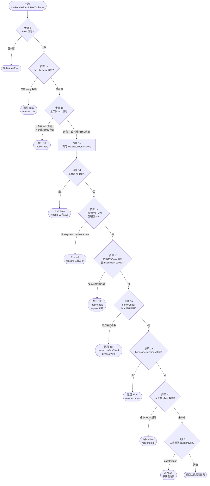
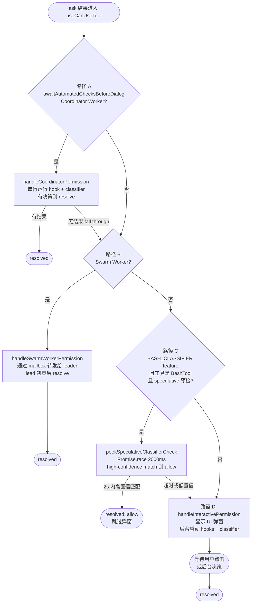

# 第7章 — 权限与安全模型
源地址：https://github.com/zhu1090093659/claude-code
## 本章导读

如果说 Agent 循环引擎是 Claude Code 的心脏，工具系统是它的双手，那么权限与安全模型就是它的神经系统——默默运行在每一次工具调用之前，决定这次操作是直接执行、静默拒绝，还是弹窗询问用户。

这套系统的复杂性常常被低估。表面上看，"要不要允许这个操作"是一个很简单的问题，但现实情况里，答案取决于至少十一种不同的决策原因：当前的权限模式、用户配置的规则、Shell 命令分类器的实时判断、外部 Hook 脚本的返回值、沙箱状态、工作目录合法性……任何一个因素都可能改变最终结论。

本章将从类型系统出发，自底向上地剥开这套机制的每一层：先理解权限的基本词汇（`PermissionMode`、`PermissionBehavior`、`PermissionDecisionReason`），再深入核心决策引擎 `hasPermissionsToUseToolInner()` 的十一步流程，然后分析外层包装函数如何处理 `dontAsk` 与 `auto` 两种特殊模式，最后落脚到 React hook `useCanUseTool()` 的四条路径，以及 `settings.json` 的实际配置方法。

读完本章，你将能够在脑海中追踪任意一次工具调用的完整权限决策链路，并能根据实际场景合理配置权限规则。

---

## 7.1 权限模式：7 种 PermissionMode

权限模式（PermissionMode）是整个安全模型的"总开关"。它决定了在没有更细粒度规则覆盖的情况下，系统应该采取什么样的默认态度。

从类型定义来看，`PermissionMode` 分为两层：对外暴露的 `ExternalPermissionMode`（五种）和运行时内部使用的 `InternalPermissionMode`（在外部模式基础上增加 `auto` 和 `bubble` 两种）。

| 模式名 | 层级 | 核心行为 | 典型适用场景 |
|--------|------|----------|-------------|
| `default` | 外部 | 标准交互模式，每次工具调用都向用户确认 | 日常交互使用，最安全 |
| `acceptEdits` | 外部 | 自动接受文件编辑（Write/Edit/MultiEdit），但 Bash 命令仍需确认 | 让 Claude 自由修改代码，但保持对 Shell 命令的控制 |
| `bypassPermissions` | 外部 | 跳过几乎所有权限检查，直接允许 | CI/CD 自动化流水线、沙箱受控环境（需 `--dangerously-skip-permissions` 标志） |
| `dontAsk` | 外部 | 将所有 `ask` 结果静默转为 `deny`，不弹窗 | headless 场景、需要无人值守但不能让 Claude 乱操作 |
| `plan` | 外部 | 只允许只读工具（如 FileRead、Glob、Grep），写操作被拒绝 | 让 Claude 制定计划但不执行 |
| `auto` | 内部 | 启用 TRANSCRIPT_CLASSIFIER feature，用 AI 分类器（YoloClassifier）代替用户弹窗自动决策 | 实验性自动化模式，需要特定 feature flag |
| `bubble` | 内部 | 将权限决策"冒泡"到上层处理（协调器/swarm 架构专用） | 多 Agent 协作场景中的 worker 节点 |

几个值得注意的细节。`bypassPermissions` 并非无条件的"通行证"——在后续的决策流程里，某些安全检查（`safetyCheck` 类型的规则，例如防止修改 `.git/` 目录或 Shell 配置文件）以及内容特定的 `ask` 规则，即使在 `bypassPermissions` 模式下也依然有效，形成了一道"bypass 免疫"防线。

`plan` 模式的实现方式颇为巧妙：它并不是通过检查工具类型来屏蔽写操作，而是在权限判断逻辑里，当模式为 `plan` 且 `isBypassPermissionsModeAvailable` 为 `false` 时，不赋予 bypass 效果，从而让写操作正常进入 `ask` 流程，由后续逻辑决定最终行为。

---

## 7.2 权限三态：allow / deny / ask

`PermissionBehavior` 只有三个值：`'allow'`、`'deny'`、`'ask'`。这三态贯穿整个权限系统，几乎所有的判断函数最终都归结到这三种结论之一。

**allow** 表示本次工具调用被批准，可以直接执行，不需要任何用户交互。这是系统"信任"的表达。

**deny** 表示本次工具调用被拒绝，工具不会执行，Claude 会收到一条权限拒绝消息。这是系统"不信任"的表达。

**ask** 是最有趣的状态。它表示系统无法自行决定，需要某种形式的外部输入——可能是用户通过弹窗点击"允许"，可能是 AI 分类器给出判断，也可能是外部 Hook 脚本返回结果。`ask` 本质上是一个"挂起"状态，等待被解析为 `allow` 或 `deny`。

在工具的 `checkPermissions()` 方法内部，还存在第四个状态 `'passthrough'`，它的含义是"这个工具本身没有意见，把决定权交给外层"。`passthrough` 只在工具内部流通，永远不会出现在最终的 `PermissionDecision` 里——外层函数在看到 `passthrough` 时，会将其转换为 `ask`（见 7.4 节步骤 3）。

---

## 7.3 权限决定原因（PermissionDecisionReason）

每一个权限决策不仅有结果（allow/deny/ask），还有原因（`PermissionDecisionReason`）。这个字段的存在让系统具备完整的可审计性：你可以追溯任何一次权限决定是由哪个机制触发的。

`PermissionDecisionReason` 是一个有辨别标签的联合类型（Discriminated Union），通过 `type` 字段区分 11 个变体：

| type 值 | 携带的附加信息 | 触发条件 |
|---------|--------------|---------|
| `rule` | `rule: PermissionRule`（完整规则对象） | 配置文件或运行时规则精确匹配了当前工具/命令 |
| `mode` | `mode: PermissionMode` | 当前权限模式直接决定了结果（如 bypassPermissions → allow） |
| `subcommandResults` | `reasons: Map<string, PermissionResult>` | BashTool 执行复合命令时，子命令的权限结果集合 |
| `permissionPromptTool` | 工具调用结果 | 宿主应用通过 PermissionPromptTool 接口给出了决定 |
| `hook` | `hookName`、`hookSource`、`reason` | PreToolUse/PostToolUse Hook 脚本返回了明确的允许/拒绝指令 |
| `asyncAgent` | `reason: string` | headless agent 的 `shouldAvoidPermissionPrompts` 为 true，静默拒绝 |
| `sandboxOverride` | `reason: 'excludedCommand' \| 'dangerouslyDisableSandbox'` | 沙箱排除命令列表命中，或沙箱本身被禁用 |
| `classifier` | `classifier: string`、`reason: string` | AI 分类器（YoloClassifier/BASH_CLASSIFIER）给出了判断 |
| `workingDir` | `reason: string` | 工作目录校验失败（路径不在允许范围内） |
| `safetyCheck` | `reason: string`、`classifierApprovable: boolean` | 内置安全路径检查命中（如 .git/、.claude/、Shell 配置文件等） |
| `other` | `reason: string` | 不属于上述任何类别的其他原因 |

`classifierApprovable` 字段是 `safetyCheck` 中一个细微但重要的标志。它表示"这个安全检查虽然触发了 ask，但 AI 分类器是否被允许覆盖它"。对于最高风险的操作（如修改 Shell 配置文件），`classifierApprovable` 为 `false`，意味着即使 `auto` 模式启用了 AI 分类器，也必须回落到人工确认。

---

## 7.4 核心决策引擎：hasPermissionsToUseToolInner()

`hasPermissionsToUseToolInner()` 是整个权限系统的心脏，位于 `src/utils/permissions/permissions.ts`。它接受工具对象、工具输入和执行上下文，返回一个包含 `behavior` 和 `decisionReason` 的 `PermissionDecision`。

这个函数的执行路径并非线性的，而是一个多级短路（short-circuit）结构：一旦某个条件满足，立即返回结果，不再继续后续检查。理解这个"优先级序列"是理解整个权限系统的关键。

下图展示了完整的 11 步决策流程：



下面逐步解析每个决策节点的含义。

**步骤 0：Abort 信号检查**

在做任何实质性判断之前，首先检查 `abortController.signal.aborted`。如果用户已经取消了当前任务，立即抛出 `AbortError`，避免做无用的权限计算。这个模式在 Claude Code 的异步函数中几乎无处不在。

**步骤 1a：全工具 deny 规则**

`getDenyRuleForTool()` 检查是否有 deny 规则精确匹配当前工具（不考虑内容，只看工具名）。例如，如果用户在 `settings.json` 里配置了 `"alwaysDenyTools": ["BashTool"]`，那么所有 Bash 调用都会在这一步被拦截。这是优先级最高的显式拒绝。

**步骤 1b：全工具 ask 规则**

类似地，如果有 ask 规则匹配工具名，会在这里返回 `ask`。但有一个重要例外：如果当前是 BashTool 且沙箱可以自动允许（`canSandboxAutoAllow`），则跳过这个 ask，继续向下走。这个例外允许沙箱环境在有 ask 规则的情况下仍然自动处理某些命令。

**步骤 1c：调用 tool.checkPermissions()**

这是工具自身进行"内容级"检查的地方。每个工具可以实现自己的 `checkPermissions()` 方法，根据具体的输入参数决定权限。例如 `FileWriteTool` 会在这里检查目标路径是否在允许的工作目录内，`BashTool` 会在这里运行命令分类逻辑。

**步骤 1d：工具实现拒绝**

如果 `checkPermissions()` 返回 `deny`，直接返回，这个结论无法被后续的 `bypassPermissions` 覆盖（因为 bypass 检查在步骤 2a，已经过了这里）。等等——这里需要更仔细地分析。实际上，步骤 1d 的 deny 是在步骤 2a 的 bypass 检查之前的，所以工具直接返回的 deny 确实不受 bypass 影响。但步骤 1f 和 1g 的内容则加了额外的 bypass 免疫标注。

**步骤 1e：工具需要用户交互**

某些工具（通过 `requiresUserInteraction()` 方法声明）天然需要人在回路中。如果工具声明了这个需求且 `checkPermissions()` 返回 `ask`，则在这里直接返回，不允许后续的 bypass 覆盖。这是第二道"bypass 免疫"机制。

**步骤 1f：内容特定 ask 规则（bypass 免疫）**

如果 `checkPermissions()` 返回的 ask 的原因是"命中了内容特定的 ask 规则"（例如用户配置了 `Bash(npm publish:*)` 必须询问），那么这个 ask 是"免疫 bypass" 的——即使是 `bypassPermissions` 模式也不能绕过它。这给了用户一种方式：对特定高风险命令强制要求人工确认，无论系统处于什么模式。

**步骤 1g：safetyCheck（bypass 免疫）**

对 `.git/`、`.claude/`、`~/.bashrc`、`~/.zshrc` 等敏感路径的操作，由内置安全检查机制捕获。这些安全检查同样免疫 bypass。这是系统的最后一道硬性防线——防止自动化流程误修改 Git 历史或 Shell 配置文件。

**步骤 2a：bypassPermissions 模式**

经过前面所有"bypass 免疫"检查之后，到这里才真正应用 `bypassPermissions` 的效果。如果当前模式是 `bypassPermissions`（或 `plan` + `isBypassPermissionsModeAvailable`），直接返回 `allow`。

**步骤 2b：全工具 allow 规则**

`toolAlwaysAllowedRule()` 检查是否有 allow 规则匹配当前工具。如果有，返回 `allow`。这是用户通过配置文件信任特定工具的机制。

**步骤 3：passthrough 转换**

走到这里的调用，意味着工具自身的 `checkPermissions()` 返回了 `passthrough`（表示工具本身没有强烈意见），且没有任何规则覆盖。此时将 `passthrough` 转换为 `ask`，生成标准的权限请求消息，等待外层处理。如果工具返回的不是 `passthrough`（例如已经是 `ask` 但没有被之前的步骤捕获），则原样返回。

---

## 7.5 外层包装：hasPermissionsToUseTool()

`hasPermissionsToUseToolInner()` 处理了规则匹配和工具内容检查，但它的返回结果如果是 `ask`，还需要外层函数 `hasPermissionsToUseTool()` 来决定如何处理这个"挂起"状态。

外层函数在内层函数返回 `ask` 之后，根据当前权限模式执行不同的处理逻辑。

### 7.5.1 dontAsk 模式转换

这是最简单的情况。`dontAsk` 模式的语义是"不要弹窗询问，直接拒绝"。因此，当内层返回 `ask` 且当前模式是 `dontAsk` 时，外层直接将其转换为 `deny`，并附上 `{ type: 'mode', mode: 'dontAsk' }` 作为原因。

用户不会看到任何弹窗，Claude 会收到权限拒绝消息，并需要寻找其他方式完成任务（或放弃）。这种模式适合在知道某些操作不应被执行的情况下运行 headless 任务，同时又不想让系统因为等待用户输入而挂起。

### 7.5.2 auto 模式与 YoloClassifier

`auto` 模式是权限系统中最复杂的部分，它试图用 AI 分类器取代人工判断，但有多个安全阀门防止分类器做出不当决策。

外层函数在 `auto` 模式下的处理流程如下。

首先，检查安全检查豁免。如果内层返回的 ask 原因是 `safetyCheck` 且 `classifierApprovable` 为 `false`，说明这是高风险操作，分类器不被允许处理。此时如果是 headless 环境，直接返回 `deny`；如果是交互环境，回落到弹窗。

其次，`acceptEdits` 快速路径。如果当前在 `acceptEdits` 模式下这个工具会被允许，那就跳过分类器，直接允许。这避免了对文件编辑操作进行不必要的 AI 分类。

第三步，连续拒绝检查（`denialTracking`）。如果分类器在最近的调用中连续拒绝了超过阈值次数的操作，说明可能存在异常情况，此时回退到弹窗，让用户介入。这是一个防止分类器陷入"拒绝循环"的保护机制。

最后，调用 `YoloClassifier`。这个分类器的行为有四种可能的结果：

`unavailable` 表示分类器服务不可用。根据配置，系统可能采用 `fail_closed`（安全失败，返回 deny）或 `fail_open`（回退到弹窗）。

`transcriptTooLong` 表示对话上下文过长，分类器无法处理。在 headless 模式下，这会导致任务中止（因为没有办法弹窗）；在交互模式下，回退到用户弹窗。

`shouldBlock` 表示分类器判断应该拒绝此操作。系统返回 `deny` 并将此次拒绝记录到 `denialTracking` 中。

`!shouldBlock` 表示分类器判断可以允许。系统返回 `allow` 并清零 `denialTracking` 计数器。

最后，如果没有任何上述模式匹配，且 `shouldAvoidPermissionPrompts` 为 `true`（headless agent 场景），则将 `ask` 转换为 `deny`，原因为 `asyncAgent`。

---

## 7.6 React Hook：useCanUseTool()

`useCanUseTool()` 是权限系统在 UI 层的入口点，位于 `src/hooks/useCanUseTool.tsx`。它接收 `hasPermissionsToUseTool()` 的结果，并根据结果路由到不同的处理路径。

对于 `allow` 和 `deny` 两种结果，处理是直接的：`allow` 调用 `resolve(buildAllow(...))`，`deny` 在 `auto` 模式下显示一个非阻断通知，然后 `resolve(result)`。

真正有趣的是 `ask` 的处理。当权限决定是 `ask` 时，Hook 会依次检查四种情形，命中第一个匹配的路径：



### 7.6.1 路径 A：Coordinator Worker

在多 Agent 协作架构中，"协调器"（Coordinator）是分配任务的主控 agent，而"工作器"（Worker）是执行具体任务的子 agent。当工作器需要权限确认时，协调器介入的时机有讲究。

`awaitAutomatedChecksBeforeDialog` 标志为 `true` 时，表示当前是协调器管理的工作器。权限请求会先经过 Hook 脚本和分类器的串行处理：如果任何一个环节给出了明确决定（allow 或 deny），直接解析，不需要弹窗。只有当所有自动检查都没有给出结论时，才回落到路径 D（交互弹窗）。

这种设计让协调器可以通过 Hook 脚本定制工作器的权限策略，实现细粒度的自动化控制。

### 7.6.2 路径 B：Swarm Worker

Swarm 架构是一种更松散的多 Agent 协作模式，没有中心化的协调器。Swarm Worker 的权限请求不会就地处理，而是通过"信箱"（mailbox）机制转发给 Swarm 的领导者（leader），由领导者统一决策后再通知 Worker。

这种设计避免了多个 Worker 同时弹窗造成的用户体验混乱，同时也让领导者有机会根据整体任务状态做出更全局的权限决定。

### 7.6.3 路径 C：Speculative Classifier（2s 竞赛）

这是权限系统中一个很精妙的设计。对于 BashTool，系统维护了一个"推测性分类器"（Speculative Classifier），可以根据命令的已输入前缀提前预测其安全性，而不必等到完整命令确定。

当 `BASH_CLASSIFIER` feature 启用时，路径 C 会调用 `peekSpeculativeClassifierCheck(command)`，与一个 2 秒超时形成 `Promise.race`。如果分类器在 2 秒内以高置信度判断命令是安全的，直接返回 `allow`，跳过弹窗，用户完全感知不到这次权限检查的存在。

如果超时，或者分类器置信度不够高，则回落到路径 D，正常弹窗。这是一个"尽力而为"的优化：最好情况下零打扰，最坏情况下退化为正常弹窗，不会有负面影响。

### 7.6.4 路径 D：交互式弹窗

这是最常见的路径，也是 `default` 模式的标准处理方式。`handleInteractivePermission()` 做两件事并行：在前台显示权限确认弹窗（包含工具名、操作描述等信息），同时在后台启动 Hook 脚本和分类器的处理。

如果用户率先点击了"允许"或"拒绝"，后台处理被取消，以用户的选择为准。如果后台处理（Hook 或分类器）率先给出了结论，弹窗关闭，以自动结论为准。这是一个"竞争解析"（race resolution）模式，兼顾了自动化效率和用户控制权。

---

## 7.7 规则系统：格式与来源

规则系统是权限配置的核心抓手。用户通过在 `settings.json` 中编写规则，告知系统哪些工具/命令应该被自动允许、自动拒绝或强制询问。

### 规则格式

规则分为两个层次：工具级规则和 Shell 命令级规则。

工具级规则最简单，直接写工具名即可：

```
"FileRead"            # 匹配整个 FileRead 工具的所有调用
"mcp__server1"        # 匹配 MCP 服务器 server1 的所有工具
"mcp__server1__query" # 只匹配 server1 的 query 工具
```

Shell 命令级规则（作用于 BashTool）使用 `Bash(...)` 包装语法，内部支持三种匹配模式：

```
"Bash(git status)"    # 精确匹配：仅允许 `git status` 这一个命令
"Bash(npm:*)"         # 前缀匹配：允许所有以 npm 开头的命令（如 npm install、npm run）
"Bash(git *)"         # 通配符匹配：允许 git 后跟任意子命令（如 git commit、git push）
```

这三种模式对应 `ShellPermissionRule` 联合类型的三个变体：`exact`、`prefix`、`wildcard`。在运行时，每次 BashTool 调用都会将命令字符串逐一与规则列表比对，命中第一条匹配规则后短路返回结果。

前缀匹配（`prefix`）和通配符匹配（`wildcard`）的区别在于粒度：前缀匹配是字符串级别的（命令必须以指定前缀开头），通配符匹配支持 `*` 占位符，可以匹配更复杂的模式（如 `rm -rf /tmp/*` 只允许删除 `/tmp/` 下的文件，而不是任意路径）。

### 规则来源与优先级

`PermissionRuleSource` 枚举定义了 8 种规则来源，它们的优先级从高到低大致如下：

| 来源 | 说明 | 优先级 |
|------|------|--------|
| `policySettings` | 企业策略文件（MDM 强制下发）| 最高（不可被用户覆盖） |
| `flagSettings` | 命令行 flag 直接设置 | 极高 |
| `cliArg` | 启动时命令行参数 | 高 |
| `session` | 对话运行时动态添加 | 高（当次会话有效） |
| `command` | 通过 `/permissions` 命令添加 | 中（对话级持久） |
| `localSettings` | `.claude/settings.local.json`（本地私有，不提交）| 中 |
| `projectSettings` | `.claude/settings.json`（项目共享）| 中低 |
| `userSettings` | `~/.claude/settings.json`（全局用户设置）| 低 |

在实践中，同一工具可能同时被多个来源的规则覆盖。系统会按来源优先级依次检查，第一个命中的规则胜出。这意味着企业策略可以强制覆盖用户的个人设置，而项目的本地设置（`localSettings`）可以在不影响团队配置（`projectSettings`）的情况下做个人定制。

---

## 7.8 Hook 权限：PermissionRequest 事件

除了配置文件规则，Claude Code 还支持通过外部 Hook 脚本参与权限决策。Hook 脚本可以是任意可执行程序（Shell 脚本、Python 脚本等），通过标准输入接收权限请求信息，通过标准输出或退出码返回决定。

与权限相关的 Hook 事件主要有三种：

**PreToolUse Hook** 在工具执行之前触发。Hook 脚本可以检查工具名和输入参数，然后返回 `allow`、`deny` 或 `ask`（继续弹窗）。如果返回 `deny` 并附带原因字符串，该原因会显示给用户，并记录在 `PermissionDecisionReason` 中，`type` 字段为 `hook`，同时携带 `hookName` 和 `hookSource`（脚本来源路径）。

**PostToolUse Hook** 在工具执行之后触发（用于审计和后处理，不影响当次权限决定，但可以影响后续操作）。

**PermissionRequest Hook** 是专门为权限决策设计的事件，比 PreToolUse 更精确：它只在工具权限进入 `ask` 状态时触发，而 PreToolUse 则无论权限状态如何都会触发。使用 PermissionRequest Hook 可以避免在工具已被 allow 规则预先批准时做不必要的脚本调用。

Hook 脚本的权限决策在 `useCanUseTool()` 的路径 A（Coordinator Worker）和路径 D（Interactive）中都会被调用，但时序略有不同：路径 A 是串行、阻断式的（Hook 先跑，再决定要不要弹窗）；路径 D 是并行、竞争式的（Hook 和弹窗同时运行，谁先有结论谁胜出）。

---

## 7.9 settings.json 配置指南

下面是一个完整的 `settings.json` 配置示例，覆盖了常见的权限配置场景：

```json
{
  "permissions": {
    "allow": [
      "FileRead",
      "FileEdit",
      "Glob",
      "Grep",
      "Bash(git status)",
      "Bash(git diff:*)",
      "Bash(git log:*)",
      "Bash(git add:*)",
      "Bash(git commit:*)",
      "Bash(npm install)",
      "Bash(npm run:*)",
      "Bash(ls:*)",
      "Bash(cat:*)",
      "mcp__filesystem"
    ],
    "deny": [
      "Bash(rm -rf:*)",
      "Bash(sudo:*)",
      "Bash(curl:*)",
      "Bash(wget:*)",
      "mcp__network__delete"
    ],
    "ask": [
      "Bash(git push:*)",
      "Bash(npm publish:*)",
      "Bash(git reset:*)",
      "WebFetch"
    ]
  }
}
```

这个配置的设计思路如下。

`allow` 列表中的规则允许常见的只读操作（FileRead、Glob、Grep）、大多数 Git 工作流命令（status、diff、log、add、commit）和 npm 本地操作（install、run scripts）。这些操作频率高、风险低，每次弹窗确认会严重影响工作流效率。

`deny` 列表阻止了高风险命令：`rm -rf` 的前缀匹配拦截所有递归删除，`sudo` 阻止权限提升，`curl`/`wget` 阻止任意网络请求（防止数据泄露）。`mcp__network__delete` 则拒绝了特定 MCP 工具的删除操作。

`ask` 列表对"需要人工确认"的操作做了标记：`git push` 会修改远程仓库，`npm publish` 会发布到公共 registry，`git reset` 可能丢失工作，`WebFetch` 涉及外部网络。这些操作让系统强制弹窗，即使在 `bypassPermissions` 模式下也不例外（因为 ask 规则是 bypass 免疫的，参见 7.4 节步骤 1f）。

如果你的项目团队希望共享权限配置，将上述内容放入 `.claude/settings.json` 并提交到版本控制。如果是个人偏好，放入 `.claude/settings.local.json`（通常加入 `.gitignore`）。全局默认配置放入 `~/.claude/settings.json`。

对于需要在 CI/CD 环境中无人值守运行的场景，推荐使用 `bypassPermissions` 模式，同时在 `ask` 列表中列出所有你希望强制人工确认的危险操作作为兜底。这样，CI 环境下普通操作可以自动完成，但如果 Claude 试图执行高风险操作（如推送到主分支），会因为 ask 规则的 bypass 免疫性而失败，从而触发 CI 告警。

---

## 本章要点回顾

本章从类型系统出发，系统性地梳理了 Claude Code 权限与安全模型的全貌。以下是核心结论。

**权限模式是系统级总开关**。七种 `PermissionMode` 中，`default` 适合日常使用，`acceptEdits` 适合允许代码编辑但保留命令控制，`bypassPermissions` 适合 CI 自动化，`dontAsk` 适合无人值守但不需要自动允许的场景，`auto` 是实验性的 AI 辅助决策模式。

**bypass 不是万能钥匙**。`bypassPermissions` 模式有三道"bypass 免疫"防线：工具本身需要用户交互（步骤 1e）、内容特定 ask 规则（步骤 1f）、安全路径检查（步骤 1g）。任何一道防线触发，bypass 都不生效。

**11 步决策流程有严格的优先级顺序**。从拒绝规则、工具内容检查，到 bypass 模式、allow 规则，每一步都有明确的语义和位置。理解这个顺序，才能正确预测权限系统的行为。

**useCanUseTool 的四条路径分别服务于不同的部署架构**。路径 A 用于协调器管理的工作器，路径 B 用于 Swarm 分布式 agent，路径 C 是针对 Bash 命令的推测性优化，路径 D 是通用的交互弹窗兜底。

**规则系统具备精确的粒度控制**。从整个工具（`"FileRead"`）到精确的 Shell 命令（`"Bash(git status)"`），三种匹配模式（精确/前缀/通配符）覆盖了从严格到宽松的各种需求。八种规则来源实现了企业→团队→个人的分层配置体系。

**PermissionDecisionReason 是可审计性的保障**。每一个权限决定都携带原因，这让调试、审计和理解系统行为成为可能。当你发现某个操作被意外拒绝时，从 `decisionReason` 入手，可以快速定位是规则匹配问题、模式设置问题，还是分类器判断问题。
