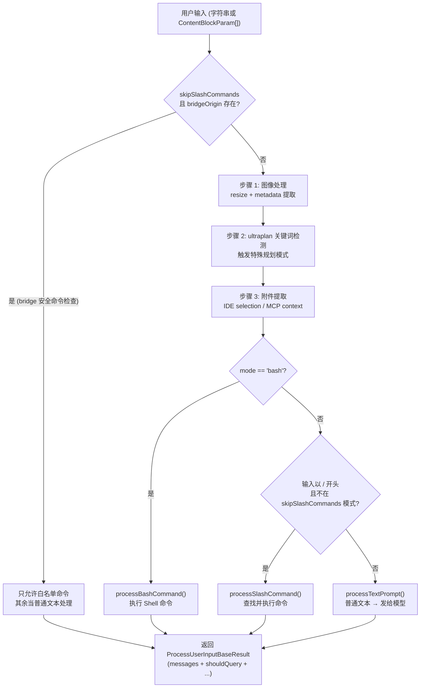

# 第8章 — 命令系统
源地址：https://github.com/zhu1090093659/claude-code
## 学习目标

读完本章，你应该能够：

1. 区分 PromptCommand、LocalCommand、LocalJSXCommand 三种类型，并说出它们各自的执行路径
2. 理解 CommandBase 中每个字段的用途，特别是 `availability`、`isEnabled`、`immediate` 这些控制性字段
3. 追踪 `getCommands()` 如何把 70+ 条内置命令、Skills、Plugins 合并成一张统一的可用命令列表
4. 解释 `processUserInput()` 内部的 7 步路由逻辑
5. 从零新增一个自定义斜杠命令，并让它出现在 `/` 补全列表中

---

用户每次在 Claude Code 的输入框里键入 `/clear`、`/compact` 或任何斜杠命令，背后都会触发一套精心设计的命令系统。这套系统要解决的问题比看起来复杂得多：如何区分"需要模型处理的文本展开"和"纯本地执行的逻辑"？如何按用户订阅状态过滤命令？如何让第三方插件的命令和内置命令享有同样的发现路径？如何在不阻塞 REPL 的前提下懒加载命令实现？

理解命令系统，是理解整个 Claude Code 交互层的入口。

---

## 8.1 三种命令类型

Claude Code 的所有命令都挂在一个联合类型 `Command` 下面，但其内核分为三条完全不同的执行路径。TypeScript 用区分联合（discriminated union）通过 `type` 字段把它们分开，编译器能在任何使用处强制你处理每一种情况。

### 8.1.1 PromptCommand：展开为模型上下文

PromptCommand 的本质是"文本模板"。当用户执行一条 PromptCommand 时，系统并不直接运行任何 TypeScript 代码，而是调用它的 `getPromptForCommand()` 方法，把命令展开成一段 `ContentBlockParam[]`，然后作为用户消息发送给模型。从模型的角度看，收到的就是普通的对话消息，它并不知道这是一条命令触发的。

这种设计使 PromptCommand 天然适合"指令模板"场景——Skills 系统（`.claude/commands/` 目录下的 Markdown 文件）就全部编译成 PromptCommand。每个 `.md` 文件就是一段提示词，通过占位符接收参数，由 `getPromptForCommand()` 在运行时填入实际值后送给模型。

PromptCommand 还有几个有意思的控制字段。`context` 字段可以设为 `'fork'`，让命令在一个独立的子 agent 中运行，而不是污染当前对话的上下文。`allowedTools` 可以限制这次模型调用能使用哪些工具，这对安全敏感的命令很有用。`effort` 字段则允许命令指定推理强度，类似 OpenAI 的 `reasoning_effort`。

```typescript
// A typical PromptCommand definition (skills compiled from markdown)
const reviewCommand: Command = {
  type: 'prompt',
  name: 'review',
  description: 'Review the current file for code quality issues',
  source: 'skills',
  progressMessage: 'Reviewing code...',
  contentLength: 512,
  context: 'inline',    // run inline, not in a forked sub-agent
  async getPromptForCommand(args, context) {
    const fileContent = await readCurrentFile(context)
    return [
      {
        type: 'text',
        text: `Please review the following code for quality issues:\n\n${fileContent}`,
      },
    ]
  },
}
```

### 8.1.2 LocalCommand：执行本地逻辑

LocalCommand 走完全不同的路径。它的 `load()` 方法是一个动态 `import()`，返回一个模块，模块里暴露的 `call()` 函数才是实际执行逻辑的地方。执行结果是本地计算得出的，不经过模型，`ProcessUserInputBaseResult.shouldQuery` 会被设为 `false`，告诉上游不要把这次输入发给 API。

懒加载（lazy loading）的设计值得特别注意。`load` 是一个返回 Promise 的函数，而不是在模块初始化时直接执行 `import()`。这意味着所有 LocalCommand 的实现代码都不会在进程启动时加载，只有用户真正执行这条命令时才会触发 bundle 拆分后的对应模块。对于一个有 70+ 条命令的系统，这节省了可观的启动时间。

`/clear` 命令是 LocalCommand 中最简单也最典型的例子，它甚至还有两个别名：

```typescript
// src/commands/clear/index.ts
// Aliases allow /reset and /new to trigger the same command
const clear = {
  type: 'local',
  name: 'clear',
  description: 'Clear conversation history and free up context',
  aliases: ['reset', 'new'],
  supportsNonInteractive: false,
  load: () => import('./clear.js'),   // lazy-loaded implementation
} satisfies Command

export default clear
```

`supportsNonInteractive: false` 表示这条命令不能在 `-p` 非交互模式下运行，因为"清除对话历史"在批处理脚本里没有意义。

### 8.1.3 LocalJSXCommand：渲染 Ink 界面

LocalJSXCommand 是三种类型中最特殊的一个。它同样有懒加载的 `load()` 方法，但加载回来的模块导出的是一个 React 组件，而不是一个普通函数。这个组件会通过 Ink（在终端里运行 React 的库）直接渲染成终端 UI。

`/config` 命令就是 LocalJSXCommand 的典型应用——它展示一个可交互的终端表单，让用户用方向键选择配置项、用回车确认，整个过程都是 React 驱动的状态管理，和网页 UI 开发方式一脉相承。这对于需要丰富交互的命令来说是绝佳方案；对于只需要输出几行文字的命令，用普通 LocalCommand 更合适。

三种命令类型的执行路径对比如下：

| 类型 | 执行主体 | 是否调用模型 | 适用场景 |
|------|----------|------------|---------|
| PromptCommand | 模型 | 是 | 提示词模板、Skills、插件指令 |
| LocalCommand | Node.js 函数 | 否 | 清除历史、配置查询、会话管理 |
| LocalJSXCommand | React/Ink 组件 | 否 | 需要交互式终端 UI 的命令 |

---

## 8.2 CommandBase：命令的公共基础

无论是哪种类型的命令，都必须混入 `CommandBase` 这个类型。它定义了命令的"公民身份"——系统用它来决定这条命令对谁可见、在什么情况下激活、在界面上如何展示。

`name` 和 `aliases` 是命令的标识符。`findCommand()` 在查找时会同时检查这两个字段，所以 `/reset` 和 `/new` 这两个名字都能找到 `clear` 命令。

`description` 是展示给用户的说明文字，会出现在 `/` 补全列表里。当命令来自外部来源（Skills、插件）时，`formatDescriptionWithSource()` 会在描述末尾追加来源标注，比如 `(workflow)` 或 `(plugin: my-plugin)`，让用户一目了然这条命令从哪里来。

`availability` 是可见性的"白名单"控制器。它的值是 `'claude-ai' | 'console'` 的数组，对应不同的订阅/服务类型。如果这个字段不存在（`undefined`），命令对所有用户可见；如果存在，则只有满足其中一个条件的用户才能看到它。`meetsAvailabilityRequirement()` 负责执行这个检查，后面 8.4 节会详细展开。

`isEnabled` 是一个函数，返回布尔值，在运行时动态判断命令是否激活。这和 `availability` 的区别在于：`availability` 是基于用户身份的静态过滤，`isEnabled` 是基于运行时状态的动态开关，比如检查某个功能 flag 是否启用、某个配置项是否打开。

```typescript
// isEnabled allows runtime dynamic gating
const voiceCommand: Command | null = isFeatureEnabled('voice')
  ? {
      type: 'local',
      name: 'voice',
      description: 'Start voice input mode',
      isEnabled: () => getMicrophonePermission() === 'granted',
      // ...
    }
  : null
```

`immediate` 字段控制命令是否需要等待模型停止生成才能执行。设为 `true` 的命令（比如紧急中断）会立即响应，无需等待当前对话轮次结束。

`isSensitive` 字段告诉系统这条命令的参数包含敏感信息。设为 `true` 后，命令的参数会在历史记录中被脱敏处理，不会以明文存储。

`whenToUse` 是一个供模型阅读的字段。当 Claude Code 的 agent 模式需要自主决定"现在该用哪个工具"时，会参考这段说明来做判断。它不面向用户，而面向模型。

`loadedFrom` 记录命令的装载来源，是一个枚举字符串：`'skills'` 表示来自用户 Skills 目录，`'plugin'` 表示来自已安装插件，`'bundled'` 表示内置打包，`'mcp'` 表示来自 MCP 服务器。这个字段主要用于调试和 `formatDescriptionWithSource()` 的格式化逻辑。

---

## 8.3 命令注册表：commands.ts 解析

`src/commands.ts` 是整个命令系统的中枢文件。它不只是一个命令数组，还承载了条件注册、内部命令分离、懒加载保障等多项职责。

### COMMANDS 为何要用 memoize 包裹

第一个值得注意的设计决策是，内置命令列表不是一个模块级的数组常量，而是一个 `memoize` 包裹的工厂函数：

```typescript
// Wrapped with memoize to prevent reading config at module init time.
// Config is not ready when the module is first imported.
const COMMANDS = memoize((): Command[] => [
  addDir,
  advisor,
  agents,
  branch,
  clear,
  compact,
  config,
  // ... 70+ commands
  ...(proactive ? [proactive] : []),
  ...(voiceCommand ? [voiceCommand] : []),
])
```

如果写成模块级常量 `const COMMANDS = [addDir, advisor, ...]`，那么在这个模块被 `import` 时，Node.js 会立即执行这段代码。问题在于，某些命令（比如 `proactive`、`voiceCommand`）需要读取用户配置才能决定是否注册，而配置系统在模块初始化阶段还没有准备好。`memoize` 把这个初始化动作推迟到第一次实际调用时，此时配置已经就绪。同时，`memoize` 保证工厂函数只执行一次，后续调用直接返回缓存结果，没有额外开销。

### 条件注册与 Feature Flag

数组末尾的几行是条件注册的典型模式：

```typescript
...(proactive ? [proactive] : []),
...(voiceCommand ? [voiceCommand] : []),
```

`proactive` 和 `voiceCommand` 在文件顶部被初始化，如果对应的功能 flag 未开启，它们的值是 `null`。这里用扩展运算符加三元表达式，在 `null` 时展开一个空数组，保持命令列表的整洁。这个模式比 `if` 判断后 `push` 更简洁，也不会引入 `undefined` 值到数组中。

### INTERNAL_ONLY_COMMANDS

文件里还有一个独立的内部命令列表：

```typescript
// Commands only visible to Anthropic employees (checked via internal identity)
export const INTERNAL_ONLY_COMMANDS = [
  backfillSessions,
  breakCache,
  bughunter,
  // ...
].filter(Boolean)
```

这些命令不会出现在 `COMMANDS()` 里，不会经过正常的发现流程，也不会在 `/` 补全中显示。它们有独立的加载入口，只有通过 Anthropic 内部身份验证的实例才会挂载它们。`.filter(Boolean)` 的目的和条件注册相同——某些内部命令在特定环境下可能不存在，过滤掉 `null/undefined` 防止数组出现空洞。

---

## 8.4 命令发现：从原始列表到可用列表

命令"发现"的过程分为两层：`loadAllCommands()` 负责聚合所有来源，`getCommands()` 负责过滤出当前用户实际可用的那些。

### loadAllCommands：三路并行聚合

`loadAllCommands` 用 `Promise.all` 同时启动三路异步加载，最大化并行度：

```typescript
// Three sources loaded in parallel to minimize startup latency
const loadAllCommands = memoize(async (cwd: string): Promise<Command[]> => {
  const [
    { skillDirCommands, pluginSkills, bundledSkills, builtinPluginSkills },
    pluginCommands,
    workflowCommands,
  ] = await Promise.all([
    getSkills(cwd),
    getPluginCommands(),
    getWorkflowCommands ? getWorkflowCommands(cwd) : Promise.resolve([]),
  ])

  return [
    ...bundledSkills,        // built-in skills shipped with Claude Code
    ...builtinPluginSkills,  // skills from first-party plugins
    ...skillDirCommands,     // user's .claude/commands/ directory
    ...workflowCommands,     // workflow scripts
    ...pluginCommands,       // installed third-party plugin commands
    ...pluginSkills,         // skills from third-party plugins
    ...COMMANDS(),           // hardcoded built-in commands
  ]
})
```

最终数组的顺序有意义：内置命令（`COMMANDS()`）排在最后，用户的 Skills 和插件命令排在前面。这保证了如果用户定义了和内置命令同名的 Skill，用户的版本会在 `findCommand()` 的线性查找中先被找到，实现了"覆盖"语义。

`loadAllCommands` 同样用了 `memoize`，整个聚合过程只执行一次，结果缓存在内存里。只有进程重启才会重新扫描 Skills 目录和插件列表。

### getCommands：可用性过滤

`getCommands()` 在 `loadAllCommands()` 的结果基础上再做一层过滤：

```typescript
export async function getCommands(cwd: string): Promise<Command[]> {
  const allCommands = await loadAllCommands(cwd)
  const dynamicSkills = getDynamicSkills()  // discovered via file-watching

  const baseCommands = allCommands.filter(
    _ => meetsAvailabilityRequirement(_) && isCommandEnabled(_),
  )
  // de-duplicate and insert dynamic skills before built-in commands
  // ...
}
```

过滤条件是两个函数的"与"关系：`meetsAvailabilityRequirement()` 检查用户身份，`isCommandEnabled()` 检查运行时状态。两者都返回 `true` 的命令才能出现在最终列表里。

### meetsAvailabilityRequirement：订阅级别过滤

```typescript
// Commands with no availability restriction are visible to everyone
export function meetsAvailabilityRequirement(cmd: Command): boolean {
  if (!cmd.availability) return true
  for (const a of cmd.availability) {
    switch (a) {
      case 'claude-ai':
        if (isClaudeAISubscriber()) return true
        break
      case 'console':
        // visible only to API users not using third-party services
        if (!isClaudeAISubscriber() && !isUsing3PServices() && isFirstPartyAnthropicBaseUrl())
          return true
        break
    }
  }
  return false
}
```

`availability` 数组采用"满足任意一项即可"的语义，而不是"必须满足所有项"。这允许一条命令同时面向多个用户群体。大多数内置命令不设置 `availability`，对所有用户可见。

`isCommandEnabled` 则直接代理给命令自身的 `isEnabled()` 方法，命令不提供该方法时默认返回 `true`：

```typescript
export function isCommandEnabled(cmd: CommandBase): boolean {
  return cmd.isEnabled?.() ?? true
}
```

---

## 8.5 命令查找：findCommand()

用户输入 `/clear` 后，系统需要在命令列表里找到对应的命令对象。`findCommand()` 是这个查找过程的唯一入口：

```typescript
// Checks name, userFacingName, and aliases — in that order
export function findCommand(commandName: string, commands: Command[]): Command | undefined {
  return commands.find(
    _ => _.name === commandName
      || getCommandName(_) === commandName
      || _.aliases?.includes(commandName),
  )
}
```

查找逻辑分三步，按优先级顺序：

第一步匹配 `name`，这是命令的内部标识符，是字符串相等比较。第二步匹配 `getCommandName()` 的返回值，这个辅助函数会优先返回 `userFacingName()`，只有 `userFacingName` 不存在时才回退到 `name`。`userFacingName` 是一个函数（而不是字符串），允许命令根据运行时状态动态返回不同的显示名称，比如语言切换场景。第三步匹配 `aliases` 数组，让 `/reset` 和 `/new` 都能命中 `clear` 命令。

`findCommand()` 返回 `undefined` 表示命令不存在，调用方需要处理这种情况——通常是将输入当作普通文本处理，发送给模型。

---

## 8.6 Skills 与 Plugins：动态扩展

命令系统的扩展性通过两个机制实现：Skills 和 Plugins。它们都最终转化为 `Command` 对象，经过完全相同的发现和过滤流程，对用户来说体验一致。

### Skills：目录扫描转命令

Skills 来自 `.claude/commands/` 目录（以及全局 `~/.claude/commands/`）下的 Markdown 文件。`getSkills(cwd)` 会扫描这些目录，把每个 `.md` 文件解析成一个 PromptCommand：

- 文件名（不含扩展名）成为命令名，比如 `fix-tests.md` 对应 `/fix-tests`
- 文件的 YAML frontmatter 提供 `description`、`allowedTools` 等元数据
- 文件正文是提示词模板，支持 `$ARGUMENTS` 占位符接收用户输入的参数
- `source` 字段被设为 `'skills'`，`loadedFrom` 被设为对应的子类型

`bundledSkills` 是随 Claude Code 打包发布的内置 Skills，`skillDirCommands` 是用户自定义的，`pluginSkills` 是插件安装的。三者都是 PromptCommand，只是 `source` 和 `loadedFrom` 不同。

### Plugins：打包命令与 Skills 的混合体

插件（Plugin）是一个 npm 包，可以同时提供两种东西：普通命令（`pluginCommands`）和 Skills（`pluginSkills`）。`getPluginCommands()` 读取已安装插件的清单，动态加载它们导出的命令对象。插件命令的 `source` 被设为 `'plugin'`，`pluginInfo` 字段记录了来源插件的 manifest 和仓库地址。

`formatDescriptionWithSource()` 正是利用这些字段，在命令描述末尾追加来源信息，让用户能在 `/` 补全列表中看到 `(plugin: my-plugin)` 这样的标注，避免与内置命令混淆。

### 动态 Skills

`getDynamicSkills()` 是 `getCommands()` 中的第三个来源。不同于 `loadAllCommands()` 一次性扫描，动态 Skills 通过文件系统监听实时发现——当用户在 `.claude/commands/` 目录里新建或删除文件时，命令列表会立即更新，无需重启。这些动态发现的 Skills 在插入时会经过去重处理，放在 `loadAllCommands()` 结果之前（但在数组整体顺序上仍在内置命令之前）。

---

## 8.7 用户输入管道：processUserInput()

`processUserInput()` 是 REPL 层的主入口，所有用户输入——无论是斜杠命令、普通文字还是粘贴的图片——都要经过这个函数。它内部调用 `processUserInputBase()`，按顺序执行 7 个处理步骤：



`ProcessUserInputBaseResult` 的 `shouldQuery` 字段是整个管道的关键输出。本地命令（LocalCommand、LocalJSXCommand）执行完毕后会把它设为 `false`，REPL 读到这个信号后不会发起 API 调用；PromptCommand 或普通文本则设为 `true`，触发模型请求。

`messages` 字段是返回给上层的消息数组，类型可以是 `UserMessage`、`AssistantMessage`，甚至 `ProgressMessage`（用于流式显示"正在处理"状态）。

`nextInput` 和 `submitNextInput` 两个字段支持命令链（command chaining）——一条命令执行完后可以预填下一条输入，甚至自动提交，实现工作流串联。

`skipSlashCommands` 参数是一个安全阀，当输入来自桥接来源（远程手机端或网页端）时，某些斜杠命令出于安全考虑不应该被远程触发，这个参数联合 `bridgeOrigin` 实现白名单过滤。

---

## 8.8 实操：新增一个斜杠命令

下面通过一个完整示例说明如何从零添加一个自定义斜杠命令：`/wordcount`，用于统计当前对话中所有消息的总字数。这是一个 LocalCommand，执行本地逻辑，不调用模型。

### 第一步：创建命令实现文件

在 `src/commands/wordcount/` 目录下创建两个文件。

先创建实现文件 `wordcount.ts`，导出 `LocalCommandModule` 要求的 `call` 函数：

```typescript
// src/commands/wordcount/wordcount.ts
// Implements the word count logic for the /wordcount command
import type { LocalCommandModule } from '../../types/command.js'
import type { ToolUseContext } from '../../types/context.js'

const wordcountCommand: LocalCommandModule = {
  async call(args: string, context: ToolUseContext) {
    // Count words across all messages in the current conversation
    const messages = context.messageHistory ?? []
    let totalWords = 0

    for (const message of messages) {
      if (typeof message.content === 'string') {
        totalWords += message.content.split(/\s+/).filter(Boolean).length
      } else if (Array.isArray(message.content)) {
        for (const block of message.content) {
          if (block.type === 'text') {
            totalWords += block.text.split(/\s+/).filter(Boolean).length
          }
        }
      }
    }

    return {
      type: 'result',
      resultForAssistant: `Total words in conversation: ${totalWords}`,
    }
  },
}

export default wordcountCommand
```

再创建命令定义文件 `index.ts`，声明命令的元数据：

```typescript
// src/commands/wordcount/index.ts
// Command definition — metadata only, implementation is lazy-loaded
import type { Command } from '../../types/command.js'

const wordcount = {
  type: 'local',
  name: 'wordcount',
  description: 'Count total words in the current conversation',
  aliases: ['wc'],                          // /wc also works
  supportsNonInteractive: true,             // safe to use in -p mode
  load: () => import('./wordcount.js'),     // lazy-load the implementation
} satisfies Command

export default wordcount
```

### 第二步：导入并注册到 commands.ts

打开 `src/commands.ts`，在文件顶部的命令导入区域添加：

```typescript
// Add import alongside other command imports
import wordcount from './commands/wordcount/index.js'
```

然后在 `COMMANDS` 工厂函数的数组中插入新命令（字母顺序排列，保持可读性）：

```typescript
const COMMANDS = memoize((): Command[] => [
  addDir,
  advisor,
  // ... other commands in alphabetical order ...
  wordcount,   // ← add here
  // ...
])
```

### 第三步：类型检查与测试

运行类型检查确认没有引入错误：

```bash
npx tsc --noEmit
```

启动 Claude Code，在输入框里键入 `/w`，补全列表应该出现 `wordcount` 和其别名。执行 `/wordcount` 应该输出当前对话的总字数统计；执行 `/wc` 应该有相同效果。

如果需要覆盖测试，可以在 `src/commands/wordcount/__tests__/wordcount.test.ts` 中验证字数统计逻辑和别名解析：

```typescript
// src/commands/wordcount/__tests__/wordcount.test.ts
import { describe, it, expect } from 'vitest'
import { findCommand } from '../../commands.js'
import wordcount from '../index.js'

describe('wordcount command', () => {
  it('should be findable by name', () => {
    // Verify findCommand() can locate it by primary name
    const found = findCommand('wordcount', [wordcount])
    expect(found).toBeDefined()
    expect(found?.name).toBe('wordcount')
  })

  it('should be findable by alias wc', () => {
    // Verify the /wc alias works
    const found = findCommand('wc', [wordcount])
    expect(found).toBeDefined()
  })

  it('should support non-interactive mode', () => {
    // Ensure the command can run in -p batch mode
    expect(wordcount.supportsNonInteractive).toBe(true)
  })
})
```

### 常见坑点

**循环依赖**：`commands.ts` 已经被很多模块导入，如果你的命令实现文件再导入 `commands.ts`，就会形成循环依赖。确保命令的 `index.ts` 只导入 `types/command.ts` 等类型文件，实现文件只导入工具函数，不导入命令注册表本身。

**memoize 缓存**：`COMMANDS()` 是 memoize 的，修改后需要重启进程才能看到新命令。开发时如果不确定命令是否注册成功，可以临时在 `loadAllCommands` 里加 `console.log` 确认。

**懒加载路径**：`load: () => import('./wordcount.js')` 中的路径是相对于编译后的 `.js` 文件的，而不是 `.ts` 源文件。确保 TypeScript 编译配置能正确解析这个路径，特别是使用 ESM 模块时扩展名必须写 `.js`（即使源文件是 `.ts`）。

---

## 本章要点回顾

命令系统是 Claude Code 交互层的骨架，掌握它需要理解几个层次的关系。

类型层：`Command = CommandBase & (PromptCommand | LocalCommand | LocalJSXCommand)` 这个联合类型是一切的起点。PromptCommand 把输入转化为给模型的消息，LocalCommand 在本地执行函数并阻断 API 调用，LocalJSXCommand 渲染终端 UI。三种类型共享 CommandBase 的元数据字段，但执行路径完全不同。

注册层：`COMMANDS` 用 `memoize` 包裹工厂函数，解决了模块初始化时配置未就绪的问题，同时避免重复计算。条件注册用"扩展空数组"的模式保持代码简洁。

发现层：`loadAllCommands` 三路并行加载（Skills + 插件 + 内置），结果再经 `getCommands` 用 `meetsAvailabilityRequirement` 和 `isCommandEnabled` 双重过滤，产出当前用户实际可用的命令列表。

执行层：`processUserInput` 的 7 步路由把图像处理、安全检查、模式判断、命令分发组织在一条串行管道里，`shouldQuery` 标志位是本地执行和模型调用的分界线。

查找层：`findCommand` 按 `name → userFacingName → aliases` 的优先级线性查找，支持别名透明替换。

新增命令只需两步：在独立目录创建命令定义和实现文件，然后导入并追加到 `COMMANDS` 数组。懒加载模式保证了扩展性不会影响启动性能；`satisfies Command` 类型约束保证了元数据的完整性；`supportsNonInteractive` 字段让你明确声明命令在批处理模式下的行为。
