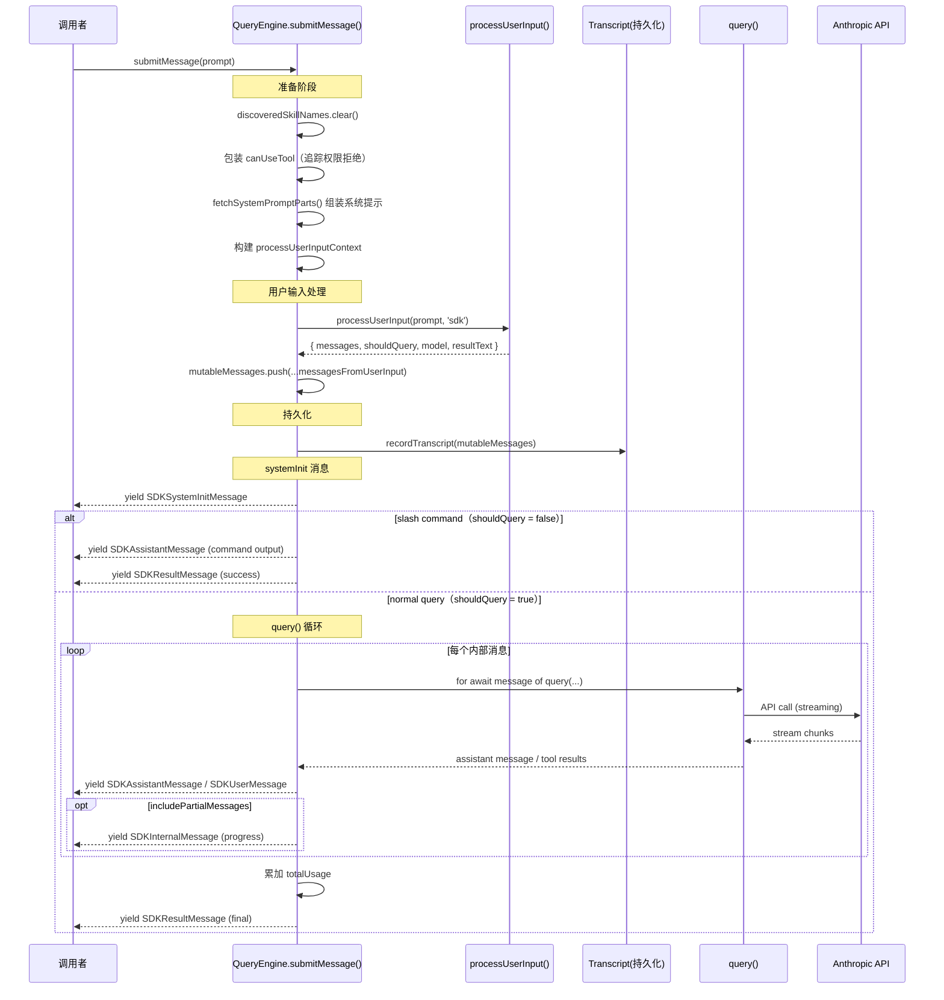

# 第9章 — QueryEngine 与 SDK 接口
源地址：https://github.com/zhu1090093659/claude-code
## 学习目标

读完本章，你应该能够：

1. 理解 QueryEngine 在 headless（无头）模式下扮演的角色，以及为什么需要它而不是直接调用 `query()`
2. 逐字段读懂 QueryEngineConfig 的所有参数，包括哪些是核心必填项、哪些是调优旋钮
3. 追踪 `submitMessage()` 的完整执行路径，从原始字符串输入到最终 SDKResultMessage 输出
4. 区分 SDKMessage 的各个变体，理解每种消息在协议中的语义
5. 写出一段可以运行的程序化调用代码，并处理流式 SDKMessage 输出
6. 解释 headless 模式与 interactive 模式在消息处理上的本质差异

---

Claude Code 既是一个交互式命令行工具，也是一个可嵌入应用的编程库。这两种用法共享相同的核心逻辑，但需要一个"会话管理层"把内部状态、系统提示组装、消息持久化、权限追踪等职责都封装起来，让外部调用者只需关心"发一条消息、收一批结果"。QueryEngine（查询引擎）就是这个会话管理层。

理解 QueryEngine，是理解 Claude Code 作为 SDK 被其他工具集成时的完整视角。

---

## 9.1 QueryEngine 的定位：为什么需要它

在第5章里，我们详细研究了 `query()` 函数——它是 agentic loop（智能体循环）的核心，负责驱动多轮 API 调用、工具执行、上下文压缩。但 `query()` 本身是无状态的：它接收一批消息和配置，产出一批消息，仅此而已。两次调用之间，谁来持有对话历史？谁来累计 token 用量？谁来追踪哪些工具调用被用户拒绝了权限？

这些问题在交互式（interactive）模式下由 REPL 的全局状态管理器负责。但当 Claude Code 以 SDK 形式被调用时，没有 REPL，没有 Ink 渲染循环，调用者只想做一件事：给一个 prompt，拿回结果。QueryEngine 就是专为这种场景设计的。

它的职责可以概括为四点：

第一，跨轮持久化对话历史。`mutableMessages` 数组在多次 `submitMessage()` 调用之间保持存在，每次调用追加新消息。这是"会话"的基础。

第二，封装系统提示的组装逻辑。每次调用都需要重新拼接系统提示——默认提示、用户自定义提示、内存注入（memory mechanics prompt）、追加提示——这些逻辑统一在 `submitMessage()` 内部处理，调用者不必关心。

第三，追踪权限拒绝记录。QueryEngine 通过包装 `canUseTool()` 函数，在每次工具调用被拒绝时把拒绝原因记入 `permissionDenials` 数组，最终附在 SDKResultMessage 里返回给调用者。

第四，将内部 `Message` 流映射为 SDKMessage 协议。`query()` 产出的是内部类型的消息流，调用者看到的必须是稳定的、可序列化的 SDK 协议类型。这个翻译工作也由 `submitMessage()` 承担。

一句话总结：QueryEngine 是 `query()` 的有状态包装，专为 headless 编程使用场景设计。

---

## 9.2 QueryEngineConfig：配置参数全解

QueryEngineConfig 是 QueryEngine 构造函数的唯一参数。它有将近三十个字段，初看很吓人，但按职责分组之后就清晰多了。

### 运行环境

`cwd` 是工作目录，告诉引擎文件操作的根路径。`tools` 是可用工具列表，`commands` 是斜杠命令列表，`mcpClients` 是已连接的 MCP 服务器，`agents` 是可调度的子 agent 定义。这五个字段共同描述了"引擎可以调动哪些能力"。

### 权限与状态

`canUseTool` 是一个回调函数，引擎在执行每个工具调用前都会先问一遍它，判断是否允许执行。`getAppState` 和 `setAppState` 是读写应用全局状态的接口，斜杠命令在执行时可能需要修改状态（比如 `/clear` 需要清空消息历史）。

### 消息与系统提示

`initialMessages` 允许调用者传入一段对话历史来初始化引擎，常用于 resume（恢复上次会话）场景。`customSystemPrompt` 会完全替换默认系统提示，`appendSystemPrompt` 则在默认提示末尾追加内容，两者互斥（customSystemPrompt 优先级更高）。

### 模型控制

`userSpecifiedModel` 指定主模型，`fallbackModel` 是主模型不可用时的备选，`thinkingConfig` 控制扩展思考（extended thinking）的参数。

### 运行约束

`maxTurns` 限制单次 `submitMessage()` 内的最大循环轮数（默认不限）。`maxBudgetUsd` 和 `taskBudget` 是预算约束，前者以美元计，后者以 token 计，任一超出都会提前终止循环。

### 结构化输出

`jsonSchema` 是结构化输出模式（structured output）的 JSON Schema，设置后引擎会强制模型按 schema 格式返回内容。

### 调试与控制流

`verbose` 打开详细日志，`replayUserMessages` 控制是否把历史用户消息重新注入到序列。`abortController` 让外部可以随时取消正在进行的请求。`setSDKStatus` 是一个回调，引擎在关键状态变更时会调用它通知外部。

### 文件与缓存

`readFileCache` 是文件内容的去重缓存，多个工具对同一文件的读取操作不会重复读磁盘。`snipReplay` 是一个高级钩子，允许外部介入"replay 剪裁"逻辑。

```typescript
// A typical QueryEngineConfig for a programmatic assistant
const config: QueryEngineConfig = {
  cwd: process.cwd(),
  tools: getDefaultTools(),
  commands: getDefaultCommands(),
  mcpClients: [],
  agents: [],
  canUseTool: async () => ({ behavior: 'allow' }),  // allow all tools
  getAppState: () => appState,
  setAppState: (f) => { appState = f(appState) },
  readFileCache: new Map(),
  customSystemPrompt: 'You are a specialized code reviewer.',
  maxTurns: 10,
  verbose: false,
}
```

---

## 9.3 类结构与私有状态

QueryEngine 的类体非常精简，构造函数只是把 config 的各个字段分发到对应的私有成员上，没有任何异步初始化逻辑——这是刻意的设计，引擎在构造时不做任何 IO，第一次调用 `submitMessage()` 时才真正启动。

```typescript
export class QueryEngine {
  private config: QueryEngineConfig
  private mutableMessages: Message[]          // conversation history, persists across calls
  private abortController: AbortController
  private permissionDenials: SDKPermissionDenial[]  // accumulated across all turns
  private totalUsage: NonNullableUsage        // cumulative token usage
  private hasHandledOrphanedPermission = false
  private readFileState: FileStateCache       // deduplication cache for file reads
  private discoveredSkillNames = new Set<string>()
  private loadedNestedMemoryPaths = new Set<string>()

  constructor(config: QueryEngineConfig) {
    this.config = config
    this.mutableMessages = config.initialMessages ?? []
    this.abortController = config.abortController ?? createAbortController()
    this.permissionDenials = []
    this.readFileState = config.readFileCache
    this.totalUsage = EMPTY_USAGE
  }
}
```

几个私有字段值得特别关注。

`mutableMessages` 是引擎的"记忆"。它不仅保存 assistant 的回复，也保存 user 消息和工具结果，完整还原了对话的 interleaving 格式。每次 `submitMessage()` 会把新产生的消息追加到这个数组，而不是替换它。

`permissionDenials` 记录的是每次工具调用被 `canUseTool` 拒绝的信息，包括工具名、tool_use_id 和输入参数。这对审计和调试非常有价值，调用者可以从最终的 SDKResultMessage 里读取这份清单。

`totalUsage` 跟踪整个会话的累计 token 消耗（不只是最后一次调用），让调用者可以在会话结束后统一核算成本。

`discoveredSkillNames` 和 `loadedNestedMemoryPaths` 是两个去重 Set，防止同一条 Skill 或同一个嵌套 CLAUDE.md 在单次 session 里被重复加载。

---

## 9.4 submitMessage()：完整执行流程

`submitMessage()` 是 QueryEngine 唯一的核心公共方法。它是一个 async generator（异步生成器），逐条 yield SDKMessage，而不是等全部完成后一次性返回。这种设计让调用者可以实时处理流式输出，比如把 assistant 的 token 流式显示到屏幕上，而不是等模型停止生成才开始渲染。

完整执行流程如下图所示：



### 9.4.1 准备阶段：canUseTool 包装 + 系统提示组装

`submitMessage()` 进入后的第一件事是清空 `discoveredSkillNames`，把上一轮发现的 skill 名单清零，让本轮重新扫描。

接下来是包装 `canUseTool`。原始的 `canUseTool` 来自 config，是调用者提供的权限决策函数。QueryEngine 在其外面套一层，每当决策结果不是 `'allow'` 时，就把该次拒绝记录到 `this.permissionDenials`。这个包装是纯透明的——原始函数的返回值原封不动传回去，调用链不受影响。

```typescript
// Wrapping canUseTool to track permission denials without changing its behavior
const wrappedCanUseTool: CanUseToolFn = async (tool_name, tool_use_id, tool_input) => {
  const result = await canUseTool(tool_name, tool_use_id, tool_input)
  if (result.behavior !== 'allow') {
    this.permissionDenials.push({ tool_name, tool_use_id, tool_input })
  }
  return result
}
```

系统提示的组装分三层。首先调用 `fetchSystemPromptParts()` 拿到默认系统提示（defaultSystemPrompt）、用户上下文（userContext）和系统上下文（systemContext）。然后检查是否有 memory mechanics prompt 需要注入（当使用 `CLAUDE_COWORK_MEMORY_PATH_OVERRIDE` 时）。最后用 `asSystemPrompt()` 把这三层合并成一个符合 API 格式的 system 字段。

```typescript
// Three-layer system prompt assembly
const systemPrompt = asSystemPrompt([
  ...(customPrompt ? [customPrompt] : defaultSystemPrompt),
  ...(memoryMechanicsPrompt ? [memoryMechanicsPrompt] : []),
  ...(appendSystemPrompt ? [appendSystemPrompt] : []),
])
```

注意 `customPrompt` 和 `defaultSystemPrompt` 是互斥的：有自定义提示词时整个默认层被替换，而 `appendSystemPrompt` 始终追加在末尾，无论前面用的是哪一层。

### 9.4.2 用户输入处理

系统提示就绪后，引擎构建 `processUserInputContext`，其中有一个关键字段：`isNonInteractiveSession: true`。这个布尔值在内部多处被检查，它告诉下游"我们不在交互式 REPL 里"，从而跳过那些只在终端界面才有意义的行为（比如提示用户按 Enter 确认）。

然后调用 `processUserInput()`，传入 `querySource: 'sdk'` 标记。这个调用有两种可能的结果：

一是输入被识别为斜杠命令（shouldQuery = false）。命令在本地处理完毕，`resultText` 包含了命令的输出文本，不需要调用 API。

二是输入是普通 prompt（shouldQuery = true）。`messages` 包含了格式化后的用户消息，准备送入 `query()` 循环。

无论哪种结果，新产生的消息都会被 `push` 进 `this.mutableMessages`，维护历史的连贯性。

### 9.4.3 持久化与 systemInit 消息

用户消息入栈后，立即触发 transcript（会话记录）的持久化写入。这个写入是在 API 响应到来之前完成的，这意味着即使进程在 API 调用期间被意外终止，用户发出的 prompt 也已经安全地落盘，下次可以从断点恢复。

```typescript
// Persist user message before making API call — enables crash recovery
if (persistSession && messagesFromUserInput.length > 0) {
  await recordTranscript([...this.mutableMessages])
}
```

紧接着 yield 第一条 SDKMessage：SDKSystemInitMessage（类型为 `'system'`，子类型为 `'init'`）。这是 SDK 协议的"握手消息"，携带了本次会话的元数据：可用工具列表、MCP 服务器、主模型名称、权限模式、命令列表、skills、plugins 等。调用者可以用这条消息初始化 UI 状态（比如显示"正在使用 claude-3-7-sonnet-20250219"）。

### 9.4.4 slash command 短路路径

当 `shouldQuery` 为 false 时，引擎进入一条简短的"短路路径"。命令的执行结果（`resultText`）会被包装成 SDKAssistantMessage 或 SDKUserMessageReplay yield 出去，紧接着 yield 一条 `subtype: 'success'` 的 SDKResultMessage，然后函数返回。整个过程不触发任何网络请求，延迟极低。

这对于 `ask()` 这样的程序化接口非常重要：调用者不需要区分"这次会不会调用 API"，所有调用都遵循同样的 SDKMessage 协议，结果消费代码不需要任何条件分支。

### 9.4.5 query() 循环与 SDKMessage 映射

正常查询路径进入 `query()` 的 async generator 消费循环。这是整个 `submitMessage()` 里最耗时的部分，也是 yield 最多消息的地方。

`query()` 内部产出的是 Claude Code 的内部消息类型，包括流式的 assistant token 块、工具调用、工具结果、压缩边界等。`submitMessage()` 在 `for await` 循环里对每一条内部消息进行映射转换：

assistant 消息（包含文本块和工具调用）映射为 SDKAssistantMessage。user 消息（主要是工具执行结果）映射为 SDKUserMessage。当 `includePartialMessages` 为 true 时，还会在流式 token 到来时产出 SDKInternalMessage，让调用者能实现流式渲染。compact_boundary 事件产出 SDKCompactBoundaryMessage，告知调用者上下文发生了压缩。

每轮循环还会把当前轮的 token 用量累加到 `this.totalUsage`，让最终账单准确。

### 9.4.6 最终 SDKResultMessage

循环结束后，`submitMessage()` yield 最后一条消息：SDKResultMessage。这是整个会话的"收据"，携带的信息极为丰富：

```typescript
// The final SDKResultMessage — a complete receipt of the session
yield {
  type: 'result',
  subtype: 'success',       // or 'error_max_turns' / 'error_during_execution'
  is_error: false,
  duration_ms: Date.now() - startTime,
  duration_api_ms: getTotalAPIDuration(),
  num_turns: totalTurns,
  result: resultText ?? '',  // the final text result, if any
  stop_reason: lastStopReason,
  session_id: getSessionId(),
  total_cost_usd: getTotalCost(),
  usage: this.totalUsage,
  modelUsage: getModelUsage(),
  permission_denials: this.permissionDenials,
}
```

`subtype` 有三个可能值：`'success'` 表示正常完成，`'error_max_turns'` 表示因轮数超限而终止，`'error_during_execution'` 表示执行过程中遇到无法恢复的错误。

---

## 9.5 SDKMessage 类型变体

SDKMessage 是一个联合类型，每个变体的 `type` 字段是区分符。下表列出了所有变体及其用途：

| 类型（type） | 子类型（subtype） | 产生时机 | 携带的关键信息 |
|-------------|-----------------|---------|--------------|
| `system` | `init` | submitMessage() 开始时，第一条消息 | 工具列表、MCP 服务器、模型名称、权限模式 |
| `assistant` | — | 每次模型产出内容 | content blocks（文本、工具调用） |
| `user` | — | 工具执行结果返回时 | 工具调用结果的 content blocks |
| `result` | `success` | 正常完成时，最后一条消息 | 耗时、成本、token 用量、权限拒绝记录 |
| `result` | `error_max_turns` | 超过 maxTurns 时 | 同上，is_error: true |
| `result` | `error_during_execution` | 执行过程中遇到错误时 | 同上，is_error: true，result 包含错误信息 |
| `internal` | `progress` | 流式 token 到来时（需 includePartialMessages） | 部分文本内容，供流式渲染使用 |
| `compact_boundary` | — | 上下文发生压缩时 | 压缩前后的消息数量 |

调用者在消费 SDKMessage 流时，通常只关心三种消息：`system.init`（初始化 UI）、`assistant`（显示模型回复）、`result`（完成清理和计费）。其余消息可以按需处理。

---

## 9.6 程序化使用示例

下面是一个完整的程序化使用示例，展示如何用 QueryEngine 构建一个简单的代码审查助手。

```typescript
import { QueryEngine } from './QueryEngine.js'
import { query } from './entrypoints/agentSdkTypes.js'
import type { SDKMessage } from './entrypoints/agentSdkTypes.js'

// Initialize application state (simplified)
let appState = {
  permissionMode: 'default' as const,
  customApiKeyStatus: null,
}

async function runCodeReview(filePath: string): Promise<string> {
  // Create a QueryEngine instance for this session
  const engine = new QueryEngine({
    cwd: process.cwd(),
    tools: getDefaultTools(),
    commands: [],
    mcpClients: [],
    agents: [],
    canUseTool: async () => ({ behavior: 'allow' }),
    getAppState: () => appState,
    setAppState: (f) => { appState = f(appState) },
    readFileCache: new Map(),
    appendSystemPrompt: 'Focus on security issues and code quality. Be concise.',
    maxTurns: 5,
    verbose: false,
  })

  const prompt = `Please review the file ${filePath} and identify the top 3 issues.`
  let finalResult = ''

  // Consume the SDKMessage stream
  for await (const message of engine.submitMessage(prompt)) {
    finalResult = handleMessage(message, finalResult)

    // Stop early if this is the final result
    if (message.type === 'result') {
      break
    }
  }

  return finalResult
}

function handleMessage(message: SDKMessage, currentResult: string): string {
  switch (message.type) {
    case 'system':
      // Session initialized — could display model name in UI
      console.log(`[SDK] Session started with model: ${message.model}`)
      return currentResult

    case 'assistant':
      // Stream assistant content blocks to console
      for (const block of message.message.content) {
        if (block.type === 'text') {
          process.stdout.write(block.text)
        }
      }
      return currentResult

    case 'result':
      // Log cost and return final text
      console.log(`\n[SDK] Cost: $${message.total_cost_usd?.toFixed(4)}`)
      console.log(`[SDK] Turns: ${message.num_turns}`)
      if (message.permission_denials.length > 0) {
        console.warn(`[SDK] Denied tools: ${message.permission_denials.map(d => d.tool_name).join(', ')}`)
      }
      return message.result

    default:
      return currentResult
  }
}
```

如果需要多轮对话（比如实现一个聊天界面），只需复用同一个 `engine` 实例，多次调用 `submitMessage()`。每次调用都会延续上一次的对话历史：

```typescript
// Multi-turn conversation using the same engine instance
async function chat(engine: QueryEngine, turns: string[]): Promise<void> {
  for (const userMessage of turns) {
    console.log(`\nUser: ${userMessage}`)
    console.log('Assistant: ')

    for await (const message of engine.submitMessage(userMessage)) {
      if (message.type === 'assistant') {
        for (const block of message.message.content) {
          if (block.type === 'text') {
            process.stdout.write(block.text)
          }
        }
      }
    }

    console.log()  // newline after each assistant response
  }
}
```

如果想要流式输出并且在用户取消时立即停止，可以传入 `abortController`：

```typescript
const controller = new AbortController()

// Cancel on Ctrl+C
process.on('SIGINT', () => {
  controller.abort()
})

const engine = new QueryEngine({
  // ... other config
  abortController: controller,
})
```

---

## 9.7 SDK 公共类型面：agentSdkTypes.ts

`src/entrypoints/agentSdkTypes.ts` 是整个 SDK 的公共入口。它的设计遵循"单一导入点"原则——不管你想用哪个 SDK 类型或函数，都从这一个文件导入即可，不需要了解内部的模块分布。

这个文件的内容是纯粹的 re-export（重新导出），背后汇聚了四个子模块：

`sdk/coreTypes.ts` 包含可序列化的核心类型。所谓"可序列化"，是指这些类型只包含 JSON 兼容的数据，不含函数、Promise 或循环引用，可以安全地用 `JSON.stringify()` 序列化后传输。SDKMessage 的所有变体、HOOK_EVENTS 常量数组、EXIT_REASONS 常量数组都在这里。

`sdk/runtimeTypes.js` 包含非序列化的运行时类型，包括回调函数类型（如 `CanUseToolFn`）、Options 接口（如 `QueryOptions`）、`Query` 接口（程序化调用的核心接口）。

`sdk/settingsTypes.generated.js` 导出 `Settings` 类型，这是自动生成的文件，来源于 JSON Schema 定义。

`sdk/toolTypes.js` 包含工具相关的类型定义。

除了类型，`agentSdkTypes.ts` 还直接导出几个函数：

`tool()` 函数用于定义 MCP 工具，签名是 `tool(name, description, inputSchema, handler, extras?)`，返回一个 `SdkMcpToolDefinition`。

`createSdkMcpServer()` 创建一个 MCP 服务器实例，可以在程序中嵌入一个完整的 MCP 服务器。

`query()` 是程序化调用的主入口，适合不需要状态管理的单次调用场景（比如批处理脚本，每次调用都是独立的）。与 QueryEngine 的区别在于它是无状态的：调用者需要自己管理 messages 数组。

`AbortError` 是一个专门的错误类，当调用者取消请求时，SDK 抛出这个类型的错误，方便调用者区分"正常完成"和"被取消"。

HOOK_EVENTS 和 EXIT_REASONS 是两个 `as const` 数组，分别列出了所有钩子事件名称和退出原因代码：

```typescript
// All hook event types — Claude Code fires these at lifecycle boundaries
export const HOOK_EVENTS = [
  'PreToolUse', 'PostToolUse', 'PostToolUseFailure', 'Notification',
  'UserPromptSubmit', 'SessionStart', 'SessionEnd', 'Stop', 'StopFailure',
  'SubagentStart', 'SubagentStop', 'PreCompact', 'PostCompact',
  'PermissionRequest', 'PermissionDenied', 'Setup',
  'TeammateIdle', 'TaskCreated', 'TaskCompleted',
  'Elicitation', 'ElicitationResult', 'ConfigChange',
  'WorktreeCreate', 'WorktreeRemove', 'InstructionsLoaded',
  'CwdChanged', 'FileChanged',
] as const

// Reasons why an interactive session might end
export const EXIT_REASONS = [
  'clear', 'resume', 'logout', 'prompt_input_exit', 'other', 'bypass_permissions_disabled',
] as const
```

这两个数组的 `as const` 修饰符让 TypeScript 把它们推导为字面量联合类型，这样所有使用钩子名称的地方都能得到类型检查，错拼钩子名会在编译期报错而不是运行时静默失败。

---

## 9.8 Headless vs Interactive：关键差异

理解 QueryEngine 还需要理解它与交互式模式的区别。这两种模式共享同样的 `query()` 核心，但在多个关键环节走不同的路径。

**isNonInteractiveSession 标志**

这是最核心的区别标志。在 QueryEngine 构建的 `processUserInputContext` 里，`isNonInteractiveSession` 被硬设为 `true`。这个标志在代码库里有数十处检查点，任何"只对终端用户有意义"的行为都会在这里被跳过：询问用户确认、等待终端输入、渲染 Ink 组件等。

**消息的双重输出**

在交互式模式下，模型回复通过 Ink 的 React 组件树渲染到终端，流式 token 会实时出现在屏幕上。QueryEngine 则把所有输出通过 async generator 的 yield 传给调用者，由调用者决定如何展示。这是"控制反转"：UI 渲染的控制权从框架内部移交给了调用者。

**会话状态的归属**

交互式模式下，会话状态（消息历史、token 统计等）保存在 REPL 的全局状态管理器里，所有 UI 组件都可以订阅这个状态。QueryEngine 模式下，这些状态完全封装在 `QueryEngine` 实例内部，外部只能通过 SDKResultMessage 里的汇总数据了解情况。这个封装使得 QueryEngine 实例可以安全地被垃圾回收——销毁实例就是清理状态，不存在全局副作用。

**权限处理**

交互式模式下，当工具调用需要用户确认时，系统会在终端显示一个确认提示，等待用户按 Y/N。headless 模式下没有终端交互，权限决策完全由调用者提供的 `canUseTool` 函数决定。如果调用者想在 headless 模式下实现"逐次确认"，需要在 `canUseTool` 内部自行实现（比如通过 WebSocket 把确认请求发给前端界面）。

**Elicitation（信息征询）**

这是一个稍微少见但值得提及的机制。当工具执行需要从用户获取额外信息时（比如一个需要账号密码的部署工具），它可以触发 elicitation 请求。交互式模式会在终端弹出输入框，headless 模式则通过 config 里的 `handleElicitation` 回调把请求转发给调用者处理。这个机制使 headless 模式也能实现"双向通信"，而不仅仅是单向的 prompt → response。

---

## 本章要点回顾

QueryEngine 的存在解答了一个架构问题：`query()` 提供了无状态的 agentic loop，但实际使用需要会话管理、权限追踪、系统提示组装等有状态的能力。QueryEngine 是这两者之间的桥接层。

`submitMessage()` 是一个十步流程的 async generator。它的核心设计决策是：无论输入是 slash command 还是普通 prompt，调用者看到的都是统一的 SDKMessage 流，不需要区分内部处理路径。

SDKMessage 协议有八种变体，其中最重要的三种是 `system.init`（会话开始）、`assistant`（模型回复）、`result`（会话结束，附带完整账单）。

`agentSdkTypes.ts` 是 SDK 的单一导入点，背后汇聚了四个子模块：coreTypes（可序列化类型）、runtimeTypes（运行时接口）、settingsTypes（设置类型）、toolTypes（工具类型）。

headless 模式与 interactive 模式的根本区别不在于功能，而在于控制权的归属：UI 渲染、权限确认、信息征询，这三件事在 headless 模式下都反转给了调用者，通过回调函数和 async generator 实现。
