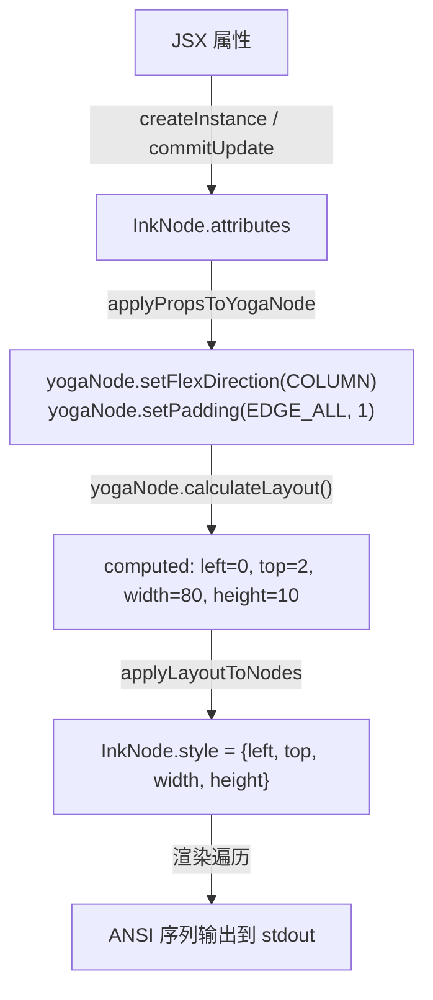
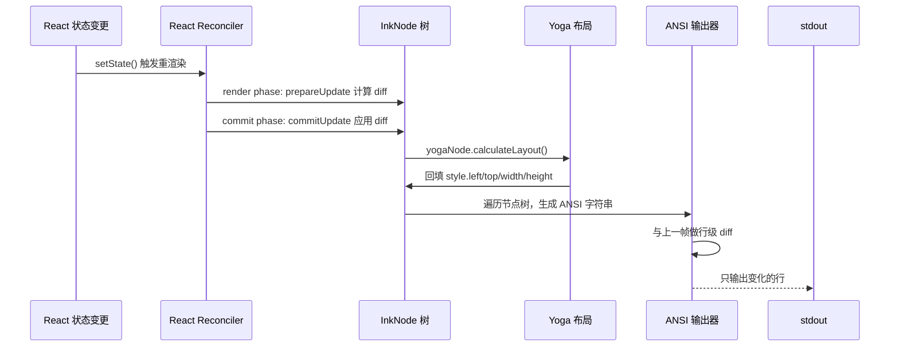
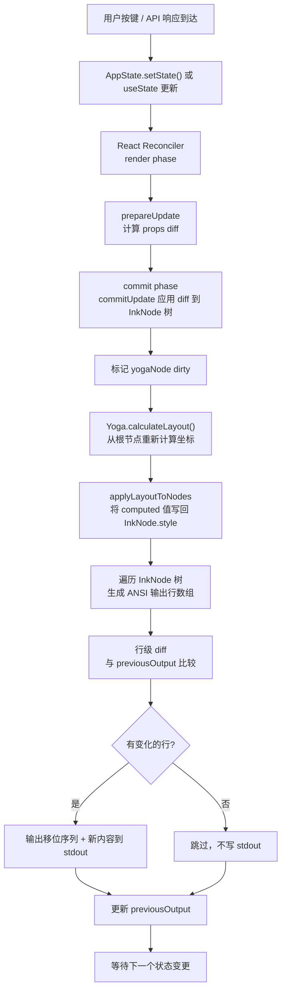

# 第 10 章：自研终端 UI 框架（Ink）
源地址：https://github.com/zhu1090093659/claude-code
## 本章导读

读完本章，你应该能够：

1. 解释 Anthropic 为什么要 fork 并深度改造 Ink，而不是直接使用 npm 上的 `ink` 包，以及这个决策背后的工程权衡
2. 理解 React Reconciler 的宿主环境（host environment）模型，并能说清楚 `createInstance`、`commitUpdate` 等核心 host config 函数在终端渲染中的作用
3. 追踪一次 React 状态变更从 `setState()` 到终端字符输出的完整渲染管线
4. 解释 Yoga WASM 布局引擎如何把 CSS Flexbox 语义翻译成终端字符坐标
5. 理解终端原始模式（raw mode）与普通模式的区别，以及键盘、鼠标事件如何从字节流解析成结构化事件
6. 解释焦点管理、虚拟滚动、文本换行三个"终端特有问题"的解决方案
7. 识别 Box、Text 这两个组件原语与浏览器 DOM 节点类比中的对应关系

---

理解 Claude Code 的 UI 层，首先需要把一个常见误解放到一边：`src/ink/` 里的代码不是 npm 上那个 5000 star 的 `ink` 包。它是 Anthropic 完整 fork 之后彻底改造过的版本，保留了"用 React 渲染终端"这个核心理念，但在渲染管线、布局引擎、I/O 处理三个方向上做了大量针对生产级 CLI 的定制工作。

这一章我们要做的，是把这个"终端版 React DOM"从里到外拆开来看。

---

## 10.1 为什么要 Fork？

表面上的答案很简单：官方 `ink` 包无法满足需求。但"无法满足"的具体含义值得细说，因为它揭示了一个生产级 CLI 工具与一个周末项目在需求上的根本差异。

### 性能瓶颈

原版 `ink` 的渲染策略是全屏刷新：每次状态变更，清空整个终端然后重新输出。这在消息数量少的时候没问题，但 Claude Code 的对话列表可以增长到几十甚至上百条消息，每条消息又可能包含多行代码块。全屏刷新意味着每次用户输入一个字符，终端就要闪烁一次，整个屏幕的内容都在重绘，这在视觉上令人难以接受。

自研版本实现了差量渲染（incremental rendering）：只重绘发生变化的行。这要求渲染器维护一份"上一帧的输出"，并在生成新帧时做行级 diff，只向 stdout 发送实际变更的 ANSI 序列。这个优化看起来不起眼，但对于一个实时流式输出模型 token 的 CLI 来说，差量渲染是不闪烁的前提。

### 布局引擎的掌控力

原版 `ink` 使用 `yoga-layout-prebuilt`（一个预编译的 Yoga native addon）。这个包有两个问题：一是 native addon 需要在目标平台上重新编译，与 Bun 的兼容性不稳定；二是它的版本跟随原版 `ink` 的发布节奏，无法单独升级。

自研版本直接集成了 `yoga-layout` 的 WASM 变体（`yoga-wasm-web`），在 JavaScript 层直接运行 WebAssembly 字节码，完全绕开 native addon 问题。更重要的是，对布局引擎的深度集成让自研版本能够做一些原版做不到的事情——比如在布局计算完成之后、渲染输出之前，插入自定义的后处理逻辑（虚拟滚动的核心就在这里）。

### 终端 I/O 的精细控制

原版 `ink` 的输入处理相对简单，只覆盖了常见的键盘事件。Claude Code 需要更细粒度的控制：括号粘贴模式（bracketed paste mode）用于区分用户手动输入和粘贴大块文本；鼠标事件用于支持点击和滚动；原始字节流的精确解析用于处理各种终端模拟器（iTerm2、Windows Terminal、tmux）之间的兼容性差异。这些需求超出了原版 `ink` 的设计范围。

### 一句话总结

fork 的根本原因是：原版 `ink` 是一个演示"React 可以渲染终端"的优雅原型，而 Claude Code 需要一个能在生产环境中稳定运行、性能可预期、可以被深度定制的工程基础设施。两者的目标读者不同，技术取舍自然不同。

---

## 10.2 React Reconciler：宿主环境是什么

在进入具体实现之前，需要建立一个基础概念：React 的架构是分层的。

大多数开发者接触的是 `react-dom`，这是 React 针对浏览器 DOM 的宿主环境（host environment）实现。`react-native` 是针对 iOS 和 Android 原生 UI 的宿主环境。它们共享同一个 `react-reconciler` 内核（调和器），区别只在于"当 React 决定要创建一个节点时，宿主环境如何响应"。

`react-reconciler` 包暴露了一个工厂函数，接受一个叫做 host config（宿主配置）的对象作为参数。这个对象定义了 React 调和器与宿主环境之间的完整接口契约：

```typescript
// Simplified view of what a host config looks like
const hostConfig = {
  // Create a host node when React processes <Box> or <Text>
  createInstance(type, props, rootContainer, hostContext, internalHandle) { ... },
  // Create a text node for literal strings in JSX
  createTextInstance(text, rootContainer, hostContext, internalHandle) { ... },
  // Append child to parent during initial mount
  appendChild(parentInstance, child) { ... },
  // Insert child before a reference node (used for reordering)
  insertBefore(parentInstance, child, beforeChild) { ... },
  // Remove child when component unmounts
  removeChild(parentInstance, child) { ... },
  // Called before committing updates to calculate changed props
  prepareUpdate(instance, type, oldProps, newProps) { ... },
  // Apply the pre-calculated update to the host node
  commitUpdate(instance, updatePayload, type, oldProps, newProps) { ... },
  // Signal that the renderer works with mutable nodes (not persistent/immutable)
  supportsMutation: true,
  // ... dozens of other lifecycle hooks
}

const reconciler = ReactReconciler(hostConfig)
```

当你写 `<Box flexDirection="column">` 时，React 最终会调用 `createInstance('ink-box', { flexDirection: 'column' }, ...)` ——这里的"ink-box"不是 HTML 标签，而是 Ink 自定义的宿主类型字符串。调和器不关心宿主类型是什么，它只负责决定"什么时候创建"，而"怎么创建"完全由 host config 定义。

这个分层设计的好处在于：React 的 fiber 调度、批量更新、并发特性（如 `startTransition`、Suspense）全部可以被复用，宿主环境只需要实现与底层平台交互的那一薄层逻辑。

### InkNode：终端节点的数据结构

在浏览器 DOM 里，节点是 `HTMLElement` 对象，有 `style`、`className` 等属性。在 Ink 的宿主环境里，节点是 `InkNode`（内部也叫 `DOMElement`），它的结构大致如下：

```typescript
// Conceptual structure of a terminal host node
interface InkNode {
  nodeName: 'ink-box' | 'ink-text' | '#text'  // type of the node
  attributes: Record<string, unknown>           // props from JSX (flexDirection, color, etc.)
  childNodes: Array<InkNode>                    // tree structure
  parentNode: InkNode | null

  // Yoga layout node — one per InkNode, linked to the layout engine
  yogaNode?: Yoga.Node

  // Computed layout result (filled after yogaNode.calculateLayout())
  style?: {
    left?: number     // x offset in character cells
    top?: number      // y offset in character cells
    width?: number    // width in character cells
    height?: number   // height in character cells
  }

  // For text nodes: the actual string content
  nodeValue?: string
}
```

注意 `yogaNode` 字段——每一个 `InkNode` 都与一个 Yoga 布局节点一一对应。当 `createInstance` 被调用时，不仅要创建 `InkNode` 对象，还要立即调用 Yoga API 创建一个对应的 `yogaNode` 并挂到节点上。当 `appendChild` 被调用时，除了在 `InkNode` 树中建立父子关系，还要在 `yogaNode` 树中同步建立对应的父子关系。两棵树始终保持结构同步，这是布局计算能够正确进行的前提。

```typescript
// Illustrative implementation of createInstance
function createInstance(type: string, props: Record<string, unknown>): InkNode {
  // Create the logical node
  const node: InkNode = {
    nodeName: type as InkNode['nodeName'],
    attributes: {},
    childNodes: [],
    parentNode: null,
  }

  // Create the corresponding Yoga layout node immediately
  node.yogaNode = Yoga.Node.create()

  // Apply initial props (flex direction, padding, etc.) to the Yoga node
  applyPropsToYogaNode(node.yogaNode, props)

  // Store props on the node for later diffing
  node.attributes = props

  return node
}
```

### commitUpdate 与 prepareUpdate 的分工

React 的提交阶段（commit phase）分为"准备"和"应用"两步，对应 host config 里的 `prepareUpdate` 和 `commitUpdate`。这个分离设计有其用意。

`prepareUpdate` 在渲染阶段（render phase）被调用，此时 React 还没有真正更新 DOM。它的职责是"计算出一个最小的差异集合"（update payload），而不是立即应用变更。这个函数应该是纯函数，不产生副作用。

```typescript
// Calculate the minimal diff between old and new props
function prepareUpdate(
  instance: InkNode,
  type: string,
  oldProps: Record<string, unknown>,
  newProps: Record<string, unknown>
): UpdatePayload | null {
  const changedProps: Record<string, unknown> = {}
  let hasChanges = false

  for (const key of Object.keys(newProps)) {
    if (oldProps[key] !== newProps[key]) {
      changedProps[key] = newProps[key]
      hasChanges = true
    }
  }

  // Return null means "no update needed" — React will skip commitUpdate
  return hasChanges ? changedProps : null
}
```

`commitUpdate` 则在提交阶段（commit phase）被调用，此时 React 已经确定了要做哪些变更，`updatePayload` 就是 `prepareUpdate` 返回的那个差异集合。这个函数做实际的状态变更，包括更新 `InkNode` 的 `attributes` 并同步更新对应的 `yogaNode`：

```typescript
// Apply the pre-calculated diff to the host node
function commitUpdate(
  instance: InkNode,
  updatePayload: UpdatePayload,
  type: string,
  oldProps: Record<string, unknown>,
  newProps: Record<string, unknown>
): void {
  // Update logical node attributes
  for (const [key, value] of Object.entries(updatePayload)) {
    instance.attributes[key] = value
  }

  // Sync changes to Yoga layout node
  if (instance.yogaNode) {
    applyPropsToYogaNode(instance.yogaNode, updatePayload)
  }

  // Mark that layout needs to be recalculated on next render
  markDirty(instance)
}
```

React 的这个两阶段设计使得调和器可以在渲染阶段"提前知道"哪些节点需要更新，然后在提交阶段批量应用，最大程度减少宿主环境的实际操作次数。

---

## 10.3 布局引擎：Yoga WASM 与字符坐标

布局（layout）是终端 UI 的核心难题。浏览器有成熟的盒模型和 CSS 布局算法，开发者不需要计算每个元素在屏幕上的精确像素坐标。但在终端里，最终的输出是一串 ANSI 转义序列，每个字符都需要明确的行列坐标，这意味着渲染器必须自己计算"每个节点应该出现在第几行第几列"。

Yoga 解决的就是这个问题。

### Yoga 的基本模型

Yoga 是 Meta（前 Facebook）开发的跨平台 CSS Flexbox 布局引擎。它最初为 React Native 设计，用于在移动端实现 Flexbox 布局，后来被提取为独立库，Ink 将其引入终端领域。

Yoga 的工作模式是"约束求解"：你给它一棵节点树，每个节点上设置好尺寸约束（宽度、高度、padding、margin）和布局参数（flex direction、align items、justify content），Yoga 根据 CSS Flexbox 规范计算出每个节点的精确位置和尺寸。

在浏览器里，单位是像素。在终端里，Ink 使用"字符单元格"（character cell）作为单位——每个字符占一个单元格，终端宽度就是当前可用的字符列数。根布局节点的宽度设置为 `process.stdout.columns`：

```typescript
// Set up the root Yoga node — the terminal viewport
function calculateLayout(rootNode: InkNode): void {
  if (!rootNode.yogaNode) return

  // Terminal width in character cells
  const terminalWidth = process.stdout.columns

  rootNode.yogaNode.setWidth(terminalWidth)

  // Trigger Yoga's layout calculation for the entire tree
  rootNode.yogaNode.calculateLayout(
    terminalWidth,
    Yoga.UNDEFINED,  // height is unbounded (content can scroll)
    Yoga.DIRECTION_LTR
  )

  // Walk the Yoga result tree and copy computed positions back to InkNodes
  applyLayoutToNodes(rootNode)
}

function applyLayoutToNodes(node: InkNode): void {
  if (!node.yogaNode) return

  // Read computed layout from Yoga
  node.style = {
    left: node.yogaNode.getComputedLeft(),
    top: node.yogaNode.getComputedTop(),
    width: node.yogaNode.getComputedWidth(),
    height: node.yogaNode.getComputedHeight(),
  }

  // Recurse into children
  for (const child of node.childNodes) {
    applyLayoutToNodes(child)
  }
}
```

`calculateLayout()` 调用之后，整棵树里的每个节点都拥有了 `style.left`、`style.top`、`style.width`、`style.height` 四个数值，单位是字符单元格。这些坐标是相对父节点的偏移，渲染器在遍历时需要累加父节点坐标来得到绝对坐标。

### Flexbox 在终端的语义

Yoga 支持 CSS Flexbox 的绝大多数属性，包括 `flexDirection`、`alignItems`、`justifyContent`、`flexGrow`、`flexShrink`、`flexBasis`、`padding`、`margin`、`gap`。但有一些浏览器支持的特性在终端里意义不同或被禁用：

`position: absolute` 在终端里是支持的，但它让节点脱离文档流，需要手动指定 `top` 和 `left`，单位是字符单元格而不是像素。这主要用于悬浮的提示框（tooltip）或临时覆盖层。

`overflow: hidden` 在终端里通过 ANSI 裁剪序列或字符截断来实现，而不是真正的视觉裁剪——终端本身没有硬件裁剪机制。

`width: '50%'` 是支持的，百分比相对根节点（即终端宽度）计算，这使得响应式布局成为可能：当用户调整终端窗口大小时，`SIGWINCH` 信号触发重新布局，百分比元素会自动适应新宽度。



### WASM 版本的工程意义

选择 WASM 版本而非 native addon，有一个不那么明显但实际上很重要的原因：可预测性。

Native addon 依赖操作系统的 C++ 运行时和 Node.js ABI（Application Binary Interface）。每次 Node.js 大版本升级，native addon 都需要重新编译。Bun 的 Node.js 兼容层对某些 native addon 接口的支持也存在差异。而 WASM 字节码与运行时无关，同一个 `.wasm` 文件在 Node.js 18、Node.js 22、Bun 1.x 上运行结果完全一致，CI 构建不需要平台特定的编译步骤。

这种可预测性对于一个需要在 macOS、Linux、WSL 等多种环境中稳定运行的工具来说非常有价值。

---

## 10.4 渲染管线：从 virtual DOM 到 ANSI 序列

现在把 reconciler 和布局引擎串联起来，看完整的渲染管线。

整个流程可以分为五个阶段：



### 阶段一：React 提交阶段

当组件调用 `setState()` 或 context 发生变化时，React reconciler 启动一轮新的渲染周期。在 render 阶段，React 遍历 fiber 树，调用 `prepareUpdate` 收集每个需要更新节点的 prop 差异。在 commit 阶段，React 按照副作用列表（effects list）依次调用 `commitUpdate`，把 diff 应用到 `InkNode` 树。

这个阶段结束后，`InkNode` 树的 `attributes` 已经是最新状态，但 `style`（坐标信息）还是旧的，`yogaNode` 也标记为"脏"（dirty）状态需要重算。

### 阶段二：布局计算

React 提交阶段结束后，Ink 立即触发一次 Yoga 布局计算。Yoga 从根节点开始，自顶向下递归计算每个节点的尺寸和位置，结果写回到每个 `yogaNode` 的计算属性里。之后 Ink 遍历 `InkNode` 树，把 `yogaNode.getComputedLeft()` 等方法返回的数值同步到 `InkNode.style`。

### 阶段三：输出生成

有了坐标信息，渲染器可以遍历 `InkNode` 树，对每个文本节点输出相应的 ANSI 移位序列。

关键的 ANSI 控制序列：

- `\x1B[{row};{col}H` — 将光标移动到指定的行列位置（1-indexed）
- `\x1B[{n}m` — 设置前景色、背景色、粗体、下划线等文本样式（`n=0` 表示重置所有样式）
- `\x1B[?25l` — 隐藏光标（渲染期间避免光标闪烁）
- `\x1B[?25h` — 渲染完毕后恢复光标显示

```typescript
// Illustrative output generation for a single text node
function renderTextNode(
  node: InkNode,
  parentLeft: number,
  parentTop: number,
  output: string[]  // lines buffer, indexed by row number
): void {
  const absLeft = parentLeft + (node.style?.left ?? 0)
  const absTop = parentTop + (node.style?.top ?? 0)
  const text = node.nodeValue ?? ''

  // Apply text style attributes (color, bold, etc.)
  const styledText = applyTextStyles(text, node.attributes)

  // Ensure the output buffer has enough lines
  while (output.length <= absTop) {
    output.push('')
  }

  // Place the styled text at the computed position within the line
  output[absTop] = insertAt(output[absTop], absLeft, styledText)
}
```

### 阶段四：差量渲染

这是自研版本相对原版 `ink` 最重要的优化。渲染器维护一个 `previousOutput: string[]`，储存上一帧每一行的输出内容。新帧生成后，逐行比对新旧内容：

```typescript
// Only write lines that actually changed
function flushChanges(
  previousOutput: string[],
  nextOutput: string[],
  stdout: NodeJS.WriteStream
): void {
  // Hide cursor to prevent flickering during updates
  stdout.write('\x1B[?25l')

  for (let row = 0; row < nextOutput.length; row++) {
    if (previousOutput[row] !== nextOutput[row]) {
      // Move cursor to this row, column 1
      stdout.write(`\x1B[${row + 1};1H`)
      // Clear the rest of this line
      stdout.write('\x1B[2K')
      // Write the new content
      stdout.write(nextOutput[row] ?? '')
    }
  }

  // Restore cursor
  stdout.write('\x1B[?25h')
}
```

在流式输出 token 的场景下，通常只有最后一行（当前正在追加 token 的那一行）在变化，差量渲染意味着每次 token 到达只需要刷新一行，而不是整屏重绘。这是 Claude Code 在流式输出时不会闪烁的根本原因。

---

## 10.5 终端 I/O：从字节流到键盘事件

终端输入的处理方式与浏览器事件系统有本质差异。浏览器有 `addEventListener('keydown', ...)` 这样的高级 API，操作系统已经帮你解析好了按键信息。在终端里，你拿到的是原始字节流，特殊键被编码成多字节的 ANSI 转义序列，需要手动解析。

### 原始模式（Raw Mode）

默认情况下，终端处于"熟模式"（cooked mode），操作系统对输入做行缓冲：用户每按一个键，操作系统会把它暂存起来，直到用户按下 Enter，才把整行内容一次性发送给程序。这适合 `readline` 这类 shell 工具，但对于一个需要实时响应每次按键的交互式 UI 来说不可用。

`process.stdin.setRawMode(true)` 切换到原始模式，取消操作系统的行缓冲和信号处理（Ctrl+C 不再自动发送 SIGINT，而是作为字节 `\x03` 传入程序，由应用自己决定如何处理）。

原始模式下，每次按键都会立即产生一个 `data` 事件，携带对应的字节：

- 普通字符：直接的字节值，比如 `a` → `\x61`
- 退格键（Backspace）：`\x7F`
- Tab 键：`\x09`
- Enter 键：`\x0D`（回车符 CR）或 `\x0A`（换行符 LF），取决于终端配置
- 方向键（Up）：`\x1B\x5B\x41`，即 `ESC [ A`
- Ctrl+C：`\x03`（应用需要自己决定是否退出）

方向键的 `\x1B` 前缀是"转义字节"，后面跟着 `[A`（CSI 序列）表示上方向键。这就是为什么方向键的解析需要状态机：收到 `\x1B` 时不能立即判断这是"单独的 Escape 键"还是多字节转义序列的开始。

```typescript
// Simplified key event parser using a state machine
class InputParser {
  private buffer = ''

  // Process raw bytes from stdin
  parse(data: Buffer): KeyEvent[] {
    this.buffer += data.toString('utf8')
    const events: KeyEvent[] = []

    while (this.buffer.length > 0) {
      const event = this.tryParseNext()
      if (!event) break  // incomplete sequence, wait for more bytes
      events.push(event)
    }

    return events
  }

  private tryParseNext(): KeyEvent | null {
    const buf = this.buffer

    // Arrow keys and other CSI sequences: ESC [ ...
    if (buf.startsWith('\x1B[')) {
      return this.parseCsiSequence()
    }

    // Single escape key: wait a short time to see if more bytes arrive
    if (buf === '\x1B') {
      return null  // inconclusive, need more data or a timeout
    }

    // Regular character or control code
    const char = buf[0]
    this.buffer = buf.slice(1)
    return this.parseRegularChar(char)
  }
}
```

### 括号粘贴模式（Bracketed Paste Mode）

当用户将大段文本粘贴进终端时，如果终端支持括号粘贴模式，粘贴内容会被 `\x1B[200~` 和 `\x1B[201~` 这两个标记包裹。这让应用能够区分"用户手动逐字输入"和"用户粘贴了一段文本"：

```typescript
// Enable bracketed paste mode — requires terminal support
function enableBracketedPaste(stdout: NodeJS.WriteStream): void {
  stdout.write('\x1B[?2004h')
}

// Detect bracketed paste in the input stream
function isBracketPasteStart(sequence: string): boolean {
  return sequence === '\x1B[200~'
}

function isBracketPasteEnd(sequence: string): boolean {
  return sequence === '\x1B[201~'
}
```

Claude Code 利用这个机制把粘贴事件作为一个整体处理，而不是逐字符处理——这对于多行代码粘贴尤其重要，避免将粘贴内容触发成多个按键事件。

### 鼠标事件

鼠标支持是通过向终端发送启用序列来激活的：

```typescript
// Enable mouse tracking: button presses, releases, and motion
stdout.write('\x1B[?1000h')  // basic mouse mode
stdout.write('\x1B[?1006h')  // SGR extended mode (for terminals > 224 columns)
```

启用后，鼠标事件通过标准输入以特定格式到达：`\x1B[M{b}{x}{y}`（基本模式）或 `\x1B[<{b};{x};{y}M`（SGR 扩展模式）。其中 `b` 是按键标志（左键、右键、滚轮上/下），`x` 和 `y` 是鼠标位置（字符坐标）。

Claude Code 主要用鼠标事件实现消息列表的滚动——这比要求用户记住滚动快捷键更直观。

---

## 10.6 焦点管理、虚拟滚动与文本换行

这三个特性各自解决了一类终端 UI 特有的问题。

### 焦点管理

浏览器有 `document.activeElement` 的概念，通过 Tab 键在可聚焦元素之间循环，键盘输入自动路由给聚焦元素。Ink 在终端里实现了类似机制。

`useFocus()` hook 让组件注册为可聚焦。每个可聚焦组件在注册时被分配一个唯一 ID，并加入全局焦点注册表（focus registry）。焦点状态由一个全局 React context 维护，记录当前聚焦组件的 ID。

```typescript
// A component using the focus system
function SearchInput() {
  const { isFocused } = useFocus({ autoFocus: true })

  return (
    <Box borderStyle={isFocused ? 'bold' : 'single'}>
      <TextInput isFocused={isFocused} />
    </Box>
  )
}
```

键盘事件的路由逻辑是：先检查当前聚焦组件，只有聚焦组件的 `useInput` 回调会收到按键通知。Tab 键由焦点管理器拦截，触发焦点切换而不是传给聚焦组件。

这个机制在 Claude Code 的 UI 里主要用于区分"消息输入框聚焦"和"消息列表聚焦"这两种状态——前者接收文字输入，后者接收方向键（用于滚动）。

### 虚拟滚动

Claude Code 的对话可以持续几十分钟，累积几百条消息。如果把所有消息都渲染到 `InkNode` 树里，Yoga 布局计算的开销会随消息数量线性增长，且每次滚动都触发整棵树的重新渲染。

虚拟滚动（virtual scrolling）的核心思路是"只渲染可见的部分"。它维护以下状态：

```typescript
interface VirtualScrollState {
  scrollOffset: number        // how many character rows are scrolled off the top
  viewportHeight: number      // current terminal height in rows
  itemHeights: number[]       // computed height of each message (in character rows)
  totalHeight: number         // sum of all itemHeights
}
```

在每次渲染时，根据 `scrollOffset` 和 `viewportHeight` 计算出当前可见的消息范围 `[startIndex, endIndex]`，只把这个范围内的消息渲染到 React 树里。不可见的消息用一个等高的空白 `<Box>` 占位：

```typescript
function VirtualMessageList({ messages }: { messages: Message[] }) {
  const { scrollOffset, viewportHeight, itemHeights } = useVirtualScroll()

  // Determine which messages are in the viewport
  const [startIndex, endIndex] = getVisibleRange(
    itemHeights,
    scrollOffset,
    viewportHeight
  )

  // Calculate the total height of hidden messages above the viewport
  const topPad = itemHeights
    .slice(0, startIndex)
    .reduce((sum, h) => sum + h, 0)

  // Calculate the total height of hidden messages below the viewport
  const bottomPad = itemHeights
    .slice(endIndex + 1)
    .reduce((sum, h) => sum + h, 0)

  return (
    <Box flexDirection="column">
      {/* Spacer for messages above viewport */}
      <Box height={topPad} />
      {/* Only render visible messages */}
      {messages.slice(startIndex, endIndex + 1).map(msg => (
        <MessageItem key={msg.id} message={msg} />
      ))}
      {/* Spacer for messages below viewport */}
      <Box height={bottomPad} />
    </Box>
  )
}
```

消息高度的计算是虚拟滚动最棘手的部分。每条消息的高度取决于其内容（文本长度、代码块数量）和当前终端宽度（影响换行）。Ink 的做法是：第一次渲染某条消息时，让 Yoga 计算出它的真实高度，缓存下来；终端宽度变化时（`SIGWINCH`），清除高度缓存重新计算。

### 文本换行

终端不像浏览器——`<div>` 里的文字超出容器宽度会自动换行，但终端输出只是逐字符写入，超出行宽不会自动换行（或者会以不可预测的方式被终端模拟器截断）。Ink 必须在输出之前手动处理换行。

`<Text wrap="wrap">` 组件会对内容做字符级别的换行计算：

```typescript
// Word-wrap text to fit within maxWidth character cells
function wrapText(text: string, maxWidth: number): string[] {
  const lines: string[] = []
  let currentLine = ''
  let currentWidth = 0

  for (const char of text) {
    // CJK characters (Chinese, Japanese, Korean) occupy 2 character cells
    const charWidth = isWideChar(char) ? 2 : 1

    if (currentWidth + charWidth > maxWidth) {
      // Current line is full — start a new one
      lines.push(currentLine)
      currentLine = char
      currentWidth = charWidth
    } else {
      currentLine += char
      currentWidth += charWidth
    }
  }

  if (currentLine) {
    lines.push(currentLine)
  }

  return lines
}

// Check if a character is a CJK wide character (occupies 2 cells)
function isWideChar(char: string): boolean {
  const code = char.codePointAt(0) ?? 0
  // CJK Unified Ideographs, Hiragana, Katakana, Hangul, etc.
  return (code >= 0x1100 && code <= 0x115F)  // Hangul Jamo
      || (code >= 0x2E80 && code <= 0x9FFF)  // CJK ranges
      || (code >= 0xAC00 && code <= 0xD7AF)  // Hangul Syllables
      || (code >= 0xF900 && code <= 0xFAFF)  // CJK Compatibility
}
```

CJK 字符宽度处理是中文开发者容易忽视的细节。在等宽字体（monospace font）的终端里，汉字、日文假名等全角字符占两个字符单元格宽度，但 JavaScript 的 `string.length` 只计算 Unicode 码位数（每个汉字为 1），不计算终端显示宽度。如果用 `string.length` 做宽度判断，含汉字的行会在视觉上"超出"容器宽度。正确的做法是遍历每个字符并调用类似 `wcwidth()` 的函数查表获取显示宽度。

`<Text wrap="truncate">` 模式更简单：超出宽度的内容直接截断，末尾加 `…`（Unicode 省略号，占 1 个字符宽度）。这个模式适合需要在固定宽度区域内显示变长内容的场景，比如文件路径显示。

---

## 10.7 组件原语：Box 与 Text

Ink 只提供两个核心组件原语：`Box` 和 `Text`。这与 React Native 的 `View` 和 `Text` 形成直接的类比，也是"终端只有矩形区域和字符"这个物理约束的直接体现。

### Box：弹性容器

`Box` 对应浏览器里的 `<div>`，是布局的基本单位。它接受所有 Yoga 支持的 Flexbox 属性：

```tsx
// Box is the primary layout primitive
<Box
  flexDirection="column"     // stack children vertically
  alignItems="center"        // center children on the cross axis
  padding={1}                // 1 character cell of padding on all sides
  borderStyle="round"        // rounded border using box-drawing characters
  borderColor="blue"         // border color using ANSI color codes
  width="50%"                // 50% of terminal width
  minHeight={3}              // minimum 3 rows
>
  {/* children */}
</Box>
```

`borderStyle` 是一个 Ink 特有的属性，没有 CSS 对应物。终端没有原生的边框渲染能力，Ink 通过 Unicode 的"盒绘字符"（Box Drawing Characters，U+2500~U+257F）来模拟边框。`round` 样式使用圆角字符（`╭╮╰╯`），`single` 使用直角字符（`┌┐└┘`），`double` 使用双线字符（`╔╗╚╝`）。

`Box` 渲染的时候，Ink 先用 Yoga 计算出容器的 `width` 和 `height`，然后按照边框样式在四个边绘制对应的盒绘字符，最后把子节点的内容渲染到容器内部的可用区域（总尺寸减去 padding 和 border 占用的空间）。

### Text：样式化文本

`Text` 对应浏览器里的内联文本节点，但功能比 HTML 的文本节点更丰富，因为它直接承载了终端文本样式：

```tsx
// Text handles all visual attributes of terminal text
<Text
  color="green"          // ANSI foreground color (named or hex)
  backgroundColor="blue" // ANSI background color
  bold                   // bold weight (\x1B[1m)
  italic                 // italic style (\x1B[3m)
  underline              // underline decoration (\x1B[4m)
  strikethrough          // strikethrough (\x1B[9m)
  dimColor               // reduced intensity (\x1B[2m)
  wrap="wrap"            // word-wrap long content
>
  Hello, world
</Text>
```

`Text` 在渲染时把这些属性转换为对应的 ANSI SGR 参数（SGR = Select Graphic Rendition）。颜色支持三种格式：

ANSI 命名颜色（`black`、`red`、`green`、`yellow`、`blue`、`magenta`、`cyan`、`white`）映射到 ANSI 颜色代码 30–37（前景）和 40–47（背景），在所有终端上都支持。

256 色（`color256(n)`）使用 `\x1B[38;5;{n}m` 语法，现代终端普遍支持，可以显示更丰富的颜色。

True color（`#rrggbb` 十六进制或 `rgb(r,g,b)`）使用 `\x1B[38;2;{r};{g};{b}m` 语法，需要终端声明支持 `COLORTERM=truecolor`，不支持的终端会静默降级到最近的 256 色或 ANSI 色。

Ink 通过检查环境变量（`COLORTERM`、`TERM`）来决定使用哪个颜色模式，避免在不支持 true color 的终端上输出乱码。

### 自定义终端组件

在 `Box` 和 `Text` 之上，Ink 提供了若干面向 CLI 场景的高级组件：

`<TextInput>` 实现了带光标的单行文本输入框。光标是通过在当前字符位置输出一个块状字符（`█`）并反转颜色来模拟的，每次按键更新光标位置并重新渲染。

`<Select>` 实现了上下键导航的选项列表，当前选中项用不同颜色高亮显示。

`<Spinner>` 通过定时器（`setInterval`）轮换一组字符（`⠋⠙⠹⠸⠼⠴⠦⠧⠇⠏`）来模拟旋转动画。由于终端没有硬件动画能力，所有"动态效果"都是通过定时重渲染实现的。

Claude Code 在这些基础组件之上构建了自己的 UI 组件库，包括消息气泡、代码高亮块、工具调用结果展示框、权限确认对话框等。这些组件的实现都遵循同一个模式：用 `Box` 定义布局结构，用 `Text` 渲染样式化内容，用 React hooks（`useState`、`useEffect`、`useFocus`）管理组件内部状态。

第4章讲过的 `AppState` 全局状态管理与这套组件系统的接入点也在这里——组件通过 `useAppState()` hook 订阅全局状态，当 `AppState` 变更时，只有订阅了对应字段的组件会重新渲染，Ink 的差量渲染机制确保只有视觉上实际发生变化的行才会被刷新到终端。

---

## 10.8 完整渲染管线回顾

把本章的所有内容串联起来，一次从用户触发状态变更到终端屏幕刷新的完整流程如下：



这个流程在 Claude Code 运行期间以极高的频率发生——每次流式 token 到达、每次用户按键、每次工具执行完成，都会触发这个完整的流程。差量渲染确保绝大多数帧只有少量行需要实际写入 stdout，这是整个 UI 系统能够流畅运行而不产生明显闪烁的工程保障。

---

## 本章要点回顾

Anthropic fork 并改造 Ink 的根本原因有三点：原版 `ink` 的全屏刷新策略在大量消息时性能不可接受；native addon 的 Yoga 版本与 Bun 不兼容；终端 I/O 的精细控制（括号粘贴、鼠标、多终端兼容）超出了原版的设计范围。

React Reconciler 的宿主环境模型让 Ink 能够复用 React 的调和器、并发调度、fiber 机制，只需要实现 host config（约 20 个函数）来桥接 React 和终端。`createInstance` 创建 `InkNode` 和对应的 `yogaNode`，`commitUpdate` 同步更新两者，这两棵树的结构始终保持同步是布局计算的前提。

Yoga WASM 把 CSS Flexbox 语义带进终端，单位是字符单元格而非像素。`yogaNode.calculateLayout()` 之后，每个节点拥有精确的 `left/top/width/height` 坐标，渲染器只需要遍历树并生成对应的 ANSI 移位序列。

差量渲染通过维护 `previousOutput` 行数组，在每帧输出时做行级 diff，只刷新实际变化的行，这是流式 token 输出时不闪烁的关键机制。

终端输入需要开启原始模式并用状态机解析 ANSI 转义序列。括号粘贴模式用于区分手动输入和粘贴；鼠标事件通过 `\x1B[?1000h` 启用后以特定字节格式到达标准输入。

文本换行不能依赖终端自动处理，必须在渲染前做字符级计算。CJK 字符占 2 个字符宽度，必须用 `wcwidth` 语义的函数而非 `string.length` 来计算显示宽度。

`Box` 和 `Text` 是仅有的两个宿主节点类型，与 React Native 的 `View` 和 `Text` 形成直接类比。所有 Claude Code 的 UI 组件都建立在这两个原语之上。

---

下一章（第 11 章），我们将把视角转移到 REPL（Read-Eval-Print Loop）——Claude Code 的交互式会话层。你将看到 REPL 如何把本章讲述的 Ink 渲染框架、第9章的 QueryEngine、第4章的状态管理系统整合为一个完整的交互式体验，以及用户的每一次输入是如何流经整个系统并最终产生屏幕上的那些字符的。
