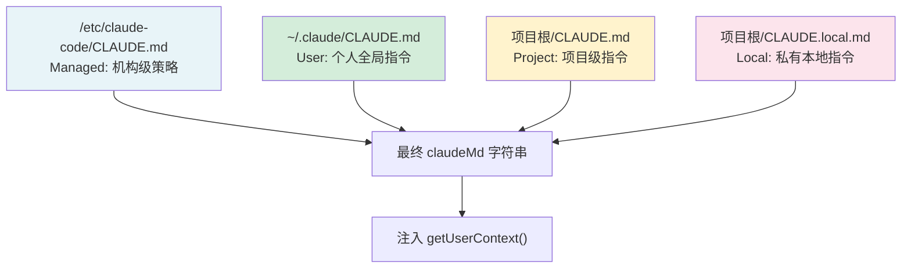
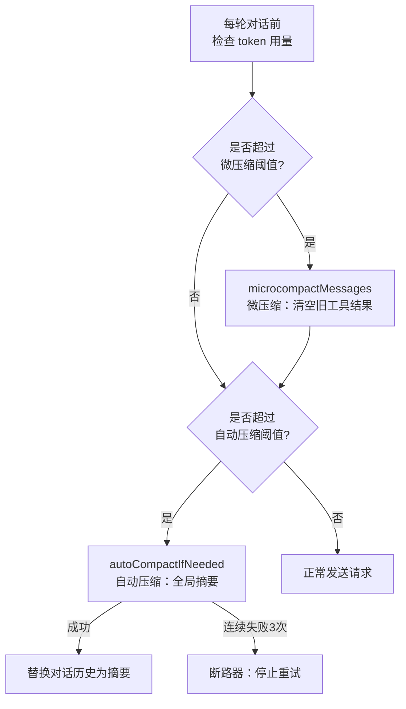
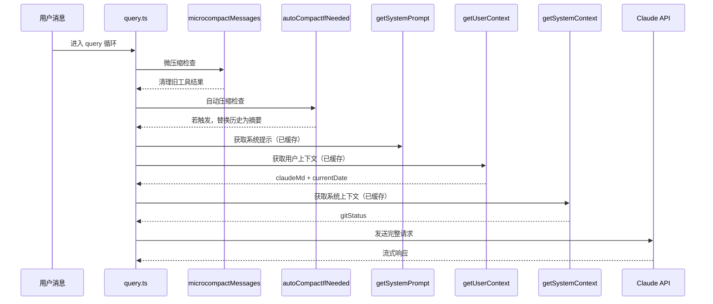

# 第14章 上下文构建与系统提示
源地址：https://github.com/zhu1090093659/claude-code
## 本章导读

每次你向 Claude Code 发出一条消息，模型收到的远不只是你打出的那行文字。它前面还有一段精心组装的"舞台布景"：系统提示（System Prompt）、当前目录与 Git 状态、各层级 CLAUDE.md 的内容、记忆文件的索引、以及对话历史在上下文窗口快满时被压缩后留下的摘要。本章带你深入这套组装流水线，看清每一块砖从哪里来、为什么要放在这里。

学完本章，你将能够：

1. 理解 `getUserContext()` 和 `getSystemContext()` 各自承担什么职责，以及为什么它们被设计为带 memoize 缓存的异步函数
2. 掌握 CLAUDE.md 文件的完整加载层级——从系统级 Managed 到用户级 User，再到项目级 Project 和本地私有 Local——以及文件如何通过 `@include` 指令互相引用
3. 逐段解读 `getSystemPrompt()` 的组装逻辑：哪些段落属于静态内容可被提示词缓存（Prompt Cache）共享，哪些段落必须放在动态边界之后
4. 了解 memdir 持久记忆系统（Auto Memory）如何将跨会话的用户偏好和项目背景注入上下文
5. 掌握上下文窗口的三种压缩策略：自动压缩（Auto Compact）、微压缩（Micro Compact）和时间触发压缩（Time-Based Micro Compact）——理解每种策略触发的条件与取舍

---

## 14.1 上下文变量的组装：getUserContext 与 getSystemContext

在每轮对话开始前，Claude Code 会收集两组上下文变量，分别由 `getUserContext()` 和 `getSystemContext()` 负责生成。二者定义在 `context.ts` 中，都使用 `lodash-es/memoize` 包裹以确保同一次会话内只计算一次。

### 14.1.1 getSystemContext：Git 快照

`getSystemContext` 负责收集与当前仓库状态相关的信息，核心是 Git 状态快照。

```typescript
// context.ts:116-150
export const getSystemContext = memoize(
  async (): Promise<{
    [k: string]: string
  }> => {
    // Skip git status in CCR (unnecessary overhead on resume) or when git instructions are disabled
    const gitStatus =
      isEnvTruthy(process.env.CLAUDE_CODE_REMOTE) ||
      !shouldIncludeGitInstructions()
        ? null
        : await getGitStatus()

    return {
      ...(gitStatus && { gitStatus }),
      ...(feature('BREAK_CACHE_COMMAND') && injection
        ? { cacheBreaker: `[CACHE_BREAKER: ${injection}]` }
        : {}),
    }
  },
)
```

`getGitStatus()` 则并发执行五个 Git 命令：

```typescript
// context.ts:61-77
const [branch, mainBranch, status, log, userName] = await Promise.all([
  getBranch(),
  getDefaultBranch(),
  execFileNoThrow(gitExe(), ['--no-optional-locks', 'status', '--short'], ...),
  execFileNoThrow(gitExe(), ['--no-optional-locks', 'log', '--oneline', '-n', '5'], ...),
  execFileNoThrow(gitExe(), ['config', 'user.name'], ...),
])
```

这五项信息拼接成一段描述性文本注入上下文，让模型在会话开始时就知道"现在在哪个分支、主分支叫什么、当前有哪些变更、最近五条提交是什么"。值得注意的是，`git status` 的输出有 2000 字符的截断上限（`MAX_STATUS_CHARS = 2000`），超出部分会附上提示，建议用 BashTool 运行 `git status` 获取完整信息。

设计上有两处值得关注的取舍：其一，Git 快照是"会话开始时的快照"，在对话进行中不会刷新，注释原文写道 "Note that this status is a snapshot in time, and will not update during the conversation"；其二，在远程（CCR）模式或用户禁用 Git 指令时跳过获取，以减少不必要的 I/O 开销。

### 14.1.2 getUserContext：CLAUDE.md 与当前日期

`getUserContext` 负责加载各层级 CLAUDE.md 文件，并附上今日日期：

```typescript
// context.ts:155-188
export const getUserContext = memoize(
  async (): Promise<{
    [k: string]: string
  }> => {
    const shouldDisableClaudeMd =
      isEnvTruthy(process.env.CLAUDE_CODE_DISABLE_CLAUDE_MDS) ||
      (isBareMode() && getAdditionalDirectoriesForClaudeMd().length === 0)

    const claudeMd = shouldDisableClaudeMd
      ? null
      : getClaudeMds(filterInjectedMemoryFiles(await getMemoryFiles()))

    setCachedClaudeMdContent(claudeMd || null)

    return {
      ...(claudeMd && { claudeMd }),
      currentDate: `Today's date is ${getLocalISODate()}.`,
    }
  },
)
```

`--bare` 模式（即 `CLAUDE_CODE_SIMPLE`）下不会自动扫描 CLAUDE.md，但如果用户通过 `--add-dir` 显式指定了额外目录，仍然会加载。这体现了 Claude Code 的一个设计原则：`--bare` 意味着"跳过我没有要求的内容"，而不是"忽略我明确要求的内容"。

注释还揭示了一个循环依赖的解决方案：`setCachedClaudeMdContent` 将结果缓存，供 `yoloClassifier.ts`（自动许可模式分类器）读取，而如果直接让后者导入 `claudemd.ts`，就会形成 `permissions/filesystem → permissions → yoloClassifier` 的循环引用。

---

## 14.2 CLAUDE.md 的层级加载机制

CLAUDE.md 的加载逻辑集中在 `utils/claudemd.ts`，这是 Claude Code 最复杂的文件之一，接近 1500 行。理解它的组织方式，是理解"指令从哪里来、优先级怎么排"的关键。

### 14.2.1 五层优先级体系

文件顶部的注释给出了最清晰的说明：

```
// utils/claudemd.ts:1-26
/**
 * Files are loaded in the following order:
 *
 * 1. Managed memory (/etc/claude-code/CLAUDE.md) - Global instructions for all users
 * 2. User memory (~/.claude/CLAUDE.md) - Private global instructions for all projects
 * 3. Project memory (CLAUDE.md, .claude/CLAUDE.md, and .claude/rules/*.md) - Instructions checked into the codebase
 * 4. Local memory (CLAUDE.local.md in project roots) - Private project-specific instructions
 *
 * Files are loaded in reverse order of priority, i.e. the latest files are highest priority
 */
```

加载顺序是从低优先级到高优先级——先 Managed，后 User，再 Project，最后 Local。因为它们最终会被拼接成一段文本，放在后面的内容自然让模型"更近"，优先级也就更高。



Project 类型还有两个变体：`CLAUDE.md` 直接放在项目根，以及 `.claude/CLAUDE.md`（隐藏目录下）；此外 `.claude/rules/*.md` 目录下的所有 `.md` 文件也会被扫描，用于按文件类型加载条件规则（通过前置 frontmatter 中的 `paths` 字段控制）。

### 14.2.2 目录遍历：从 CWD 向上走到根

`getMemoryFiles()` 的核心逻辑是从当前工作目录出发，一路向上遍历到文件系统根：

```typescript
// utils/claudemd.ts:850-934
let currentDir = originalCwd
while (currentDir !== parse(currentDir).root) {
  dirs.push(currentDir)
  currentDir = dirname(currentDir)
}

// Process from root downward to CWD
for (const dir of dirs.reverse()) {
  const projectPath = join(dir, 'CLAUDE.md')
  result.push(...(await processMemoryFile(projectPath, 'Project', ...)))
  const dotClaudePath = join(dir, '.claude', 'CLAUDE.md')
  result.push(...(await processMemoryFile(dotClaudePath, 'Project', ...)))
  // ...
}
```

收集路径时是从 CWD 向上（`dirs.push`），但处理时反转（`dirs.reverse()`），所以是从根目录向 CWD 方向处理。这意味着越靠近 CWD 的 CLAUDE.md 越晚被加载，也就越靠近最终文本的末尾，模型的注意力权重更高。

### 14.2.3 @include 指令：文件之间的跨引用

CLAUDE.md 支持用 `@path` 语法引用其他文件：

```markdown
<!-- 在 CLAUDE.md 中引用外部规则 -->
@./rules/typescript-guidelines.md
@~/shared-team-guidelines.md
```

`extractIncludePathsFromTokens` 函数用 `marked` 库对 Markdown 进行词法分析（lex），在文本节点中搜索符合 `@(路径)` 格式的引用，跳过代码块，最多递归 5 层（`MAX_INCLUDE_DEPTH = 5`）。被引用的文件以调用者为父节点，在 `processedPaths` 集合中去重，避免循环引用。

路径解析规则：`@path`（无前缀）等同于 `@./path`（相对路径）；`@~/...` 展开为家目录；`@/...` 为绝对路径。外部路径（超出项目 CWD 的文件）默认被忽略，需要用户在项目配置中明确批准。

### 14.2.4 内容处理管道

读取文件后，`parseMemoryFileContent` 对原始内容执行三项处理：

1. **解析 frontmatter**：剥离 `---` 包裹的 YAML 头，提取 `paths` 字段作为条件规则的 glob 模式
2. **剥离 HTML 注释**：用 `stripHtmlComments` 移除 `<!-- ... -->` 块，让作者可以在 CLAUDE.md 中加注释而不污染上下文
3. **截断 MEMORY.md 入口**：AutoMem 和 TeamMem 类型的文件有 200 行 / 25000 字节双重上限，超出时追加警告

最终，`getClaudeMds` 把所有文件拼接成一段带元数据的字符串，格式为：

```
Contents of /path/to/CLAUDE.md (project instructions, checked into the codebase):

[文件内容]

Contents of ~/.claude/CLAUDE.md (user's private global instructions for all projects):

[文件内容]
```

整段文本前缀为固定引导语：`"Codebase and user instructions are shown below. Be sure to adhere to these instructions. IMPORTANT: These instructions OVERRIDE any default behavior and you MUST follow them exactly as written."`

---

## 14.3 getSystemPrompt 的组装：从静态到动态

系统提示的完整组装逻辑位于 `constants/prompts.ts`，核心函数是 `getSystemPrompt`。它接收工具列表、模型名称和可选的 MCP 客户端配置，异步返回一个字符串数组，每个元素是提示词的一个"块"（block）。

### 14.3.1 整体结构：静态区与动态区

```typescript
// constants/prompts.ts:560-576
return [
  // --- Static content (cacheable) ---
  getSimpleIntroSection(outputStyleConfig),
  getSimpleSystemSection(),
  getSimpleDoingTasksSection(),
  getActionsSection(),
  getUsingYourToolsSection(enabledTools),
  getSimpleToneAndStyleSection(),
  getOutputEfficiencySection(),
  // === BOUNDARY MARKER ===
  ...(shouldUseGlobalCacheScope() ? [SYSTEM_PROMPT_DYNAMIC_BOUNDARY] : []),
  // --- Dynamic content (registry-managed) ---
  ...resolvedDynamicSections,
].filter(s => s !== null)
```

`SYSTEM_PROMPT_DYNAMIC_BOUNDARY` 是一个特殊的分隔符字符串（`'__SYSTEM_PROMPT_DYNAMIC_BOUNDARY__'`），它告诉下游的 API 层（`src/utils/api.ts` 中的 `splitSysPromptPrefix`）：前面的块可以用 `scope: 'global'` 跨用户共享 Prompt Cache，后面的块包含用户特定内容，不能缓存共享。

这个设计非常精妙。Anthropic 的 Prompt Cache（提示词缓存）以前缀匹配为粒度——只要前缀字节序列相同，API 就能命中缓存。把变化频率低的静态行为指令放在前面，把每次会话都不同的上下文（Git 状态、CLAUDE.md 内容、当前日期）放在后面，可以最大化缓存命中率，降低 token 计费成本。

代码注释对此有明确警告：`WARNING: Do not remove or reorder this marker without updating cache logic in: src/utils/api.ts (splitSysPromptPrefix) and src/services/api/claude.ts (buildSystemPromptBlocks)`。

### 14.3.2 静态区内容：各个功能段

静态区包含七个功能段，依次是：

**介绍段（getSimpleIntroSection）**：声明 Claude 的角色定位，包含防 URL 生成的安全提示，以及防止网络钓鱼的 `CYBER_RISK_INSTRUCTION`。

**系统段（getSimpleSystemSection）**：描述工具的运作机制（许可模式）、`<system-reminder>` 标签的语义，以及自动压缩机制——"The system will automatically compress prior messages in your conversation as it approaches context limits."

**任务执行段（getSimpleDoingTasksSection）**：这是最长的一段，包含反过度设计规则（不要添加没被要求的功能、不要添加无法发生场景的错误处理）、代码风格建议，以及在 `USER_TYPE === 'ant'`（内部 Anthropic 员工构建）时才出现的额外指导（如关于注释的详细规则、关于真实报告测试结果的要求）。

**操作谨慎段（getActionsSection）**：详细描述什么操作需要确认，包括不可逆操作（删除文件、强制推送）、影响共享系统的操作（推送代码、创建 PR）和上传到第三方服务。注意这里明确说明"用户批准一次不代表批准所有上下文"。

**工具使用段（getUsingYourToolsSection）**：指导模型优先使用专用工具（Read、Edit、Glob、Grep）而非 Bash，以及何时并行调用工具。REPL 模式下此段内容会精简。

**语气风格段（getSimpleToneAndStyleSection）**：禁止未被要求时使用 emoji、要求以 `file_path:line_number` 格式引用代码位置、以及冒号后不直接接工具调用等细节规则。

**输出效率段（getOutputEfficiencySection）**：内部构建与外部构建的内容差异明显。外部版本只要求简洁直接；内部版本是一大段关于如何向用户沟通的详细规范，包括"倒金字塔结构"（先说结论）、"避免语义回溯"等写作指导原则。

### 14.3.3 动态区：systemPromptSection 注册表

动态区通过一套 section 注册表机制管理，每个动态段都用 `systemPromptSection(name, factory)` 声明：

```typescript
// constants/prompts.ts:491-555
const dynamicSections = [
  systemPromptSection('session_guidance', () =>
    getSessionSpecificGuidanceSection(enabledTools, skillToolCommands),
  ),
  systemPromptSection('memory', () => loadMemoryPrompt()),
  systemPromptSection('env_info_simple', () =>
    computeSimpleEnvInfo(model, additionalWorkingDirectories),
  ),
  systemPromptSection('language', () =>
    getLanguageSection(settings.language),
  ),
  // ...
]
```

`systemPromptSection` 的核心价值是跨轮次缓存：一旦某个段的工厂函数在本次会话中已被计算，下次调用时直接返回缓存结果，不重新执行。这对 `loadMemoryPrompt()` 等涉及文件 I/O 的段尤为重要。

有一个特殊的 `DANGEROUS_uncachedSystemPromptSection`，用于 MCP 指令段：

```typescript
DANGEROUS_uncachedSystemPromptSection(
  'mcp_instructions',
  () => isMcpInstructionsDeltaEnabled()
    ? null
    : getMcpInstructionsSection(mcpClients),
  'MCP servers connect/disconnect between turns',
),
```

加 `DANGEROUS_` 前缀是因为不缓存会导致每轮都重新计算，破坏 Prompt Cache，但 MCP 服务器可能在会话中间连接或断开，不得不每次检查。

### 14.3.4 环境信息段：computeSimpleEnvInfo

`computeSimpleEnvInfo` 生成的环境信息段是你在每次对话中都能看到的：

```
# Environment
You have been invoked in the following environment:
 - Primary working directory: /path/to/project
 - Is a git repository: Yes
 - Platform: darwin
 - Shell: zsh
 - OS Version: Darwin 24.3.0
 - You are powered by the model named Claude Sonnet 4.6...
 - Assistant knowledge cutoff is August 2025.
```

模型的知识截止日期（knowledge cutoff）是通过 `getKnowledgeCutoff(modelId)` 按 canonical model ID 查表得到的，每次发布新模型时需要更新（代码中有 `// @[MODEL LAUNCH]: Add a knowledge cutoff date for the new model.` 标注）。

---

## 14.4 持久记忆：memdir 系统

Auto Memory（自动记忆）是 Claude Code 实现跨会话持久化的核心机制，相关代码集中在 `memdir/` 目录。

### 14.4.1 存储路径的解析层级

记忆文件的存储位置由 `getAutoMemPath()` 决定，其解析优先级如下：

```typescript
// memdir/paths.ts:223-235
export const getAutoMemPath = memoize(
  (): string => {
    const override = getAutoMemPathOverride() ?? getAutoMemPathSetting()
    if (override) {
      return override
    }
    const projectsDir = join(getMemoryBaseDir(), 'projects')
    return join(projectsDir, sanitizePath(getAutoMemBase()), AUTO_MEM_DIRNAME) + sep
  },
  () => getProjectRoot(),
)
```

默认路径格式为 `~/.claude/projects/<sanitized-git-root>/memory/`，其中 git 根目录经过路径净化（替换特殊字符为连字符）。这里有个细节：`getAutoMemBase()` 优先使用 `findCanonicalGitRoot()`，目的是让同一仓库的所有 worktree 共享同一个记忆目录（代码注释引用了 issue #24382）。

### 14.4.2 MEMORY.md：记忆索引文件

每个项目的记忆系统以 `MEMORY.md` 作为入口文件（index），限制为 200 行 / 25000 字节。`buildMemoryLines()` 生成的指令告诉模型如何维护这套系统：

- 每条记忆保存为独立文件（如 `user_role.md`, `feedback_testing.md`），使用固定的 frontmatter 格式（包含 name、description、type 字段）
- `MEMORY.md` 只是索引，每行一条指针格式为 `- [Title](file.md) — 一行摘要`
- 按语义（topic）而非时间（chronological）组织记忆
- 记忆类型（type）限制在四个分类：`user`（用户偏好）、`feedback`（行为反馈）、`project`（项目背景）、`reference`（参考信息）

明确禁止存入记忆的内容是："可以从当前项目代码派生出来的内容"（代码模式、架构、Git 历史）——这些从代码本身读取就够了，不应该重复存入记忆系统。

### 14.4.3 loadMemoryPrompt 的分发逻辑

`loadMemoryPrompt()` 是 `getSystemPrompt` 中 `memory` 段的工厂函数，它根据功能开关决定使用哪种记忆范式：

```typescript
// memdir/memdir.ts:419-507
export async function loadMemoryPrompt(): Promise<string | null> {
  const autoEnabled = isAutoMemoryEnabled()

  // KAIROS 日志模式：追加到日期命名的日志文件
  if (feature('KAIROS') && autoEnabled && getKairosActive()) {
    return buildAssistantDailyLogPrompt(skipIndex)
  }

  // TEAMMEM 模式：同时加载个人和团队记忆
  if (feature('TEAMMEM')) {
    if (teamMemPaths!.isTeamMemoryEnabled()) {
      return teamMemPrompts!.buildCombinedMemoryPrompt(...)
    }
  }

  // 默认：个人 auto memory
  if (autoEnabled) {
    return buildMemoryLines('auto memory', autoDir, ...).join('\n')
  }

  return null
}
```

注意此函数在 `systemPromptSection` 缓存下只会在每次会话启动时执行一次，因此它不会在运行中动态反映记忆文件的变化——这是有意为之的，避免系统提示在对话中途突然改变破坏 Prompt Cache。

---

## 14.5 上下文窗口管理：三种压缩策略

当对话历史越积越长，终将触及模型的上下文窗口上限。Claude Code 实现了三种不同粒度的压缩机制，从精细到粗暴依次应对不同场景。



### 14.5.1 自动压缩（Auto Compact）

自动压缩是最彻底的方式，将整段对话历史提炼为结构化摘要，再用摘要替换原始消息，把 token 占用从几十万压到几千。

**触发阈值**的计算逻辑在 `autoCompact.ts`：

```typescript
// services/compact/autoCompact.ts:33-49
export function getEffectiveContextWindowSize(model: string): number {
  const reservedTokensForSummary = Math.min(
    getMaxOutputTokensForModel(model),
    MAX_OUTPUT_TOKENS_FOR_SUMMARY,  // 20,000
  )
  let contextWindow = getContextWindowForModel(model, getSdkBetas())
  return contextWindow - reservedTokensForSummary
}

export const AUTOCOMPACT_BUFFER_TOKENS = 13_000

export function getAutoCompactThreshold(model: string): number {
  const effectiveContextWindow = getEffectiveContextWindowSize(model)
  return effectiveContextWindow - AUTOCOMPACT_BUFFER_TOKENS
}
```

有效上下文窗口 = 模型最大上下文 - 为摘要输出预留的空间（20000 tokens）。自动压缩触发线 = 有效窗口 - 13000 tokens 缓冲。这个设计留出了充足的余量，确保压缩过程本身有足够空间完成。

**断路器（Circuit Breaker）**防止在无法恢复的情况下反复尝试：

```typescript
// services/compact/autoCompact.ts:68-71
const MAX_CONSECUTIVE_AUTOCOMPACT_FAILURES = 3

if (tracking?.consecutiveFailures >= MAX_CONSECUTIVE_AUTOCOMPACT_FAILURES) {
  return { wasCompacted: false }
}
```

注释中引用了真实数据："1,279 sessions had 50+ consecutive failures (up to 3,272) in a single session, wasting ~250K API calls/day globally"，说明这不是假想的问题，而是用生产数据支撑的必要保护。

**压缩摘要的结构**由 `getCompactPrompt()` 定义，要求模型生成一个包含九个部分的结构化摘要：主要请求与意图、技术概念、文件与代码片段、错误与修复、问题解决、所有用户消息、待办任务、当前工作，以及可选的下一步。

压缩完成后，`compactConversation` 还会执行一系列后处理：重新注入最近读取的文件（`createPostCompactFileAttachments`，最多 5 个，总预算 50000 tokens）、重新注入调用过的 skill（`createSkillAttachmentIfNeeded`）、重新注入计划文件（`createPlanAttachmentIfNeeded`），以及触发 pre/post compact 钩子。

### 14.5.2 微压缩（Micro Compact）

微压缩是更精细的策略，不重写整段历史，而是只清除已经不再需要的工具调用结果的内容，保留工具调用记录本身（让模型知道"这件事做过了"）但把详细输出替换为占位符，从而节省 token 而不损失任务上下文。

`microcompact.ts` 中定义了哪些工具的结果可以被压缩：

```typescript
// services/compact/microCompact.ts:41-50
const COMPACTABLE_TOOLS = new Set<string>([
  FILE_READ_TOOL_NAME,
  ...SHELL_TOOL_NAMES,
  GREP_TOOL_NAME,
  GLOB_TOOL_NAME,
  WEB_SEARCH_TOOL_NAME,
  WEB_FETCH_TOOL_NAME,
  FILE_EDIT_TOOL_NAME,
  FILE_WRITE_TOOL_NAME,
])
```

这些都是结果体积大但事后价值低的工具——读文件结果在文件内容不变时可以重新获取；Shell 命令输出通常只需要结论而不需要完整日志。

**Cached Micro Compact**（功能开关 `CACHED_MICROCOMPACT`）是微压缩的升级版，它不直接修改消息内容，而是通过 Anthropic API 的 `cache_edits` 机制在服务端删除缓存中的工具结果，这样本地消息列表不变，但发送给 API 的实际内容经过了精简，同时还能保持已有的 Prompt Cache 命中。这是通过 `pendingCacheEdits` 队列和 `pinCacheEdits` 机制实现的，在 API 请求发出前将清理指令附加到请求参数中。

### 14.5.3 时间触发微压缩（Time-Based Micro Compact）

当用户离开一段时间再回来时，服务端的 Prompt Cache 已经超过 5 分钟失效了——此时即使发送完整的消息历史，也不会命中缓存。既然缓存已冷，不如顺势把旧的工具结果清掉，减少实际发送的 token 数量：

```typescript
// services/compact/microCompact.ts:422-444
export function evaluateTimeBasedTrigger(
  messages: Message[],
  querySource: QuerySource | undefined,
): { gapMinutes: number; config: TimeBasedMCConfig } | null {
  const config = getTimeBasedMCConfig()
  if (!config.enabled || !querySource || !isMainThreadSource(querySource)) {
    return null
  }
  const lastAssistant = messages.findLast(m => m.type === 'assistant')
  const gapMinutes =
    (Date.now() - new Date(lastAssistant.timestamp).getTime()) / 60_000
  if (gapMinutes < config.gapThresholdMinutes) {
    return null
  }
  return { gapMinutes, config }
}
```

触发后，它会保留最近 N 个工具结果（`keepRecent`，防止清空过多导致模型失去当前工作上下文），清空其余的：

```typescript
const keepSet = new Set(compactableIds.slice(-keepRecent))
const clearSet = new Set(compactableIds.filter(id => !keepSet.has(id)))
// 把 clearSet 中的工具结果内容替换为 '[Old tool result content cleared]'
```

这种策略与 Cached Micro Compact 互斥：时间触发意味着缓存已冷，不需要也不应该用 cache_edits（那是为保留热缓存设计的）。

---

## 14.6 整体流水线：从用户消息到 API 请求

了解了各个组件后，让我们把整个上下文构建流水线串起来。



三个缓存层（`getSystemPrompt`、`getUserContext`、`getSystemContext`）都使用 `memoize`，在同一次会话中只计算一次。这与压缩后缓存失效的机制形成了补充：压缩发生时，`resetGetMemoryFilesCache` 会清除 CLAUDE.md 的缓存，让下一次获取能读取到最新的文件状态（虽然通常内容相同），同时也让 `InstructionsLoaded` 钩子以 `'compact'` 而非 `'session_start'` 为原因触发。

---

## 本章小结

Claude Code 的上下文构建是一项精心设计的工程，在每次用户发消息前悄悄完成。它的几个核心设计原则贯穿始终：

**缓存优先**：静态内容放在系统提示的前半段，动态内容放在边界之后，最大化 Prompt Cache 的命中率，直接降低 API 成本。三个上下文函数（`getUserContext`、`getSystemContext`、`getSystemPrompt` 的各段）都用 memoize 避免重复计算。

**层级覆盖**：CLAUDE.md 的五层加载（Managed→User→Project→Local）给了不同角色控制 AI 行为的权限，越靠近用户/项目的指令优先级越高，越靠近系统的指令提供基础约束。

**渐进压缩**：上下文窗口快满时，微压缩清除低价值工具结果；更满时，自动压缩将整段历史提炼为摘要；在用户离开后回来时，时间触发微压缩利用缓存已冷的窗口机会顺势清理。三种策略形成梯度防御。

**持久记忆**：Auto Memory 系统把用户偏好、项目背景等跨会话知识保存到本地文件，通过 MEMORY.md 索引注入每次对话，让 Claude Code 能记住你是谁、你喜欢怎么工作。

理解了这套机制，你在编写 CLAUDE.md、配置 Auto Memory、或遭遇"context limit"时，都会有更清晰的判断依据——知道哪里能优化，哪里是设计约束。

参见第5章的 query 循环，了解上下文在每轮 `runQuery` 调用中如何被实际使用；参见第7章了解许可模式如何影响工具段的内容。
