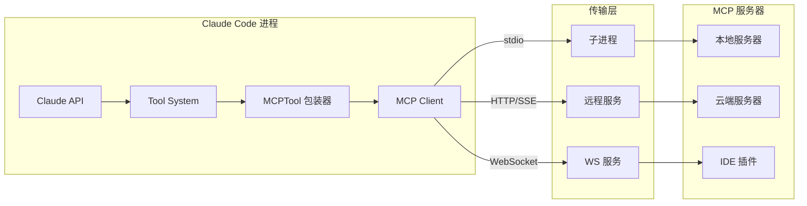
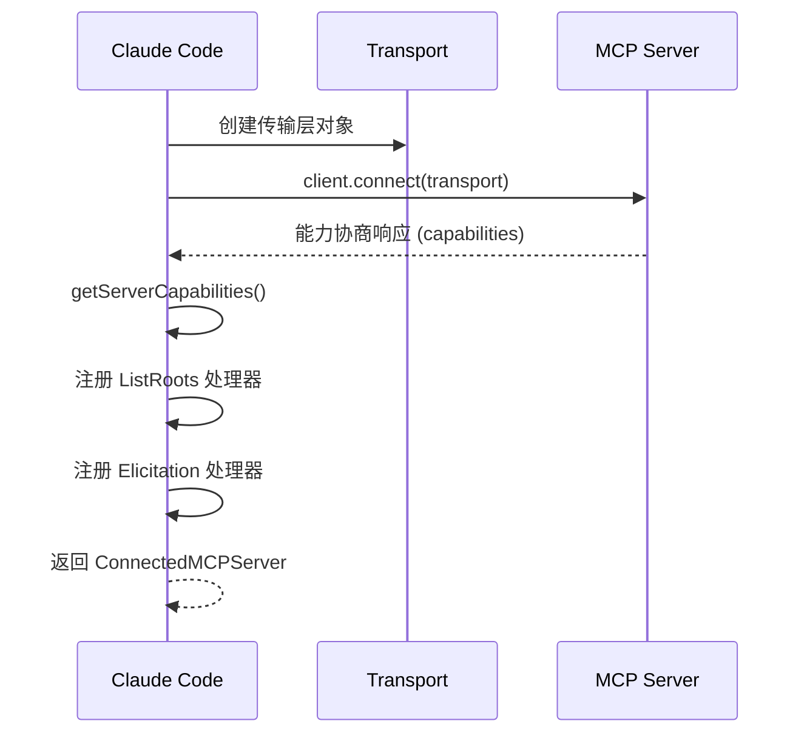
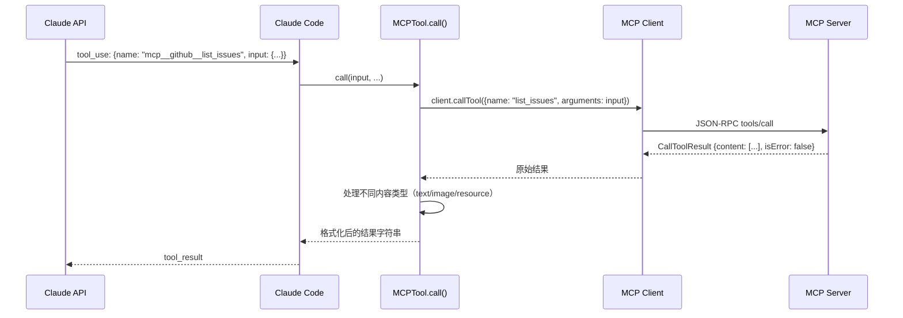

# 第15章 MCP协议集成
源地址：https://github.com/zhu1090093659/claude-code
## 本章导读

本章深入解析 Claude Code 如何通过模型上下文协议（Model Context Protocol，MCP）与外部工具服务器协作。阅读完本章，你将能够：

1. 理解 MCP 解决了什么问题，以及它与直接内置工具的根本区别
2. 掌握 MCP 服务器的配置体系：本地、用户、项目、企业四个作用域的优先级规则
3. 了解五种传输层类型（stdio、SSE、HTTP Streamable、WebSocket、SDK）及其适用场景
4. 理解 `connectToServer` 函数如何建立连接、协商能力、注册心跳检测
5. 深入 `MCPTool` 包装器的设计：MCP 工具如何变成 Claude Code 工具系统中的一等公民
6. 掌握 `mcp__serverName__toolName` 命名约定及其在权限检查中的作用
7. 了解 OAuth 认证流程，以及 needs-auth 缓存如何避免重复认证检测
8. 理解 MCP 资源（Resources）与工具（Tools）的区别，以及资源 URI 方案

---

## 15.1 MCP 是什么，为什么需要它

在构建 AI 编码助手时，有一个根本性的张力：Claude 需要访问种类繁多的外部能力——查询数据库、调用 REST API、操作 Git 仓库、读写 Slack 消息……但把所有这些逻辑都硬编码进 Claude Code 本身，既不现实也不可持续。

MCP 的核心思路是：**把能力的实现者（服务器）与能力的消费者（客户端，即 Claude Code）分离开**，用一套标准化协议连接二者。服务器可以由任何人以任何语言编写，只要遵守协议约定，Claude Code 就能发现并使用它暴露的工具、资源和提示词模板。

协议本身基于 JSON-RPC 2.0，定义了三类核心原语：

- **工具（Tools）**：可被调用的函数，有结构化的输入 schema 和结构化的输出
- **资源（Resources）**：可读取的数据，通过 URI 标识，类似文件系统
- **提示词模板（Prompts）**：预定义的提示词片段，供 Claude 在特定场景下复用

从架构上看，Claude Code 扮演 MCP 客户端的角色：



"为什么不直接内置工具？"这是个好问题。内置工具（如 `BashTool`、`ReadTool`）在编译期确定，调用路径短、权限模型简单。MCP 工具则是运行时发现的——用户可以在配置文件里增删服务器，Claude Code 无需重新编译就能获得新能力。这种动态扩展性是 MCP 的核心价值所在。

---

## 15.2 配置体系：谁的服务器

### 15.2.1 四个作用域

Claude Code 从四个来源加载 MCP 服务器配置，代码位于 `.src/services/mcp/config.ts`。优先级从低到高：

| 作用域 | 存储位置 | 说明 |
|--------|----------|------|
| plugin | 插件系统 | 插件携带的服务器，最低优先级 |
| user | `~/.claude.json` 中的 `mcpServers` | 用户全局配置 |
| project | `.mcp.json`（从 CWD 向上查找） | 项目级配置，可提交到版本库 |
| local | 项目本地配置 | 不提交到版本库的本地配置 |
| enterprise | 企业管理的 `managed-mcp.json` | 优先级最高，若存在则独占控制权 |

合并逻辑直接体现在 `getClaudeCodeMcpConfigs` 函数的最后几行：

```typescript
// Merge in order of precedence: plugin < user < project < local
const configs = Object.assign(
  {},
  dedupedPluginServers,
  userServers,
  approvedProjectServers,
  localServers,
)
```

后合并的覆盖先合并的，同名服务器以 local 为准。

企业模式有独特行为：一旦检测到 `managed-mcp.json` 文件存在（`doesEnterpriseMcpConfigExist()` 用 `memoize` 缓存这个结果避免重复 I/O），其他所有作用域直接被忽略。

### 15.2.2 配置格式

`.mcp.json` 的典型结构：

```json
{
  "mcpServers": {
    "github": {
      "type": "stdio",
      "command": "npx",
      "args": ["-y", "@modelcontextprotocol/server-github"],
      "env": {
        "GITHUB_PERSONAL_ACCESS_TOKEN": "${GITHUB_TOKEN}"
      }
    },
    "slack": {
      "type": "http",
      "url": "https://mcp.slack.com/api/v1",
      "headers": {
        "Authorization": "Bearer ${SLACK_BOT_TOKEN}"
      }
    },
    "filesystem": {
      "type": "sse",
      "url": "http://localhost:8080/sse"
    }
  }
}
```

注意 `${GITHUB_TOKEN}` 这种语法——配置加载时会调用 `expandEnvVarsInString` 展开环境变量。如果变量未设置，不会报错中止，而是记录为 `warning` 级别的校验错误，继续尝试连接。

类型系统用 Zod schema 精确描述每种服务器类型（位于 `.src/services/mcp/types.ts`）：

```typescript
// Five transport types for user configuration
export const TransportSchema = lazySchema(() =>
  z.enum(['stdio', 'sse', 'sse-ide', 'http', 'ws', 'sdk']),
)
```

其中 `sse-ide` 和 `ws-ide` 是内部专用类型，用于 IDE 插件（VS Code 扩展等），用户无法在配置文件中使用。`sdk` 类型是 SDK V2 的特殊通道，工具调用会路由回 SDK 而不是真正发起连接。

### 15.2.3 策略管控

企业可以通过 `allowedMcpServers` 和 `deniedMcpServers` 配置白名单和黑名单，支持三种匹配方式：

- **按名称**：`{"serverName": "github"}`
- **按命令**：`{"serverCommand": ["npx", "-y", "@modelcontextprotocol/server-github"]}`
- **按 URL（支持通配符）**：`{"serverUrl": "https://*.slack.com/*"}`

黑名单优先于白名单，代码中体现为：

```typescript
function isMcpServerAllowedByPolicy(serverName, config) {
  // Denylist takes absolute precedence
  if (isMcpServerDenied(serverName, config)) {
    return false
  }
  // ... then check allowlist
}
```

---

## 15.3 传输层：如何与 MCP 服务器通信

### 15.3.1 stdio 传输

最常见的类型，Claude Code 把 MCP 服务器作为子进程启动，通过标准输入/输出交换 JSON-RPC 消息：

```typescript
// From connectToServer() in client.ts, lines ~944-958
transport = new StdioClientTransport({
  command: finalCommand,
  args: finalArgs,
  env: {
    ...subprocessEnv(),
    ...serverRef.env,
  } as Record<string, string>,
  stderr: 'pipe', // prevents error output from printing to the UI
})
```

注意 `stderr: 'pipe'`——子进程的错误输出被捕获到内存缓冲区（上限 64MB），在连接失败时作为诊断信息打印，不会直接污染用户界面。

进程退出时的清理策略采用"先礼后兵"三步法：SIGINT → SIGTERM → SIGKILL，每步之间等待一段时间让进程优雅退出。

### 15.3.2 SSE 传输

基于 HTTP 的持久连接，使用 Server-Sent Events 接收服务器推送。这里有个非常精妙的设计——SSE 连接本身是长期存在的流，不能加超时；但 OAuth 令牌刷新等 POST 请求需要超时保护。代码通过两套不同的 `fetch` 实现来处理：

```typescript
// For SSE transport in client.ts
transportOptions.eventSourceInit = {
  // Long-lived stream: NO timeout wrapper
  fetch: async (url, init) => {
    const tokens = await authProvider.tokens()
    if (tokens) {
      authHeaders.Authorization = `Bearer ${tokens.access_token}`
    }
    return fetch(url, { ...init, headers: { ...authHeaders } })
  },
}
// Regular API calls: WITH timeout wrapper (60s)
fetch: wrapFetchWithTimeout(
  wrapFetchWithStepUpDetection(createFetchWithInit(), authProvider),
),
```

### 15.3.3 HTTP Streamable 传输

MCP 2025-03-26 规范引入的新传输类型，每个请求是独立的 HTTP POST，响应可以是 JSON 也可以是 SSE 流。客户端必须在 `Accept` 头中同时声明两种格式：

```typescript
// Guaranteed by wrapFetchWithTimeout() in client.ts
const MCP_STREAMABLE_HTTP_ACCEPT = 'application/json, text/event-stream'
```

HTTP 传输还有一个会话管理机制——服务器通过 Session ID 跟踪状态，当 Session 过期时服务器返回 HTTP 404 加上 JSON-RPC 错误码 -32001。Claude Code 专门检测这个组合：

```typescript
export function isMcpSessionExpiredError(error: Error): boolean {
  const httpStatus = 'code' in error ? error.code : undefined
  if (httpStatus !== 404) return false
  return (
    error.message.includes('"code":-32001') ||
    error.message.includes('"code": -32001')
  )
}
```

检测到 Session 过期后，会关闭旧连接，下次工具调用时自动重建。

### 15.3.4 WebSocket 传输

同时支持 Bun 原生 WebSocket 和 Node.js `ws` 包，通过运行时检测选择：

```typescript
if (typeof Bun !== 'undefined') {
  wsClient = new globalThis.WebSocket(serverRef.url, {
    protocols: ['mcp'],
    headers: wsHeaders,
    // ...
  })
} else {
  wsClient = await createNodeWsClient(serverRef.url, { ... })
}
```

---

## 15.4 连接生命周期

### 15.4.1 建立连接

`connectToServer` 函数（约 300 行）是整个 MCP 子系统的核心，负责完整的连接建立流程：



连接超时由 `MCP_TIMEOUT` 环境变量控制，默认 30 秒。连接成功后，`ConnectedMCPServer` 对象会携带能力清单（capabilities）——这决定了服务器是否支持工具、资源、提示词模板，以及是否支持资源订阅推送。

### 15.4.2 连接断开检测与重连

MCP 传输层有一个设计上的不对称性：连接断开时，SDK 会调用 `onerror`，但不一定调用 `onclose`。如果只有 `onerror` 而没有 `onclose`，挂起中的工具调用请求会一直等待，永远不会失败。

Claude Code 用一个"终端错误计数器"来解决这个问题：

```typescript
// client.ts, around line 1228
let consecutiveConnectionErrors = 0
const MAX_ERRORS_BEFORE_RECONNECT = 3

client.onerror = (error) => {
  if (isTerminalConnectionError(error.message)) {
    consecutiveConnectionErrors++
    if (consecutiveConnectionErrors >= MAX_ERRORS_BEFORE_RECONNECT) {
      closeTransportAndRejectPending('consecutive terminal errors')
    }
  }
}
```

`closeTransportAndRejectPending` 调用 `client.close()`，SDK 的 close 链会拒绝所有挂起的 Promise，让上层的工具调用代码能够感知到失败并触发重连。

### 15.4.3 连接缓存

`connectToServer` 被 `memoize` 包裹，缓存键由服务器名称和配置的 JSON 序列化组成：

```typescript
export function getServerCacheKey(name, serverRef) {
  return `${name}-${jsonStringify(serverRef)}`
}

export const connectToServer = memoize(
  async (name, serverRef, serverStats) => { /* ... */ },
  getServerCacheKey,
)
```

这意味着配置不变时不会重复建立连接。当连接断开时，调用 `clearServerCache` 删除缓存条目，下次调用 `connectToServer` 会触发全新的连接尝试。

---

## 15.5 工具枚举与 MCPTool 包装器

### 15.5.1 从 MCP 工具到 Claude Code 工具

连接建立后，Claude Code 调用 `client.listTools()` 获取工具列表，然后为每个工具创建一个 `MCPTool` 的定制化副本。

`MCPTool`（位于 `.src/tools/MCPTool/MCPTool.ts`）是一个模板，其核心特点是使用 passthrough schema 接受任意输入：

```typescript
// MCPTool.ts
export const inputSchema = lazySchema(() => z.object({}).passthrough())
```

这意味着 MCP 工具的 JSON Schema 不在这里验证——验证发生在 MCP 服务器端，Claude Code 只是透传输入对象。

实际的工具定制发生在 `client.ts` 的 `getMCPTools` 函数中，大致逻辑是：

1. 调用 `client.listTools()` 获取原始工具列表
2. 对每个工具，用 `buildMcpToolName(serverName, tool.name)` 生成完整名称
3. 克隆 `MCPTool` 对象，覆盖 `name`、`description`、`call` 等属性
4. `call` 方法内部调用 `client.callTool()`，把结果转换为 Claude Code 格式

### 15.5.2 命名约定

MCP 工具的完整名称遵循 `mcp__serverName__toolName` 格式，由 `buildMcpToolName` 函数生成：

```typescript
// mcpStringUtils.ts
export function buildMcpToolName(serverName: string, toolName: string): string {
  return `${getMcpPrefix(serverName)}${normalizeNameForMCP(toolName)}`
}

export function getMcpPrefix(serverName: string): string {
  return `mcp__${normalizeNameForMCP(serverName)}__`
}
```

`normalizeNameForMCP` 把服务器名和工具名中所有不符合 `[a-zA-Z0-9_-]` 模式的字符替换为下划线。这样，一个名为 `github` 的服务器上的 `create-pull-request` 工具，最终名称变为 `mcp__github__create-pull-request`。

为什么需要这个前缀？有两个原因：

首先是权限隔离。Claude Code 的权限系统通过工具名称匹配规则，`mcp__github__` 前缀保证 MCP 工具与内置工具不会混淆。

其次是逆向解析。`mcpInfoFromString` 可以从完整名称中提取服务器名和工具名，用于权限检查：

```typescript
// mcpStringUtils.ts
export function mcpInfoFromString(toolString: string) {
  const parts = toolString.split('__')
  const [mcpPart, serverName, ...toolNameParts] = parts
  if (mcpPart !== 'mcp' || !serverName) return null
  const toolName = toolNameParts.length > 0 ? toolNameParts.join('__') : undefined
  return { serverName, toolName }
}
```

### 15.5.3 工具调用流程



结果处理是 MCP 集成中最复杂的部分之一，因为 MCP 工具结果可以包含多种内容块类型：

- `text`：文本内容，直接传递
- `image`：Base64 编码的图片，需要检查大小并可能降采样
- `resource`：对 MCP 资源的引用，需要嵌入资源内容或引用链接

---

## 15.6 权限检查与安全边界

### 15.6.1 allowlist 与 denylist

MCP 工具在进入 Claude 的工具列表之前，会经过 IDE 工具过滤（只允许特定的 IDE 工具）和用户授权检查。

在 `client.ts` 中有一个精确的过滤：

```typescript
// Only include specific tools for IDE MCP servers
const ALLOWED_IDE_TOOLS = ['mcp__ide__executeCode', 'mcp__ide__getDiagnostics']

function isIncludedMcpTool(tool: Tool): boolean {
  return (
    !tool.name.startsWith('mcp__ide__') || ALLOWED_IDE_TOOLS.includes(tool.name)
  )
}
```

这确保 IDE 服务器只暴露安全可控的工具子集，不会因为 IDE 插件扩展了内部工具而产生意外暴露。

### 15.6.2 权限检查的完整路径

当用户在配置里设置了 `allowedTools` 或 `deniedTools`，权限系统用 `getToolNameForPermissionCheck` 获取用于匹配的名称：

```typescript
// mcpStringUtils.ts
export function getToolNameForPermissionCheck(tool: {
  name: string
  mcpInfo?: { serverName: string; toolName: string }
}): string {
  return tool.mcpInfo
    ? buildMcpToolName(tool.mcpInfo.serverName, tool.mcpInfo.toolName)
    : tool.name
}
```

对于 MCP 工具，用的是完整的 `mcp__server__tool` 名称，而不是工具的展示名。这样设计是为了避免歧义：假如有一个 MCP 工具恰好也叫 `Write`，通过前缀区分可以确保针对内置 `Write` 工具的 deny 规则不会误伤 MCP 工具（反之亦然）。

---

## 15.7 OAuth 认证

### 15.7.1 认证流程

对于 `sse` 和 `http` 类型的远程 MCP 服务器，Claude Code 实现了完整的 OAuth 2.0 PKCE 认证流程，由 `ClaudeAuthProvider` 类负责（位于 `.src/services/mcp/auth.ts`）。

整个流程：

1. 首次连接时，如果服务器返回 401，`UnauthorizedError` 被捕获
2. 调用 `handleRemoteAuthFailure`，服务器状态变为 `needs-auth`
3. 在本地缓存中记录这个状态（TTL 15 分钟）
4. 用户界面提示需要认证，用户通过 `/mcp auth` 命令触发认证
5. 认证成功后，令牌存入系统钥匙串，服务器状态变回 `pending`（等待重连）

### 15.7.2 认证缓存

为了避免在批量连接多个服务器时重复读取认证缓存文件，Claude Code 用了一个带有"失效机制"的内存缓存：

```typescript
// client.ts around line 269
let authCachePromise: Promise<McpAuthCacheData> | null = null

function getMcpAuthCache(): Promise<McpAuthCacheData> {
  if (!authCachePromise) {
    authCachePromise = readFile(getMcpAuthCachePath(), 'utf-8')
      .then(data => jsonParse(data) as McpAuthCacheData)
      .catch(() => ({}))
  }
  return authCachePromise  // N concurrent callers share one read
}
```

写入时通过一个 Promise 链串行化，防止并发写入导致的 race condition：

```typescript
let writeChain = Promise.resolve()

function setMcpAuthCacheEntry(serverId) {
  writeChain = writeChain.then(async () => {
    // read-modify-write serialized
    const cache = await getMcpAuthCache()
    cache[serverId] = { timestamp: Date.now() }
    await writeFile(cachePath, jsonStringify(cache))
    authCachePromise = null  // invalidate read cache
  })
}
```

---

## 15.8 MCP 资源

### 15.8.1 资源与工具的区别

工具是"做某事"，资源是"读某物"。工具有副作用，资源理论上是只读的。从 API 角度，资源通过 URI 标识，而非名称；返回内容而非执行结果。

Claude Code 提供了两个对应工具：

- `ListMcpResourcesTool`：列举某个 MCP 服务器上的所有资源
- `ReadMcpResourceTool`：读取特定 URI 的资源内容

### 15.8.2 资源枚举

资源列举通过 `client.listResources()` 完成，返回的每个资源包含 URI、名称、描述和 MIME 类型。URI 的格式由 MCP 服务器定义，常见的有文件系统风格（`file:///path/to/file`）和自定义协议（`github://repo/issues/123`）。

```typescript
// types.ts
export type ServerResource = Resource & { server: string }
```

`ServerResource` 在标准 MCP `Resource` 类型基础上附加了 `server` 字段，记录资源来自哪个服务器，因为 Claude Code 可能同时管理多个 MCP 服务器的资源。

---

## 15.9 UI 层：MCPTool 的结果渲染

MCPTool 的 UI 组件（`.src/tools/MCPTool/UI.tsx`）在渲染 MCP 工具结果时有三级降级策略，从最优到最基础：

1. **解包主文本策略**：如果结果是形如 `{"messages": "line1\nline2..."}` 的 JSON，提取主文本字段，让 `OutputLine` 负责截断和换行显示
2. **扁平键值策略**：如果 JSON 是最多 12 个键的简单对象，渲染为对齐的 `key: value` 格式
3. **原始输出策略**：否则交给 `OutputLine` 做通用的输出处理

这个三级策略背后是真实观察到的 MCP 服务器行为——很多服务器（比如 Slack MCP）把所有文本内容包在一个 JSON 对象里，用转义的 `\n` 表示换行。如果直接显示 JSON，可读性极差；解包后才是正常的多行文本。

---

## 15.10 调试 MCP 连接

`MCP_DEBUG=true` 环境变量会激活详细日志输出，每条日志都带有服务器名前缀：

```
[MCP:github] SSE transport initialized, awaiting connection
[MCP:github] Successfully connected (transport: sse) in 342ms
[MCP:github] Connection established with capabilities: {"hasTools":true,"hasPrompts":false}
```

连接超时由 `MCP_TIMEOUT` 控制（毫秒，默认 30000），工具调用超时由 `MCP_TOOL_TIMEOUT` 控制（默认约 27.8 小时，即"实际上无限制"）。批量连接服务器时，本地服务器（stdio、sdk）最多同时建立 3 个连接，远程服务器最多 20 个并发，分别由 `MCP_SERVER_CONNECTION_BATCH_SIZE` 和 `MCP_REMOTE_SERVER_CONNECTION_BATCH_SIZE` 控制。

---

## 本章小结

MCP 集成是 Claude Code 可扩展性的核心机制，整个实现分为清晰的三层：

**配置层**（`services/mcp/config.ts`）负责从五个作用域收集、合并、过滤服务器配置，处理环境变量展开、策略管控和重复去除。

**连接层**（`services/mcp/client.ts`）负责根据传输类型建立实际连接，管理连接缓存、错误恢复、Session 过期重建和 OAuth 认证。它是系统中最复杂的单个文件，涵盖了所有运行时边界情况。

**工具层**（`tools/MCPTool/`）负责把 MCP 工具包装成 Claude Code 工具系统能理解的形式，处理命名规范、权限检查集成和结果渲染。

理解了这三层的分工，就理解了为什么 Claude Code 能够在启动时连接数十个不同的 MCP 服务器，为 Claude 提供动态扩展的工具生态，同时保持对权限和安全边界的严格控制。

本章与第6章（工具系统）紧密相关：MCP 工具最终通过 `MCPTool` 进入与 `BashTool`、`ReadTool` 完全相同的工具分发流水线，这正是工具系统统一抽象设计的体现。
