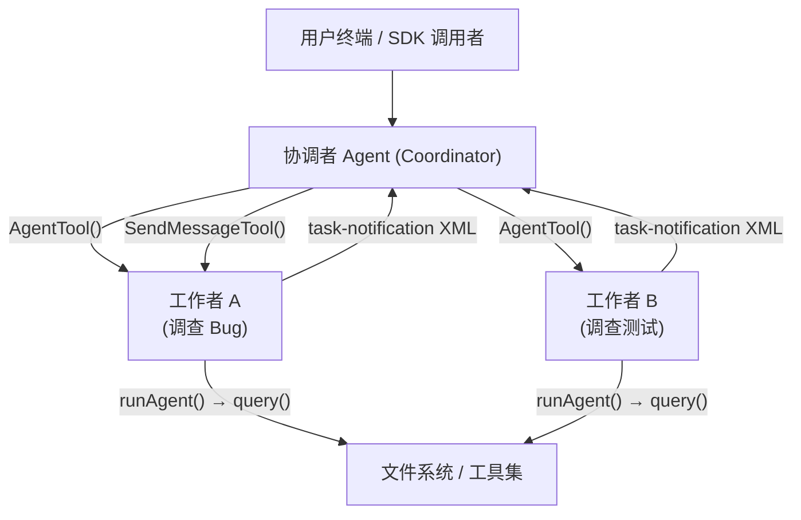
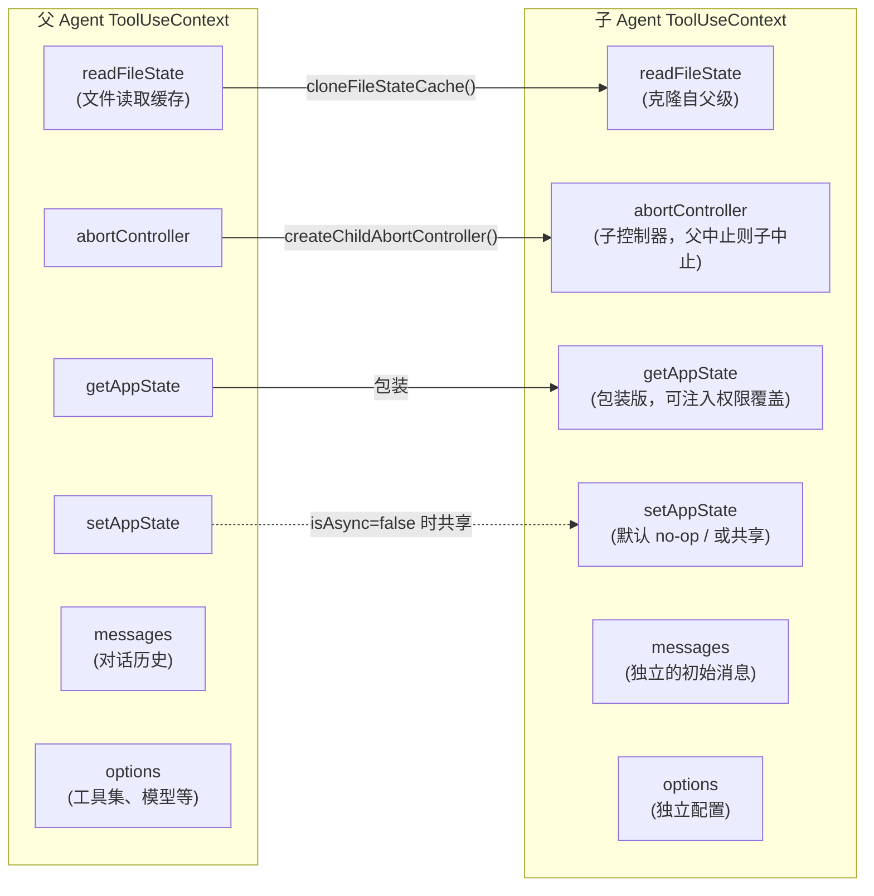
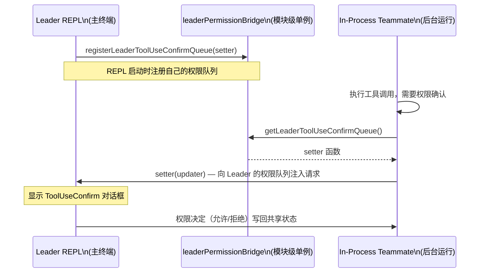

# 第16章 子Agent与多Agent协作
源地址：https://github.com/zhu1090093659/claude-code
## 本章导读

本章深入探讨 Claude Code 最强大也最复杂的能力：多 Agent 协作架构。当一个请求超出单个 Agent 能够高效处理的范围时，Claude Code 可以动态地派生子 Agent，将任务分解、并行推进。这不是简单的"调用另一个 AI"，而是一套精心设计的执行隔离、权限委托和结果聚合机制。

阅读本章，你将了解：

1. `AgentTool` 如何作为子 Agent 的入口，以及 `runAgent.ts` 的完整执行流程
2. 子 Agent 的上下文分叉机制：哪些状态被克隆，哪些被共享，背后的工程考量
3. Coordinator 模式与普通 REPL 模式的本质区别，以及协调者 (coordinator) 如何管理工作者 (worker) 群体
4. Swarm 架构的三种后端 (tmux、iTerm2、in-process)，各自的适用场景与选择逻辑
5. 七种任务类型的设计边界：从本地 Shell 到远程 Agent
6. Worker 向 Leader 请求权限的代理协议：in-process 伙伴如何复用主终端的权限对话框

---

## 16.1 从单 Agent 到多 Agent：为什么需要协作

Claude Code 的核心是第5章描述的 `query()` 循环：模型输出工具调用，工具执行后将结果返回，循环直到任务完成。这个模型在大多数场景下运转良好，但面对以下挑战时会遇到瓶颈：

**并行性瓶颈**：单个 Agent 是严格顺序执行的。如果任务的多个子步骤相互独立，让它们排队等待是一种浪费。

**上下文窗口压力**：一个大型代码库的调查任务可能需要读取数十个文件，累积数万 token 的上下文。将所有子任务放在同一个对话中，会加速达到上下文窗口上限。

**职责隔离需求**：某些子任务（如只读的代码调查）不需要写文件的权限，而主任务可能拥有这些权限。子 Agent 提供了一种缩小权限范围的自然方式。

**工作隔离**：在需要并行修改不同文件的场景下，子 Agent 可以在独立的 git worktree 中工作，彼此不干扰。

Claude Code 的解决方案是 `AgentTool`，它允许当前 Agent（以下称"父 Agent"或"协调者"）派生出一个或多个子 Agent（以下称"工作者"），每个工作者拥有独立的对话历史、可配置的工具集和权限，但共享底层的文件系统访问。



---

## 16.2 AgentTool 与 runAgent：子 Agent 的完整生命周期

### 16.2.1 AgentTool 的角色

`tools/AgentTool/AgentTool.tsx` 是 Claude 模型可以调用的工具入口。当模型决定派生一个子 Agent 时，它向该工具传入任务描述、`subagent_type`（决定使用哪种 Agent 定义）、以及初始提示词。

`AgentTool` 本身做的事情很薄：解析参数、确定是同步（前台）还是异步（后台）执行、根据 `subagent_type` 找到对应的 `AgentDefinition`，然后将执行权转交给 `runAgent.ts`。

### 16.2.2 runAgent.ts 的核心流程

`runAgent.ts` 是子 Agent 执行的心脏，大约 900 行代码，但逻辑结构清晰：

```typescript
// src/tools/AgentTool/runAgent.ts (第 248-329 行)
export async function* runAgent({
  agentDefinition,
  promptMessages,
  toolUseContext,
  canUseTool,
  isAsync,
  canShowPermissionPrompts,
  forkContextMessages,
  querySource,
  override,
  model,
  maxTurns,
  availableTools,
  allowedTools,
  onCacheSafeParams,
  contentReplacementState,
  useExactTools,
  worktreePath,
  description,
  transcriptSubdir,
  onQueryProgress,
}: { ... }): AsyncGenerator<Message, void>
```

这是一个异步生成器函数，它逐条 yield 子 Agent 产生的消息，让调用方（AgentTool）能够流式处理中间输出。

**第一步：初始化 Agent 身份**

```typescript
// runAgent.ts (第 347-348 行)
const agentId = override?.agentId ? override.agentId : createAgentId()
```

每个子 Agent 都会获得一个唯一的 `agentId`，格式如 `agent-a1b2c3d4`。如果是恢复 (resume) 场景，`override.agentId` 会传入历史 ID。

**第二步：上下文消息的分叉处理**

```typescript
// runAgent.ts (第 370-378 行)
const contextMessages: Message[] = forkContextMessages
  ? filterIncompleteToolCalls(forkContextMessages)
  : []
const initialMessages: Message[] = [...contextMessages, ...promptMessages]
```

当 `forkContextMessages` 存在时（Fork 子 Agent 场景），子 Agent 会继承父 Agent 的对话历史。`filterIncompleteToolCalls` 会过滤掉没有对应 `tool_result` 的工具调用，防止 API 报错。

**第三步：确定模型与权限模式**

```typescript
// runAgent.ts (第 340-345 行)
const resolvedAgentModel = getAgentModel(
  agentDefinition.model,
  toolUseContext.options.mainLoopModel,
  model,
  permissionMode,
)
```

Agent 定义中的 `model` 字段可以是 `"inherit"`（继承父 Agent 的模型）或具体的模型别名。注意权限模式的覆盖逻辑：

```typescript
// runAgent.ts (第 415-430 行)
// 如果父 Agent 处于 bypassPermissions 或 acceptEdits 模式，这些模式不会被覆盖
// 这确保了父级的授权级别总是生效
if (
  agentPermissionMode &&
  state.toolPermissionContext.mode !== 'bypassPermissions' &&
  state.toolPermissionContext.mode !== 'acceptEdits'
) {
  toolPermissionContext = {
    ...toolPermissionContext,
    mode: agentPermissionMode,
  }
}
```

**第四步：构建 agentGetAppState 闭包**

这是一个关键的设计模式：`runAgent` 创建了一个包装过的 `getAppState` 函数，而不是直接修改 AppState。这个包装函数负责：

- 按需覆盖权限模式
- 为异步 Agent 设置 `shouldAvoidPermissionPrompts: true`（防止无人值守的后台 Agent 弹出权限对话框）
- 注入子 Agent 专属的 `allowedTools` 规则，同时保留父级的 `cliArg` 权限

**第五步：创建子 Agent 的 ToolUseContext**

```typescript
// runAgent.ts (第 700-714 行)
const agentToolUseContext = createSubagentContext(toolUseContext, {
  options: agentOptions,
  agentId,
  agentType: agentDefinition.agentType,
  messages: initialMessages,
  readFileState: agentReadFileState,
  abortController: agentAbortController,
  getAppState: agentGetAppState,
  // 同步 Agent 与父 Agent 共享 setAppState
  shareSetAppState: !isAsync,
  // 两种 Agent 都共享响应长度统计（用于 API 指标）
  shareSetResponseLength: true,
  contentReplacementState,
})
```

**第六步：递归调用 query() 循环**

```typescript
// runAgent.ts (第 748-806 行)
for await (const message of query({
  messages: initialMessages,
  systemPrompt: agentSystemPrompt,
  userContext: resolvedUserContext,
  systemContext: resolvedSystemContext,
  canUseTool,
  toolUseContext: agentToolUseContext,
  querySource,
  maxTurns: maxTurns ?? agentDefinition.maxTurns,
})) {
  // 将流式事件转发给父 Agent 的指标显示
  if (message.type === 'stream_event' && ...) {
    toolUseContext.pushApiMetricsEntry?.(message.ttftMs)
    continue
  }
  // 记录对话历史到 sidechain 转录文件
  if (isRecordableMessage(message)) {
    await recordSidechainTranscript([message], agentId, lastRecordedUuid)
    yield message
  }
}
```

这里体现了 Claude Code 架构的优雅之处：子 Agent 和父 Agent 使用完全相同的 `query()` 函数（见第5章），没有任何"二等公民"的代码路径。两者在 API 层面是等价的。

**第七步：清理工作（finally 块）**

无论子 Agent 正常完成、被中止还是抛出异常，`finally` 块都会执行：

- 清理子 Agent 注册的 MCP 服务器连接
- 清除子 Agent 注册的 Session Hooks
- 释放克隆的文件状态缓存
- 清除 todos 条目（防止 AppState 内存泄漏）
- 终止子 Agent 派生的后台 Bash 任务

---

## 16.3 上下文分叉：共享什么，隔离什么

`createSubagentContext()`（位于 `utils/forkedAgent.ts`）是理解 Agent 隔离机制的关键。它采用"默认隔离，显式共享"的原则。



**文件读取状态缓存（readFileState）**：克隆，而非共享。子 Agent 的文件读取历史从父 Agent 当前状态开始，但后续变化相互独立。如果 `forkContextMessages` 存在（上下文继承场景），则从父级克隆；否则创建空缓存。

**AbortController**：创建子控制器。父 Agent 中止时，子 Agent 也会被中止（级联中止）。但子 Agent 自身被中止时，父 Agent 不受影响。

**getAppState**：包装版本。默认情况下，子 Agent 读取的 AppState 会强制设置 `shouldAvoidPermissionPrompts: true`，这防止异步子 Agent 在后台弹出权限对话框。`agentGetAppState` 闭包进一步在运行时注入权限模式覆盖和工具白名单。

**setAppState**：这里有个微妙的设计。对于同步子 Agent（`isAsync=false`），它与父 Agent 共享 `setAppState`，因为同步子 Agent 在父 Agent 的执行流程中同步运行，状态变化应当立即对父 Agent 可见。对于异步子 Agent，`setAppState` 是一个空操作 (no-op)——但有一个例外：

```typescript
// forkedAgent.ts (第 416-417 行)
setAppStateForTasks:
  parentContext.setAppStateForTasks ?? parentContext.setAppState,
```

任务注册和清理（`setAppStateForTasks`）始终路由到根级别的 AppState 写入器，即使普通 `setAppState` 是空操作。这确保了异步子 Agent 启动的后台 Bash 任务能够被正确注册和清理，防止僵尸进程。

**messages（对话历史）**：子 Agent 拥有自己独立的对话历史。这是最重要的隔离维度——子 Agent 不会"看到"父 Agent 与用户的对话，只看到发给它的任务提示词（以及可选的继承上下文）。

---

## 16.4 Coordinator 模式：让 Claude 成为项目经理

### 16.4.1 什么是 Coordinator 模式

Coordinator 模式通过环境变量 `CLAUDE_CODE_COORDINATOR_MODE=1` 启用，由 `coordinator/coordinatorMode.ts` 检测：

```typescript
// coordinator/coordinatorMode.ts (第 36-41 行)
export function isCoordinatorMode(): boolean {
  if (feature('COORDINATOR_MODE')) {
    return isEnvTruthy(process.env.CLAUDE_CODE_COORDINATOR_MODE)
  }
  return false
}
```

在协调者模式下，Claude 会收到一套全新的系统提示词（`getCoordinatorSystemPrompt()`），将其定位为"软件工程任务编排者"，而非"直接执行者"。系统提示词明确列出了协调者的职责边界：

- 通过 `AgentTool` 派生工作者
- 通过 `SendMessageTool` 向现有工作者追发消息
- 通过 `TaskStopTool` 终止走错方向的工作者
- 直接回答用户问题（不要把每件事都委托出去）

### 16.4.2 任务通知：工作者向协调者汇报

工作者完成任务后，结果以 XML 格式注入到协调者的对话历史中，作为 `user` 角色消息出现：

```xml
<task-notification>
<task-id>agent-a1b2c3</task-id>
<status>completed</status>
<summary>Agent "调查 auth Bug" completed</summary>
<result>在 src/auth/validate.ts:42 发现空指针，Session.user 字段在会话过期后为 undefined...</result>
<usage>
  <total_tokens>24580</total_tokens>
  <tool_uses>18</tool_uses>
  <duration_ms>45230</duration_ms>
</usage>
</task-notification>
```

协调者系统提示词明确告知模型：这些 `task-notification` 消息虽然来自 `user` 角色，但不是真实用户输入——它们是内部信号，不要向它们"道谢"或"致辞"。

### 16.4.3 并行的力量

协调者模式最重要的指导方针之一写在系统提示词里：

```typescript
// coordinator/coordinatorMode.ts (第 213 行)
// "PARALLELISM IS YOUR SUPERPOWER. Workers are async.
//  Launch independent workers concurrently whenever possible."
```

在单次 API 响应中，协调者可以输出多个 `AgentTool` 工具调用块，它们会被并发执行。一次典型的并行研究任务看起来像：

```
# 协调者的一次输出（伪代码）
AgentTool({ description: "调查 auth 模块", prompt: "找出 src/auth/ 中的空指针..." })
AgentTool({ description: "调查测试覆盖", prompt: "找出 src/auth/ 相关的测试..." })

"正在从两个角度同时调查，稍后汇报。"
```

工作者管理工具的调用规则（来自系统提示词）：
- **读操作**（research）：可以无限并行
- **写操作**（implementation）：同一批文件同时只能有一个工作者修改
- **验证**（verification）：可以与其他区域的实现并行进行

### 16.4.4 "综合-再委派"原则

协调者系统提示词中反复强调的核心工作方式：工作者返回研究结果后，协调者必须自己理解和消化这些结果，然后才能写出下一步的执行提示。

```typescript
// coordinator/coordinatorMode.ts (第 255-259 行)
// 反面教材：
// AgentTool({ prompt: "Based on your findings, fix the auth bug" })
//
// 正面示例：
// AgentTool({ prompt: "Fix the null pointer in src/auth/validate.ts:42.
//   The user field on Session is undefined when sessions expire but the
//   token remains cached. Add a null check before user.id access..." })
```

这不只是风格建议——这是确保工作者能够独立完成任务的必要条件，因为工作者看不到协调者与用户的对话历史。

---

## 16.5 Swarm 架构：多种后端的统一抽象

"Swarm"（蜂群）是 Claude Code 对团队式工作模式的内部称呼，指的是 Teammate（伙伴）功能——多个 Claude 实例作为团队成员协同工作，每个成员可视化为独立的终端面板。

### 16.5.1 三种后端

Swarm 架构提供三种后端，通过 `utils/swarm/backends/` 目录管理：

```typescript
// utils/swarm/backends/types.ts (第 8-10 行)
export type BackendType = 'tmux' | 'iterm2' | 'in-process'
```

**tmux 后端**：利用 tmux 的分窗格能力，在每个新窗格中启动独立的 `claude` 进程。适合在 tmux 会话或无 GUI 终端环境中使用。

**iTerm2 后端**：利用 iTerm2 的原生 Python API（通过 `it2` 命令行工具），在 macOS 的 iTerm2 终端中创建原生分窗格布局。视觉体验最佳。

**in-process 后端**：在同一个 Node.js 进程中运行多个 Agent，使用 AsyncLocalStorage 实现上下文隔离。没有子进程开销，但需要在主进程内共享资源。

### 16.5.2 后端的自动检测逻辑

`registry.ts` 实现了优先级明确的检测流程：

```typescript
// utils/swarm/backends/registry.ts (第 136-253 行)
// 优先级：
// 1. 如果在 tmux 内部运行 → 使用 tmux（即使在 iTerm2 中也优先 tmux）
// 2. 如果在 iTerm2 中且 it2 CLI 可用 → 使用 iTerm2 原生后端
// 3. 如果在 iTerm2 中但 it2 不可用且 tmux 可用 → 用 tmux 作为 fallback
// 4. 如果 tmux 可用（外部会话模式）→ 使用 tmux
// 5. 否则：抛出安装指引错误
```

检测结果会被缓存，因为运行环境在进程生命周期内不会改变。

```typescript
// registry.ts (第 351-389 行)
export function isInProcessEnabled(): boolean {
  // 非交互式会话（-p 模式）强制使用 in-process
  if (getIsNonInteractiveSession()) {
    return true
  }
  const mode = getTeammateMode()
  if (mode === 'in-process') return true
  if (mode === 'tmux') return false
  // 'auto' 模式：不在 tmux 也不在 iTerm2 中 → 使用 in-process
  return !isInsideTmuxSync() && !isInITerm2()
}
```

### 16.5.3 TeammateExecutor 统一接口

无论使用哪种后端，调用代码都通过 `TeammateExecutor` 接口操作：

```typescript
// utils/swarm/backends/types.ts (第 279-300 行)
export type TeammateExecutor = {
  readonly type: BackendType
  isAvailable(): Promise<boolean>
  spawn(config: TeammateSpawnConfig): Promise<TeammateSpawnResult>
  sendMessage(agentId: string, message: TeammateMessage): Promise<void>
  terminate(agentId: string, reason?: string): Promise<boolean>
  kill(agentId: string): Promise<boolean>
  isActive(agentId: string): Promise<boolean>
}
```

`InProcessBackend`（`backends/InProcessBackend.ts`）实现了这个接口，其 `spawn()` 方法会：

1. 调用 `spawnInProcessTeammate()` 创建 TeammateContext 并注册到 AppState
2. 调用 `startInProcessTeammate()` 在后台启动 Agent 执行循环（fire-and-forget）
3. 返回 `agentId`、`taskId` 和 `abortController`

---

## 16.6 任务系统：生命周期管理的统一框架

### 16.6.1 任务类型一览

`Task.ts` 定义了系统中所有任务的基础类型：

```typescript
// Task.ts (第 6-14 行)
export type TaskType =
  | 'local_bash'    // 本地 Shell 命令（Bash 工具）
  | 'local_agent'   // 后台 Agent（AgentTool 的异步 Agent）
  | 'remote_agent'  // 远程 Agent（通过 CCR 协议）
  | 'in_process_teammate'  // 进程内伙伴（Swarm 功能）
  | 'local_workflow' // 本地工作流
  | 'monitor_mcp'  // MCP 监控任务
  | 'dream'        // Dream 任务（实验性）
```

所有任务共享相同的状态机：

```typescript
// Task.ts (第 15-19 行)
export type TaskStatus =
  | 'pending'    // 待开始
  | 'running'    // 执行中
  | 'completed'  // 正常完成
  | 'failed'     // 执行失败
  | 'killed'     // 被强制终止
```

任务 ID 有类型前缀，便于调试区分：`b` 前缀是 bash 任务，`a` 是本地 Agent，`r` 是远程 Agent，`t` 是 in-process 伙伴。

### 16.6.2 LocalAgentTask：后台 Agent 的状态管理

`tasks/LocalAgentTask/LocalAgentTask.tsx` 是后台 Agent（即 `AgentTool` 异步模式的运行实体）的状态管理中心：

```typescript
// LocalAgentTask.tsx (第 116-148 行)
export type LocalAgentTaskState = TaskStateBase & {
  type: 'local_agent'
  agentId: string
  prompt: string
  agentType: string
  abortController?: AbortController
  error?: string
  result?: AgentToolResult
  progress?: AgentProgress      // 工具调用次数、token 计数、最近活动
  retrieved: boolean
  messages?: Message[]          // 可选的对话历史（用于 transcript 视图）
  isBackgrounded: boolean       // false = 前台运行中，true = 已后台化
  pendingMessages: string[]     // SendMessageTool 排队的消息
  retain: boolean               // UI 是否正在展示该任务
  diskLoaded: boolean           // transcript JSONL 是否已加载进内存
  evictAfter?: number           // 过期时间戳（用于 GC）
}
```

`progress` 字段中的 `AgentProgress` 包含了 `ProgressTracker` 的聚合视图：工具调用次数、累计输入/输出 token（分开追踪以避免重复计数，因为 Claude API 的 `input_tokens` 是每轮累积值）、以及最近5次工具活动记录。

任务完成时，`enqueueAgentNotification()` 会将结构化的 `<task-notification>` XML 消息注入到协调者的对话队列中：

```typescript
// LocalAgentTask.tsx (第 252-262 行)
const message = `<${TASK_NOTIFICATION_TAG}>
<${TASK_ID_TAG}>${taskId}</${TASK_ID_TAG}>
<${OUTPUT_FILE_TAG}>${outputPath}</${OUTPUT_FILE_TAG}>
<${STATUS_TAG}>${status}</${STATUS_TAG}>
<${SUMMARY_TAG}>${summary}</${SUMMARY_TAG}>${resultSection}${usageSection}
</${TASK_NOTIFICATION_TAG}>`
enqueuePendingNotification({ value: message, mode: 'task-notification' })
```

### 16.6.3 InProcessTeammateTask：进程内伙伴的特殊状态

与后台 Agent 不同，进程内伙伴（`InProcessTeammateTask`）具有以下独特状态：

- `identity`：包含 `agentId`（格式为 `agentName@teamName`）、团队名、显示颜色
- `pendingUserMessages`：等待注入的用户消息队列（用于从外部向伙伴发送消息）
- `shutdownRequested`：是否已请求优雅关闭
- `messages`：上限裁剪的对话历史（用于"缩放视图"展示）
- `abortController`：进程内独立的中止控制器

伙伴的通信通过文件邮箱（mailbox）实现，即使对于 in-process 伙伴也是如此——这保持了与 tmux/iTerm2 伙伴相同的通信协议。

---

## 16.7 权限代理：Worker 如何向 Leader 请求权限

### 16.7.1 问题的本质

异步后台 Agent 不能在终端上弹出权限对话框——用户可能正在与主界面交互，突然弹出一个来自后台 Agent 的权限请求会造成混乱。因此，默认情况下后台 Agent 的 `shouldAvoidPermissionPrompts` 为 `true`，遇到需要权限的操作时会自动拒绝。

但进程内伙伴（in-process teammates）是个例外。它们虽然也是异步运行的，但它们在同一个终端窗口中可见，可以复用主 REPL 的权限对话框机制。

### 16.7.2 leaderPermissionBridge.ts：跨组件的权限通道

`utils/swarm/leaderPermissionBridge.ts` 是这个机制的核心：

```typescript
// leaderPermissionBridge.ts (第 1-54 行)

// Leader（主 REPL）在启动时注册自己的权限队列 setter
let registeredSetter: SetToolUseConfirmQueueFn | null = null
let registeredPermissionContextSetter: SetToolPermissionContextFn | null = null

export function registerLeaderToolUseConfirmQueue(
  setter: SetToolUseConfirmQueueFn,
): void {
  registeredSetter = setter
}

export function getLeaderToolUseConfirmQueue(): SetToolUseConfirmQueueFn | null {
  return registeredSetter
}
```

工作流程如下：



这个设计使用了模块级单例（module-level singleton），而非通过 React props 或 context 传递。这是必要的：in-process runner 是非 React 代码，但它需要触发 React 组件（权限对话框）的更新。模块级引用是打通这两个世界的最直接方式。

### 16.7.3 权限模式 'bubble'

Fork 子 Agent（`forkSubagent.ts`）的权限模式设置为 `'bubble'`：

```typescript
// forkSubagent.ts (第 60-71 行)
export const FORK_AGENT = {
  agentType: FORK_SUBAGENT_TYPE,
  tools: ['*'],
  maxTurns: 200,
  model: 'inherit',
  permissionMode: 'bubble',  // 权限请求冒泡到父终端
  source: 'built-in',
  getSystemPrompt: () => '',
}
```

`bubble` 模式意味着权限请求会"冒泡"到父终端，由父终端的权限对话框处理。这与 in-process teammates 的模式类似，区别在于 fork 子 Agent 共享父 Agent 的对话上下文。

---

## 16.8 Fork 子 Agent：最高层次的上下文继承

`forkSubagent.ts` 实现了一种特殊的子 Agent 派生模式：Fork（分叉）。

### 16.8.1 什么是 Fork

普通的 AgentTool 子 Agent 从一张白纸开始（只看到发给它的提示词）。Fork 子 Agent 则继承父 Agent 的完整对话历史，然后接收一个"指令"（directive）来执行特定任务。

```typescript
// forkSubagent.ts (第 107-168 行)
export function buildForkedMessages(
  directive: string,
  assistantMessage: AssistantMessage,
): MessageType[] {
  // 构建策略：
  // [...父对话历史, assistant(所有工具调用), user(占位符结果..., 指令)]
  // 只有最后的指令文本块在各个 fork 子 Agent 间不同
  // 这最大化了提示缓存的命中率
}
```

关键设计：所有工具结果使用相同的占位符文本（`"Fork started — processing in background"`），只有最后的指令块是各个 fork 子 Agent 独有的。这确保了 API 请求前缀完全相同，充分利用 Claude 的提示缓存机制。

### 16.8.2 防止递归 Fork

Fork 子 Agent 的系统提示词中明确写着"不要再派生子 Agent"，但仅靠提示词约束不够可靠。代码中有一个显式的保护机制：

```typescript
// forkSubagent.ts (第 78-89 行)
export function isInForkChild(messages: MessageType[]): boolean {
  return messages.some(m => {
    if (m.type !== 'user') return false
    const content = m.message.content
    if (!Array.isArray(content)) return false
    return content.some(
      block =>
        block.type === 'text' &&
        block.text.includes(`<${FORK_BOILERPLATE_TAG}>`),
    )
  })
}
```

通过扫描对话历史中是否包含 Fork 样板标签，即使在 autocompact（上下文压缩）后对话结构发生变化，也能可靠地检测出当前 Agent 是否处于 Fork 子 Agent 的角色中。

---

## 16.9 MCP 服务器的 Agent 级注入

Agent 定义可以在 frontmatter 中声明专属的 MCP 服务器，这些服务器会附加到父 Agent 的 MCP 连接之上：

```typescript
// runAgent.ts (第 648-665 行)
const {
  clients: mergedMcpClients,
  tools: agentMcpTools,
  cleanup: mcpCleanup,
} = await initializeAgentMcpServers(
  agentDefinition,
  toolUseContext.options.mcpClients,
)

// Agent 专属的 MCP 工具与解析后的工具集合并（去重）
const allTools = agentMcpTools.length > 0
  ? uniqBy([...resolvedTools, ...agentMcpTools], 'name')
  : resolvedTools
```

`initializeAgentMcpServers()` 区分两种 MCP 服务器引用方式：

1. **按名称引用**（字符串）：复用父 Agent 已经建立的连接（memoized），不创建新连接，Agent 结束时也不关闭
2. **内联定义**（对象）：创建新的连接，在 Agent 完成时通过 `cleanup()` 关闭

这体现了"按需隔离，资源共享"的设计原则：如果 MCP 服务器是公共基础设施，就共享；如果是 Agent 专属，就独立管理生命周期。

---

## 16.10 精简子 Agent：减少不必要的 Token 消耗

在大规模部署中（数百万次 Agent 调用），每个 Agent 的 token 消耗都举足轻重。`runAgent.ts` 中有几处精心优化的减量策略：

**精简 CLAUDE.md**：只读型的探索 Agent（Explore、Plan）不需要 CLAUDE.md 中的提交规范、PR 要求等指导，因此会跳过：

```typescript
// runAgent.ts (第 388-396 行)
const shouldOmitClaudeMd =
  agentDefinition.omitClaudeMd &&
  !override?.userContext &&
  getFeatureValue_CACHED_MAY_BE_STALE('tengu_slim_subagent_claudemd', true)
```

**精简 git 状态**：Explore 和 Plan 类型的 Agent 不需要父会话开始时的 git 状态快照（可能长达 40KB），会主动过滤掉：

```typescript
// runAgent.ts (第 404-410 行)
const resolvedSystemContext =
  agentDefinition.agentType === 'Explore' ||
  agentDefinition.agentType === 'Plan'
    ? systemContextNoGit
    : baseSystemContext
```

**禁用 thinking（推理链）**：子 Agent 默认禁用 extended thinking（`thinkingConfig: { type: 'disabled' }`），只有 fork 子 Agent（`useExactTools=true` 路径）会继承父 Agent 的 thinking 配置，因为缓存命中需要完全相同的 API 请求前缀。

---

## 16.11 设计哲学：为什么这样分层

回顾整个多 Agent 架构，可以看出几个贯穿始终的设计决策：

**统一的执行路径**：子 Agent 和父 Agent 使用同一个 `query()` 函数。没有为子 Agent 专门构建"二等公民"的执行路径，这减少了代码复杂度，也让子 Agent 能够享受到主循环的所有改进。

**声明式隔离**：`createSubagentContext()` 通过参数（`shareSetAppState`、`shareAbortController` 等）显式声明哪些资源需要共享。这比隐式继承更清晰，也更容易推理出子 Agent 的副作用范围。

**选择性精简**：不同类型的子 Agent 有不同的"重量"——只读探索 Agent 省略 CLAUDE.md 和 git 状态，默认禁用 thinking。这不是为了简化代码，而是为了在数千万次 Agent 调用的规模下控制成本。

**后端抽象的价值**：`TeammateExecutor` 接口让 tmux、iTerm2 和 in-process 三种执行模式共享同一套调用代码。这使得 in-process 模式能够作为无 GUI 环境或 SDK 调用场景下的自然降级选项，而无需修改上层代码。

---

## 本章小结

本章系统拆解了 Claude Code 多 Agent 协作架构的每一个层次：

从入口 `AgentTool` 到执行核心 `runAgent.ts`，子 Agent 的启动是一个涉及上下文分叉、权限隔离、MCP 服务器注入和 sidechain transcript 记录的完整流程。核心设计原则是"默认隔离"——每个子 Agent 拥有独立的对话历史、独立的 AbortController 和独立的文件缓存，但通过精确的接口共享必要的资源。

Coordinator 模式（`coordinatorMode.ts`）将 Claude 从执行者变为调度者：它接收工作者的 `task-notification` 汇报，综合信息后产生下一步的精确指令。并行是其核心价值——多个无依赖的工作者可以在同一轮响应中被并发启动。

Swarm 架构（`utils/swarm/`）通过 `TeammateExecutor` 接口统一了三种执行后端：tmux 的经典分窗格、iTerm2 的原生界面，以及无需 GUI 的 in-process 模式。后端检测是自动的，优先使用当前运行环境最匹配的后端。

任务系统（`tasks/`）为所有后台操作提供了统一的生命周期框架：`pending → running → completed/failed/killed`。`LocalAgentTask` 管理普通后台 Agent，`InProcessTeammateTask` 管理进程内伙伴，两者通过 `enqueueAgentNotification()` 向协调者发送结构化的完成通知。

权限代理（`leaderPermissionBridge.ts`）解决了后台 Agent 无法展示权限对话框的困境：in-process 伙伴通过模块级单例获取主 REPL 注册的权限队列 setter，将权限请求"冒泡"到 Leader 的终端界面。

理解了这套架构，你就掌握了 Claude Code 从单一聊天助手跃升为并行工程编排系统的底层逻辑。
