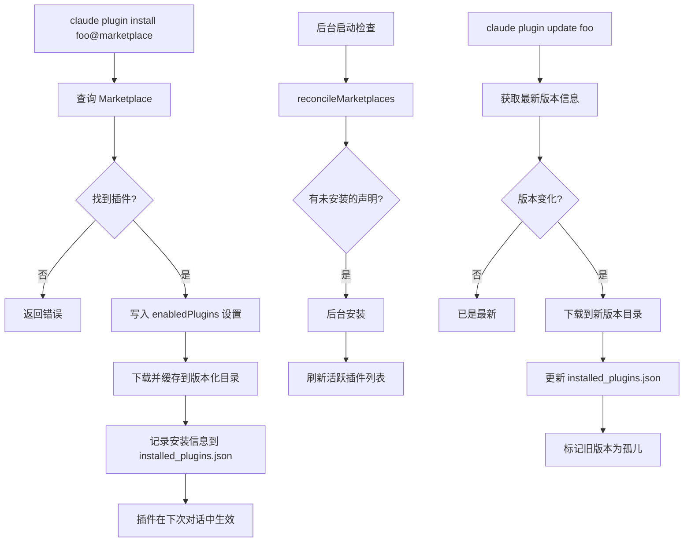

# 第17章 Skills 与插件系统
源地址：https://github.com/zhu1090093659/claude-code
## 本章导读

本章深入剖析 Claude Code 的扩展机制——Skills 和 Plugin 系统。阅读完本章，你将能够：

1. 理解 Skill 的本质：一个带有 YAML frontmatter 的 Markdown 文件如何变成一条可调用的斜杠命令
2. 掌握 `loadSkillsDir.ts` 的文件发现算法——从目录扫描、frontmatter 解析到最终生成 `Command` 对象的完整流程
3. 了解内置 Skill（Bundled Skills）的注册机制，以及它们与用户自定义 Skill 在架构上的区别
4. 理解 `SkillTool` 如何在运行时调用 Skill——包括 inline 和 fork 两种执行模式
5. 掌握 Plugin 的架构设计：Plugin 能携带什么、如何安装和管理、如何与命令注册表整合
6. 动手写一个完整的自定义 Skill，理解每个 frontmatter 字段的作用
7. 理解设计哲学：为什么 Skill 用 Markdown 描述、Plugin 用代码结构组织

---

## 17.1 什么是 Skill

在 Claude Code 里，Skill 是一段打包好的"意图"——告诉 Claude 在特定情景下应该怎么做。它的载体是一个 Markdown 文件，文件顶部附着一段 YAML 格式的元数据（frontmatter），其余部分就是将要注入给 Claude 的指令文本。

当用户输入 `/commit` 或者 `/review-pr 123`，Claude Code 实际上是在查找一个名为 `commit` 或 `review-pr` 的 Skill，找到后把它的 Markdown 内容扩展进对话上下文，再让模型按照其中的步骤执行。这个过程对用户几乎透明，却蕴含了精心设计的工程细节。

一个最简单的 Skill 文件看起来是这样的：

```markdown
---
description: "Commit staged changes with a conventional commit message"
allowed-tools:
  - Bash(git:*)
when_to_use: "Use when the user wants to commit. Examples: 'commit', 'git commit', 'save my changes'"
---

# Commit

Review the staged diff with `git diff --staged`, write a conventional commit message, and run `git commit`.
```

这个文件存放在 `.claude/skills/commit/SKILL.md`，目录名 `commit` 就是命令名称。

---

## 17.2 Skill 文件的发现与加载

### 17.2.1 目录结构约定

Skills 的标准存放位置有三层，按优先级从高到低排列：

- **托管层**（Managed）：由组织管理员通过策略下发，路径由 `getManagedFilePath()` 决定
- **用户层**（User）：`~/.claude/skills/`，跨项目生效
- **项目层**（Project）：`.claude/skills/`，仅在当前项目生效

每个 Skill 必须是一个目录，目录里有一个名为 `SKILL.md` 的文件（名称不区分大小写）。单独的 `.md` 文件放在 `/skills/` 目录里是不被支持的：

```
.claude/
└── skills/
    ├── commit/
    │   └── SKILL.md          # 正确：目录 + SKILL.md
    ├── review-pr/
    │   └── SKILL.md
    └── my-helper.md          # 错误：直接放 .md 文件不被识别
```

这个约定来自 `loadSkillsDir.ts` 第 424 行的判断：

```typescript
// Only support directory format: skill-name/SKILL.md
if (!entry.isDirectory() && !entry.isSymbolicLink()) {
  // Single .md files are NOT supported in /skills/ directory
  return null
}
```

为什么要用目录而不是单个文件？因为目录可以容纳 Skill 附带的其他资源文件（脚本、数据文件等），而这些文件可以通过 `${CLAUDE_SKILL_DIR}` 变量在 Skill 指令中引用。

### 17.2.2 并行加载与去重

`getSkillDirCommands` 是整个 Skill 加载链路的入口，它被 `lodash.memoize` 包裹，同一个 `cwd` 只会执行一次实际的 IO：

```typescript
// loadSkillsDir.ts: 638-714
export const getSkillDirCommands = memoize(
  async (cwd: string): Promise<Command[]> => {
    // Load from /skills/ directories, additional dirs, and legacy /commands/ in parallel
    const [
      managedSkills,
      userSkills,
      projectSkillsNested,
      additionalSkillsNested,
      legacyCommands,
    ] = await Promise.all([
      loadSkillsFromSkillsDir(managedSkillsDir, 'policySettings'),
      loadSkillsFromSkillsDir(userSkillsDir, 'userSettings'),
      Promise.all(projectSkillsDirs.map(dir =>
        loadSkillsFromSkillsDir(dir, 'projectSettings'),
      )),
      // ...
    ])
```

所有目录的读取是并发进行的，IO 完成后合并，然后做一次去重。去重的依据是文件的 **realpath**（符号链接解析后的真实路径），而不是路径字符串本身。这样处理可以防止通过符号链接把同一个 Skill 文件加载两次：

```typescript
// loadSkillsDir.ts: 728-763
const fileIds = await Promise.all(
  allSkillsWithPaths.map(({ skill, filePath }) =>
    skill.type === 'prompt'
      ? getFileIdentity(filePath)   // resolves symlinks via realpath()
      : Promise.resolve(null),
  ),
)

const seenFileIds = new Map<string, ...>()
// First-wins: earlier sources (managed > user > project) take precedence
for (let i = 0; i < allSkillsWithPaths.length; i++) {
  const fileId = fileIds[i]
  if (seenFileIds.has(fileId)) { continue }   // skip duplicate
  seenFileIds.set(fileId, skill.source)
  deduplicatedSkills.push(skill)
}
```

### 17.2.3 frontmatter 解析

每个 `SKILL.md` 文件被读入后，由 `parseFrontmatter` 分割成 frontmatter 对象和正文两部分，再由 `parseSkillFrontmatterFields` 提取具体字段：

```typescript
// loadSkillsDir.ts: 185-264
export function parseSkillFrontmatterFields(
  frontmatter: FrontmatterData,
  markdownContent: string,
  resolvedName: string,
): {
  displayName: string | undefined
  description: string
  allowedTools: string[]
  argumentHint: string | undefined
  argumentNames: string[]
  whenToUse: string | undefined
  model: ReturnType<typeof parseUserSpecifiedModel> | undefined
  effort: EffortValue | undefined
  hooks: HooksSettings | undefined
  executionContext: 'fork' | undefined
  // ...
}
```

下面是所有 frontmatter 字段的含义：

| 字段 | 类型 | 说明 |
|------|------|------|
| `name` | string | 对用户展示的名称，默认用目录名 |
| `description` | string | 一句话描述，出现在技能列表中 |
| `when_to_use` | string | 详细描述何时自动调用，包含触发短语示例 |
| `allowed-tools` | string[] | 该 Skill 允许使用的工具白名单 |
| `argument-hint` | string | 参数提示，如 `"<pr-number>"` |
| `arguments` | string[] | 参数名列表，用于 `$arg_name` 替换 |
| `model` | string | 覆盖模型，如 `claude-opus-4-5` 或 `inherit` |
| `effort` | string/int | 思考力度，`low`/`medium`/`high` 或数字 |
| `context` | string | 执行上下文：`fork` 表示作为独立子 Agent |
| `paths` | string[] | 文件路径模式，仅当匹配文件被操作时激活 |
| `hooks` | object | Skill 专属的 Hooks 配置 |
| `user-invocable` | boolean | 是否出现在用户可见的技能列表（默认 true） |
| `disable-model-invocation` | boolean | 禁止通过 SkillTool 调用（仅限用户手动触发） |

### 17.2.4 条件激活：paths 字段

`paths` 字段让 Skill 实现"按需唤醒"：Skill 在加载时不会立即进入活跃列表，而是存入 `conditionalSkills` 映射；只有当某次文件操作触及了匹配的路径时，它才被激活：

```typescript
// loadSkillsDir.ts: 997-1058
export function activateConditionalSkillsForPaths(
  filePaths: string[],
  cwd: string,
): string[] {
  for (const [name, skill] of conditionalSkills) {
    const skillIgnore = ignore().add(skill.paths)  // gitignore-style matching
    for (const filePath of filePaths) {
      const relativePath = relative(cwd, filePath)
      if (skillIgnore.ignores(relativePath)) {
        dynamicSkills.set(name, skill)     // activated!
        conditionalSkills.delete(name)
        activated.push(name)
        break
      }
    }
  }
  return activated
}
```

路径匹配使用 `ignore` 库，规则语法与 `.gitignore` 完全一致。例如 `paths: ["src/api/**"]` 的 Skill 只会在你打开或编辑 `src/api/` 下的文件时才出现在可用命令列表里。

---

## 17.3 Command 对象的构造

解析完所有字段后，`createSkillCommand` 把这些数据组装成一个 `Command` 对象，这是整个系统统一的命令表示：

```typescript
// loadSkillsDir.ts: 270-401
export function createSkillCommand({ skillName, markdownContent, ... }): Command {
  return {
    type: 'prompt',
    name: skillName,
    // ...
    async getPromptForCommand(args, toolUseContext) {
      let finalContent = baseDir
        ? `Base directory for this skill: ${baseDir}\n\n${markdownContent}`
        : markdownContent

      // Substitute $arg_name placeholders
      finalContent = substituteArguments(finalContent, args, true, argumentNames)

      // Replace ${CLAUDE_SKILL_DIR} with actual directory path
      if (baseDir) {
        finalContent = finalContent.replace(/\$\{CLAUDE_SKILL_DIR\}/g, skillDir)
      }

      // Replace ${CLAUDE_SESSION_ID}
      finalContent = finalContent.replace(/\$\{CLAUDE_SESSION_ID\}/g, getSessionId())

      // Execute inline shell commands (!`...` syntax) — skipped for MCP skills
      if (loadedFrom !== 'mcp') {
        finalContent = await executeShellCommandsInPrompt(finalContent, ...)
      }

      return [{ type: 'text', text: finalContent }]
    },
  } satisfies Command
}
```

`getPromptForCommand` 是这个对象最核心的方法，它在 Skill 被实际调用时才执行，而不是在加载时执行。这种懒加载设计保证了即使注册了几十个 Skill，启动时也不会产生无谓的 IO 开销。

---

## 17.4 动态发现：子目录里的 Skill

Skill 不仅可以在启动时加载，还能在会话过程中被动态发现。当 Claude 对某个文件执行 Read/Write/Edit 操作时，系统会沿着文件路径向上遍历，查找是否存在 `.claude/skills/` 目录：

```typescript
// loadSkillsDir.ts: 861-914
export async function discoverSkillDirsForPaths(
  filePaths: string[],
  cwd: string,
): Promise<string[]> {
  for (const filePath of filePaths) {
    let currentDir = dirname(filePath)
    // Walk up to cwd but NOT including cwd itself
    while (currentDir.startsWith(resolvedCwd + pathSep)) {
      const skillDir = join(currentDir, '.claude', 'skills')
      if (!dynamicSkillDirs.has(skillDir)) {   // avoid redundant stat calls
        dynamicSkillDirs.add(skillDir)
        if (await isPathGitignored(currentDir, resolvedCwd)) continue  // security guard
        newDirs.push(skillDir)
      }
      currentDir = dirname(currentDir)
    }
  }
  // Sort deepest first — closer skills take precedence
  return newDirs.sort((a, b) => b.split(pathSep).length - a.split(pathSep).length)
}
```

这个机制使得单仓库（monorepo）中每个子包都可以拥有自己的 Skill 集合，当你在 `packages/api/` 里工作时，`packages/api/.claude/skills/` 里的 Skill 会自动激活。gitignored 的目录（比如 `node_modules`）被明确跳过，防止第三方依赖包中潜藏的 Skill 文件被无意激活。

---

## 17.5 内置 Skills（Bundled Skills）

Claude Code 随附了一批内置 Skill，它们不存放在文件系统上，而是直接编译进二进制。`bundledSkills.ts` 提供了注册机制：

```typescript
// bundledSkills.ts: 53-100
export function registerBundledSkill(definition: BundledSkillDefinition): void {
  const command: Command = {
    type: 'prompt',
    name: definition.name,
    source: 'bundled',
    loadedFrom: 'bundled',
    contentLength: 0,           // not applicable for bundled skills
    getPromptForCommand: definition.getPromptForCommand,
    // ...
  }
  bundledSkills.push(command)
}
```

内置 Skill 的 `getPromptForCommand` 是一个 TypeScript 函数，可以访问运行时上下文（消息历史、会话状态等），这是文件型 Skill 无法做到的。以 `skillify` 为例，它会读取当前会话的消息历史来帮用户总结并生成新的 Skill 文件：

```typescript
// skills/bundled/skillify.ts: 179-195
async getPromptForCommand(args, context) {
  const sessionMemory = (await getSessionMemoryContent()) ?? 'No session memory.'
  const userMessages = extractUserMessages(
    getMessagesAfterCompactBoundary(context.messages),
  )
  const prompt = SKILLIFY_PROMPT
    .replace('{{sessionMemory}}', sessionMemory)
    .replace('{{userMessages}}', userMessages.join('\n\n---\n\n'))
  return [{ type: 'text', text: prompt }]
}
```

一些内置 Skill 还携带附属文件（`files` 字段），这些文件在 Skill 第一次被调用时才解压到磁盘，后续调用直接使用缓存：

```typescript
// bundledSkills.ts: 59-73
if (files && Object.keys(files).length > 0) {
  skillRoot = getBundledSkillExtractDir(definition.name)
  let extractionPromise: Promise<string | null> | undefined
  getPromptForCommand = async (args, ctx) => {
    // Memoize the promise so concurrent callers await the same extraction
    extractionPromise ??= extractBundledSkillFiles(definition.name, files)
    const extractedDir = await extractionPromise
    // ...
  }
}
```

写文件时使用了 `O_EXCL | O_NOFOLLOW` 标志（Windows 上用 `'wx'` 等价模式）来防止符号链接攻击，体现了内置 Skill 在安全性上的严格要求。

---

## 17.6 SkillTool：Skill 的调用入口

`SkillTool` 是模型与 Skill 系统之间的桥梁。当模型判断需要使用某个 Skill 时，它会调用这个工具，而不是直接操作文件：

```typescript
// tools/SkillTool/constants.ts
export const SKILL_TOOL_NAME = 'Skill'

// tools/SkillTool/SkillTool.ts: 291-298
export const inputSchema = lazySchema(() =>
  z.object({
    skill: z.string().describe('The skill name. E.g., "commit", "review-pr"'),
    args: z.string().optional().describe('Optional arguments for the skill'),
  }),
)
```

### 17.6.1 Skill 提示词（prompt）

`SkillTool` 的 system prompt 告诉模型如何使用它（`prompt.ts` 第 174 行起）：

```
Execute a skill within the main conversation

When users ask you to perform tasks, check if any of the available skills match.

How to invoke:
- Use this tool with the skill name and optional arguments
- Examples:
  - `skill: "pdf"` - invoke the pdf skill
  - `skill: "commit", args: "-m 'Fix bug'"` - invoke with arguments

Important:
- When a skill matches the user's request, this is a BLOCKING REQUIREMENT:
  invoke the relevant Skill tool BEFORE generating any other response
```

注意"BLOCKING REQUIREMENT"这个措辞——它强制要求模型在回应用户之前先触发 Skill，防止模型先自行发挥一通再"顺便"调用 Skill。

### 17.6.2 两种执行模式

Skill 有两种执行模式，由 frontmatter 中的 `context` 字段决定：

**inline 模式（默认）**

Skill 的 Markdown 内容被展开为一条用户消息，注入当前对话上下文，Claude 在主对话线程中按照指令执行。这适用于需要与用户交互或需要访问当前上下文的 Skill。

```typescript
// SkillTool.ts: 638-755 (call方法中的inline路径)
const processedCommand = await processPromptSlashCommand(
  commandName, args || '', commands, context,
)
// newMessages contains the expanded skill content as a user message
return {
  data: { success: true, commandName, allowedTools, model },
  newMessages,        // injected into conversation
  contextModifier,    // modifies tool permissions and model settings
}
```

**fork 模式**

当 frontmatter 设置了 `context: fork`，Skill 会在一个独立的子 Agent 中运行，拥有独立的 token 预算和上下文。适用于不需要中途用户交互的自包含任务：

```typescript
// SkillTool.ts: 622-633
if (command?.type === 'prompt' && command.context === 'fork') {
  return executeForkedSkill(
    command, commandName, args, context, canUseTool, parentMessage, onProgress,
  )
}
```

执行完成后，子 Agent 的结果以文本形式汇报给主对话：

```typescript
// SkillTool.ts: 276-288
return {
  data: {
    success: true,
    commandName,
    status: 'forked',
    agentId,
    result: resultText,    // extracted from sub-agent messages
  },
}
```

### 17.6.3 权限检查

`SkillTool` 有精细的权限控制。只有满足"安全属性白名单"的 Skill 才会自动放行，否则会弹出确认对话框：

```typescript
// SkillTool.ts: 875-908
const SAFE_SKILL_PROPERTIES = new Set([
  'type', 'progressMessage', 'contentLength', 'argNames',
  'model', 'effort', 'source', 'skillRoot', 'context', 'agent',
  // ...
])

function skillHasOnlySafeProperties(command: Command): boolean {
  for (const key of Object.keys(command)) {
    if (!SAFE_SKILL_PROPERTIES.has(key)) {
      const value = (command as Record<string, unknown>)[key]
      if (value !== undefined && value !== null) return false  // requires permission
    }
  }
  return true
}
```

带有 `hooks`（自定义钩子）或 `allowedTools`（工具权限）的 Skill 会触发用户确认，因为它们可以扩展 Claude 的能力边界。

---

## 17.7 Plugin 系统

### 17.7.1 Plugin 与 Bundled Skill 的区别

理解 Plugin 系统的关键是先搞清楚它和内置 Skill 的本质区别：

| 维度 | Bundled Skill | Plugin |
|------|---------------|--------|
| 来源 | 编译进二进制 | 从 Marketplace 安装 |
| 管理界面 | 无，随 Claude Code 版本更新 | `/plugin` UI，可独立启用/禁用 |
| 能携带 | Skill（TypeScript 函数实现） | Skill + MCP 服务器 + Hooks |
| 更新机制 | 随 Claude Code 升级 | `claude plugin update` 独立更新 |
| 作用范围 | 全局 | user / project / local 三个层级 |

`builtinPlugins.ts` 中的注释清楚地说明了这个边界（第 7-13 行）：

> Built-in plugins differ from bundled skills in that:
> - They appear in the /plugin UI under a "Built-in" section
> - Users can enable/disable them (persisted to user settings)
> - They can provide multiple components (skills, hooks, MCP servers)

### 17.7.2 Plugin 的标识符体系

Plugin 的标识符格式是 `{name}@{marketplace}`，例如 `code-reviewer@anthropic`。内置插件使用特殊的哨兵值 `{name}@builtin`。这个格式贯穿整个 Plugin 系统的各个操作：

```typescript
// pluginOperations.ts: 71-76
/** Valid installable scopes */
export const VALID_INSTALLABLE_SCOPES = ['user', 'project', 'local'] as const
```

三个安装范围的语义：
- `user`：写入 `~/.claude/settings.json`，对所有项目生效
- `project`：写入 `.claude/settings.json`，提交到版本库，团队共享
- `local`：写入 `.claude/settings.local.json`，只对当前用户的当前项目生效

### 17.7.3 安装流程（settings-first 设计）

Plugin 安装遵循"settings 先行"的原则——先写配置声明意图，再执行物理安装。这保证了即使安装过程失败，下次启动时系统也能自动重试：

```typescript
// pluginOperations.ts: 321-418
export async function installPluginOp(
  plugin: string,
  scope: InstallableScope = 'user',
): Promise<PluginOperationResult> {
  // 1. Search marketplace for plugin info
  const pluginInfo = await getPluginById(plugin)

  // 2. Write settings (THE ACTION — declares intent)
  // 3. Cache plugin + record version hint (materialization)
  const result = await installResolvedPlugin({
    pluginId, entry, scope, marketplaceInstallLocation,
  })

  return {
    success: true,
    message: `Successfully installed plugin: ${pluginId} (scope: ${scope})`,
    pluginId, pluginName: entry.name, scope,
  }
}
```

### 17.7.4 Plugin 的完整生命周期



### 17.7.5 禁用与卸载

禁用和卸载是两个不同操作。禁用只改变 `enabledPlugins` 的值（`false`），Plugin 的文件缓存保留；卸载则完全删除相关配置和缓存：

```typescript
// pluginOperations.ts: 508-514
// Remove the plugin from settings (delete key entirely)
const newEnabledPlugins = { ...settings?.enabledPlugins }
newEnabledPlugins[pluginId] = undefined    // undefined signals deletion
updateSettingsForSource(settingSource, { enabledPlugins: newEnabledPlugins })

// Remove from installed_plugins_v2.json
removePluginInstallation(pluginId, scope, projectPath)
```

卸载时还会检查是否有其他 Plugin 依赖当前这个 Plugin，如果有，会给出警告但不阻止操作——因为阻止可能导致已下线插件的依赖链无法清理。

---

## 17.8 内置插件（Built-in Plugins）

除了通过 Marketplace 安装的外部插件，Claude Code 还有一套"内置插件"机制，允许把某些内置功能暴露为用户可开关的组件：

```typescript
// plugins/builtinPlugins.ts: 21-32
const BUILTIN_PLUGINS: Map<string, BuiltinPluginDefinition> = new Map()
export const BUILTIN_MARKETPLACE_NAME = 'builtin'

export function registerBuiltinPlugin(definition: BuiltinPluginDefinition): void {
  BUILTIN_PLUGINS.set(definition.name, definition)
}
```

内置插件的 ID 格式是 `{name}@builtin`，它们出现在 `/plugin` UI 的"Built-in"分区，用户可以通过这个界面启用或禁用它们。

当前 `plugins/bundled/index.ts` 中的 `initBuiltinPlugins()` 是空的——这是为将来把某些内置 Skill 迁移为用户可开关的插件预留的脚手架：

```typescript
// plugins/bundled/index.ts: 20-23
export function initBuiltinPlugins(): void {
  // No built-in plugins registered yet — this is the scaffolding for
  // migrating bundled skills that should be user-toggleable.
}
```

---

## 17.9 实战：从零创建一个自定义 Skill

下面是一个完整的例子，演示如何创建一个 `code-review` Skill，让 Claude 对当前 git diff 进行代码审查。

### 第一步：创建目录结构

```bash
mkdir -p .claude/skills/code-review
touch .claude/skills/code-review/SKILL.md
```

### 第二步：编写 SKILL.md

```markdown
---
name: code-review
description: "Review current git diff for issues and improvements"
allowed-tools:
  - Bash(git diff:*)
  - Bash(git log:*)
when_to_use: "Use when the user wants a code review of recent changes. Examples: 'review my changes', 'check this diff', 'code review before commit'"
argument-hint: "[--staged | <commit-range>]"
arguments:
  - range
effort: high
---

# Code Review

Perform a thorough code review of the current changes.

## Inputs
- `$range`: Optional git range or `--staged` flag (defaults to unstaged changes)

## Steps

### 1. Gather diff

```bash
git diff $range
```

If `$range` is empty, use `git diff HEAD` to show all uncommitted changes.

**Success criteria**: You have the full diff to review.

### 2. Review the diff

Analyze the diff for:
- Correctness: logic errors, edge cases, off-by-one errors
- Security: injection risks, hardcoded secrets, unsafe deserialization
- Performance: N+1 queries, unnecessary allocations, blocking calls
- Maintainability: overly complex logic, missing error handling, naming clarity
- Test coverage: are the changes covered by tests?

### 3. Report findings

Present findings grouped by severity:
- **Critical**: must fix before merging
- **Major**: should fix, potential bugs
- **Minor**: optional improvements
- **Nit**: style suggestions

For each finding, include: file/line reference, the issue, and a suggested fix.
```

### 第三步：验证 Skill 被识别

重启 Claude Code 会话（或等待动态发现触发），然后输入 `/code-review` 或让 Claude 审查你的改动。如果 Skill 被正确加载，它会出现在 `/help` 列表中。

### 第四步：添加 fork 模式（可选）

如果这个审查流程不需要用户中途干预，可以设置 `context: fork`，让它在子 Agent 中独立运行，不影响主对话的 token 预算：

```yaml
---
context: fork
effort: high
---
```

### 第五步：用 skillify 自动生成

Claude Code 内置了一个 `skillify` Skill，可以根据当前会话自动生成新的 Skill 文件。完成一个工作流后，运行：

```
/skillify the code review process we just did
```

`skillify` 会分析会话历史，通过多轮对话澄清细节，最终生成并保存 `SKILL.md`。

---

## 17.10 设计哲学：为什么是 Markdown

**对于 Skill**，选择 Markdown 而非代码是一个深思熟虑的决定：

Markdown 文件可以直接被非工程师编写和理解。一位设计师、产品经理、或者非 TypeScript 开发者都可以创建并修改 Skill，而无需了解 Claude Code 的内部 API。这极大地降低了扩展门槛。

同时，Markdown 文件即是文档，又是配置。你可以在 `SKILL.md` 里写详细的注释、示例和边界说明，这些内容本身对 Claude 也是有意义的——它们是提示词的一部分。

**对于 Plugin**，选择代码结构（TypeScript 实现 + 清单文件）则是因为：

Plugin 需要协调多个组件（MCP 服务器、Hook、Skill），这种结构化的需求超出了 Markdown 的表达能力。Plugin 还需要版本管理、依赖解析、市场分发，这些都需要机器可读的清单格式。

两者的分工体现了一个原则：**让简单的事情简单，让复杂的事情可能**。

---

## 本章小结

本章系统地梳理了 Claude Code 的扩展机制：

Skills 系统以 Markdown 文件为基础，通过 `loadSkillsDir.ts` 完成多层目录扫描、并行加载和去重，最终生成标准的 `Command` 对象。每个 Skill 的实际内容在调用时才展开，支持参数替换、Shell 命令执行和动态变量注入。`SkillTool` 作为模型调用 Skill 的唯一入口，提供了 inline（注入上下文）和 fork（独立子 Agent）两种执行模式，并有细粒度的权限控制机制。

Plugin 系统以 `{name}@{marketplace}` 标识符为核心，支持三个安装范围（user/project/local），遵循"settings 先行"的安装设计，通过后台协调器确保声明的插件最终被物理安装。Plugin 可以携带 Skill、MCP 服务器和 Hooks 三种组件，生命周期由 `pluginOperations.ts` 统一管理。

两套系统的分工体现了良好的设计哲学：Skill 为低门槛扩展而生，Markdown 即配置即文档；Plugin 为复杂能力打包而生，用结构化代码组织多组件协作。
