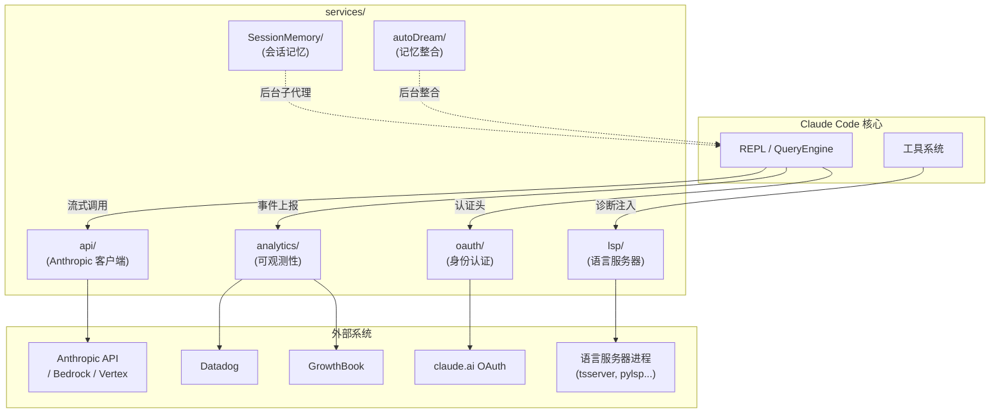

# 第18章 服务层全景：API、分析与LSP
源地址：https://github.com/zhu1090093659/claude-code
## 本章导读

到目前为止，我们已经深入分析了 Claude Code 的工具系统、会话管理、压缩机制和插件体系。这些功能背后都依赖一个不太显眼却至关重要的支撑层——`services/` 目录。它既不是用户直接交互的界面，也不是执行具体任务的工具，而是连接一切的基础设施：API 通信、可观测性、语言服务器协议 (Language Server Protocol)、身份认证，以及若干后台智能服务。

本章是一张"服务地图"。我们不会对每个文件逐行分析，而是帮助读者建立整体认识，知道每个子目录的职责是什么、关键接口在哪里、各模块之间如何协作。有了这张地图，读者在后续阅读源码时就能快速定位，不会迷失在庞大的目录结构里。

本章涵盖以下模块：

- `services/api/`：与 Anthropic 模型 API 通信的核心客户端
- `services/analytics/`：可观测性基础设施，包括功能开关与事件追踪
- `services/lsp/`：语言服务器协议集成，提供诊断与代码智能
- `services/oauth/`：OAuth2 身份认证流程
- 其他后台服务：SessionMemory、autoDream 等

---

## 目录结构概览

```
services/
├── api/                    # Anthropic API 客户端
│   ├── client.ts           # 多提供商客户端工厂（核心）
│   ├── claude.ts           # BetaMessageStreamParams 组装与流式处理
│   ├── withRetry.ts        # 重试逻辑与退避算法
│   ├── usage.ts            # 用量查询（Max/Pro 套餐）
│   ├── errors.ts           # 错误类型定义
│   └── ...
├── analytics/              # 可观测性
│   ├── index.ts            # 公共 logEvent API（无依赖）
│   ├── sink.ts             # 事件路由到 Datadog / 1P
│   ├── growthbook.ts       # GrowthBook 功能开关
│   ├── datadog.ts          # Datadog 批量上报
│   └── firstPartyEventLogger.ts  # 第一方事件日志
├── lsp/                    # Language Server Protocol
│   ├── LSPClient.ts        # LSP 客户端封装（vscode-jsonrpc）
│   ├── LSPServerManager.ts # 多服务器实例管理
│   ├── LSPServerInstance.ts# 单个服务器的生命周期
│   ├── LSPDiagnosticRegistry.ts  # 诊断消息注册表
│   ├── manager.ts          # 全局单例管理
│   └── config.ts           # 从插件加载 LSP 服务器配置
├── oauth/                  # OAuth2 身份认证
│   ├── client.ts           # 授权 URL 构建、令牌交换与刷新
│   ├── auth-code-listener.ts # 本地 HTTP 监听器（接收授权回调）
│   ├── crypto.ts           # PKCE 挑战码生成
│   └── index.ts            # 公共导出
├── SessionMemory/          # 会话记忆提取
├── autoDream/              # 后台记忆整合
├── compact/                # 上下文压缩（见第14章）
├── mcp/                    # MCP 协议（见第15章）
└── plugins/                # 插件系统（见第17章）
```

下面的架构图展示了这些服务模块与应用核心的关系：



---

## `services/api/`：Anthropic API 客户端

### 核心职责

这是 Claude Code 与语言模型通信的唯一出口。每一次对话轮次、每一次工具调用后的推理请求，都经过这里。它的核心难题是：同一套高层接口需要透明地支持四个完全不同的底层提供商。

### 多提供商客户端工厂

`client.ts` 中的 `getAnthropicClient()` 是整个 API 层的入口。它根据环境变量决定实例化哪个 SDK 客户端，并统一注入请求头、代理设置和超时配置：

```typescript
// services/api/client.ts（简化）
export async function getAnthropicClient({ maxRetries, model, ... }) {
  // 四个分支，对应四种提供商
  if (isEnvTruthy(process.env.CLAUDE_CODE_USE_BEDROCK)) {
    const { AnthropicBedrock } = await import('@anthropic-ai/bedrock-sdk')
    return new AnthropicBedrock({ awsRegion, ...ARGS }) as unknown as Anthropic
  }
  if (isEnvTruthy(process.env.CLAUDE_CODE_USE_FOUNDRY)) {
    const { AnthropicFoundry } = await import('@anthropic-ai/foundry-sdk')
    return new AnthropicFoundry({ azureADTokenProvider, ...ARGS }) as unknown as Anthropic
  }
  if (isEnvTruthy(process.env.CLAUDE_CODE_USE_VERTEX)) {
    const { AnthropicVertex } = await import('@anthropic-ai/vertex-sdk')
    return new AnthropicVertex({ region, googleAuth, ...ARGS }) as unknown as Anthropic
  }
  // 默认：直连 Anthropic API（含 OAuth 和 API Key 两种认证方式）
  return new Anthropic({ apiKey, authToken, ...ARGS })
}
```

值得注意的细节：
- 动态 `import()` 加载各平台 SDK，使得未使用 Bedrock/Vertex 的用户不会引入不必要的依赖。
- 所有客户端都共享一个 `ARGS` 对象，其中包含统一的超时（默认 600 秒）、代理配置和自定义请求头。
- 每个请求都自动附加 `x-claude-code-session-id`，便于服务端关联日志。

对于 Vertex AI，区域选择有完整的优先级体系：模型专属环境变量 > `CLOUD_ML_REGION` > 配置默认值 > 兜底 `us-east5`。这解决了跨区域模型部署的常见痛点。

### 重试逻辑

`withRetry.ts` 是整个系统弹性的核心。它是一个 `AsyncGenerator`，每次等待期间会向调用者 `yield` 一个系统消息（让 REPL 可以展示"正在重试..."的状态），同时执行实际的退避等待：

```typescript
// services/api/withRetry.ts（节选）
export async function* withRetry<T>(
  getClient: () => Promise<Anthropic>,
  operation: (client, attempt, context) => Promise<T>,
  options: RetryOptions,
): AsyncGenerator<SystemAPIErrorMessage, T> {
  for (let attempt = 1; attempt <= maxRetries + 1; attempt++) {
    try {
      return await operation(client, attempt, retryContext)
    } catch (error) {
      // 对 401/403/Bedrock auth 错误强制刷新客户端
      if (needsFreshClient(error)) {
        client = await getClient()
      }
      // 产生进度消息，让 UI 显示等待状态
      yield createSystemAPIErrorMessage(error, delayMs, attempt, maxRetries)
      await sleep(delayMs, signal)
    }
  }
}
```

退避策略的几个关键设计：

**529（过载）错误的差异化处理**：前台查询（用户正在等待结果的）会重试最多 3 次；后台查询（摘要、标题生成等）遇到 529 立即放弃，避免在服务端容量紧张时产生重试风暴。

**Opus 模型回退**：连续 3 次 529 后，如果配置了备用模型（通常是 Sonnet），自动切换。这个逻辑通过 `FallbackTriggeredError` 向上层传递信号，而不是在重试循环内直接修改模型。

**上下文溢出自动裁剪**：收到"input length and `max_tokens` exceed context limit"这类 400 错误时，解析出实际的 token 数量，动态缩小 `max_tokens` 后重试，而不是让整个请求失败。

```typescript
// 退避计算（指数退避 + 25% 随机抖动）
export function getRetryDelay(attempt: number, retryAfterHeader?: string | null, maxDelayMs = 32000): number {
  if (retryAfterHeader) {
    return parseInt(retryAfterHeader, 10) * 1000
  }
  const baseDelay = Math.min(BASE_DELAY_MS * Math.pow(2, attempt - 1), maxDelayMs)
  const jitter = Math.random() * 0.25 * baseDelay
  return baseDelay + jitter
}
```

### 用量追踪

`usage.ts` 专为 claude.ai 订阅用户提供用量查询功能，通过 `/api/oauth/usage` 接口获取 5 小时窗口和 7 天窗口的配额利用率。这些数据在 REPL 界面中作为状态指示器展示。

---

## `services/analytics/`：可观测性基础设施

### 设计哲学：零依赖的事件队列

`analytics/index.ts` 是整个可观测性层的公共 API，有一个刻意的约束：**这个模块不依赖任何项目内部模块**。这是为了打破循环依赖——几乎所有其他模块都需要上报事件，如果 `analytics/index.ts` 反过来依赖那些模块，就会形成依赖环。

解决方案是事件队列 (event queue) + 汇入点 (sink) 的分离架构：

```typescript
// services/analytics/index.ts（节选）
let sink: AnalyticsSink | null = null
const eventQueue: QueuedEvent[] = []

// 在 sink 附加之前，所有事件进入队列
export function logEvent(eventName: string, metadata: LogEventMetadata): void {
  if (sink === null) {
    eventQueue.push({ eventName, metadata, async: false })
    return
  }
  sink.logEvent(eventName, metadata)
}

// 应用启动时调用此函数，挂载实际的路由逻辑
export function attachAnalyticsSink(newSink: AnalyticsSink): void {
  if (sink !== null) return  // 幂等
  sink = newSink
  // 异步排空队列，不阻塞启动路径
  queueMicrotask(() => { /* drain eventQueue */ })
}
```

这个设计让其他模块在应用初始化完成之前就可以安全地调用 `logEvent()`，不会丢失任何早期事件。

还有一处值得关注的类型设计：
```typescript
// 用类型系统强制审查敏感字段
export type AnalyticsMetadata_I_VERIFIED_THIS_IS_NOT_CODE_OR_FILEPATHS = never
```
这个 `never` 类型让所有字符串类型的元数据字段都无法直接传入 `logEvent()`，必须显式添加类型断言 `as AnalyticsMetadata_I_VERIFIED_THIS_IS_NOT_CODE_OR_FILEPATHS`，从而在编译时强制开发者核查该字段不含代码片段或文件路径等敏感信息。

### GrowthBook 功能开关

`growthbook.ts` 封装了与 GrowthBook (功能开关服务) 的集成，管理从功能灰度到 A/B 实验的所有远程配置。

它提供两种核心读取语义：

- `getFeatureValue_CACHED_MAY_BE_STALE(feature, default)` —— 同步读取磁盘缓存，立即返回，适合启动关键路径和热循环中调用。值可能是上一次进程写入的旧值。
- `getDynamicConfig_BLOCKS_ON_INIT(feature, default)` —— 异步等待 GrowthBook 完成初始化后返回，值是当前会话的新鲜值，适合安全相关的门控检查。

磁盘缓存的写入发生在每次成功拉取远端 payload 后（初始化时和每 6 小时的定期刷新时），采用全量替换而非增量合并，确保服务端删除的功能也能从缓存中消除。

### Datadog 集成

`datadog.ts` 实现了一个轻量级的批量上报机制：事件先进入内存队列 `logBatch`，默认每 15 秒或队列满 100 条时批量 POST 到 Datadog 的日志摄入接口。

几个工程细节：
- 只有 `DATADOG_ALLOWED_EVENTS` 集合中的事件名才会被发送，防止意外上报未经审查的事件。
- 第三方提供商（Bedrock/Vertex/Foundry）的用户不上报 Datadog，因为这些事件对 Anthropic 没有分析价值。
- 用户 ID 通过 SHA-256 哈希后取模分桶（30 个桶），让监控告警能以"受影响用户数"而不是"事件数"作为阈值，同时保护隐私。

```typescript
// 事件流向：用户操作 → logEvent() → sink.logEvent() → 两个后端
//                                              ├── trackDatadogEvent() → Datadog
//                                              └── logEventTo1P()      → 1P 事件日志
```

---

## `services/lsp/`：语言服务器协议

### LSP 为 Claude Code 提供什么

语言服务器协议 (Language Server Protocol, LSP) 是 Microsoft 提出的编辑器与语言工具通信的标准协议。Claude Code 作为一个代码助手，通过 LSP 获得三类信息：

1. **诊断 (Diagnostics)**：来自编译器或 linter 的错误、警告信息，自动注入到下一次对话轮次中，让模型知道"这里有类型错误"。
2. **代码动作 (Code Actions)**：语言服务器建议的快速修复。
3. **定义跳转 (Go to Definition)**：解析符号定义位置，辅助代码理解。

### 连接生命周期

整个 LSP 集成围绕以下层次展开：

```
manager.ts (全局单例)
    └── LSPServerManager (多服务器路由)
            ├── LSPServerInstance (单个服务器 + 生命周期管理)
            │       └── LSPClient (vscode-jsonrpc 连接封装)
            │               └── [子进程 stdio]
            └── LSPDiagnosticRegistry (诊断消息存储)
```

`manager.ts` 维护一个全局单例，在 Claude Code 启动时异步初始化，不阻塞主线程：

```typescript
// services/lsp/manager.ts（简化）
export function initializeLspServerManager(): void {
  if (isBareMode()) return  // --bare 模式不启动 LSP（非交互式场景）

  lspManagerInstance = createLSPServerManager()
  initializationState = 'pending'

  // 异步初始化，失败不崩溃
  initializationPromise = lspManagerInstance.initialize()
    .then(() => {
      initializationState = 'success'
      registerLSPNotificationHandlers(lspManagerInstance)  // 挂载诊断监听器
    })
    .catch(error => {
      initializationState = 'failed'
      lspManagerInstance = undefined
    })
}
```

`LSPServerManager` 根据文件扩展名路由请求到对应的语言服务器。所有语言服务器配置来自插件（参见第17章），而不是硬编码：

```typescript
// services/lsp/config.ts（关键逻辑）
export async function getAllLspServers() {
  const { enabled: plugins } = await loadAllPluginsCacheOnly()
  // 并行加载所有插件的 LSP 服务器配置，后者覆盖前者
  const results = await Promise.all(plugins.map(p => getPluginLspServers(p, errors)))
  return { servers: mergedServerConfigs }
}
```

### 诊断注入机制

`LSPDiagnosticRegistry.ts` 实现了一个与 `AsyncHookRegistry` 相似的模式：诊断消息通过 `publishDiagnostics` 通知异步到达，先存入注册表，在下一个对话轮次开始时由 `getAttachments()` 统一读取并附加到消息中。

限流常量防止诊断信息淹没上下文：每个文件最多 10 条，全局最多 30 条。已投递的诊断通过 LRU 缓存去重，避免在长会话中反复上报相同的错误。

---

## `services/oauth/`：身份认证

### OAuth2 PKCE 流程

Claude Code 支持两条认证路径：API Key 和 OAuth2（用于 claude.ai 订阅用户）。OAuth2 实现了完整的 PKCE (Proof Key for Code Exchange) 流程，这是命令行工具中防止授权码截获攻击的标准方案：

```
用户              CLI                    授权服务器
 |                |                         |
 |   /login       |                         |
 |--------------->|                         |
 |                | 生成 code_verifier       |
 |                | SHA256(verifier)→challenge
 |                |                         |
 |                | buildAuthUrl() 打开浏览器|
 |                |------------------------>|
 |                |                         |
 |  同意授权       |                         |
 |<------------------------------------ code|
 |                |                         |
 |                | exchangeCodeForTokens() |
 |                | (code + verifier)        |
 |                |------------------------>|
 |                |<-------- access_token --|
 |                |         refresh_token   |
```

`oauth/crypto.ts` 生成随机的 `code_verifier`，`oauth/client.ts` 的 `buildAuthUrl()` 构建包含 `code_challenge`（`verifier` 的 SHA-256 哈希）的授权 URL。

本地回调通过 `auth-code-listener.ts` 启动一个临时 HTTP 服务器监听 `localhost:PORT/callback`，接收授权码后立即关闭。

### 令牌刷新策略

`refreshOAuthToken()` 在刷新成功后有一个优化：如果全局配置中已存在完整的 profile 信息（包括订阅类型），则跳过额外的 `/api/oauth/profile` 请求，减少约 700 万次/天的服务端请求（按团队级别的规模估算）。

```typescript
// services/oauth/client.ts（节选）
export async function refreshOAuthToken(refreshToken, { scopes } = {}) {
  const response = await axios.post(TOKEN_URL, {
    grant_type: 'refresh_token',
    refresh_token: refreshToken,
    client_id: CLIENT_ID,
    scope: CLAUDE_AI_OAUTH_SCOPES.join(' '),
  })

  // 有完整缓存时跳过 profile 请求，节省一次 RTT
  if (hasFullProfileCache()) {
    return buildTokensFromResponse(response.data, cachedProfile)
  }

  // 否则拉取最新 profile（订阅类型、配额信息等）
  const profile = await getOauthProfileFromOauthToken(accessToken)
  return buildTokensFromResponse(response.data, profile)
}
```

令牌过期检测通过 `isOAuthTokenExpired(expiresAt)` 函数实现，在发起 API 请求前和 GrowthBook 初始化前都会提前检查，避免因令牌失效导致的无谓 401 错误。

---

## 其他后台服务简介

### SessionMemory：会话记忆

`services/SessionMemory/` 实现了一个运行在后台的"速记员"。它通过 `registerPostSamplingHook()` 注册一个钩子，在每次对话轮次完成后检查是否需要提取并更新会话记忆文件。提取工作由一个独立的子代理 (forked agent) 完成，不占用主对话的上下文窗口。记忆文件以 Markdown 格式保存在 `~/.claude/memory/` 目录下，每个项目独立。

触发条件由配置动态控制：满足初始化阈值（一定的工具调用次数）后才开始工作，之后每隔一定的工具调用轮次更新一次，防止频繁触发消耗额外配额。

### autoDream：后台记忆整合

`services/autoDream/` 实现了跨会话的记忆整合。它采用三道门控（cheapest first 原则）：

1. **时间门**：距上次整合是否超过 `minHours` 小时（单次文件 stat，代价极低）
2. **会话门**：在此期间是否产生了 `minSessions` 个新的对话记录（列举文件 mtime）
3. **锁门**：是否有其他进程正在整合（防止并发写入记忆文件）

通过三道门控后，autoDream 以 `/dream` 命令启动一个子代理，该代理读取历史对话摘要，将有价值的信息整合写入 CLAUDE.md 或用户指定的记忆文件。整合完成或失败都会通过 `logEvent()` 上报，便于监控整合质量。

### compact、mcp、plugins

这三个服务模块本书已有专章论述：

- `services/compact/`：上下文压缩，见第14章
- `services/mcp/`：Model Context Protocol 集成，见第15章
- `services/plugins/`：插件安装与管理，见第17章

---

## 模块协作示意

一次普通的对话轮次中，服务层的参与方式如下：

```
用户输入
  │
  ▼
QueryEngine.query()
  │
  ├──► analytics/index.logEvent('tengu_query_*')    # 上报查询开始事件
  │
  ├──► lsp/manager.getLspServerManager()            # 获取 LSP 诊断附件
  │         └── LSPDiagnosticRegistry.checkForLSPDiagnostics()
  │
  ├──► oauth (通过 client.ts 的 getAnthropicClient)  # 检查令牌有效性
  │
  ├──► api/withRetry → api/client.getAnthropicClient # 发起 API 调用
  │         ├── 重试循环（yield 进度消息）
  │         └── 流式接收响应
  │
  ├──► analytics/index.logEvent('tengu_api_success') # 上报结果
  │
  └──► SessionMemory (postSamplingHook)              # 异步更新会话记忆
```

---

## 本章小结

`services/` 目录是 Claude Code 的基础设施层。理解它的最好方法是记住每个子模块的核心职责：

`api/` 是唯一的模型通信出口，通过工厂模式透明支持四个提供商，用 `withRetry` 提供生产级别的弹性。`analytics/` 采用无依赖的队列-汇入架构，解决了循环依赖难题，同时用类型系统在编译期防止敏感数据泄露到日志。`lsp/` 将编辑器级别的语言智能引入终端，通过诊断注册表将异步到达的错误信息无缝融入对话流。`oauth/` 实现了完整的 PKCE 流程，并通过缓存策略将令牌刷新的 profile 查询降至最低。

这些模块独立设计、低耦合，但通过清晰的接口协作，共同支撑起 Claude Code 在生产环境中的稳定运行。读者在阅读具体工具或功能的实现时，遇到这些服务调用时，回到本章的地图即可快速找到上下文。
