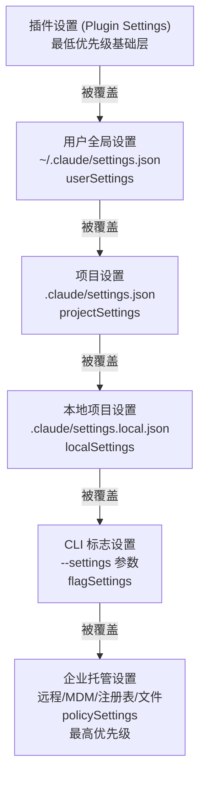

# 第 19 章：配置系统与 Hooks 机制
源地址：https://github.com/zhu1090093659/claude-code
## 本章导读

读完本章，你应该能够：

1. 描述 Claude Code 配置系统的六层优先级结构，以及每一层的物理存储位置
2. 理解 `settingsMergeCustomizer` 函数的数组合并策略，以及它与普通 `Object.assign` 的本质区别
3. 解释企业级托管设置（MDM/注册表/远程）的"首个有效来源胜出"（first source wins）与普通设置"深度合并"的差异
4. 读懂 `schemas/hooks.ts` 中的四种 Hook 命令类型（command、prompt、agent、http）及其对应的执行引擎
5. 理解 Hook 的退出码协议：0 表示成功、2 表示阻塞模型、其他值表示仅告知用户
6. 自己写出一个 `PostToolUse` 钩子，实现工具调用后发送通知的完整示例
7. 了解键盘快捷键（keybindings）的配置结构及 17 个上下文分区

---

Claude Code 是一个高度可配置的工具，但它的配置系统远比看起来复杂。当你在 `~/.claude/settings.json` 里写入一条规则时，你并不了解这条规则最终会以什么优先级生效、会和哪些来源的规则合并、在什么情况下会被企业策略覆盖。这一章就是要把这套机制完整地展开。

Hooks 机制是配置系统最强大的部分。它允许你把任意 shell 脚本、HTTP 请求、甚至一个小型 AI 代理挂在工具调用的前后，实现审计日志、工作流集成、安全检查等各种需求。理解 hooks 的执行模型，你就能写出真正有价值的自动化。

---

## 19.1 配置系统的六层结构

Claude Code 的配置不是一个单一的文件，而是六个来源按优先级依次合并的结果。理解这个结构是正确使用配置系统的前提。



这六层在源码中以 `SETTING_SOURCES` 数组定义，位于 `.src/utils/settings/constants.ts:7`：

```typescript
// Priority order: later sources override earlier ones
export const SETTING_SOURCES = [
  'userSettings',
  'projectSettings',
  'localSettings',
  'flagSettings',
  'policySettings',
] as const
```

加上未出现在这个数组中的插件设置，共六层。

**用户全局设置**对应 `~/.claude/settings.json`（在 cowork 模式下为 `cowork_settings.json`）。这是大多数个人配置放置的地方。

**项目设置**对应项目根目录下的 `.claude/settings.json`，会被提交到版本库，团队成员共享。

**本地项目设置**对应 `.claude/settings.local.json`，系统会自动把这个路径加入 `.gitignore`，用于存放不适合共享的本地覆盖配置，比如你个人的 API key 路径或实验性开关。

**CLI 标志设置**通过 `--settings <path>` 参数指定文件路径，也支持 SDK 内联传入。这让自动化脚本可以注入临时配置而不影响任何永久文件。

**企业托管设置**（policySettings）是这个系统里最特殊的一层。它不走普通的深度合并逻辑，而是执行"首个有效来源胜出"策略，优先级从高到低为：

1. 远程托管设置（通过 Anthropic API 推送）
2. 系统级 MDM：macOS 使用 `com.anthropic.claudecode` preference domain，Windows 使用 `HKLM\SOFTWARE\Policies\ClaudeCode` 注册表项
3. 文件：`managed-settings.json` 及 `managed-settings.d/*.json` drop-in 目录
4. 用户级注册表：Windows 的 `HKCU\SOFTWARE\Policies\ClaudeCode`（优先级最低，因为用户可写）

这个逻辑在 `.src/utils/settings/settings.ts:319` 的 `getSettingsForSourceUncached` 函数中实现：一旦找到非空的来源，就立刻返回，不再向下查找。

---

## 19.2 深度合并策略

把这六层设置合并成最终生效配置的核心逻辑，在 `loadSettingsFromDisk` 函数中（`.src/utils/settings/settings.ts:645`）。它使用 lodash 的 `mergeWith` 配合一个自定义的合并器：

```typescript
// Custom merge: arrays are concatenated + deduplicated,
// objects are deeply merged, scalars use the higher-priority value.
export function settingsMergeCustomizer(
  objValue: unknown,
  srcValue: unknown,
): unknown {
  if (Array.isArray(objValue) && Array.isArray(srcValue)) {
    return mergeArrays(objValue, srcValue)  // uniq([...target, ...source])
  }
  return undefined  // let lodash handle default merge for non-arrays
}
```

这个合并策略的关键在于**数组不被覆盖，而是合并去重**。实际效果如下：

如果用户全局设置中有：
```json
{
  "permissions": {
    "allow": ["Read(~/projects/**)", "Bash(git status)"]
  }
}
```

项目设置中有：
```json
{
  "permissions": {
    "allow": ["Write(./**)", "Bash(npm run *)"]
  }
}
```

最终生效的权限数组会是：
```json
["Read(~/projects/**)", "Bash(git status)", "Write(./**)", "Bash(npm run *)"]
```

而如果是标量字段，如 `model: "claude-opus-4-5"`，则优先级高的来源直接覆盖优先级低的来源。对象字段则进行深度合并。

这个设计的现实意义：用户不需要担心项目配置会"清空"自己的全局权限规则，因为权限数组总是累积的。

---

## 19.3 SettingsSchema：配置字段全景

整个配置文件的结构由 `SettingsSchema` Zod Schema 定义，位于 `.src/utils/settings/types.ts:255`。这个 Schema 使用了 `.passthrough()` 模式，意味着 Schema 不认识的字段不会报错，而是被保留——这保证了向前兼容性。

以下是最常用的几个配置字段：

**permissions（权限控制）**

```json
{
  "permissions": {
    "allow": ["Read(**)", "Bash(git *)"],
    "deny": ["Bash(rm -rf *)"],
    "ask": ["Write(**/*.prod.*)", "Bash(kubectl *)"],
    "defaultMode": "default"
  }
}
```

`allow`、`deny`、`ask` 使用权限规则语法（见第 7 章），`defaultMode` 控制未匹配规则时的默认行为。

**hooks（钩子定义）**

钩子配置的位置，本章的核心内容，后面详细展开。

**model（模型覆盖）**

```json
{
  "model": "claude-opus-4-5"
}
```

覆盖默认模型。企业管理员常用 `availableModels` 数组限制用户可选的模型范围。

**env（环境变量注入）**

```json
{
  "env": {
    "GITHUB_TOKEN": "ghp_xxxx",
    "NODE_ENV": "development"
  }
}
```

会注入到所有由 Claude Code 启动的子进程中。

**disableAllHooks**

```json
{
  "disableAllHooks": true
}
```

紧急开关，一键禁用所有 hooks 和 statusLine 脚本。

---

## 19.4 Hooks 机制：什么是钩子

Claude Code 的钩子（Hooks）是用户定义的命令，在特定的生命周期事件触发时自动执行。钩子不是简单的"事件通知"——它可以主动影响 Claude 的行为：拦截工具调用、向模型注入额外信息、阻止危险操作。

要理解 hooks 的执行模型，必须先理解 **Hook 的触发点**（事件类型）和 **Hook 的命令类型**（执行方式）这两个维度。

---

## 19.5 Hook 事件类型

Claude Code 目前定义了 27 种 Hook 事件，在 `.src/utils/hooks/hooksConfigManager.ts:27` 的 `getHookEventMetadata` 函数中有完整记录。以下是最常用的几类：

**工具调用相关**

- `PreToolUse`：工具执行前触发。输入是工具调用参数的 JSON。这是实现"拦截"的主要位置。
- `PostToolUse`：工具执行后触发。输入包含调用参数和执行结果。
- `PostToolUseFailure`：工具执行失败时触发，包含错误信息。

**会话生命周期**

- `SessionStart`：新会话开始时触发，可以注入上下文信息给 Claude。
- `SessionEnd`：会话结束时触发，可用于清理或统计。
- `Stop`：Claude 即将结束本轮回复前触发，可以用来做最终验证。
- `SubagentStop`：子代理（Agent 工具调用）结束前触发。

**用户交互**

- `UserPromptSubmit`：用户提交 prompt 时触发。退出码 2 可以拦截整个提交。
- `Notification`：系统向用户发送通知时触发，如权限请求对话框出现时。

**对话管理**

- `PreCompact`：上下文压缩（compact）前触发，stdout 的输出会被当作自定义压缩指令。
- `PostCompact`：压缩完成后触发，附带压缩摘要。

**文件系统监控**

- `CwdChanged`：工作目录变更时触发。
- `FileChanged`：被监控的文件发生变化时触发，需配合 matcher 指定文件名。

**企业协作**（需要相应功能支持）

- `TeammateIdle`：队友即将进入空闲状态时触发。
- `TaskCreated` / `TaskCompleted`：任务创建和完成时触发。
- `PermissionRequest`：权限对话框弹出时触发，可以通过 JSON 输出自动决策。

---

## 19.6 Hook 命令类型与 Schema

每种 Hook 事件可以绑定多个命令，每个命令有四种类型，定义在 `.src/schemas/hooks.ts`。

**command（Shell 命令）**

最常用的类型，执行一个 shell 命令：

```typescript
{
  type: 'command',
  command: 'jq -r .tool_name',  // shell command to run
  if: 'Bash(*)',                  // optional: only run if tool matches
  shell: 'bash',                  // 'bash' or 'powershell'
  timeout: 30,                    // seconds
  async: false,                   // if true, run without blocking
  asyncRewake: false,             // if true, async but wake model on exit code 2
  statusMessage: 'Logging...',   // custom spinner text
  once: false,                    // if true, auto-remove after first run
}
```

**prompt（LLM 提示）**

把 hook 输入发给 LLM，让 LLM 返回 `{"ok": true}` 或 `{"ok": false, "reason": "..."}`：

```typescript
{
  type: 'prompt',
  prompt: 'Verify the following bash command is safe: $ARGUMENTS',
  model: 'claude-haiku-4-5',   // uses small fast model by default
  timeout: 30,
}
```

**agent（AI 代理验证）**

启动一个完整的子代理来验证条件，代理可以使用工具读取文件系统、运行命令等：

```typescript
{
  type: 'agent',
  prompt: 'Verify that unit tests ran and passed.',
  model: 'claude-haiku-4-5',
  timeout: 60,
}
```

**http（HTTP 请求）**

向远端服务发送 POST 请求，把 hook 输入作为 JSON body：

```typescript
{
  type: 'http',
  url: 'https://hooks.example.com/audit',
  headers: {
    'Authorization': 'Bearer $MY_TOKEN'
  },
  allowedEnvVars: ['MY_TOKEN'],   // required for env var interpolation
  timeout: 10,
}
```

HTTP 钩子有完善的安全机制：`allowedEnvVars` 白名单控制哪些环境变量可以被插值到 headers 中；`allowedHttpHookUrls` 企业策略可以限制允许访问的 URL 模式；内置了 SSRF 防护（`.src/utils/hooks/ssrfGuard.ts`），阻止访问私有 IP 范围。

---

## 19.7 退出码协议：How Hooks Communicate

这是理解 hooks 最关键、也是最容易被忽视的部分。Hook 命令通过退出码来告知 Claude Code 如何处理结果：

**PreToolUse 事件的退出码含义：**

| 退出码 | 含义 |
|--------|------|
| 0 | 允许工具执行，stdout/stderr 不显示 |
| 2 | **阻塞工具执行**，将 stderr 作为原因发送给模型 |
| 其他 | 允许工具执行，但将 stderr 显示给用户（模型不可见） |

**PostToolUse 事件的退出码含义：**

| 退出码 | 含义 |
|--------|------|
| 0 | 成功，stdout 在 Transcript 模式下（Ctrl+O）可见 |
| 2 | 立即将 stderr 发送给模型（可用于触发额外处理） |
| 其他 | 将 stderr 显示给用户 |

**Stop 事件的退出码含义：**

| 退出码 | 含义 |
|--------|------|
| 0 | 允许 Claude 结束本轮 |
| 2 | 将 stderr 发送给模型，继续对话 |
| 其他 | 显示 stderr 给用户 |

这个协议让 hooks 成为一个真正的双向通信机制：你可以从 hook 脚本向模型注入信息（exit 2），而不仅仅是监听事件。

除退出码外，hook 还可以通过 stdout 输出特殊 JSON 来实现更精细的控制。例如 `PermissionRequest` 事件的 hook 可以输出：

```json
{
  "hookSpecificOutput": {
    "hookEventName": "PermissionRequest",
    "decision": "allow"
  }
}
```

来自动允许权限请求，无需用户手动点击。

---

## 19.8 hooks 配置的 JSON 结构

在 `settings.json` 中，hooks 配置遵循以下格式：

```json
{
  "hooks": {
    "<EventName>": [
      {
        "matcher": "<optional string pattern>",
        "hooks": [
          { "type": "command", "command": "..." },
          { "type": "http", "url": "..." }
        ]
      }
    ]
  }
}
```

**matcher 字段**是可选的。对于 `PreToolUse` 和 `PostToolUse` 事件，matcher 匹配 `tool_name`；对于 `Notification` 事件，matcher 匹配 `notification_type`；对于 `SessionStart`，matcher 匹配 `source`（startup / resume / clear / compact）。

以下是一个完整的多事件配置示例：

```json
{
  "hooks": {
    "PreToolUse": [
      {
        "matcher": "Bash",
        "hooks": [
          {
            "type": "command",
            "command": "bash ~/.claude/hooks/log-bash.sh",
            "timeout": 5
          }
        ]
      }
    ],
    "PostToolUse": [
      {
        "matcher": "Write",
        "hooks": [
          {
            "type": "command",
            "command": "bash ~/.claude/hooks/notify-write.sh",
            "async": true
          }
        ]
      }
    ],
    "Stop": [
      {
        "hooks": [
          {
            "type": "command",
            "command": "bash ~/.claude/hooks/on-stop.sh"
          }
        ]
      }
    ]
  }
}
```

---

## 19.9 完整示例：构建一个 PostToolUse 通知钩子

下面通过一个完整的实战示例，演示如何编写一个在文件写入后发送桌面通知的 PostToolUse 钩子。

**第一步：创建钩子脚本**

```bash
# ~/.claude/hooks/notify-write.sh
#!/usr/bin/env bash

# This hook receives PostToolUse data on stdin as JSON.
# The input format is:
#   { "tool_name": "Write", "tool_input": {...}, "tool_response": {...} }

INPUT=$(cat)

# Extract the file path that was written
FILE_PATH=$(echo "$INPUT" | jq -r '.tool_input.file_path // "unknown file"')

# Determine platform and send notification
if command -v osascript &> /dev/null; then
  # macOS
  osascript -e "display notification \"Claude wrote: $FILE_PATH\" with title \"Claude Code\""
elif command -v notify-send &> /dev/null; then
  # Linux (libnotify)
  notify-send "Claude Code" "Claude wrote: $FILE_PATH"
fi

# Exit 0: success, stdout shown in transcript mode
echo "Notification sent for $FILE_PATH"
exit 0
```

```bash
chmod +x ~/.claude/hooks/notify-write.sh
```

**第二步：配置 settings.json**

编辑 `~/.claude/settings.json`（全局生效）或项目的 `.claude/settings.json`：

```json
{
  "hooks": {
    "PostToolUse": [
      {
        "matcher": "Write",
        "hooks": [
          {
            "type": "command",
            "command": "bash ~/.claude/hooks/notify-write.sh",
            "timeout": 10,
            "async": true,
            "statusMessage": "Sending notification..."
          }
        ]
      },
      {
        "matcher": "Edit",
        "hooks": [
          {
            "type": "command",
            "command": "bash ~/.claude/hooks/notify-write.sh",
            "timeout": 10,
            "async": true
          }
        ]
      }
    ]
  }
}
```

这里使用了 `async: true`，让通知在后台发送，不阻塞 Claude 继续执行下一步。如果通知失败（脚本返回非 0 退出码），只会把 stderr 显示给用户，不影响工具调用的结果。

**第三步：验证钩子已生效**

在 Claude Code 中运行 `/hooks` 命令，可以看到当前生效的所有钩子配置。或者用 `/status` 查看配置的整体状态。

**增强版：向 Slack 发送通知**

把通知改为发送到 Slack webhook，适合团队审计场景：

```bash
# ~/.claude/hooks/audit-write.sh
#!/usr/bin/env bash

INPUT=$(cat)
FILE_PATH=$(echo "$INPUT" | jq -r '.tool_input.file_path // "unknown"')
TOOL_NAME=$(echo "$INPUT" | jq -r '.tool_name')
TIMESTAMP=$(date -u +"%Y-%m-%dT%H:%M:%SZ")

# Send to Slack (SLACK_HOOK_URL must be in settings.json env section)
if [ -n "$SLACK_HOOK_URL" ]; then
  curl -s -X POST "$SLACK_HOOK_URL" \
    -H 'Content-type: application/json' \
    --data "{
      \"text\": \"*Claude Code* used \`$TOOL_NAME\` on \`$FILE_PATH\` at $TIMESTAMP\"
    }" > /dev/null
fi

exit 0
```

对应的配置：

```json
{
  "env": {
    "SLACK_HOOK_URL": "https://hooks.slack.com/services/..."
  },
  "hooks": {
    "PostToolUse": [
      {
        "matcher": "Write",
        "hooks": [
          {
            "type": "command",
            "command": "bash ~/.claude/hooks/audit-write.sh",
            "async": true
          }
        ]
      }
    ]
  }
}
```

---

## 19.10 钩子的安全含义

Hooks 机制是 Claude Code 里权限边界最敏感的地方之一。理解安全模型至关重要。

**谁能设置钩子？**

任何配置来源都可以定义钩子：用户设置、项目设置、本地设置，以及企业托管设置。这意味着一个被签出的恶意项目（`.claude/settings.json`）理论上可以在工具调用时注入任意 shell 命令。

这不是一个被忽视的漏洞——Claude Code 的信任模型明确要求用户在打开项目时确认是否信任该项目配置（Trust Dialog）。只有用户通过对话框明确允许后，项目级钩子才会生效。

**企业管控：allowManagedHooksOnly**

企业管理员可以在托管设置中设置：

```json
{
  "allowManagedHooksOnly": true
}
```

这会让所有来自用户设置、项目设置、本地设置的钩子被完全忽略，只有托管设置中定义的钩子才能执行。这是高安全合规场景下防止钩子被滥用的标准做法。逻辑实现在 `.src/utils/hooks/hooksSettings.ts:96`。

**strictPluginOnlyCustomization**

比 `allowManagedHooksOnly` 更细粒度的控制。管理员可以把 `hooks` 加入受限制的"表面"列表：

```json
{
  "strictPluginOnlyCustomization": ["hooks", "skills", "mcp"]
}
```

这样只有通过插件（plugin）提供的钩子才被允许，其他所有来源的 hooks 字段都被忽略。

**HTTP 钩子的 SSRF 防护**

HTTP 类型的钩子内置了服务端请求伪造（Server-Side Request Forgery，SSRF）防护：所有 HTTP 请求会验证目标 IP，阻止访问私有网段（10.x.x.x、172.16.x.x、192.168.x.x 等）。当通过沙箱代理或环境变量代理时，这个检查被绕过（因为代理本身会进行 DNS 解析）。

---

## 19.11 Hook 执行引擎内部

理解 hooks 的执行需要了解 `.src/utils/hooks.ts` 里的核心逻辑（文件较长，这里讲关键路径）。

**命令类型钩子的执行**

Shell 命令通过 Node.js 的 `child_process.spawn` 启动，使用当前工作目录（CWD）作为工作目录，hook 输入 JSON 通过 stdin 传入：

```typescript
// Pseudocode representation of command hook execution
const proc = spawn(shell, ['-c', hook.command], {
  cwd: getCwd(),
  env: subprocessEnv(),  // includes all session env vars
  stdio: ['pipe', 'pipe', 'pipe'],
})
proc.stdin.write(jsonInput)
proc.stdin.end()
```

**`if` 条件前置过滤**

每个 hook 命令都支持可选的 `if` 字段，使用权限规则语法（如 `Bash(git *)`）进行前置过滤。匹配失败时，hook 不会被 spawn，避免不必要的子进程创建开销。

**异步钩子（async: true）**

设置了 `async: true` 的钩子会在后台运行，Claude Code 不等待它完成就继续执行后续操作。如果同时设置了 `asyncRewake: true`，当钩子以退出码 2 结束时，会唤醒模型，报告错误——这允许异步验证在发现问题时主动打断 Claude。

**Agent 类型钩子**

Agent 钩子启动一个完整的子代理（通过 `query()` 循环），子代理拥有大部分工具权限，但被禁止使用会导致递归的工具（如 Agent 工具本身）。子代理必须调用 `SyntheticOutputTool` 返回 `{"ok": true}` 或 `{"ok": false, "reason": "..."}` 才被认为成功完成验证。详见 `.src/utils/hooks/execAgentHook.ts:36`。

---

## 19.12 键盘快捷键配置

键盘快捷键系统相对独立，配置文件是 `~/.claude/keybindings.json`，由 `KeybindingsSchema` 验证（`.src/keybindings/schema.ts:214`）。

配置结构是按上下文（context）分组的绑定块数组：

```json
{
  "$schema": "https://json.schemastore.org/claude-code-keybindings.json",
  "bindings": [
    {
      "context": "Chat",
      "bindings": {
        "ctrl+k": "chat:externalEditor",
        "ctrl+l": null
      }
    },
    {
      "context": "Global",
      "bindings": {
        "ctrl+shift+t": "command:todos"
      }
    }
  ]
}
```

将某个键设为 `null` 表示解绑默认快捷键。

支持的 17 个上下文分区（`KEYBINDING_CONTEXTS`，`.src/keybindings/schema.ts:12`）涵盖从聊天输入框到模型选择器的各个交互区域。可用的动作（`KEYBINDING_ACTIONS`）目前有约 70 个，从 `app:interrupt` 到 `voice:pushToTalk` 覆盖所有主要功能。

绑定值可以是：
- 预定义动作名（如 `"chat:submit"`）
- 命令调用（如 `"command:compact"`，等效于在输入框中键入 `/compact`）
- `null`（解绑）

---

## 本章小结

Claude Code 的配置系统由六层构成，按优先级从低到高依次为：插件基础层、用户全局设置、项目设置、本地项目设置、CLI 标志设置、企业托管设置。普通配置源使用 `settingsMergeCustomizer` 进行深度合并，其中数组字段采用合并去重策略而非覆盖；企业托管设置则采用"首个有效来源胜出"原则。

Hooks 机制是配置系统最强大的扩展点。通过四种命令类型（command、prompt、agent、http）和 27 种触发事件，用户可以在工具调用的任意生命周期节点插入自定义逻辑。退出码协议是理解 hooks 的核心：退出码 2 是让 hook 向模型注入信息或阻塞操作的关键信号。

安全性方面，项目级 hooks 需要用户明确信任；企业场景可以通过 `allowManagedHooksOnly` 或 `strictPluginOnlyCustomization` 限制 hooks 来源；HTTP 类型钩子内置了 SSRF 防护和环境变量白名单机制。

键盘快捷键系统通过 `~/.claude/keybindings.json` 配置，支持 17 个上下文分区和约 70 个动作，可以绑定预定义动作、调用斜杠命令，或将 `null` 解绑默认快捷键。
