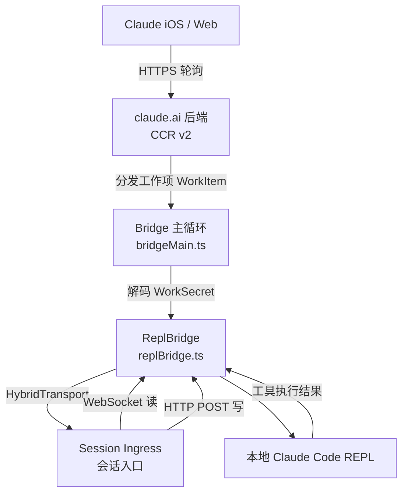

# 第20章 周边功能与工具集
源地址：https://github.com/zhu1090093659/claude-code
## 本章导读

前面的章节深入剖析了 Claude Code 的核心架构——工具系统、REPL 交互层、Hooks 机制与组件库。本章转换视角，将目光投向那些散落在代码库边缘、却不可或缺的"周边设施"。这些模块彼此独立，却共同构成了 Claude Code 完整的工程图景：从手机端远程操控本机开发环境的 Bridge 系统，到解析 Vi 按键序列的状态机，再到悄然完成格式迁移的数据管道，每一处细节都值得一看。

本章采用参考手册式的写法，为每个模块给出定位、关键文件和具有代表性的代码片段，帮助读者快速建立全局认知，而非对每一行代码进行逐字解析。

### 代码库目录概览

```
src/
├── bridge/          # 远程控制 (Remote Control) 桥接层 — 28 个文件
├── cli/
│   ├── handlers/    # CLI 子命令处理器
│   └── transports/  # SSE / WebSocket / Hybrid 传输层
├── remote/          # CCR (Claude Code Remote) 会话管理 — 4 个文件
├── server/          # Direct Connect Unix 域套接字服务器 — 3 个文件
├── vim/             # Vim 模式状态机 — 5 个文件
├── migrations/      # 配置数据迁移脚本 — 10 个文件
├── buddy/           # 同伴精灵系统 — 5 个文件
├── outputStyles/    # 输出样式加载器 — 1 个文件
└── utils/           # 通用工具库 — 564 个文件（含众多子目录）
```

---

## 20.1 Bridge 系统：从手机操控你的代码库

### 功能定位

Bridge 系统（位于 `bridge/` 目录）让用户能够从 iOS、Android 或 Web 版的 Claude 应用向运行在本机或云端服务器上的 Claude Code 发送指令。这是"Remote Control"功能的底层实现，核心思想是：将 claude.ai 的对话前端与 Claude Code 的工具执行能力通过一套轮询加 WebSocket 的协议连接起来。

### 架构概览



### 关键文件

| 文件 | 职责 |
|------|------|
| `bridgeMain.ts` | 主循环：轮询工作队列、生成 worktree、管理生命周期 |
| `replBridge.ts` | 单会话核心：建立传输层、转发消息、处理控制流 |
| `replBridgeTransport.ts` | v1/v2 传输工厂函数 |
| `jwtUtils.ts` | JWT 解码与令牌自动刷新调度器 |
| `trustedDevice.ts` | 可信设备令牌的注册与存储 |
| `pollConfigDefaults.ts` | 轮询间隔配置（含 GrowthBook 远程调参） |

### 轮询状态与会话模式

Bridge 有三种会话产生模式（`SpawnMode`），由 `--spawn` 参数控制：

```typescript
// bridge/types.ts — SpawnMode 定义
export type SpawnMode = 'single-session' | 'worktree' | 'same-dir'
```

- `single-session`：在当前目录运行一个会话，结束即退出
- `worktree`：每个会话获得独立的 Git worktree，适合并发作业
- `same-dir`：所有会话共享工作目录（会相互覆盖，慎用）

轮询间隔由 `pollConfigDefaults.ts` 定义，分为"未满载"和"已满载"两档：

```typescript
// bridge/pollConfigDefaults.ts
const POLL_INTERVAL_MS_NOT_AT_CAPACITY = 2000      // 2 秒，快速接活
const POLL_INTERVAL_MS_AT_CAPACITY = 600_000        // 10 分钟，维持心跳
```

### 令牌刷新调度器

Bridge 会话使用短期 JWT 作为 session-ingress 的访问凭证。`jwtUtils.ts` 中的 `createTokenRefreshScheduler` 在令牌过期前 5 分钟主动触发刷新，避免会话在长时间运行后因认证失败中断：

```typescript
// bridge/jwtUtils.ts — 刷新调度器创建
export function createTokenRefreshScheduler({
  getAccessToken,
  onRefresh,
  label,
  refreshBufferMs = TOKEN_REFRESH_BUFFER_MS, // 默认 5 分钟
}: {
  getAccessToken: () => string | undefined | Promise<string | undefined>
  onRefresh: (sessionId: string, oauthToken: string) => void
  label: string
  refreshBufferMs?: number
}): {
  schedule: (sessionId: string, token: string) => void
  scheduleFromExpiresIn: (sessionId: string, expiresInSeconds: number) => void
  cancel: (sessionId: string) => void
  cancelAll: () => void
}
```

调度器内部用"generation 计数器"解决 `setTimeout` 的竞态：每次 `schedule()` 或 `cancel()` 都会递增 generation，正在飞行的异步刷新回调会比对 generation，若已失效则静默退出。

### 可信设备机制

为了给 Bridge 会话提供更高的安全等级（`SecurityTier=ELEVATED`），claude.ai 引入了可信设备令牌机制。`trustedDevice.ts` 在用户登录后立即向后端注册当前设备，并将返回的长期令牌（90 天滚动有效期）存入系统密钥链（Keychain / Secret Service）：

```typescript
// bridge/trustedDevice.ts — 设备注册核心逻辑（简化）
response = await axios.post(
  `${baseUrl}/api/auth/trusted_devices`,
  { display_name: `Claude Code on ${hostname()} · ${process.platform}` },
  { headers: { Authorization: `Bearer ${accessToken}` } }
)
storageData.trustedDeviceToken = response.data.device_token
secureStorage.update(storageData)
```

该功能受 GrowthBook 特性门控（`tengu_sessions_elevated_auth_enforcement`）保护，支持 CLI 侧与服务侧分阶段上线。

### ReplBridgeHandle 接口

`replBridge.ts` 导出的 `ReplBridgeHandle` 是单个 Bridge 会话的完整操作句柄，REPL 主循环通过它向远端发送消息：

```typescript
// bridge/replBridge.ts — 会话句柄类型
export type ReplBridgeHandle = {
  bridgeSessionId: string
  environmentId: string
  sessionIngressUrl: string
  writeMessages(messages: Message[]): void
  writeSdkMessages(messages: SDKMessage[]): void
  sendControlRequest(request: SDKControlRequest): void
  sendControlResponse(response: SDKControlResponse): void
  sendControlCancelRequest(requestId: string): void
  sendResult(): void
  teardown(): Promise<void>
}

export type BridgeState = 'ready' | 'connected' | 'reconnecting' | 'failed'
```

---

## 20.2 CLI 传输层：将输出送达各种消费者

### 功能定位

`cli/transports/` 目录实现了 Claude Code 向外部消费者推送消息的几种传输协议。这些传输层统一实现 `Transport` 接口，消费者可以是远程 IDE、Web UI，也可以是接收结构化 JSON 的 SDK 调用方。

### 传输层家族

**WebSocketTransport**（`WebSocketTransport.ts`）是基础实现：建立 WebSocket 连接，支持指数退避重连（最长等待 10 分钟放弃），并维护 45 秒的活跃性探测定时器。

**HybridTransport**（`HybridTransport.ts`）继承 WebSocketTransport，改写方向：读取仍用 WebSocket，但写入改为 HTTP POST。这是 Bridge 模式的默认传输，原因是：Bridge 的写操作采用 `void transport.write()` 即发即忘，若同时有多个 POST 在飞行，并发写入 Firestore 同一文档会引发冲突风暴。HybridTransport 通过 `SerialBatchEventUploader` 实现严格串行：

```typescript
// cli/transports/HybridTransport.ts — 写入流程注释
/**
 * Write flow:
 *
 *   write(stream_event) ─┐
 *                        │ (100ms timer: 合并内容增量)
 *                        ▼
 *   write(other) ────► uploader.enqueue()
 *                        │
 *                        ▼ serial, batched, retries indefinitely
 *                   postOnce()  (single HTTP POST)
 */
```

对 `stream_event` 类型的消息（LLM 流式输出的内容增量），HybridTransport 会累积 100ms 后批量发送，以减少 POST 次数。其他消息类型会立即刷新已缓存的流式事件，以保证顺序。

**SSETransport**（`SSETransport.ts`）使用 Server-Sent Events 读取、HTTP POST 写入。它实现了 CCR v2 的事件流格式（`event: client_event`），内部维护序列号去重集合，并通过 `Last-Event-ID` 请求头实现断线续传：

```typescript
// cli/transports/SSETransport.ts — 连接时携带续传位点
if (this.lastSequenceNum > 0) {
  sseUrl.searchParams.set('from_sequence_num', String(this.lastSequenceNum))
  headers['Last-Event-ID'] = String(this.lastSequenceNum)
}
```

### structuredIO.ts：结构化 JSON 模式

`cli/structuredIO.ts` 实现了 `--output-format json` 模式下的 I/O 处理器。在该模式下，所有工具调用请求、权限决策、助手消息均以 NDJSON（Newline-Delimited JSON）格式写入 stdout，外部程序（如 CI 系统、IDE 插件）可直接解析：

```
{"type":"assistant","message":{...}}
{"type":"tool_use","id":"...","name":"Read","input":{...}}
{"type":"tool_result","tool_use_id":"...","content":"..."}
{"type":"result","subtype":"success","cost_usd":0.012}
```

`print.ts` 是"无头打印模式"的入口，当 `--print` 参数存在时激活。它绕过交互式 REPL，将单次提示的输出直接打印后退出，适合脚本调用。

---

## 20.3 Remote Sessions：CCR 集成

### 功能定位

`remote/` 目录实现了客户端侧的 CCR（Claude Code Remote）会话管理。与 Bridge 系统不同，这里是"查看者"视角——用户在本地 claude 命令中连接到已经在云端运行的会话，接收消息、提交权限决策，而不是启动新会话。

### 关键文件

`RemoteSessionManager.ts` 是核心。它通过 `SessionsWebSocket`（封装了重连逻辑的 WebSocket 客户端）接收来自 CCR 的消息，并将控制消息（权限请求、控制取消）分派给调用方：

```typescript
// remote/RemoteSessionManager.ts — 会话配置
export type RemoteSessionConfig = {
  sessionId: string
  getAccessToken: () => string
  orgUuid: string
  hasInitialPrompt?: boolean
  /**
   * When true, this client is a pure viewer.
   * Ctrl+C/Escape do NOT send interrupt to the remote agent.
   */
  viewerOnly?: boolean
}
```

`viewerOnly` 模式用于 `claude assistant` 子命令——用户可以旁观远端会话的执行过程，但不发送中断信号，也不更新会话标题。

`sdkMessageAdapter.ts` 负责在 CCR 的 wire 格式与 Claude Code SDK 消息格式之间做适配，屏蔽版本差异。

---

## 20.4 Direct Connect：IDE 扩展的直连通道

### 功能定位

`server/` 目录实现了一个轻量级的 HTTP + WebSocket 服务器，专为 IDE 扩展（如 VS Code 插件、JetBrains 插件）提供进程内直连能力。与 Bridge 的云端中转不同，Direct Connect 完全在本机完成通信，延迟极低。

### 协议流程

```typescript
// server/createDirectConnectSession.ts — 创建会话请求
resp = await fetch(`${serverUrl}/sessions`, {
  method: 'POST',
  headers,
  body: jsonStringify({ cwd, dangerously_skip_permissions: true }),
})
// 返回: { session_id, ws_url, work_dir }
```

IDE 扩展向 Claude Code 进程内的 HTTP 服务 POST `/sessions`，获得 WebSocket URL，随后通过 WebSocket 订阅 `StdoutMessage` 事件流。`DirectConnectSessionManager`（`directConnectManager.ts`）在客户端侧管理连接，并将收到的消息分派给 `onMessage` / `onPermissionRequest` 回调。

这套协议与 SDK 的 `--output-format json` 模式共用消息格式，IDE 插件无需了解内部细节即可显示实时输出。

---

## 20.5 Vim 模式：REPL 中的 Vi 键绑定

### 功能定位

`vim/` 目录为 REPL 的提示输入框（`PromptInput`）实现了一套完整的 Vim 键绑定。用户可通过设置开启该功能，随后在输入框中使用 Normal、Insert、Visual 模式进行文本编辑，体验接近终端 Vim。

### 状态机设计

Vim 模式的核心是一个纯函数状态机，`types.ts` 用 TypeScript 的联合类型完整描述了所有可能的状态：

```typescript
// vim/types.ts — 完整状态定义
export type VimState =
  | { mode: 'INSERT'; insertedText: string }
  | { mode: 'NORMAL'; command: CommandState }

export type CommandState =
  | { type: 'idle' }
  | { type: 'count'; digits: string }
  | { type: 'operator'; op: Operator; count: number }
  | { type: 'operatorCount'; op: Operator; count: number; digits: string }
  | { type: 'operatorFind'; op: Operator; count: number; find: FindType }
  | { type: 'operatorTextObj'; op: Operator; count: number; scope: TextObjScope }
  | { type: 'find'; find: FindType; count: number }
  | { type: 'g'; count: number }
  | { type: 'replace'; count: number }
  | { type: 'indent'; dir: '>' | '<'; count: number }
```

状态图注释直接内嵌在 `types.ts` 头部，清楚地展示了 Normal 模式下每个按键如何触发状态转换：

```
idle ──┬─[d/c/y]──► operator
       ├─[1-9]────► count
       ├─[fFtT]───► find
       ├─[g]──────► g
       ├─[r]──────► replace
       └─[><]─────► indent
```

### 转换函数

`transitions.ts` 的 `transition()` 函数是状态机的驱动器，接收当前状态、输入字符和操作上下文，返回下一个状态和（可选的）待执行副作用：

```typescript
// vim/transitions.ts — 主分发函数
export function transition(
  state: CommandState,
  input: string,
  ctx: TransitionContext,
): TransitionResult {
  switch (state.type) {
    case 'idle':    return fromIdle(input, ctx)
    case 'count':   return fromCount(state, input, ctx)
    case 'operator': return fromOperator(state, input, ctx)
    // ...其余状态
  }
}

export type TransitionResult = {
  next?: CommandState   // 无则回 idle
  execute?: () => void  // 有副作用则立即执行
}
```

`PersistentState` 跨命令保存"寄存器"（剪贴板内容）、"最后查找字符"和"最后修改"，用于支持 `.` 重复命令和 `;` / `,` 重复查找。

### 操作符与文本对象

`operators.ts` 实现了 d/c/y 等操作符与运动命令的组合执行，例如 `dw`（删除单词）、`ci"` （修改引号内文本）。`textObjects.ts` 定义了 `iw`、`a"`、`i(` 等文本对象的范围计算逻辑。`motions.ts` 实现了 h/j/k/l、w/b/e、0/^/$ 等运动命令的光标偏移计算。

---

## 20.6 Migrations：配置数据的平滑迁移

### 功能定位

`migrations/` 目录存放了一系列"一次性数据迁移"脚本，在 Claude Code 启动时依序执行，将老版本 `settings.json` 或全局配置中的字段升级为新格式。这类迁移通常是幂等的，只在检测到需要迁移的条件时才写入。

### 典型迁移模式

以 `migrateSonnet45ToSonnet46.ts` 为例，它将用户手动固定为 Sonnet 4.5 的模型字符串迁移到通用别名 `sonnet`：

```typescript
// migrations/migrateSonnet45ToSonnet46.ts
export function migrateSonnet45ToSonnet46(): void {
  // 只迁移一方订阅用户，API 用户不受影响
  if (getAPIProvider() !== 'firstParty') return
  if (!isProSubscriber() && !isMaxSubscriber()) return

  const model = getSettingsForSource('userSettings')?.model
  // 精确匹配，不误伤其他设置
  if (model !== 'claude-sonnet-4-5-20250929' && /* ... */) return

  const has1m = model.endsWith('[1m]')
  updateSettingsForSource('userSettings', {
    model: has1m ? 'sonnet[1m]' : 'sonnet',
  })
}
```

另一个典型例子 `migrateAutoUpdatesToSettings.ts` 将存储在全局配置（`~/.claude/config`）中的 `autoUpdates: false` 标志迁移到 `settings.json` 的 `env.DISABLE_AUTOUPDATER` 字段：这是从"全局配置字段"向"环境变量注入"模式演进的典型案例，有利于企业管理员通过 MDM 统一管控。

### 迁移调用位置

所有迁移函数在应用启动时的初始化阶段被集中调用，顺序执行，每次调用都是幂等的（先检查条件，条件不满足则直接返回）。

现有迁移列表展示了模型别名演进的历史轨迹：

| 迁移脚本 | 内容 |
|----------|------|
| `migrateFennecToOpus.ts` | Fennec 内部代号 → Opus |
| `migrateLegacyOpusToCurrent.ts` | 旧 Opus 字符串 → 当前格式 |
| `migrateOpusToOpus1m.ts` | Opus → Opus 1m |
| `migrateSonnet1mToSonnet45.ts` | Sonnet 1m → Sonnet 4.5 |
| `migrateSonnet45ToSonnet46.ts` | Sonnet 4.5 → Sonnet 4.6 |
| `migrateReplBridgeEnabledToRemoteControlAtStartup.ts` | Bridge 配置键重命名 |
| `migrateAutoUpdatesToSettings.ts` | 自动更新偏好 → 环境变量 |

---

## 20.7 Utils 全景：564 个文件的工具库

`utils/` 是整个代码库中规模最大的目录，包含 564 个文件。以下列出几个在理解整体架构时最有参考价值的子目录。

### bash/ — Shell 命令分析

`bash/` 子目录实现了对 shell 命令的静态分析，这是权限系统能够理解"这条命令在做什么"的基础。

核心是 `bashParser.ts` + `ast.ts`，基于 tree-sitter 解析 bash 语法树。`commands.ts` 提取命令名、参数、管道结构。`shellQuoting.ts` 正确处理单引号、双引号与转义序列，避免误判。`shellPrefix.ts` 识别环境变量前缀（如 `NODE_ENV=production npm run build`）。

### permissions/ — 权限规则引擎

第 14 章（Hooks 层）中提到的权限系统，其核心规则求值逻辑就在 `permissions/` 子目录中：

- `PermissionRule.ts`：规则数据类型（allow/deny + 匹配模式）
- `permissionRuleParser.ts`：从配置文件解析规则字符串
- `shellRuleMatching.ts`：将 shell 命令与规则进行模糊匹配
- `bashClassifier.ts`：基于命令特征对操作危险程度分类
- `dangerousPatterns.ts`：高危命令模式的静态白名单/黑名单
- `yoloClassifier.ts`：`--dangerously-skip-permissions` 模式下的快速放行分类器

### swarm/ — 多智能体协调

`swarm/` 子目录支撑了第 16 章介绍的多智能体（Swarm）功能。关键文件：

- `backends/`：并发执行后端（进程内 vs 子进程）
- `leaderPermissionBridge.ts`：Leader 代理收集子代理的权限请求，汇总后呈现给用户
- `teammateInit.ts`：子代理初始化流程
- `reconnection.ts`：子代理重连逻辑

### settings/ — 配置加载

`settings/` 管理 Claude Code 的多层配置合并（系统级 → 用户级 → 项目级 → 本地级）：

- `settings.ts`：主读写函数 `getSettingsForSource` / `updateSettingsForSource`
- `settingsCache.ts`：带失效机制的设置缓存
- `validation.ts`：Zod schema 驱动的配置校验
- `mdm/`：企业 MDM（Mobile Device Management）管控策略读取

### model/ — 模型选择

`model/` 处理"用户说要用哪个模型"到"实际 API 调用用哪个字符串"的全链路逻辑：

- `aliases.ts`：`sonnet`、`opus`、`haiku` 等别名的实际模型 ID 映射
- `modelCapabilities.ts`：各模型支持的功能特性（1m 上下文、计算机使用等）
- `providers.ts`：一方（claude.ai）、Bedrock、Vertex 等提供方的路由
- `deprecation.ts`：旧模型名的废弃警告与强制迁移逻辑

### telemetry/ — 遥测助手

`telemetry/` 封装了多种遥测后端：

- `events.ts`：所有事件名称的类型定义，确保 `logEvent` 调用时不出错
- `sessionTracing.ts`：基于 OpenTelemetry 的会话级 Trace
- `perfettoTracing.ts`：Perfetto trace 格式导出（供性能分析工具使用）
- `bigqueryExporter.ts`：Anthropic 内部 BigQuery 事件推送

---

## 20.8 杂项模块

### Buddy：同伴精灵系统

`buddy/` 目录实现了 Claude Code 的"同伴"功能——一个基于用户 ID 确定性生成的虚拟精灵，有物种、眼睛、帽子、稀有度和五项能力值。

物种列表有 18 种（duck、goose、blob、cat、dragon 等），稀有度概率从 common（60%）到 legendary（1%）。有趣的是，`types.ts` 中物种名称通过字符码拼接而非直接字面量，以避免触发代码库的内部字符串检查：

```typescript
// buddy/types.ts — 使用字符码规避字符串检查
const c = String.fromCharCode
export const duck = c(0x64,0x75,0x63,0x6b) as 'duck'
export const goose = c(0x67,0x6f,0x6f,0x73,0x65) as 'goose'
```

同伴的"骨架"（物种、稀有度等外观属性）在每次读取时从 `hash(userId)` 重新推导，确保用户无法通过手动编辑配置文件伪造稀有度。"灵魂"（名字、个性描述）才持久化存储在 `~/.claude/config` 中。

### voice/：语音输入

`voice/` 目录目前只有一个文件 `voiceModeEnabled.ts`，是语音输入模式的特性开关检查函数。完整的语音输入处理逻辑应在其他模块中，此处仅作功能开关。

### outputStyles/：输出样式

`outputStyles/loadOutputStylesDir.ts` 实现了自定义输出样式的加载机制。用户可以在 `.claude/output-styles/` 目录或 `~/.claude/output-styles/` 目录下放置 Markdown 文件，每个文件代表一种输出样式，文件名即样式名，正文内容作为附加的系统提示注入对话：

```
.claude/
└── output-styles/
    ├── concise.md      # 简洁模式：只输出结论
    ├── detailed.md     # 详细模式：逐步解释
    └── review.md       # 代码审查格式
```

样式文件支持 frontmatter，可设置 `name`、`description` 和 `keep-coding-instructions` 等元数据。

---

## 本章小结

本章完成了对 Claude Code 周边功能模块的系统性巡礼：

Bridge 系统是连接移动端与本地开发环境的关键基础设施，其轮询机制、JWT 刷新调度和可信设备注册共同构成了安全可靠的远程控制通道。传输层家族（SSE、WebSocket、Hybrid）为不同场景下的消费者提供了最优的通信策略，HybridTransport 的串行批量上传设计尤其值得关注，它用架构约束消除了并发写入引发的冲突问题。

Vim 模式的状态机是一个教科书式的纯函数设计——状态、输入、输出都有精确的类型定义，TypeScript 的穷举检查成为状态转换的天然护栏。迁移系统则以幂等脚本的形式，悄无声息地处理了模型别名演进与配置字段重组的历史包袱。

`utils/` 目录的 564 个文件是整个系统的神经末梢，bash 分析、权限规则引擎、多智能体协调、配置加载、模型选择和遥测等子系统各司其职，共同支撑着前面章节中描述的所有高层功能。Buddy 精灵和 outputStyles 则展示了 Claude Code 在功能完备之余，为用户体验投入的一份不失温度的心意。

理解这些周边模块，有助于在扩展 Claude Code 时找到正确的切入点，也有助于在排查问题时迅速定位责任边界。
