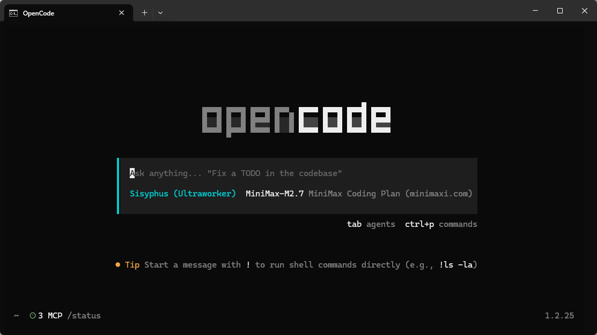
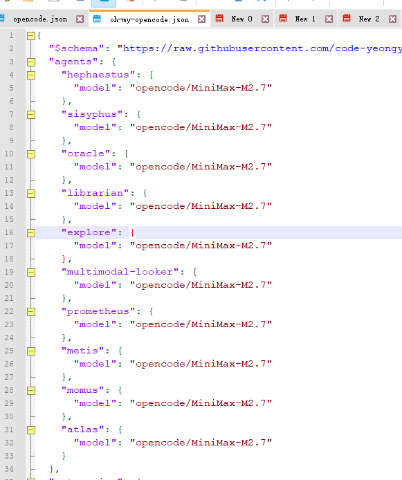

```
title: Oh-My-OpenCode
```

# 🚀 Oh-My-OpenCode (OMO) 深度指南

**Oh-My-OpenCode** 是一个面向 AI 原生开发者的增强型命令行工具集，通过“万神殿”多智能体架构和 MCP 协议，将你的终端转变为一个全自动的编码工作站。
------
## 🛠️ 安装与配置

### 方式一：AI 助手一键安装（推荐）

在 **Cursor / Claude Code / OpenCode** 会话中直接粘贴：

> Install and configure oh-my-opencode by following the instructions here:
>
> https://raw.githubusercontent.com/code-yeongyu/oh-my-opencode/refs/heads/master/docs/guide/installation.md

### 方式二：交互式安装

Bash

```
# 使用 Bun (推荐，速度极快)
bunx oh-my-opencode install

# 或使用 npx
npx oh-my-opencode install
```

*提示：安装过程中请准备好你的 Claude、OpenAI 或 Gemini API Key。*



------

## 🏛️ 核心架构：万神殿 (The Pantheon)

OMO 不只是一个简单的脚本，它将任务分发给具有不同“人格”的 AI 智能体：

| **角色**     | **代号**       | **职责**                       | **推荐模型**              |
| ------------ | -------------- | ------------------------------ | ------------------------- |
| **首席策划** | **Sisyphus**   | 全局规划、任务拆解、矛盾协调   | Claude 3.5 Sonnet / 4.0   |
| **工匠**     | **Hephaestus** | 具体代码实现、重构、Bug 修复   | Claude 3.5 / GPT-4o       |
| **侦察兵**   | **Explorer**   | 代码库扫描、文件定位、模式搜索 | Gemini 1.5 Flash (低延迟) |
| **战略顾问** | **Oracle**     | 架构决策、复杂逻辑攻坚         | o1 / GPT-5 系列           |

------

## ⚡ 招牌功能：Ultrawork (全自动模式)

这是 OMO 的核心竞争力。当你输入一个复杂的模糊需求时，系统会进入**自主循环**。

**示例指令：**

```
ultrawork: 为我的 VitePress 博客添加基于 Giscus 的评论系统
```

**工作流拆解：**

1. **探索 (Explore)：** 自动读取 `docs/.vitepress/config.ts` 和主题入口。
2. **计划 (Plan)：** 确定需要修改的 Vue 组件位置及环境变量配置。
3. **并行 (Execute)：** 同时启动子任务：生成 Giscus 配置代码、修改主题布局、更新文档。
4. **验证 (Verify)：** 自动运行 `npm run build`，若报错则根据日志自动修复，直到成功。

------

## 🔌 MCP Servers：赋予 AI 实时超能力

OMO 深度集成了 **Model Context Protocol (MCP)**，通过 `/status` 可以查看当前激活的服务：

### 1. `websearch` (实时联网)

- **作用：** 突破模型训练数据的时间限制。
- **场景：** “查询 VitePress 2.0 最新的 API 变更。”

### 2. `context7` (实时技术栈知识库)

- **作用：** 自动同步最新开源库的官方文档。
- **场景：** 避免 AI 使用过时的 React Hooks 语法或已弃用的 API。

### 3. `grep_app` (GitHub 全量搜索)

- **作用：** 在数百万开源仓库中寻找代码实现参考。
- **场景：** “看看别人是怎么在 VitePress 里实现暗黑模式切换动画的。”

------

## 💎 为什么选择 OMO？

- **极致省钱 (Token Optimization)：** 自动路由技术。UI 微调交给廉价的 Gemini，核心逻辑交给昂贵的 Claude。
- **理解 AST (抽象语法树)：** 它不是简单的文本替换，而是像编译器一样理解你的代码结构。
- **并行处理：** 支持 5+ 个任务同步推进，开发效率呈指数级提升。

配置各智能体模型：
C:\用户\账户\.config\opencode\oh-my-opencode.json
