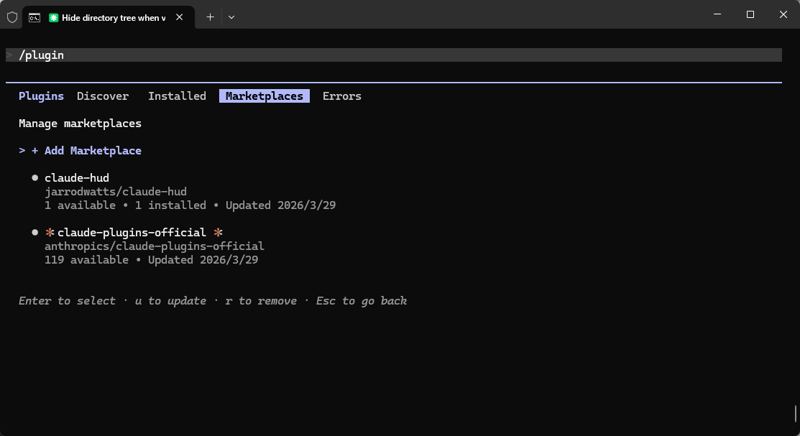
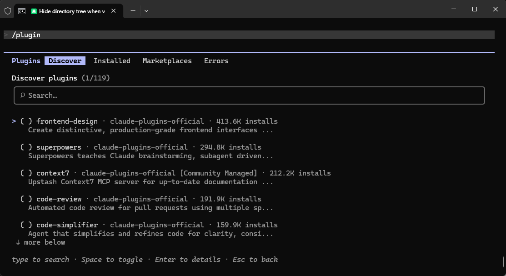

# Claude Code 官方插件市场

> **插件来源**：`anthropics/claude-plugins-official`
>
> **GitHub 仓库**：[https://github.com/anthropics/claude-plugins-official](https://github.com/anthropics/claude-plugins-official)

Claude Code 官方插件市场提供了一系列扩展能力的插件，涵盖前端开发、代码审查、自动化测试、文档管理等场景。

在终端输入 `/plugin` 即可直接看到 **Marketplaces** 和 **Discover** 入口：





## 快速开始

**第一步：添加官方插件市场**（仅需执行一次）

```bash
/plugin marketplace add anthropics/claude-plugins-official
```

**第二步：安装插件**

```bash
# 安装单个插件
/plugin install [plugin-name]@claude-plugins-official

# 批量安装
/plugin install frontend-design@claude-plugins-official context7@claude-plugins-official

# 安装后重载
/reload-plugins
```

**常用管理命令**

```bash
/plugin list          # 查看已安装插件
/plugin uninstall [plugin-name]  # 卸载插件
/plugin update [plugin-name]     # 更新插件
```

---

## 热门插件一览

| 插件 | 安装量 | 核心功能 | 详情 |
|------|:------:|------|:----:|
| [frontend-design](./frontend-design) | 413.6K | 生成高质量、有设计感的前端 UI 代码，告别千篇一律的 AI 风格 | [查看 →](./frontend-design) |
| [superpowers](./superpowers) | 294.8K | 超能力模式：头脑风暴 + 子代理协作 + 多步骤规划 | [查看 →](./superpowers) |
| [context7](./context7) | 212.2K | 实时注入第三方库最新文档，解决训练数据过时问题 | [查看 →](./context7) |
| [code-review](./code-review) | 191.9K | 四个并行 Agent 全维度审查 PR，附置信度评分 | [查看 →](./code-review) |
| [code-simplifier](./code-simplifier) | 159.9K | 自动简化重构代码，提升可读性，功能不变 | [查看 →](./code-simplifier) |
| [github](./github) | 158.3K | 官方 GitHub MCP 服务器，管理仓库 / PR / Issue | [查看 →](./github) |
| [feature-dev](./feature-dev) | 143.9K | 七阶段功能开发工作流，三个专属 Agent 协作完成 | [查看 →](./feature-dev) |
| [playwright](./playwright) | 134.6K | 浏览器自动化与 E2E 测试 MCP 服务器 | [查看 →](./playwright) |
| [ralph-loop](./ralph-loop) | 120.6K | 自引用 AI 闭环迭代，持续执行直到满足完成条件 | [查看 →](./ralph-loop) |
| [typescript-lsp](./typescript-lsp) | 116.5K | TypeScript/JS 语言服务器，类型检查 + 代码补全 | [查看 →](./typescript-lsp) |
| [claude-md-management](./claude-md-management) | 110.2K | 维护优化 CLAUDE.md，保持项目文档与代码同步 | [查看 →](./claude-md-management) |
| [skill-creator](./skill-creator) | 105.9K | 创建和优化 Claude 自定义技能，扩展 AI 能力边界 | [查看 →](./skill-creator) |

---

## 场景推荐

| 我想做… | 推荐插件 |
|---------|---------|
| 生成漂亮的前端页面 | `frontend-design` |
| 开发一个完整的新功能 | `feature-dev` + `context7` |
| 审查/合并 PR | `code-review` + `github` |
| 重构老代码 | `code-simplifier` + `ralph-loop` |
| 写 TypeScript 项目 | `typescript-lsp` + `context7` |
| 做 E2E 自动化测试 | `playwright` |
| 管理项目文档 | `claude-md-management` |
| 解决复杂问题 | `superpowers` |
