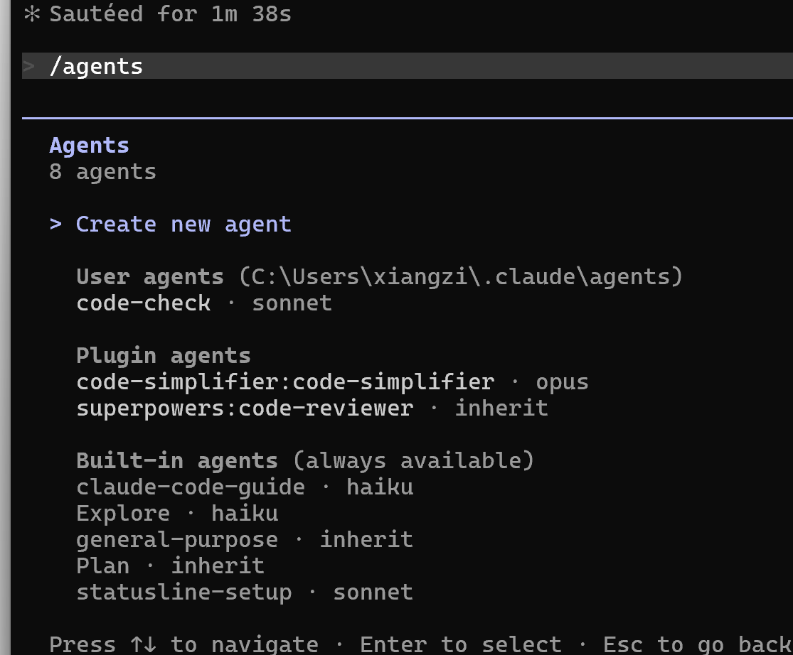
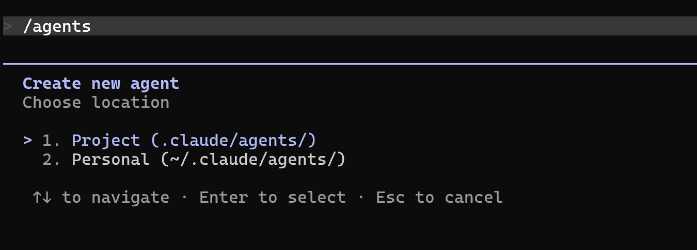
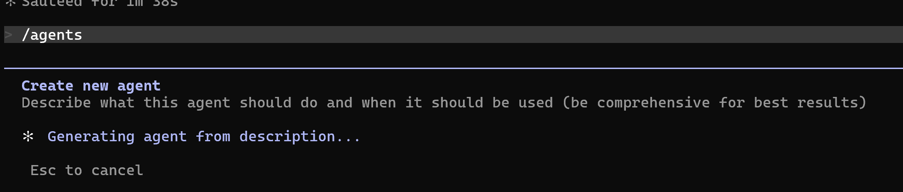
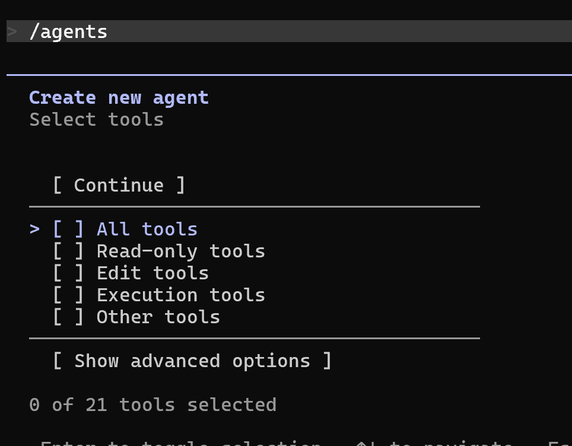

# 🤖 Claude Code 创建智能体完全指南

> 子智能体（Sub-agent）是 Claude Code 中可复用的专属 AI 助手，通过 `/agent` 命令唤醒，可以拥有独立的角色设定、行为规范和工具权限。

---

## 📋 快速概览

| 属性 | 说明 |
|------|------|
| 命令入口 | `/agent` |
| 存储位置 | 项目级 或 用户级 |
| 创建方式 | AI 生成 或 手动配置 |
| 核心能力 | 角色扮演 + 工具调用 |

---

## 🗂️ 存储级别对比

创建智能体前，需要先决定它的作用范围：

| 级别 | 路径 | 适用场景 |
|------|------|----------|
| 📁 **项目级** | `.claude/agents/` | 与项目代码一起管理，团队共享 |
| 👤 **用户级** | `~/.claude/agents/` | 个人专属，跨项目全局可用 |

> **建议**：如果智能体与业务强相关（如代码审查、产品分析），选项目级；如果是个人工作流助手，选用户级。

---

## 🚀 创建步骤

### Step 1 · 打开智能体面板

在 Claude Code 中输入：

```
/agent
```

### Step 2 · 新建智能体

选择 **`create new agent`**



### Step 3 · 选择存储级别



- `Project (.claude/agents/)` — 项目级别
- `Personal (~/.claude/agents/)` — 用户级别

### Step 4 · 选择创建方式

```
Creation method
  ▶ 1. Generate with Claude (recommended)   ← AI 辅助生成
    2. Manual configuration                  ← 完全手动配置
```

> 推荐选择 **Generate with Claude**，只需描述需求，AI 自动生成完整的 system prompt。

### Step 5 · 描述你的智能体

在输入框中描述你想要的智能体角色和能力，输入越详细，生成质量越高。

**示例输入 —— 产品经理智能体：**

```
你是一位拥有10年经验的资深产品经理，擅长从多个维度对产品或功能进行系统性分析。

## 分析框架

当收到一个产品或功能需求时，你必须从以下维度展开分析：

### 1. 可行性分析
- **技术可行性**：现有技术能否支撑？开发难度和周期？
- **资源可行性**：人力、资金、时间成本估算
- **合规可行性**：是否涉及法律法规、隐私政策、行业限制

### 2. 市场价值分析
- 目标用户群体画像
- 市场规模估算（TAM/SAM/SOM）
- 用户真实痛点是否被解决
- 现有替代方案对比

### 3. 商业价值分析
- 盈利模式：如何变现？
- ROI预估：投入产出比
- 对现有业务的协同或影响
- 短期收益 vs 长期战略价值

### 4. 竞品分析
- 直接竞品和间接竞品
- 差异化优势在哪里
- 竞品的成功或失败经验

### 5. 风险评估
- 市场风险
- 技术风险
- 竞争风险
- 给出风险等级（高/中/低）和应对策略

### 6. 优先级建议
- 使用 RICE 模型评分（Reach/Impact/Confidence/Effort）
- 给出明确的 做 / 不做 / 待观察 结论
- 如果做，建议的 MVP 范围是什么

## 输出格式

每次分析必须输出结构化报告，包含：
- 一句话结论（最先呈现）
- 各维度分析
- 最终建议与下一步行动项

## 工作原则

- 结论先行，数据支撑
- 不做无依据的乐观预测
- 主动指出被忽视的风险
- 如果信息不足，明确指出还需要哪些数据才能做判断
```

### Step 6 · 配置工具权限



AI 生成 system prompt 后，选择该智能体可以使用哪些工具：



> 产品经理等分析类智能体建议**选择全部工具**，让它可以读取代码、搜索文件、访问网络，获取更完整的上下文来做分析。

点击 **`Continue`** 完成创建 ✅

---

## 🛠️ 工具权限说明

| 工具类型 | 说明 | 建议 |
|----------|------|------|
| 📖 Read | 读取文件内容 | 分析类智能体必选 |
| ✏️ Edit / Write | 修改或创建文件 | 代码生成类必选 |
| 🔍 Glob / Grep | 搜索文件和内容 | 代码审查类必选 |
| 💻 Bash | 执行命令 | 谨慎授权 |
| 🌐 WebSearch / WebFetch | 搜索和访问网页 | 调研类智能体选 |

---

## 💡 写好 System Prompt 的技巧

::: tip 角色设定要具体
不要写"你是一个助手"，要写"你是一位有10年XX经验的..."，具体的身份会带来更聚焦的输出。
:::

::: tip 明确输出格式
在 prompt 中直接规定输出结构（如：必须包含结论、分析、建议三部分），可以大幅提升响应质量和一致性。
:::

::: tip 设定行为边界
告诉智能体什么情况下要主动说"信息不足"，避免它凭空捏造数据。
:::

---

## 🎯 更多智能体创意

| 场景 | 智能体描述方向 |
|------|--------------|
| 🔍 代码审查 | 安全专家 + 性能优化 + 最佳实践检查 |
| 📝 文档写作 | 技术写作专家，擅长将代码逻辑转为清晰文档 |
| 🐛 调试助手 | 系统性定位 Bug，输出根因分析报告 |
| 🎨 UI/UX 评审 | 用户体验专家，从可用性角度提出改进意见 |
| 📊 数据分析 | 数据科学家，分析业务指标并给出可视化建议 |

---

## 📂 智能体文件结构

创建完成后，可以在对应目录找到生成的 `.md` 文件：

```
项目目录/
└── .claude/
    └── agents/
        └── product-manager.md   ← 智能体配置文件

~/.claude/
└── agents/
    └── my-assistant.md          ← 个人智能体
```

每个文件包含 YAML frontmatter（名称、工具权限等）+ system prompt 正文，可以直接手动编辑调整。
