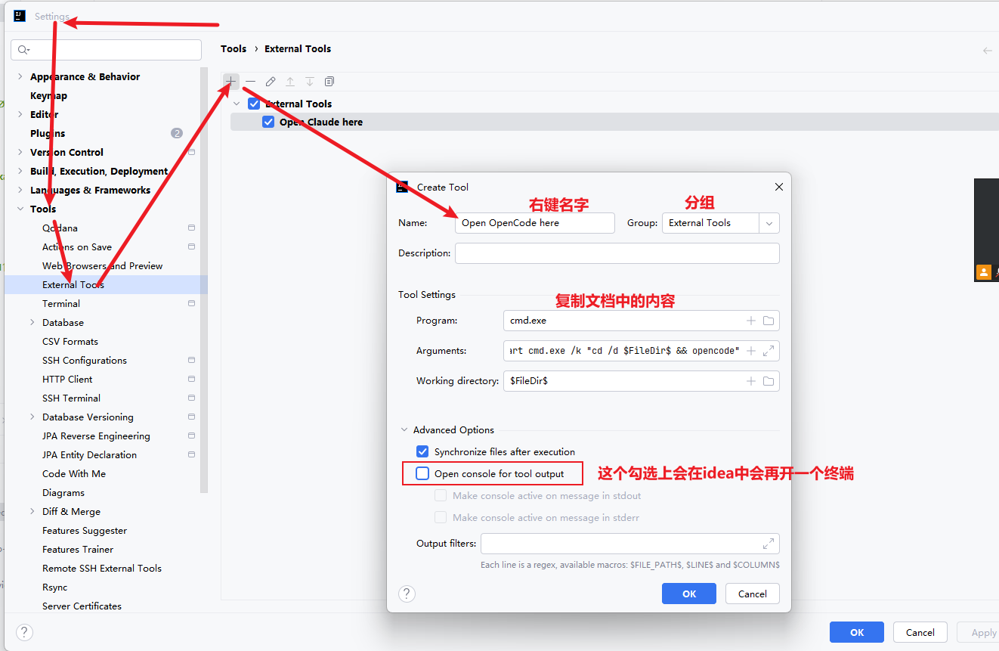
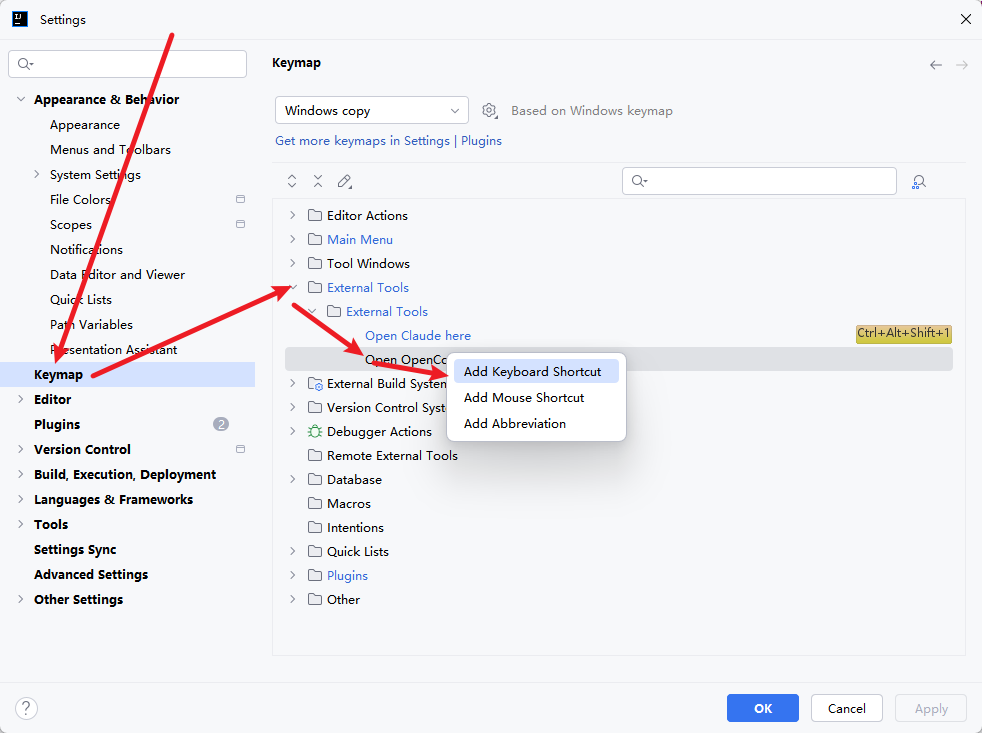

# 🚀 快速打开终端

> 通过注册表与 IDE 配置，在任意目录右键直接启动 Claude / OpenCode 终端，告别繁琐的手动 cd 操作。

---

## 📋 一切的前提

::: tip 前置条件
已安装好 `claude` / `opencode` 等 CLI 工具，并可在终端中直接调用。
:::

这个配置只是为了**快速打开终端**——不想每次都先打开文件夹、再 cmd、再输命令了。个人比较喜欢在 Windows 自带终端上 vibe coding，一天下来会开四个以上终端窗口，每次重复操作太麻烦。

---

## 🤖 个人开发流程参考

| # | 工具组合 | 用途 | 模式 |
|---|---------|------|------|
| 1️⃣ | OpenCode + 国内模型 + oh-my-openagent | 梳理代码结构 | Plan Agent |
| 2️⃣ | OpenCode + 国内模型 + oh-my-openagent | 计划 MD 文档编写 → 执行编码（Tab 切换 Sisyphus） | Plan → Execute |
| 3️⃣ | Claude + Sonnet 4.6 + git | 代码审查 | 审查模式 |
| 4️⃣ | Claude + Sonnet 4.6 + superpowers | 编码能力不足时使用（小任务不必开，token 消耗大） | 编码模式 |

---

## 🛠️ Windows 终端右键快速打开

### Step 1 · 效果预览

### Step 2 · 修改注册表

在任意目录右键即可看到 **Open Claude here** / **Open OpenCode here** 菜单项。

::: tip 注册表脚本
注册表安装与卸载命令已放到附件，直接运行对应 `.reg` 文件即可。
:::

---

## 💡 IDEA 右键快速打开

### Step 1 · 效果预览

### Step 2 · 配置流程

进入 **Settings → Tools → External Tools**，新增两条配置。

### Step 3 · 配置参数 ✅

| 字段 | 🤖 Claude | ⚡ OpenCode |
|------|-----------|------------|
| Name | Open Claude here | Open OpenCode here |
| Program | cmd.exe | cmd.exe |
| Arguments | /c start cmd.exe /k "cd /d $FileDir$ && claude" | /c start cmd.exe /k "cd /d $FileDir$ && opencode" |
| Working directory | $FileDir$ | $FileDir$ |

---

## 🎯 进阶技巧

- 可以将上述 IDEA External Tools 绑定快捷键，进一步提速，我快捷键设置的这么反人类，是因为搭配了键盘自带的映射使用

  
