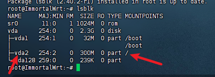

# PVE 安装 ImmortalWrt 保姆级教程

> 适用环境：Proxmox VE 7.x / 8.x，ImmortalWrt 23.05+
>
> 本教程以 **x86-64** 架构为例，将 ImmortalWrt 作为虚拟机运行在 PVE 上，可实现旁路由/主路由/透明代理等用途。

---

## 一、前期准备

### 1.1 下载 ImmortalWrt 镜像

前往官方固件下载页面：

```
https://downloads.immortalwrt.org/releases/
```

选择对应版本，路径示例：

```
releases/23.05.3/targets/x86/64/
```

下载文件：**`immortalwrt-23.05.3-x86-64-generic-ext4-combined-efi.img.gz`**

> **镜像类型说明：**
> - `ext4-combined-efi`：EFI 启动 + ext4 文件系统，推荐 PVE 使用
> - `squashfs-combined-efi`：只读根分区，支持恢复出厂，但扩容麻烦
> - 若你的 PVE 不支持 EFI，选 `combined`（非 efi）版本

### 1.2 解压镜像

在本地（Windows/Linux/Mac）解压 `.gz` 文件，得到 `.img` 文件：

**Windows：** 使用 [7-Zip](https://www.7-zip.org/) 解压  
**Linux/Mac：**

```bash
gunzip immortalwrt-23.05.3-x86-64-generic-ext4-combined-efi.img.gz
```

### 1.3 上传镜像到 PVE

方法一：PVE Web 界面上传

1. 进入 PVE 控制台 → 选择节点 → `local (pve)` → **ISO Images**
2. 点击 **Upload** → 选择 `.img` 文件上传

> ⚠️ PVE 的 ISO 存储本质是目录，`.img` 文件可以正常上传，但后续需要用命令行操作。

方法二：SCP 直接上传到 PVE（推荐）

```bash
scp immortalwrt-*.img root@<PVE_IP>:/var/lib/vz/template/iso/
```

---

## 二、创建虚拟机

### 2.1 新建虚拟机

在 PVE Web 界面点击右上角 **Create VM**，按以下配置填写：

#### General（常规）

| 参数 | 值 |
|------|----|
| VM ID | 自定义，如 `100` |
| Name | `immortalwrt` |

#### OS（操作系统）

| 参数 | 值 |
|------|----|
| Do not use any media | ✅ 勾选（我们后续手动导入磁盘） |
| Guest OS Type | Linux |
| Kernel version | 5.x - 2.6 Kernel |

#### System（系统）

| 参数 | 值 |
|------|----|
| BIOS | **OVMF (UEFI)**（若使用 efi 镜像）或 SeaBIOS（non-efi 镜像） |
| EFI Storage | `local-lvm`（仅 OVMF 时需要） |
| Machine | q35 |
| SCSI Controller | VirtIO SCSI single |

> 💡 若选了 OVMF，会自动添加一个 EFI Disk，正常保留即可。

#### Disks（磁盘）

**先删除默认磁盘**（后续通过命令导入 img），直接点 **Next** 跳过。

#### CPU

| 参数 | 值 |
|------|----|
| Sockets | 1 |
| Cores | 2（根据需求） |
| Type | host（性能最佳） |

#### Memory（内存）

| 参数 | 值 |
|------|----|
| Memory (MiB) | 512 ～ 1024（ImmortalWrt 很轻量） |
| Ballooning | 可关闭 |

#### Network（网络）

| 参数 | 值 |
|------|----|
| Bridge | `vmbr0`（连接到物理网络） |
| Model | VirtIO (paravirtualized) |

> 如需多网口（主路由），点 **Add** 继续添加网卡，绑定不同的 bridge。

#### Confirm（确认）

检查配置，点击 **Finish**，**不要勾选 Start after created**。

---

## 三、导入磁盘镜像

虚拟机创建完成后，需要将 `.img` 文件导入为虚拟磁盘。

### 3.1 在 PVE 终端执行导入命令

登录 PVE Shell（Web 界面 → 节点 → Shell）：

```bash
# 将 img 导入到虚拟机 102，存储到 local-lvm
qm importdisk 102 /var/lib/vz/template/iso/immortalwrt-24.10.5-x86-64-generic-ext4-combined-efi.img local-lvm
```

> 将 `100` 替换为你的 VM ID，`local-lvm` 替换为你的存储名称（可在 PVE → Datacenter → Storage 查看）。

执行成功后会输出类似：

```
Successfully imported disk as 'unused0:local-lvm:vm-100-disk-1'
```

### 3.2 挂载磁盘到虚拟机

1. 进入 PVE Web → 选中虚拟机 → **Hardware**
2. 找到 **Unused Disk 0**（刚导入的磁盘），双击
3. 配置如下：

| 参数 | 值 |
|------|----|
| Bus/Device | **VirtIO Block**，编号 `virtio0` |
| Cache | Write back（性能好）或 No cache |
| Discard | ✅ 勾选（SSD/精简存储推荐） |

4. 点击 **Add** 挂载

### 3.3 设置启动顺序

1. 选中虚拟机 → **Options** → **Boot Order**

2. 点击 **Edit**，将 `virtio0` 勾选并拖到第一位

3. 取消其他不需要的启动项（如 ide2、net0）

4. 点击 **OK**

   

---

#### 选第一项，如果进不去系统

```
选 **`EFI Firmware Setup`**（第二项）回车进入 UEFI 设置界面

进入 **`Device Manager`** → **`Secure Boot Configuration`**

将 **`Attempt Secure Boot`** 改为 **`Disabled`**

按 `F10` 保存，`ESC` 退出，选 **`Reset`** 重启
```


## 四、首次启动与基本配置

### 4.1 启动虚拟机

点击 **Start**，然后点击 **Console** 查看启动日志。

正常启动后会看到 ImmortalWrt 的登录提示：

```
BusyBox v1.36.x ...

ImmortalWrt login:
```

### 4.2 登录系统

```
用户名：root
密　码：（默认为空，直接回车）
```

### 4.3 修改 LAN IP 地址

ImmortalWrt 默认 LAN IP 为 `192.168.1.1`，如果你的主路由也是 `192.168.1.x` 网段，需要修改以避免冲突：

```bash
# 修改 LAN IP（以改为 192.168.2.1 为例）
uci set network.lan.ipaddr='192.168.11.1'
uci commit network
/etc/init.d/network restart
```

### 4.4 通过浏览器访问 Web 管理界面

在浏览器中访问：

```
http://192.168.1.1
```

（或你修改后的 IP）

默认账号：`root`，密码为空（进入后建议立即设置密码）。

---

## 五、扩容磁盘（可选但推荐）

ImmortalWrt 的 img 镜像通常只有 ~400MB，建议扩展到 2GB 以上以安装更多插件。

### 5.1 在 PVE 中扩展磁盘

方法一：Web 界面  
虚拟机 → **Hardware** → 选中磁盘 → **Disk Action** → **Resize** → 填写增加的大小（如 `+2G`）

方法二：宿主机执行命令行

```bash
qm resize 102 virtio0 +2G
```

### 5.2 在 ImmortalWrt 中扩展分区

进入虚拟机 Console：

```bash
# 安装 parted（如未内置）
opkg update && opkg install parted losetup resize2fs

# 查看磁盘分区情况
lsblk

# 扩展分区（假设根分区是 /dev/vda2），根分区看后边的截图
parted /dev/vda resizepart 2 100%


# 扩展文件系统  如果扩容失败看后边有个离线扩容
resize2fs /dev/vda2
```




验证：

```bash
df -h /
```

---

## 六、网络拓扑配置建议

### 6.1 旁路由模式（推荐新手）

```
主路由（192.168.1.1）
    │
    ├── PVE 宿主机（vmbr0）
    │       └── ImmortalWrt VM（单网卡，IP: 192.168.1.2，网关指向主路由）
    │
    └── 其他设备
```

ImmortalWrt 配置：

```bash
# LAN 接口设置为静态 IP，网关指向主路由
uci set network.lan.ipaddr='192.168.1.2'
uci set network.lan.gateway='192.168.1.1'
uci set network.lan.dns='192.168.1.1'
uci set network.lan.proto='static'
uci commit network
/etc/init.d/network restart
```

需要使用旁路由的设备，手动将**网关和 DNS 设为 `192.168.1.2`**。

### 6.2 主路由模式

需要在 PVE 上创建多个网桥（vmbr0 接 WAN，vmbr1 接 LAN），并给虚拟机分配两块网卡：

| 网卡 | PVE Bridge | ImmortalWrt 接口 | 说明 |
|------|------------|-----------------|------|
| eth0 | vmbr0 | WAN | 连接上游路由/光猫 |
| eth1 | vmbr1 | LAN | 连接内网设备 |

---

## 七、常用插件推荐

进入 Web 管理界面 → **System** → **Software** 或使用命令行安装：

```bash
opkg update

# 常用软件
opkg install luci-app-homeproxy        # sing-box 透明代理（推荐）
opkg install luci-app-adguardhome      # AdGuard Home 广告过滤
opkg install luci-app-ddns             # DDNS 动态域名
opkg install luci-app-wireguard        # WireGuard VPN
opkg install luci-app-ttyd             # Web 终端
opkg install htop                      # 系统监控
```

---

## 八、快照与备份（强烈推荐）

### 8.1 创建快照

配置完成后，在 PVE 中为虚拟机创建快照以便随时回滚：

虚拟机 → **Snapshots** → **Take Snapshot**

填写快照名称（如 `initial-config`），点击 **OK**。

### 8.2 导出备份

PVE → Datacenter → **Backup** → **Add** 配置定时备份任务，存储到 local 或 NFS。

---

## 九、常见问题排查

| 问题 | 原因 | 解决方法 |
|------|------|----------|
| 虚拟机启动后无网络 | 网卡未挂载或 Bridge 配置错误 | 检查 Hardware 中网卡的 Bridge 绑定 |
| 无法访问 Web 界面 | IP 冲突或防火墙问题 | Console 登录后用 `ip addr` 查看当前 IP |
| 磁盘空间不足 | 镜像原始大小仅 400MB | 参考第五章进行扩容 |
| EFI 启动失败 | BIOS 类型与镜像不匹配 | efi 镜像用 OVMF，non-efi 镜像用 SeaBIOS |
| 插件安装失败 | DNS 不通或镜像源问题 | 检查网关/DNS 设置，或更换 opkg 镜像源 |
| Console 无输出 | 显示适配问题 | 在 Options → KVM hardware virtualization 确认已启用 |

---

## 十、参考资源

- ImmortalWrt 官网：https://immortalwrt.org
- 固件下载：https://downloads.immortalwrt.org
- ImmortalWrt GitHub：https://github.com/immortalwrt/immortalwrt
- PVE 官方文档：https://pve.proxmox.com/wiki/Main_Page
- OpenWrt Wiki（通用参考）：https://openwrt.org/docs/guide-user/start

---

*本文档最后更新：2026 年 4 月*


### 如果没有网络

NS 解析失败，先 ping IP 确认网络是否通：

bash

```bash
ping 192.168.10.1
```

------

## 根据结果判断

**如果 ping 192.168.10.1 不通：**

说明网关没生效，执行：

bash

```bash
ip route
```

看看默认路由是否存在，发给我。

**如果 ping 192.168.10.1 通，但域名不通：**

DNS 没生效，手动设置：


bash

```bash
echo "nameserver 114.114.114.114" > /etc/resolv.conf
ping www.baidu.com
```


### 如果扩容失败

## 正式扩容步骤

**第一步：关闭虚拟机**

PVE Web → 虚拟机 → **Shutdown**，确保虚拟机完全关机。

**第二步：安装 kpartx（如未安装）**

在 PVE 宿主机 Shell 执行：


bash

```bash
apt install kpartx -y
```

**第三步：映射虚拟磁盘分区**


bash

```bash
# 替换 102 为你的 VM ID
kpartx -av /dev/pve/vm-102-disk-1
```

成功后会输出类似：


```
add map pve-vm--102--disk--1p1 ...
add map pve-vm--102--disk--1p2 ...
add map pve-vm--102--disk--1p128 ...
```

**第四步：检查文件系统**


bash

```bash
e2fsck -f /dev/mapper/pve-vm--102--disk--1p2
```

**第五步：扩容文件系统**


bash

```bash
resize2fs /dev/mapper/pve-vm--102--disk--1p2
```

**第六步：取消分区映射**


bash

```bash
kpartx -dv /dev/pve/vm-102-disk-1
```

**第七步：启动虚拟机验证**


bash

```bash
df -h /
```

输出示例：


```
Filesystem   Size  Used  Available  Use%  Mounted on
/dev/root    2.3G  43.9M    2.2G    2%    /
```

------

## 注意事项

- 整个过程必须在**虚拟机关机状态**下进行
- `vm-102-disk-1` 中的 `102` 对应你的 VM ID，按实际替换
- 操作对象是 `p2`（第二分区），即根分区；`p1` 是 boot 分区不要动
