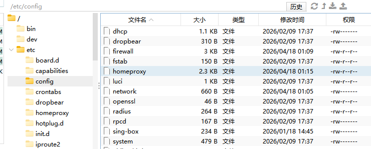

1、配置文件地址



```
+0000 2026-04-17 17:51:38 WARN router: initialize rule-set take too much time to finish!
+0000 2026-04-17 17:51:43 INFO network: updated default interface eth0, index 2
+0000 2026-04-17 17:51:43 INFO outbound/direct[direct-out]: outbound connection to testingcf.jsdelivr.net:443
+0000 2026-04-17 17:51:43 INFO outbound/direct[direct-out]: outbound connection to testingcf.jsdelivr.net:443
+0000 2026-04-17 17:51:43 INFO outbound/direct[direct-out]: outbound connection to testingcf.jsdelivr.net:443
+0000 2026-04-17 17:51:43 INFO outbound/direct[direct-out]: outbound connection to testingcf.jsdelivr.net:443
+0000 2026-04-17 17:51:43 INFO outbound/direct[direct-out]: outbound connection to testingcf.jsdelivr.net:443
```


ip能ping通但域名ping不通

```
sh# 1. 查 DNS 配置
cat /etc/resolv.conf
cat /tmp/resolv.conf.d/resolv.conf.auto 2>/dev/null

# 2. 手动测试 DNS 是否可达
nslookup www.baidu.com 223.5.5.5
nslookup www.baidu.com 127.0.0.1

# 3. 看 dnsmasq 状态
pgrep -a dnsmasq
/etc/init.d/dnsmasq status

# 4. 看 homeproxy 是否劫持了 DNS
nft list ruleset 2>/dev/null | grep -i "dns\|53" | head -20
iptables-save 2>/dev/null | grep -i "53\|dns" | head -20
```

如果是homproxy的缘故

```
# 彻底关掉 homeproxy 避免干扰
/etc/init.d/homeproxy stop
/etc/init.d/homeproxy disable

# 清掉 homeproxy 对 dnsmasq 的注入
rm -f /tmp/dnsmasq.d/homeproxy.conf
rm -f /tmp/dnsmasq.cfg*.d/homeproxy.conf

# 重启 dnsmasq
/etc/init.d/dnsmasq restart


# 测试
nslookup www.baidu.com
ping -c 2 www.baidu.com
```

DNS 通了之后再启用 homeproxy：

```sh
/etc/init.d/homeproxy enable
/etc/init.d/homeproxy start
logread -e homeproxy | tail -20
```
