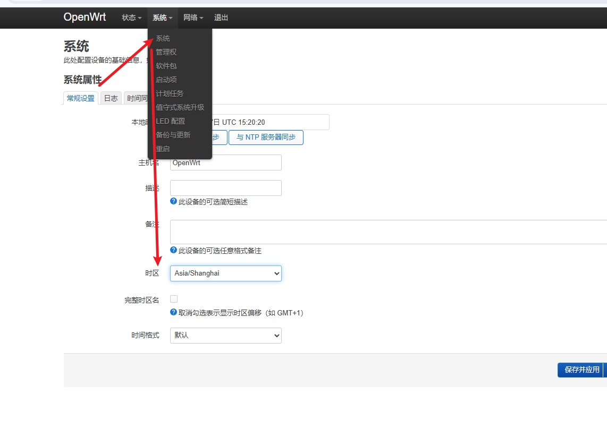
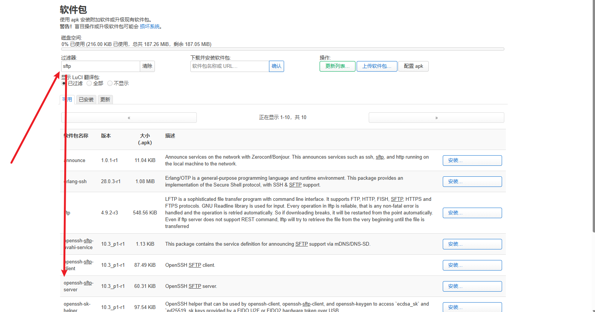

镜像安装地址

```
https://firmware-selector.openwrt.org/
```

中科大镜像源

旧版本：

```
sed -i 's/downloads.openwrt.org/mirrors.ustc.edu.cn\/openwrt/g' /etc/opkg/distfeeds.conf
```

新版本已经换成 **apk** 包管理器了，没有 opkg 的配置文件。

bash

```bash
sed -i 's/downloads.openwrt.org/mirrors.ustc.edu.cn\/openwrt/g' /etc/apk/repositories.d/distfeeds.list
```

然后更新索引：

bash

```bash
apk update
```

可以先看一下替换是否成功：

bash

```bash
cat /etc/apk/repositories.d/distfeeds.list
```

确认里面的地址已经从 `downloads.openwrt.org` 变成了 `mirrors.ustc.edu.cn/openwrt` 就对了。


```
# 备份
cp /etc/opkg/distfeeds.conf /etc/opkg/distfeeds.conf.bak

# 改成中科大源
sed -i 's/downloads.openwrt.org/mirrors.ustc.edu.cn\/openwrt/g' /etc/opkg/distfeeds.conf

#更新
opkg update

# 想改回来的时候，直接恢复备份
cp /etc/opkg/distfeeds.conf.bak /etc/opkg/distfeeds.conf

```


设置时区



为了传输文件，安装sftp



主题安装

github地址，选择安装命令

```
https://github.com/jerrykuku/luci-theme-argon
```

我这里贴的是官方openwrt和immortalwrt

25版本之后

提示我证书不对，我连上电脑下载的

在**电脑上**用浏览器下载那个 apk 文件，然后通过 SCP 传到路由器：

bash

```bash
# 在电脑上执行（Windows 用 PowerShell）
scp luci-theme-argon-2.4.3-r20250722.apk root@192.168.1.1:/tmp/
```

然后 SSH 到路由器装bash

```bash
cd /tmp
apk add --allow-untrusted ./luci-theme-argon-2.4.3-r20250722.apk
```


---
title: openwrt
order: 2
draft: true
---
25版本之前：

```
opkg install luci-compat
opkg install luci-lib-ipkg
wget --no-check-certificate https://github.com/jerrykuku/luci-theme-argon/releases/download/v2.3.2/luci-theme-argon_2.3.2-r20250207_all.ipk
opkg install luci-theme-argon*.ipk
```


momo安装

下载地址

```
https://github.com/nikkinikki-org/OpenWrt-momo/releases
```

将压缩包放到目录下

例如/temp

```
apk add --allow-untrusted ./momo-*.apk
apk add --allow-untrusted ./luci-app-momo-*.apk
apk add --allow-untrusted ./luci-i18n-momo-zh-cn-*.apk
```

