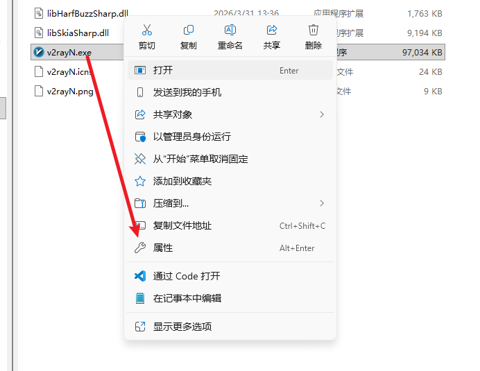
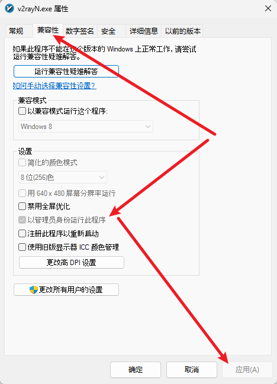
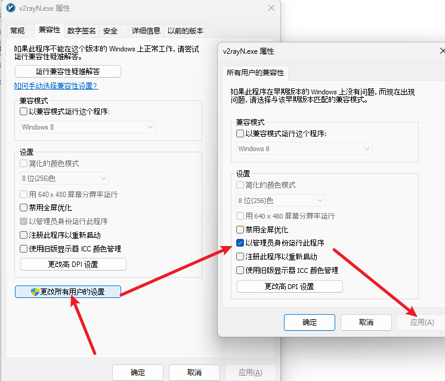
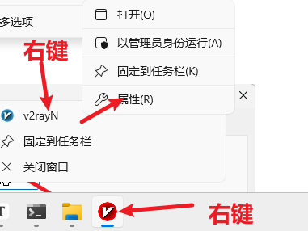
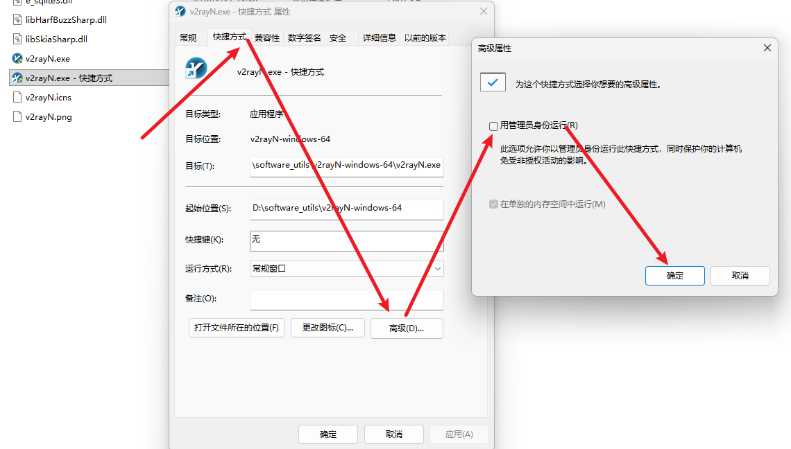

# windows软件默认管理员模式运行

### 1. 修改属性（exe文件，快捷方式请看第三点）

这是最直接的方法，适用于桌面或文件夹里的软件。

- 右键点击该软件的exe。
- 选择 **“属性”**。
- 切换到 **“兼容性”** 选项卡。
- 在下方勾选 **“以管理员身份运行此程序”**。
- 点击“确定”。以后双击这个应用，它就会自动申请管理员权限。

### 2. 针对所有用户生效（进阶设置）

如果你电脑上有多个账户，或者想更彻底地设置：

- 在上述的“兼容性”选项卡中，点击下方的 **“更改所有用户的设置”**。
- 在这里再次勾选 **“以管理员身份运行此程序”** 并确定。

### 3. 通过“高级”属性设置（快捷方式）

有些快捷方式（特别是开始菜单里的）可能没有兼容性选项卡，可以尝试：

- 右键点击快捷方式 -> **“属性”**。
- 在 **“快捷方式”** 选项卡下，点击右下角的 **“高级”** 按钮。
- 勾选 **“用管理员身份运行”**，点击确定。

