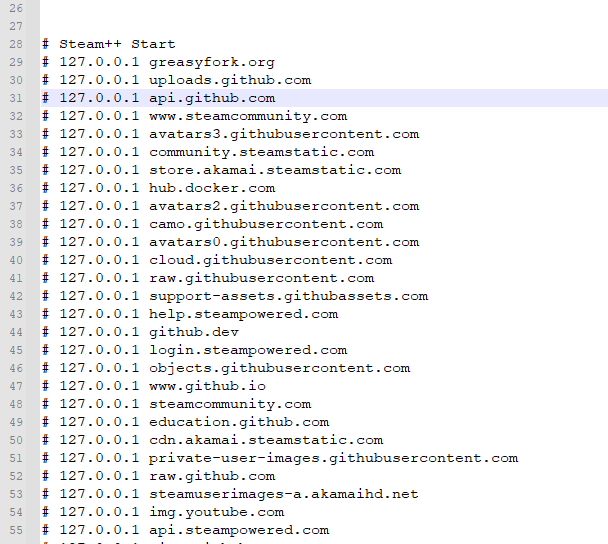

# 避坑指南：TUN 模式下 GitHub 连接重置与 DNS 回环排查实录

在配置 Clash (Mihomo) 的 TUN 模式时，很多同学会遇到“明明开启了代理，但终端克隆 GitHub 依然报错”的情况。本文记录了一次典型的 DNS 回环（Loopback）故障排查过程。

## 1. 问题现象

在执行 GitHub 相关操作（如克隆仓库或添加插件）时，终端报错：
`ssh: connect to host github.com port 22: Connection refused`
或者在日志中看到：
`[TCP] dial DIRECT (match GeoIP/private) 127.0.0.1:443 error: No connection could be made because the target machine actively refused it.`

## 2. 深度分析
通过观察 Clash 日志，我们发现了三个核心矛盾点：

1. **目标地址异常**：`github.com` 被解析成了 `127.0.0.1`（本地回环）。
3. **连接闭环**：流量请求发送到了本地 443 端口，而本地并未运行 HTTPS 服务，导致连接被直接拒绝。

**结论**：这是典型的 **DNS 污染残留 导致的“自杀式”访问。

---

## 3. 解决方案

### 清理本地 Hosts 劫持
很多“GitHub 加速工具”或手动配置会在系统 `hosts` 文件中写入硬编码 IP。在 TUN 模式下，这些记录会干扰内核的 Fake-IP 逻辑。

1. 以管理员身份打开记事本，编辑：`C:\Windows\System32\drivers\etc\hosts`
2. **删除** 所有涉及 `github.com`、`githubusercontent.com` 的行。
3. 保存并关闭。

